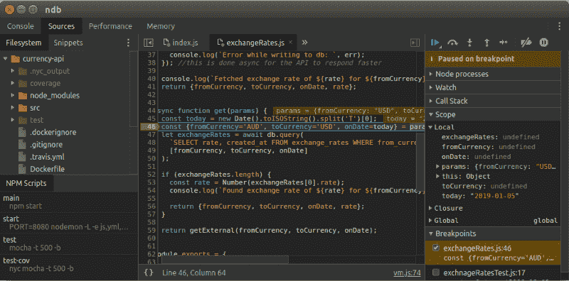
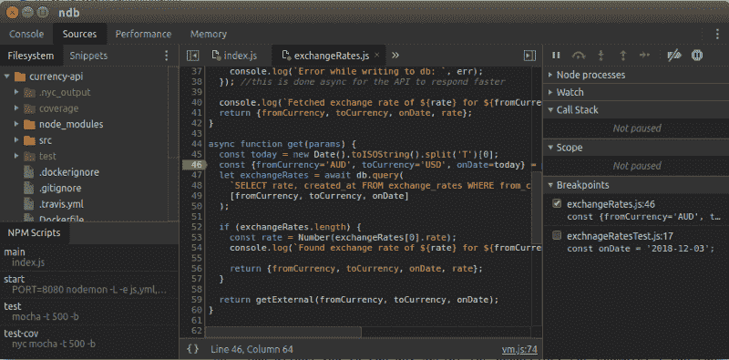
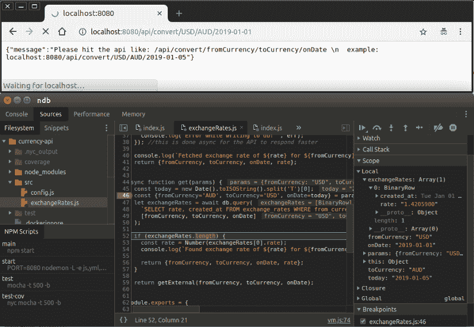
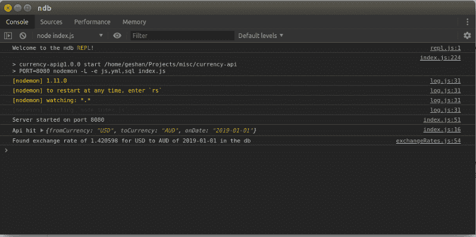

# 如何开始使用 ndb 调试 NodeJS 应用程序

> 原文：<https://www.freecodecamp.org/news/how-to-get-started-debugging-nodejs-applications-with-ndb-a37e8747dbba/>

NodeJs 差不多是 9 年前发布的。NodeJs 的默认调试过程(read Node.js)相当笨拙。您可能已经意识到需要使用节点检查器将`--inspect`添加到节点脚本中。它也依赖于 Chrome。然后你必须查看正确的 web 套接字连接，这是很难的，并使用 Chrome 的节点调试器进行调试。老实说，这是一件令人讨厌的事。

**最后，谷歌 chromelabs 发布了 ndb** ，他们说这是“Node.js 的改进调试体验，由 Chrome DevTools 实现”。在调试 Nodejs 应用程序时，Ndb 是一个福音。

我将一步步展示如何用 [ndb](https://github.com/GoogleChromeLabs/ndb) 调试 nodejs 应用程序。下面你可以看到 ndb 的行动。所以现在让我们卷起袖子开始吧:



### 先决条件

下面是开始之前的一些先决条件:

1.  您的系统上安装了 nodejs(这是显而易见的，但仍然值得一提)
2.  您已经了解了运行节点脚本和使用 nodejs 应用程序的一般知识。
3.  你有 nodejs 或任何其他语言的调试经验。

为了调试 nodejs 应用程序，我将使用一个完整的 nodejs express 应用程序来代替另一个脚本。这是一个开源应用程序，我用它来演示测试 nodejs 应用程序。

### 作为演示调试 nodejs express 应用程序

我使用我的开源货币 API 来一步一步地指导调试 nodejs 应用程序。它是使用 ExpressJS 框架构建的。您还可以查看托管在 [Zeit Now](https://currency-api-nodejs.now.sh/api/convert/USD/AUD/2019-01-01) 上的跑步应用程序，以查看 2019 年 1 月 10 日美元对澳元的汇率。

应用程序的想法很简单。如果数据库中有兑换率，它将从数据库中获取。如果没有，它将从另一个 API 获取数据并发送给用户，同时将数据保存在数据库中(异步)以备后用。

您可以从 github 克隆应用程序并运行`npm install`来为调试做好准备。这是一个非常简单的应用程序，大部分逻辑在`exchangeRates.js` [文件](https://github.com/geshan/currency-api/blob/master/src/exchangeRates.js)中。它也有摩卡[测试](https://github.com/geshan/currency-api/blob/master/test/exchnageRatesTest.js)，因为这是一个测试 nodejs 应用程序的演示。

### 1.开始，安装 ndb

安装 ndb 非常容易。开始调试 nodejs 应用程序所需要做的就是安装 [ndb](https://github.com/GoogleChromeLabs/ndb#installation) 。我建议您在全球范围内安装它:

```
# with npm
npm install -g ndb
# with yarn 
yarn global add ndb
```

如果你愿意，你也可以在本地安装和使用它。我必须解决的一件事是获得最新版本的 Chrome，因为我发现了一些权限问题。

### 2.使用 ndb(不是 node 或 nodemon)运行应用程序

对于使用 ndb 调试 nodejs 应用程序，可以使用 ndb 而不是 node 直接运行 nodejs 应用程序脚本。举个例子，如果你在开发中习惯做`node index.js`或者`nodemon index.js`。要调试您的应用，您可以运行:

```
ndb index.js
```

请注意，您不需要放置任何`-- inspect`，因此体验会更加流畅。

你不需要记住一个不同的端口或者去 chrome devtools 打开一个不同的检查器窗口来调试。如释重负！

当您执行`ndb .`或`ndb index.js`时，ndb 会打开如下屏幕:



请在第 46 行添加一个断点。当你用 ndb 运行应用程序时，它将在调试模式下运行，当你在浏览器上点击`http://localhost:8080/api/convert/USD/AUD/2019-01-01`时，它将在如下所示的断点处停止。我在 exchangeRates.js 上设置了断点，比如下面截图中的 46:


ndb 允许您运行任何脚本进行调试。例如，我可以运行`ndb npm start`，它将使用 nodemon 运行。这意味着我可以在修改代码的同时调试应用程序，这很棒。

*例如，它可以与`ndb npm start`一起运行，以调试这个 nodejs express 应用程序。*

您也可以使用类似于`ndb npm test`的命令来调试您的测试。

### 3.让我们调试一些代码

随着调试器的运行，我可以放置更多的断点，或者以我的速度和方便来运行代码。

*基本的快捷键是`F10`单步执行函数调用和`F11`单步执行函数。*

我假设您熟悉通常的调试工作流程。下面我已经推进到第 52 行:



### 更多调试的东西

与任何其他调试器一样，使用 ndb，您可以:

1.  添加手表
2.  检查调用堆栈跟踪
3.  检查流程

如果你想在上下文中快速查找一些节点代码，控制台选项卡也很有帮助。

在官方的[自述文件](https://github.com/GoogleChromeLabs/ndb#what-can-i-do)中阅读更多关于你可以用 ndb 做什么的信息。下面是有用的控制台截图:



### 结论(TL；博士)

用 ndb 调试任何 nodejs 应用程序都是更好的开发者体验。要使用 ndb 调试 currency API nodejs express 应用程序，假设您安装了 node > 8，您可以运行以下命令:

1.  npm 安装-g ndb
2.  git 克隆[【电子邮件保护】](https://geshan.com.np/cdn-cgi/l/email-protection) :geshan/currency-api.git
3.  cd 货币-api
4.  npm 安装
5.  ndb npm 开始
6.  ndb 调试器打开后，在 src/exchangeRates.js 的第 46 行添加一个断点
7.  然后在浏览器中打开`http://localhost:8080/api/convert/USD/AUD/2019-01-01`
8.  现在，应用程序应该在断点处暂停，享受！并继续调试。

如果它适用于这个应用程序，您可以用这种方法调试任何 nodejs 应用程序。

欢迎使用调试 nodejs 应用程序的新方法，这种方法独立于浏览器，比默认体验流畅得多。加紧调试 nodejs 应用程序游戏。

我希望这篇文章能帮助你更好地调试 nodejs 应用程序。如果你有任何关于调试 nodejs 应用程序或更好地使用 ndb 的其他事情要分享，请在下面评论！

感谢阅读！

你可以阅读更多我的博客文章[geshan.com.np](https://geshan.com.np/blog/2019/01/getting-started-with-debugging-nodejs-applications-with-ndb/)。