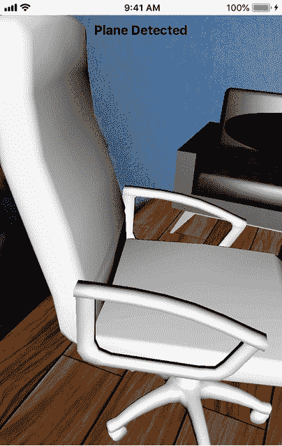
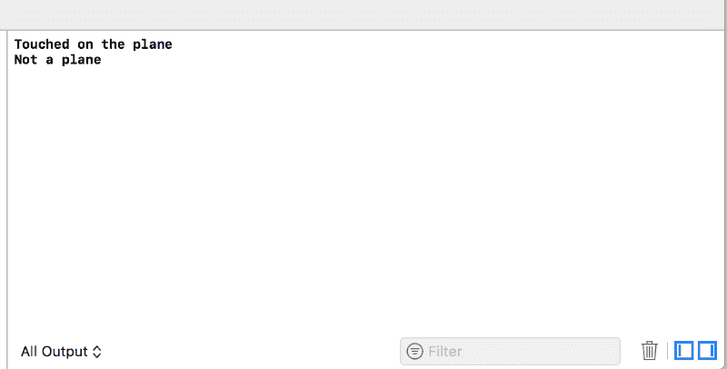
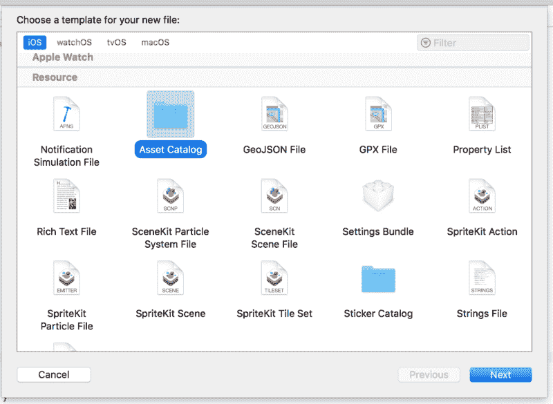
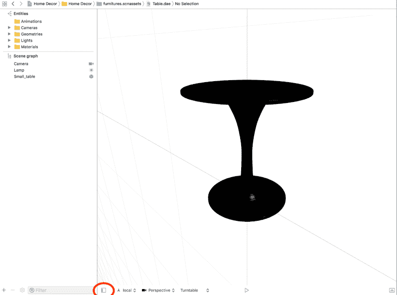
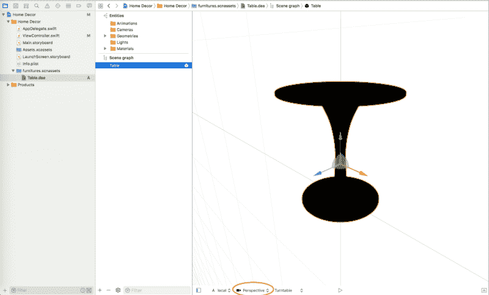
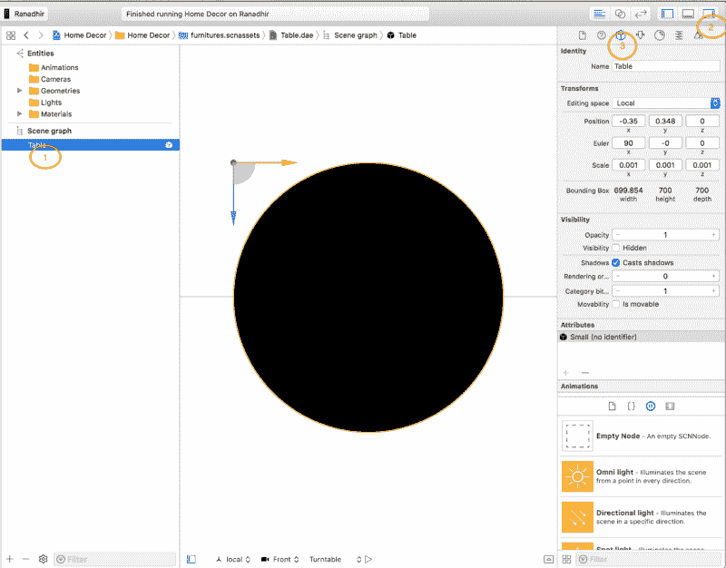
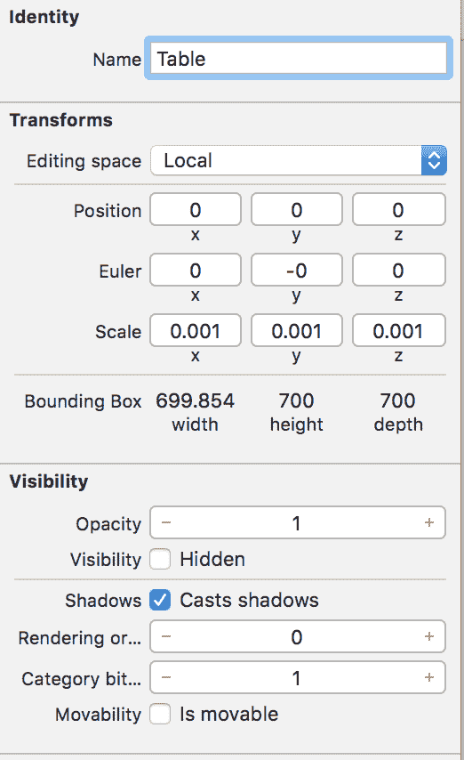
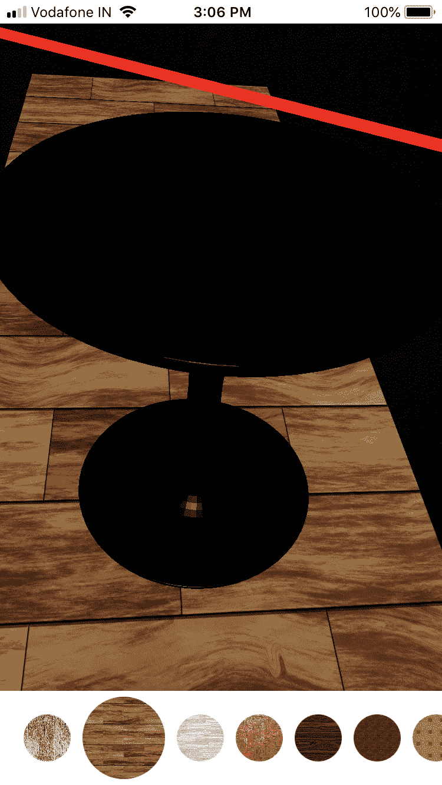
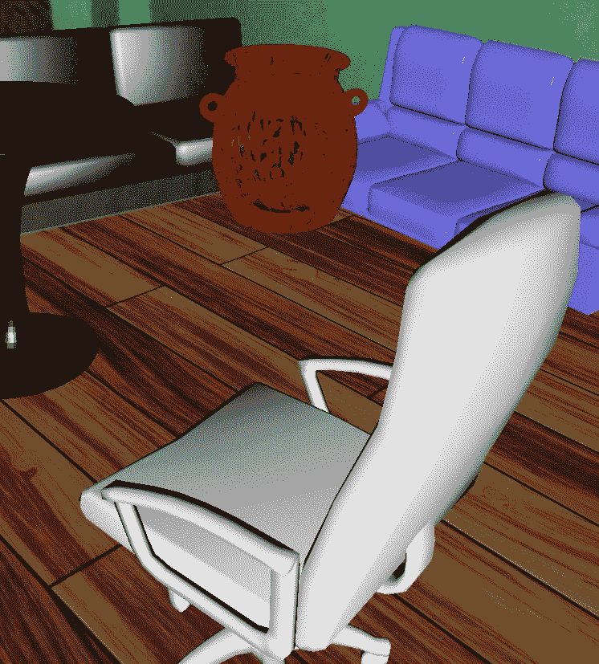

# 如何通过装饰您的家开始使用 Swift 中的增强现实

> 原文：<https://www.freecodecamp.org/news/how-to-get-started-with-augmented-reality-in-swift-by-decorating-your-home-85671482df3c/>

作者:拉纳迪尔·戴

# 如何通过装饰您的家开始使用 Swift 中的增强现实

如果你看过我之前的帖子，你的餐厅已经有一个漂亮的 AR 地板了。这是我们在学习 AR 的[基础时构建的第一个东西。现在，是时候用一些很酷的虚拟家具来装饰房间了。在本教程结束时，您将拥有一个像这样的餐厅:](https://medium.freecodecamp.org/how-to-get-started-with-ar-in-swift-the-easy-way-7399fe1c82f5)



### 命名节点

让我们把手弄脏吧。启动 Xcode，打开我们装饰地板的最后一个项目。在 viewDidLoad 之前，创建一个常量 floorNodeName。

```
let floorNodeName = "FloorNode"
```

我们现在要将楼层节点的名称设置为这个常量，这样我们就不会将这个节点与其他家具节点混淆。转到 createFloorNode 方法，并将 floor 节点命名为。

在第 7 行中，我们刚刚命名了 floor 节点——其他一切都保持不变。

该计划是，一旦启动，应用程序将首先识别地板，然后用户将通过屏幕来确定他们想要放置家具的位置。他们会点击位置，一件家具就放在那里。为了实现这一点，我们需要在屏幕上的点和现实世界的位置之间建立关联。谢天谢地，苹果已经把这个过程变得相当简单了。

### 手势和点击

活跃的 AR 会话持续寻找附近的物体/平面。一旦发现一个新的物体/平面，它就在它的上面放置 AR 锚点。为了准确找到用户点击了哪些锚，我们需要 [HitTest](https://developer.apple.com/documentation/arkit/arframe/2875718-hittest) 的帮助。HitTest 是这样工作的:

*   一条逻辑射线从接触点射向平面上的锚点
*   光线经过的所有锚点都以 [HitTestResult](https://developer.apple.com/documentation/arkit/arhittestresult) 的格式存储在一个数组中。

每个 HitTestResult 包含 AR 锚的真实世界表面的信息。我们将使用这些信息来摆放家具。

让我们创建一个方法，将轻击手势添加到我们的场景视图中，以便与用户交互。我们将从 viewDidLoad 调用这个方法。

现在定义“tapped”方法，以获得水龙头的位置，并在那里放置家具。现在，我们打印以测试 HitTest 是否工作正常。

在第一行中，我们将点击手势的视图转换为 ARSCNView。因为我们知道水龙头将来自我们的场景本身，我们强行打开它。然后我们在 sceneView 上得到用户点击的位置。然后执行点击测试，以获得从点击位置到真实世界锚点的所有点击结果。".existingPlaneUsingExtent”给出了检测到的平面的估计大小。现在，我们检查用户是否真的点击了检测到的平面或其他地方，并相应地打印。

现在运行应用程序，等待世界原点加载和检测到地板。然后点击屏幕，检查我们是否正确地击中了飞机。



如果你点击瓷砖所在的地方，它会打印“在平面上触摸。”再碰别的地方，就“不是飞机了。”如果控制台中没有输出，说明您没有从 viewDidLoad 调用 addTapGesture 方法(这发生在我身上！).现在我们已经成功地检测到了点击的位置，是时候把一些家具带回家了。

### 将 3D 模型导入项目

我们需要一些 3D 家具模型。我使用的是 [turbosquid](https://www.turbosquid.com/) ，这是一个伟大的 3D 模型库。你需要在那里创建一个免费帐户来访问他们的免费模型。我现在已经下载了一张 3D [桌子](https://www.turbosquid.com/3d-models/3d-small-dining-table-1161153)(在 GitHub repo 中——我还会添加一些家具)。

[苹果建议](https://developer.apple.com/documentation/scenekit/scnscenesource?changes=_4)你使用 collada 格式的(。dae)模型。我过去也使用过其他类型的模型，在很多情况下我都遇到了问题。大多数情况下，如果有一个玻璃，SceneKit 往往会使它成为固体。所以，让我们来寻找扩展名为. dae 的 3D 模型。

现在，在“家居装饰”组下添加一个资产文件夹。



按下一步，并在保存对话框中，将其保存为 furnitures。scna sets 而不是 xcassets。


### 使用 Xcode SceneKit 编辑器

SceneKit 将使用的所有场景文件或模型都应该位于一个 scnassets 文件夹中。现在，将我们刚刚下载的表拖放到 scnassets 文件夹中，并将其重命名为“table”。单击 Table.dae 文件(如果尚未打开),在 SceneKit 编辑器中打开它。左下角有一个按钮(下面用红色椭圆标记)用于打开场景图形视图。点击它，编辑器应该如下所示。



在场景图中有 3 个节点:一个摄像机，一个光源(灯)和一个桌子(小桌子)。ARKit 有它的默认摄像头，所以我们不再需要这个摄像头了。由于我们将使用 sceneView 的默认照明，我们也不需要灯。把它们都拿走。

让我们将“Small_table”重命名为“table”，与文件名相同。现在，场景图将如下所示:



在编辑器中有一个叫做视点的东西(上面用一个红色的椭圆标记),它决定了从某个特定的角度看物体的样子。默认情况下，它被设置为透视，但我们将从前面看到表。所以把视角换成正面。

哎呀——看起来我们只能看到俯视图。显然，这不是我们希望看到的情况。我们希望看到透视图中显示的表格。让我们解决这个问题。

选择表格节点，打开“实用工具”标签(Xcode 中的右上角按钮)，然后单击节点检查器(立方体图标)。你应该看到下面的窗口。



我把步骤编了号，供你参考。要从前面查看完整的表格，我们需要绕 X 轴旋转表格。如果你还记得的话，我们在第一篇文章中做了同样的事情，我们通过改变它的欧拉角在 Z 轴上旋转胶囊。

如果您看到变换矩阵，则 X 的欧拉角已经指定为 90 度弧度，这将导致表格旋转不正确。使其为零，旋转就固定了。但是定位有一个向量(-0.35，0.348，0)。我们将使它(0，0，0)精确地放置在用户点击的地方。现在，转换将如下所示:



变换矩阵编辑是一种反复试验的任务。在到达准确位置之前，您可能需要经历相当多的迭代。

现在我们改变。dae 模型到 SceneKit 场景文件(。scn ),这将使 SceneKit 的处理效率更高。转到编辑器>转化为 SceneKit 场景文件。scn)。

然后…我们完成了 3D 对象编辑。回到 ViewController 文件。首先，由于我们已经移除了桌子的光源，我们应该在 viewDidLoad 中打开场景视图的默认照明。

scene view . autoenablesdefaultlighting = true

### 定位 3D 对象

然后，我们创建一个方法将桌子添加到场景中。它将接受 HitResult 作为参数，并根据 HitResult 的位置放置表格。

请耐心听我说——这是最后一个需要解释的方法！

1.  声明一个常数，知道需要添加什么家具场景。当我们有更多家具时，我们将把它改为一个变量，并在 viewcontroller 上声明它。
2.  然后，我们从选定的家具文件创建一个场景。
3.  家具节点是从家具场景的根节点的子节点创建的，带有家具的名称。因为我们将第一个节点命名为与家具名称相同的名称，所以它不需要再进一步遍历。因此，递归选项被设置为 false。
4.  HitResult 的 [worldTransform](https://developer.apple.com/documentation/arkit/arhittestresult/2867907-worldtransform) 属性保存真实世界位置和场景锚点/节点位置之间的关联变换矩阵。变换矩阵的第 3 列保存位置信息。
5.  既然我们已经成功地提取了点击位置的世界坐标，我们现在的工作就是将家具节点放置在完全相同的坐标上。
6.  然后，我们将节点添加到场景的根节点。就是这样！

现在我们只需要在用户点击屏幕时调用这个方法。让我们修改 tapped 方法来适应这种变化。

在这里，如果我们找到一个平面，我们只是调用方法来添加家具。由于 HitTest 占据了光线通过的所有位置，我们正在考虑最上面的结果。让我们运行应用程序，等到地板上有瓷砖，然后在屏幕上点击放置一张桌子。瞧！你的地板上有一张新桌子。小心脚下:)



我已经下载了更多的家具，并将其添加到回购中。我还添加了捏和旋转手势来调整和旋转对象。完整的源代码会给你这样一个外观:



你可以从 [GitHub](https://github.com/ranadhirdey/Home-Decor-With-Furniture) 下载完整的源代码。

希望你像我写这篇文章一样喜欢阅读这篇文章:)

下一个帖子见。快乐阅读！！