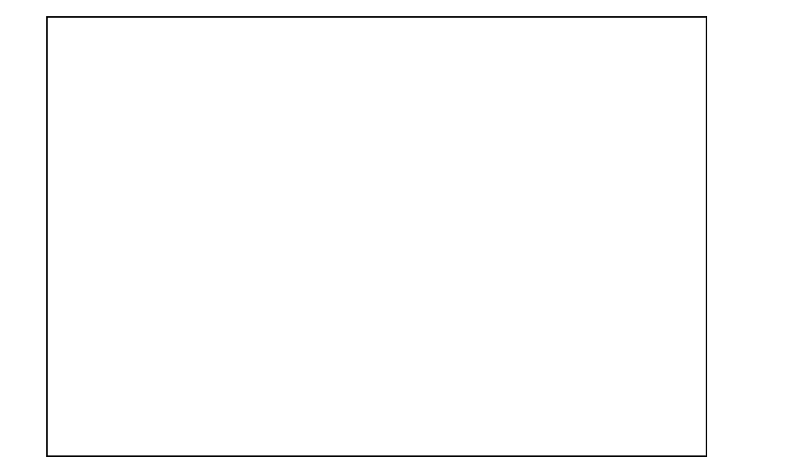
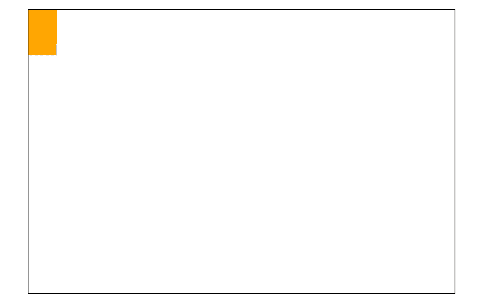
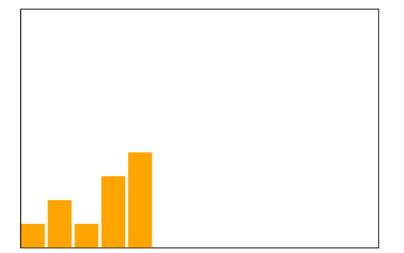
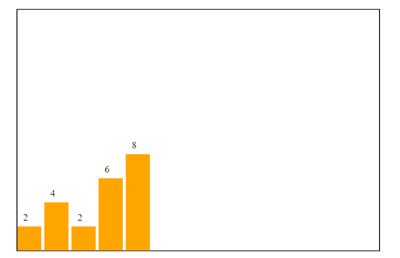

# 如何上手 D3 并做出反应

> 原文：<https://www.freecodecamp.org/news/how-to-get-started-with-d3-and-react-c7da74a5bd9f/>

数据驱动文档(D3.js)是一个 JavaScript 库，用于使用 HTML、CSS 和 SVG 创建数据的可视化。它通过将数据绑定到 DOM(文档对象模型)及其元素并允许它们在数据改变时进行转换来实现这一点。

例如，假设我们想要创建一个饼图，显示图书馆中每种类型的书籍数量。我们有一些数据，每当图书管理员输入一本新书时，我们都会更新这些数据。我们将它存储在应用程序状态中一个名为“books”的变量中。

```
const [books, setBooks] = useState(initialBooks)
const initialBooks = [
    {
        name: "Harry Potter and the Philosophers Stone",
        author: "J. K. Rowling",
        genre: "fantasy"
    },{
        name: "The Pedagogy of Freedom",
        author: "Bell hooks",
        genre: "non-fiction"
    },{
        name: "Harry Potter and the Chamber of Secrets",
        author: "J. K. Rowling",
        genre: "fantasy"
    },{
        name: "Gilgamesh",
        author: "Derrek Hines",
        genre: "poetry"
    }
]
```

现在我们可以创建一个图表，其中 50%是幻想，25%是非虚构，25%是诗歌。当图书管理员向数据库中添加一本新书时，数据会发生变化，你的工作也会发生变化。假设我们添加了“50 道素食”。

```
setBooks(books.concat(
    {
        name: "50 vegan dishes",
        author: "Antti Leppänen",
        genre: "non-fiction"
    }
))
```

当这个数据改变时，我们的 D3 图形更新 DOM 以匹配新数据。我们现在有 40%的幻想，40%的非小说，20%的诗歌。D3 使得操作网站 DOM 变得容易。这意味着您可以使用它来创建、更新和删除页面结构中的元素。

如果你想继续这个例子，你可以使用 [Create React App](https://github.com/facebook/create-react-app) 来创建一个简单的 React web 应用。如果 React 对你来说还很陌生，你可以[从 React 文档中找到这个教程](https://reactjs.org/tutorial/tutorial.html)。

1.  创建一个新的 app，名为 my-d4-app `npx create-react-app my-d3-app`。使用`cd my-d3-app`将目录切换到创建的文件夹。
2.  运行`npm install d3 --save`安装 D3。
3.  通过添加`import * as d3 from d3`将 D3 导入 App.js。您需要使用 import *(“import everything”)，因为 D3 没有默认的导出模块。

#### 选择 DOM 元素

D3 使得操作 DOM 变得容易。比如让我们试着改变所有的`<p&g`t；</p>-具有内嵌样式的元素，将颜色设置为蓝色。

`d3.selectAll("p").style("color", "blue")`

方法允许我们选择特定类型的所有元素。我们也可以使用`.select()`来选择单个节点。

React 库也操纵 DOM。这意味着我们需要做一些额外的努力来让它和 D3 一起工作。幸运的是，React 已经有了一个允许定位和更新 DOM 元素的解决方案。为此，React 使用引用。

让我们创建一个`<div>`-元素并给它添加一个引用，然后使用引用用 D3 来拾取它。

```
d3.select(this.refs.myDiv).style(“background-color”, “blue”)
render(<div ref=”myDiv”></div>)
```

#### 向 DOM 追加元素

一旦选择了想要操作的元素，就可以开始向它追加更多的元素。例如，假设我们有一个`<ol ref="myList">`。我们可以使用 D3 添加一个新的列表项元素，包含文本“香蕉”。

```
d3.select(this.refs.myList)
    .append("li")
    .text("bananas")
```

#### 使用数据来创建

您可以通过选择 DOM 元素并使用`.data()`将数据附加到这些元素上，让 D3 知道您的数据。D3 有一个叫做`.enter()`的方法，经常用于处理数据。这意味着需要将这些数据元素添加到 DOM 中。输入对应词`.exit()`，用于表示那些不再存在于数据中但存在于 DOM 中的元素。我们可以用它和 remove 一起删除这些元素，如`.exit().remove()`所示。

让我们看一个例子。

```
import React, { component } from 'react'
import * as d3 from 'd3'
class App extends Component {
    const temperatureData = [ 8, 5, 13, 9, 12 ]
    d3.select(this.refs.temperatures)
        .selectAll("h2")
        .data(temperatureData)
        .enter()
            .append("h2")
            .text("New Temperature")

    render(<div ref="temperatures"></div>)
}
export default App
```

这表示“D3，选择具有参考‘温度’的元素。然后，将 temperatureData 附加到它的`<h2>`元素上。对于尚未在 DOM 中表示的数据部分，添加新的`<h2>`-元素和文本“New Temperature”。

等等，现在它一遍又一遍地说“新温度”！如果我们想显示实际的数据点值呢？

#### 作为函数的属性

在 D3 中，可以使用函数设置样式、属性和其他元素属性。让我们重构上面的代码，使用一个函数将`<`H2>-元素的文本设置为它们表示的数据点值。

```
d3.select(this.refs.temperatures)
    .selectAll("h2")
    .data(temperatureData)
    .enter()
        .append("h2")
        .text((datapoint) => datapoint + " degrees")
```

我们可以使用一个箭头函数来获取数据点值，并返回添加到“degrees”中的值。属性中的函数允许我们对元素进行创新。在这个来自 [D3 文档](https://d3js.org/)的例子中，一个段落被赋予了一个随机的颜色，使用一个函数来设置元素样式属性。

```
d3.selectAll("p")
    .style("color", function() {
        return "hsl(" + Math.random() * 360 + ",100%,50%)";
    }
);
```

你也可以使用条件句，就像在任何函数中一样。假设我们想根据数据设置温度列表中某个元素的样式。

```
d3.select(this.refs.temperatures)
    .selectAll("h2")
    .data(temperatureData)
    .enter()
        .append("h2")
        .text((datapoint) => `${datapoint} degrees`)
        .style((datapoint) => {
            if (datapoint > 10) {
                return "red"
            } else { return "blue" }     
        }) 
```

然而，添加内联样式是一项繁琐的工作，我们希望使用类和 id 来代替，这样我们就可以在 CSS 中设置样式。为了设置像类和 id 这样的属性，我们使用`.attr()`。上面的代码可以重构为`.attr("class", (datapoint) => { datapoint > 10 ? "highTemperature" : "lowTemperature" }`。

#### 使用转场制作动画

最后，D3 使动画过渡变得容易。我们可以将文本颜色改为红色。

```
d3.select(this.ref.descr)
    .transition()
    .style("background-color", "red");
render(<p ref="descr"></p>)
```

我们可以使用`.duration(1000)`修改动画，使其在 1 秒后发生。我们也可以将函数与过渡一起使用。例如，我们可以让我们的元素以交错过渡的方式出现。D3 文档中的以下示例使用以`dataPoint`和`iteration`为参数的`delay()`函数，一次显示一个圆，并返回乘以 10 的迭代。迭代是指数据点在数据列表中的位置。

```
d3.selectAll("circle").transition()
    .duration(750)
    .delay(function(dataPoint, iteration) => iteration * 10)
    .attr("r", (dataPoint) => Math.sqrt(d * scale))
```

#### 我们的第一张图表

让我们创建一个新组件。创建一个新文件，名为`BarChart.js`。将 App.js 修改成这样。

```
import React from React
import BarChart from './BarChart'
const App = () => {
    return ( <BarChart /> )
}
```

将以下样板文件粘贴到`BarChart.js`中。调用`npm start`启动 app。

```
import React, { Component } from 'react'
import * as d3 from 'd3'
class BarChart extends Component {
    componentDidMount() {
        const data = [ 2, 4, 2, 6, 8 ]
        this.drawBarChart(data)
    }
    drawBarChart(data)  {}
    render() { return <div ref="canvas"></div> }
}
export default BarChart
```

我们有一组虚拟数据，作为参数传递给绘图函数。从现在开始，我们将在`drawBarChart()`内部工作。首先，用参考`canvas`选择`div`。在`drawBarChart()`中，我们在引用的`div`中添加了一个`svg`元素。我们设置`svg`的宽度为 600，高度为 400，边框为黑色。您应该会在页面上看到这个空框。

```
const svgCanvas = d3.select(this.refs.canvas)
    .append(“svg”)
    .attr(“width”, 600)
    .attr(“height”, 400)
    .style(“border”, “1px solid black”)
```



An empty SVG element with a black border.

接下来，我们需要条形图上的一些条形。我们选择`svg`的所有`rect`元素或矩形。然后，我们将数据追加到矩形中，并使用 enter 进入数据。对于元素中的每个数据，我们附加一个矩形，宽度为 40，数据点值的高度乘以 20。

```
svgCanvas.selectAll(“rect”)
    .data(data).enter()
         .append(“rect”)
         .attr(“width”, 40)
         .attr(“height”, (datapoint) => datapoint * 20)
         .attr(“fill”, “orange”)
```



After appending the rectangles with data to the SVG.

等等，为什么看起来我们只有一个长方形？由于我们没有指定矩形应该出现在`svg`的什么位置，它们都堆积在 0，0 处。让我们给它们加上 x 和 y 的位置。让我们也重构代码，在变量中保持画布的宽度、高度和条形的比例。

```
drawBarChart(data) {
const canvasHeight = 400
const canvasWidth = 600
const scale = 20
const svgCanvas = d3.select(this.refs.canvas)
    .append(“svg”)
    .attr(“width”, canvasWidth)
    .attr(“height”, canvasHeight)
    .style(“border”, “1px solid black”)
svgCanvas.selectAll(“rect”)
    .data(data).enter()
        .append(“rect”)
        .attr(“width”, 40)
        .attr(“height”, (datapoint) => datapoint * scale)
        .attr(“fill”, “orange”)
        .attr(“x”, (datapoint, iteration) => iteration * 45)
        .attr(“y”, (datapoint) => canvasHeight — datapoint * scale)
}
```

现在我们将位置 x 设置为迭代乘以 45，比列宽宽 5，在列之间留一个小间隙。y 位置有点棘手。我们将其设置为画布高度减去条的高度，即 datapoint 值乘以 20。现在我们的图表看起来像这样。



After setting the x and y positions of the rectangles.

为了给我们的柱状图添加最后的润色，让我们将数据点值添加到柱状图中。我们将一些文本元素添加到`svg`中，并将它们的 x 属性设置为比每个条形的起点大 10 个单位。我们将 y 属性设置为比条形的起点小 10 个单位。

```
svgCanvas.selectAll(“text”)
    .data(data).enter()
        .append(“text”)
        .attr(“x”, (dataPoint, i) => i * 45 + 10)
        .attr(“y”, (dataPoint, i) => canvasHeight - dataPoint * scale - 10)
        .text(dataPoint => dataPoint)
```



Adding text labels to our bars.

现在文本就放在栅栏上面。您可以继续使用图表，添加样式(使用`.attr("class", "bar")`)和添加 CSS 文件。您还可以向图表添加一个轴，并在鼠标悬停在该条上时添加一个工具提示。

**发挥创意，尽情享受！**

一开始使用 D3 似乎很困难。一旦你掌握了基础知识，它就会成为表达和可视化数据的强大工具。我推荐使用 D3，而不是选择现成的图表库，因为它允许更多个性化和可修改的内容。

最后，学习 D3 也是熟练遍历和操作 DOM 的一个好方法。理解 DOM 通常是面试官在前端开发人员中寻找的品质。

#### 资源:

[D3 教程](https://github.com/d3/d3/wiki/Tutorials)由 D3 建议

[React 文档中的 React 教程](https://reactjs.org/tutorial/tutorial.html)