# 如何开始使用数据砖块

> 原文：<https://www.freecodecamp.org/news/how-to-get-started-with-databricks-bc8da4ffbccb/>

作者 Shubhi Asthana

# **如何开始使用数据块**

当我开始用 Pyspark 学习 Spark 时，我偶然发现了 Databricks 平台，并进行了探索。这个平台使得建立一个运行 Spark 数据帧和练习编码的环境变得很容易。这篇文章包含了一些可以帮助你开始使用数据砖块的步骤。

Databricks 是一个运行在 Apache Spark 之上的平台。它有一个方便的笔记本系统设置。人们可以轻松地在云中配置集群，它还集成了一个用于探索和可视化的集成工作区。

您还可以安排任何现有的笔记本电脑或本地开发的 Spark 代码从原型到生产，而无需重新设计。

#### **1。** **设置数据块账户**

要开始学习教程，请导航到此[链接](https://databricks.com/try-databricks)并选择免费社区版来打开您的帐户。此选项具有单个群集，最多可提供 6 GB 的可用存储空间。它允许你创建一个基本的笔记本。您需要一个有效的电子邮件地址来验证您的帐户。

成功登录您的帐户后，您将看到此屏幕。

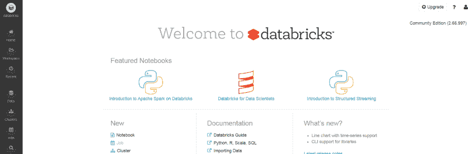

#### **2。** **创建新的集群**

我们首先创建一个新的集群来运行我们的程序。单击主页上的“Cluster ”,并为该集群键入一个新名称。

接下来，您需要选择“Databricks Runtime”版本。Databricks 运行时是一组运行在由 Databricks 管理的集群上的核心组件。它包括 Apache Spark，但也添加了许多组件和更新，以提高工具的可用性和性能。

您可以选择任何 Databricks 运行时版本—我选择了 3.5 LTS(包括 Apache Spark 2.2.1、Scala 2.11)。您还可以在 Python 2 和 3 之间进行选择。


创建群集需要几分钟时间。一段时间后，您应该能够在仪表板上看到一个活动的集群。

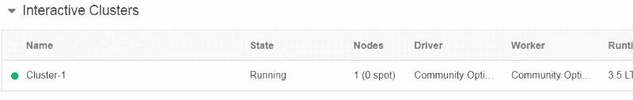

#### **3。** **创建新笔记本**

让我们继续创建一个新的笔记本，您可以在上面运行您的程序。

在主页上，点击“新建笔记本”并输入笔记本的名称。选择您喜欢的语言——我在这里选择了 Python。可以看到 Databricks 支持包括 Scala、R 和 SQL 在内的多种语言。

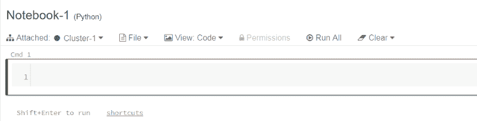

一旦输入详细信息，您会发现笔记本的布局与 Jupyter 笔记本非常相似。为了测试笔记本，我们导入 pyspark。

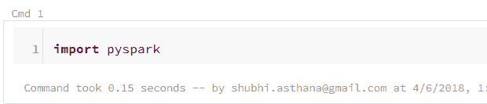

该命令运行了 0.15 秒，并给出了运行它的集群的名称。如果代码中有任何错误，它会显示在 cmd 框下面。

您可以点击页面右上角的键盘图标来查看特定于操作系统的快捷方式。

这里最重要的快捷方式是:

*   Shift+Enter 运行单元格
*   Ctrl+Enter 保持运行同一单元格，而不移动到下一个单元格

注意这些快捷方式是针对 Windows 的。您可以在键盘图标上查看操作系统特定的快捷方式。

#### **4。** **上传数据到数据块**

转到左边栏的“表格”部分，点击“创建表格”您可以上传一个文件，或者连接到 Spark 数据源或其他数据库。

这里上传一下常用的虹膜数据集文件(如果没有数据集，用这个[链接](https://archive.ics.uci.edu/ml/machine-learning-databases/iris/))

上传数据后，使用 UI 创建表，以便可以可视化该表，并在集群上预览它。如您所见，您可以观察表的属性。Spark 将尝试检测每一列的数据类型，并允许您编辑它。

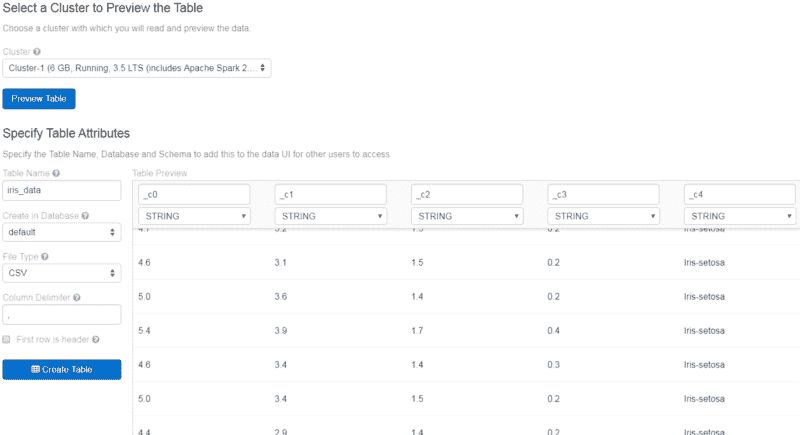

现在我需要为列添加标题，这样我就可以通过标题而不是`_c0`、`_c1`等等来识别每一列。

我把它们的头标为萼片长，萼片宽，花瓣长，花瓣宽和类。在这里，Spark 错误地将前四列的数据类型检测为字符串，所以我将其更改为所需的数据类型——Float。

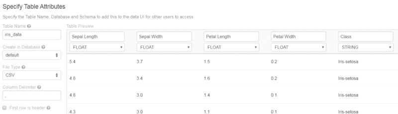

#### **5。** **如何从笔记本上获取数据**

Spark 是一个框架，可以使用 SQL、机器学习、图形处理或实时流分析来分析大数据。在本教程中，我们将使用 SparkSQL 和 Dataframes。

让我们开始处理笔记本上的数据。我们上传的数据现在以表格形式呈现。我们需要一个 SQL 查询来读取数据并将其放入 dataframe 中。

键入`df = sqlContext.sql(“SELECT * FROM iris_data”)` 将虹膜数据读入数据帧。

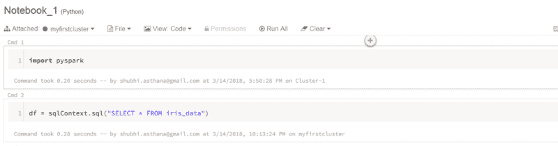

要查看数据帧中的前五行，我只需运行以下命令:

`display(df.limit(5))`

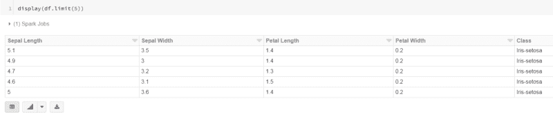

请注意底部的条形图图标。单击后，您可以查看导入到数据块中的数据。要查看完整数据的条形图，请运行`display(df)`而不是`display(df.limit(5))`。

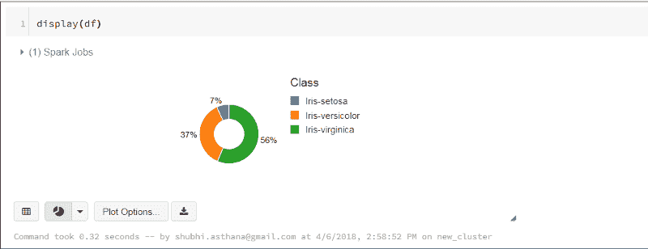

下拉按钮允许您在不同的图表中可视化数据，如条形图、饼图、散点图等。它还为您提供了绘图选项，用于自定义绘图和仅可视化特定列。

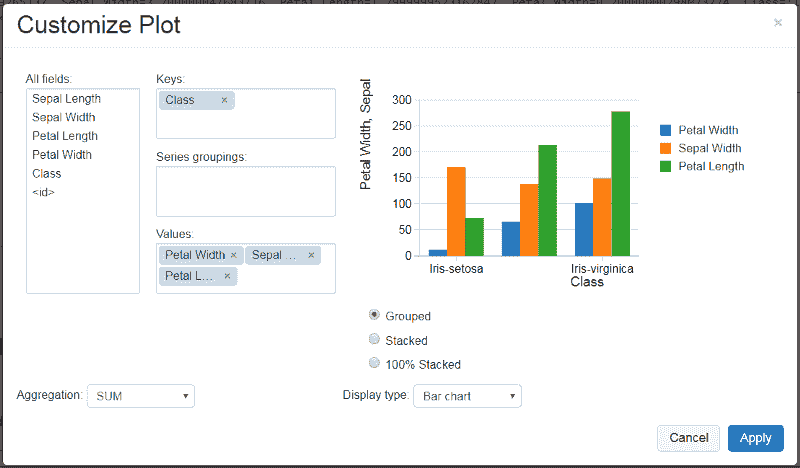

您还可以在数据块中显示 matplotlib 和 ggplot 图形。有关演示，请参见 Python 笔记本中的 [Matplotlib 和 ggplot。](https://docs.databricks.com/user-guide/visualizations/matplotlib-and-ggplot.html)

要查看所有列的数据，只需输入`df.columns`

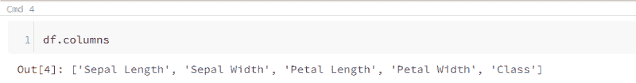

要计算数据帧中总共有多少行(并查看从远程磁盘/S3 进行一次完整扫描需要多长时间)，请运行`df.count()`。

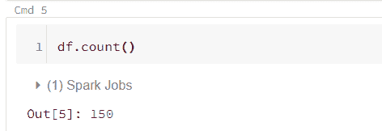

#### **6。将火花数据帧转换为熊猫数据帧。**

现在，如果您习惯于使用 pandas 数据帧，并且希望将 Spark 数据帧转换为 pandas，您可以通过输入以下命令来完成此操作

```
import pandas as pdpandas_df=df.to_pandas()
```

现在你可以在`pandas_df`数据帧上使用 pandas 操作。

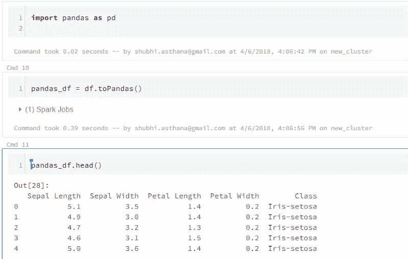

#### 7 .**。查看 Spark 用户界面**

Spark UI 包含调试 Spark 作业所需的大量信息。有一堆很棒的可视化，所以让我们来看一看要点。

要转到 Spark UI，你需要转到页面顶部，那里有一些菜单选项，如“文件”、“视图”、“代码”、“权限”等。您会在“Attached”旁边的顶部找到群集的名称，旁边还有一个下拉按钮。点击下拉按钮，选择“查看火花用户界面。”一个新的标签将会打开，上面有你笔记本上的大量信息。

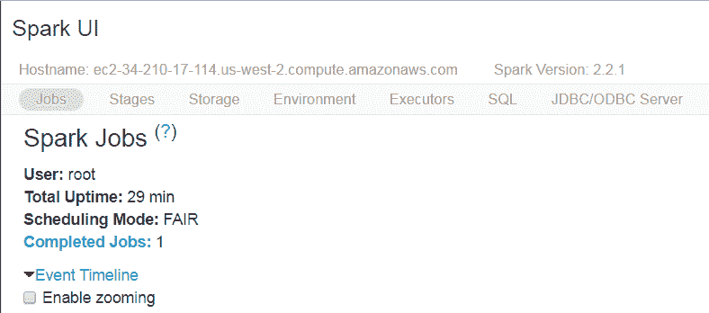

UI 视图提供了关于在集群上执行的每个作业、阶段、环境和执行的 SQL 查询的大量信息。这个 UI 可以帮助用户调试他们的应用程序。此外，这个 UI 提供了一个很好的 Spark 流统计可视化。要了解 Spark UI 各个方面的更多细节，请参考这个[链接](https://databricks.com/blog/2015/06/22/understanding-your-spark-application-through-visualization.html)。

完成笔记本后，您可以继续发布它或以不同的文件格式导出文件，这样其他人就可以使用唯一的链接来使用它。我已经用 HTML 格式的附上了我的笔记本[。](https://cdn.rawgit.com/sasthan/Tutorial_databricks/7f01b3e1/Notebook_1.html)

#### 包扎

这是一个简短的概述，介绍如何快速开始使用 Databricks 并运行您的程序。使用 Databricks 的优势在于，它为构建分析、数据仓库和机器学习应用程序提供了端到端的服务。可以使用 Databricks 的自助服务模型来管理、监控和保护整个 Spark 集群。

这里有一些给数据科学家和数据工程师的有趣链接。另外，这里有一个[教程](https://www.youtube.com/watch?v=K14plpZgy_c)，我发现它非常有用，对初学者来说非常棒。