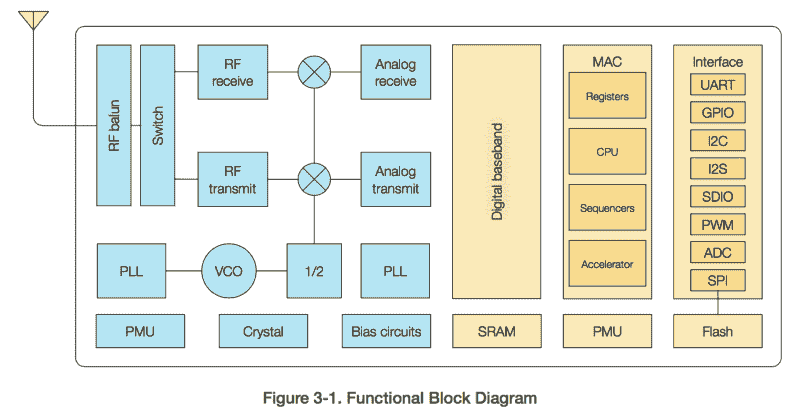
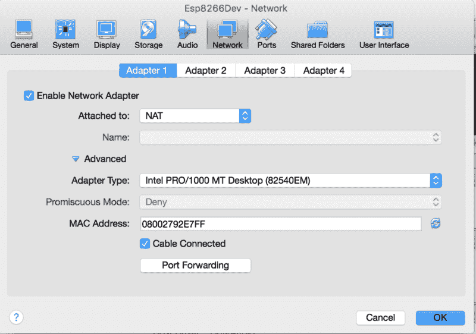
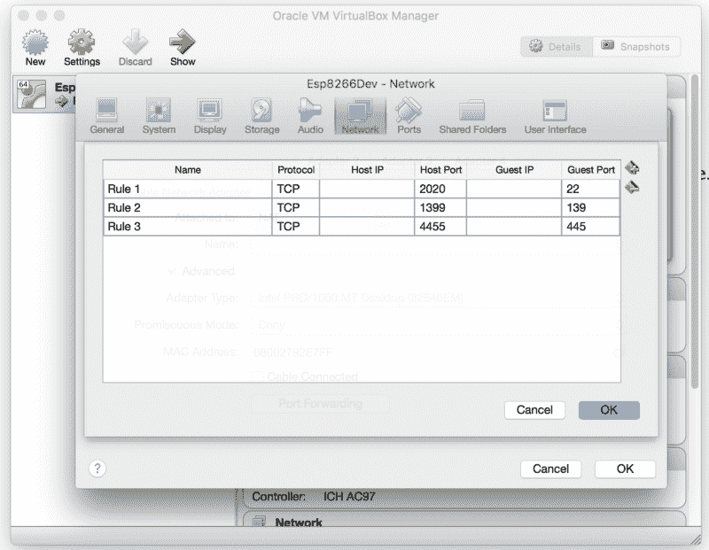
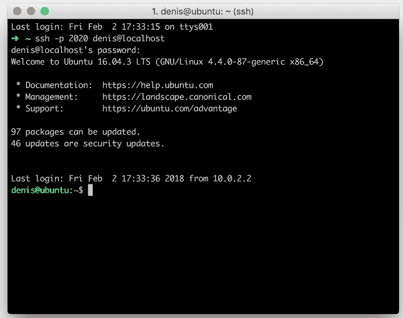
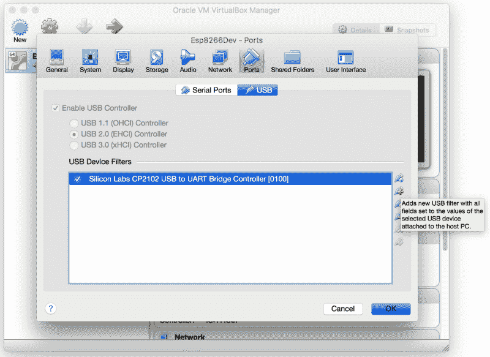
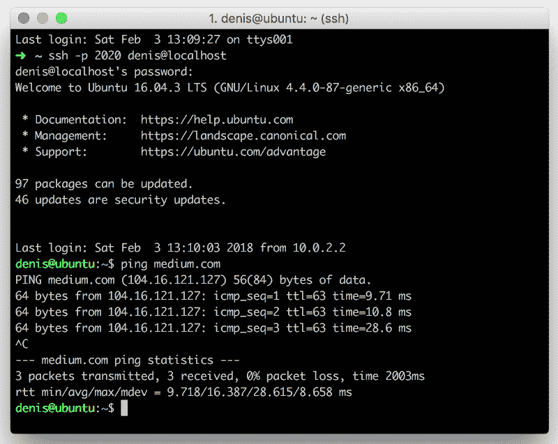
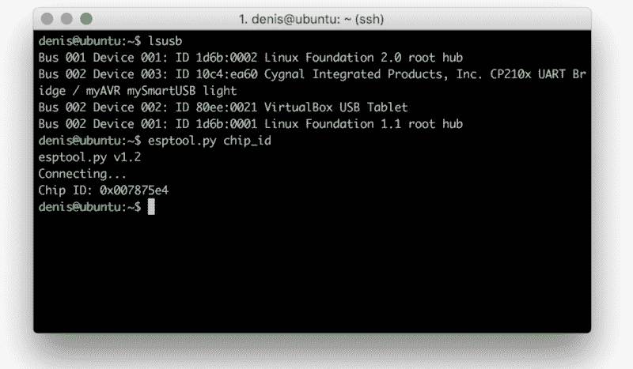
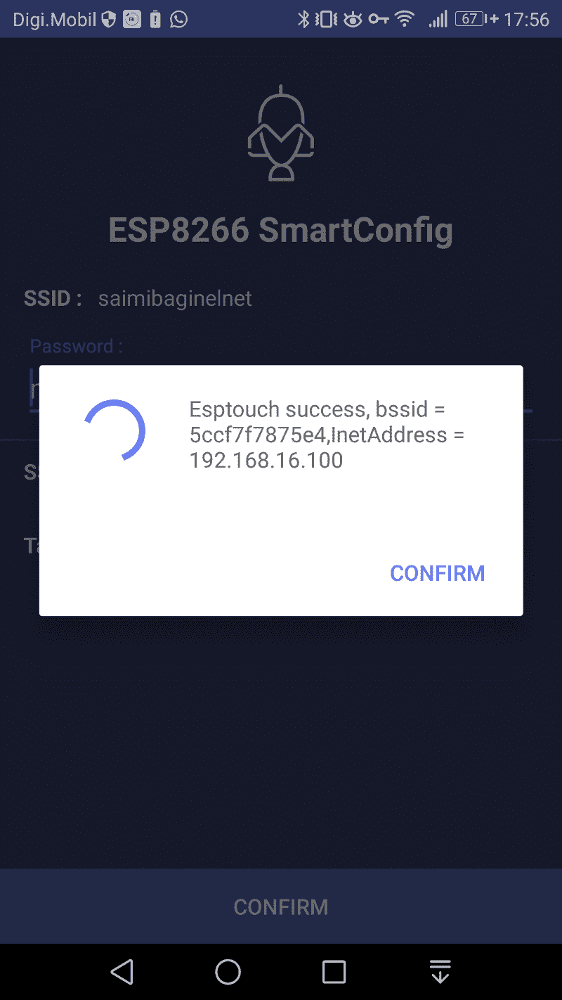

# 如何开始使用 FreeRTOS 和 ESP8266

> 原文：<https://www.freecodecamp.org/news/how-to-get-started-with-freertos-and-esp8266-7a16035ddd71/>

by Denis Nuțiu

# 如何开始使用 FreeRTOS 和 ESP8266


[Cover Photo by Matan Segev from PexelsCover](https://www.pexels.com/photo/action-android-device-electronics-595804/)

最近，我花了大约 4 美元从全球速卖通购买了一个 NodeMCU。我这样做的原因是为了找出 ESP8266 的所有大惊小怪之处。

NodeMCU 是一个开源的物联网平台。它包括在 Espressif Systems 的 ESP8266 Wi-Fi SoC 上运行的固件，以及基于 ESP-12 模块的硬件。



Source: ESP8266 Datasheet

与 Arduino UNO 相比，我的 ESP8266 在 CPU 能力和价格方面完全超过了它。

ESP8266 比 Arduino 快 500%，便宜 82%。ESP8266 还具有 WiFi 连接功能。

当我访问 ESP8266 的 Espressif 网站时，我感到非常惊讶。有许多文档和资源可供您使用。例如，有一个 Android 应用程序告诉您的 ESP8266 连接到您的 WiFi。该应用程序以数据包的形式发送 SSID 和密码，ESP8266 对其进行嗅探，然后连接到您的 WiFi。这叫做 SmartConfig，是德州仪器发明的。

在本文中，我将指导您从 Espressif RTOS SDK 设置和运行智能配置示例。

#### 这是你需要的东西:

*   一台现代电脑。
*   带 ESP12-E 的 NodeMCU 板
*   虚拟世界([https://www.virtualbox.org/wiki/Downloads](https://www.virtualbox.org/wiki/Downloads))
*   https://www.ubuntu.com/download/server 的 Ubuntu 服务器 LTS

### 为开发配置 VirtualBox

1.  下载 VirtualBox 并安装 Ubuntu Server。这应该很容易做到，但是如果你不知道怎么做，谷歌一下或者看看这个图片[一步一步的指导](https://dalanzg.github.io/tips-tutorials/ubuntu/2016/04/15/install-ubuntu-server-on-virtualbox/)。安装操作系统是一项不错的技能。*(提示:当 VirtualBox 提示您选择磁盘时，请动态分配磁盘，大小至少为 50GB。这将为你今后省去一些麻烦。)*
2.  确保您可以从虚拟机内部访问互联网，并配置 DNS 服务器:



Right click the machine then Settings -> Network

要配置 DNS 服务器，请看这个[例子](https://askubuntu.com/questions/346838/how-do-i-configure-my-dns-settings-in-ubuntu-server)。

> 例子:`dns-nameservers 8.8.8.8 8.8.4.4`如果你能 ping 通谷歌，那么你就可以开始了！

3.(可选)安装 [OpenSSH](https://help.ubuntu.com/lts/serverguide/openssh-server.html) 和 [Samba](https://help.ubuntu.com/lts/serverguide/samba-fileserver.html) 服务器。这会让你的生活轻松很多。

4.**(可选)**启用端口转发。为了直接 SSH 到您的虚拟机，您需要启用端口转发。例如，将您的**主机**上的**端口 2222** 映射到您的**虚拟机**的**端口 22** 。



Enable Port forwarding: Settings -> Network **-> Port Forw**arding

如果您启用了端口转发，您现在可以从您的主机 SSH 到您的虚拟机，如下图所示。



FIG1: ssh -p 2020 denis@localhost

注意:如果你在 Windows 上，你需要 **Putty** 来 SSH 进入虚拟机。

5.插入 NodeMCU 并执行以下命令:

`tail -f /var/log/kern.log`

这将向您显示该设备已被标识为/dev/ttyUSB0。如果什么都没有发生，那么您需要将 USB 添加到虚拟机。添加 USB 后，拔出并再次插入您的设备。



Adding USB: Settings -> Ports -> USB

如果你已经到了这一步，并且一切正常，**祝贺你**！现在，您已经准备好编译 SDK 并运行 SmartConfig 示例。你甚至可以在 https://twitter.com/metonymyqt 的[给我发推文](https://twitter.com/metonymyqt)

### **编译 SDK 并刷新板卡**

1.  安装所需的软件包(如下所示)。这些信息也可以在 SDK 的 readme.md 上找到。

```
sudo apt-get install make unrar-free autoconf automake libtool gcc g++ gperf flex bison texinfo gawk ncurses-dev libexpat-dev python-dev python python-serial sed git unzip bash help2man wget bzip2 libtool-bin
```

2.创建一个新文件夹并导航到其中:`mkdir Development && cd Development`

3.克隆开放的 SDK:[https://github.com/pfalcon/esp-open-sdk](https://github.com/pfalcon/esp-open-sdk)

`git clone --recursive https://github.com/pfalcon/esp-open-sdk.git`

3.运行方式:`make`

警告:这一步需要一段时间才能完成，请耐心等待。在我的虚拟机上，它在 50 分钟后完成。在你的电脑上，这可能需要或多或少的时间，但在你跑步之前，请确保你的**连接到互联网**并且**的 DNS 配置正确**。最好的检查方法是，如果谷歌在你所在的地区被屏蔽，就对谷歌或其他网站执行 ping 操作。



Successful ping command: $ ping medium.com

如果 ping 成功，您可以最小化窗口，观看您最喜欢的电视节目。大约 40 分钟后再回来(但要确保您的电脑没有进入睡眠状态)。

SDK 成功构建后，您会看到一条消息，告诉您在您的路径中放置一些东西。为此，请执行以下命令:

```
echo 'export PATH=/home/denis/Development/esp-open-sdk/xtensa-lx106-elf/bin:$PATH' >> ~/.profile
```

该命令会将字符串追加到 **~/中。配置文件**文件。现在请运行以下命令:

`xtensa-lx106-elf-gcc --version`

如果命令执行成功，那么您就可以开始了！

4.测试您的主板

插入您的 NodeMCU 并运行 **lsusb** 来验证您的设备是否已连接。之后，运行 **esptool.py chip_id** 。您现在应该可以看到主板的芯片 id。



esptool.py chip_id

5.克隆 [ESP8266_RTOS_SDK](https://github.com/espressif/ESP8266_RTOS_SDK)

```
git clone https://github.com/espressif/ESP8266_RTOS_SDK.git
```

6.使用下面的命令导出 SDK 路径和 SDK/BIN 路径。

```
echo 'export SDK_PATH=/home/denis/Development/ESP8266_RTOS_SDK' >> ~/.profile
```

```
echo 'export BIN_PATH=/home/denis/Development/ESP8266_RTOS_SDK/bin' >> ~/.profile
```

7.编译 SmartConfig 示例

```
cd /home/denis/Development/ESP8266_RTOS_SDK/examples/smart_config/
```

```
chmod +x ./gen_misc.sh
```

```
./gen_misc.sh
```

现在接受默认值，直到要求您输入 **SPI_SIZE_MAP。**这是您选择 **4** 的地方，因为 NodeMCU 的闪存大小为 32mb，这相当于 4MB。*您也可以选择 SPI_SPEED 3=80Mhz*

您会看到类似这样的内容:

```
!!!SDK_PATH: /home/denis/Development/ESP8266_RTOS_SDKBIN_PATH: /home/denis/Development/ESP8266_RTOS_SDK/bin
```

```
No boot needed.Generate eagle.flash.bin and eagle.irom0text.bin successully in BIN_PATHeagle.flash.bin — — — →0x00000eagle.irom0text.bin — →0x20000!!!
```

8.闪一下黑板

```
cd $BIN_PATH
```

```
esptool.py erase_flash
```

```
esptool.py write_flash 0x00000 $BIN_PATH/eagle.flash.bin 0x20000 $BIN_PATH/eagle.irom0text.bin 0x3FC000 $BIN_PATH/esp_init_data_default.bin
```

现在，如果您重置电路板，您应该看不到 LED 闪烁。

9.使用电话应用程序

*   [安卓应用](https://play.google.com/store/apps/details?id=com.cmmakerclub.iot.esptouch&hl=en)
*   [iPhone 应用程序](https://itunes.apple.com/us/app/ti-wifi-smartconfig/id580969322?mt=8)



ScreenShot from my Android Device

打开应用程序，确定您已连接到 WiFi AP，输入您的密码，然后按“确认”。几秒钟后，ESP8266 应该会连接到您的 AP。就是这样。祝贺你到达终点！

如果您想使用 ESP8266-RTOS SDK 进行更多开发，请访问官方网站。您可以在那里找到大量的资源和文档。另外，请看看 SDK 文件夹中的其他示例。

非常感谢你花时间阅读这篇文章。如果你想联系我，你可以在推特上这样做

#### 资源

*   [ESP8266 概述](https://www.espressif.com/en/products/hardware/esp8266ex/overview)
*   [ESP8266 资源](https://www.espressif.com/en/products/hardware/esp8266ex/resources)
*   [FreeRTOS 网站](https://www.freertos.org/)