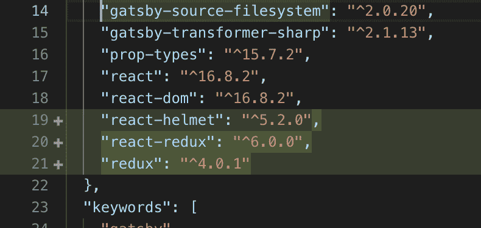
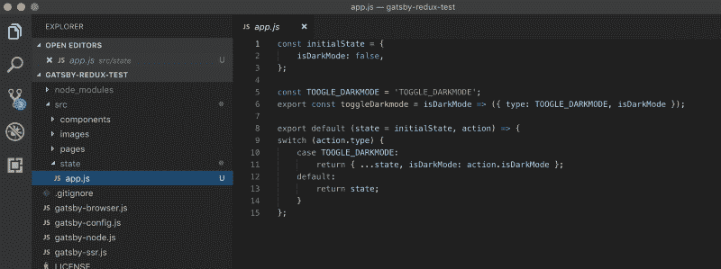
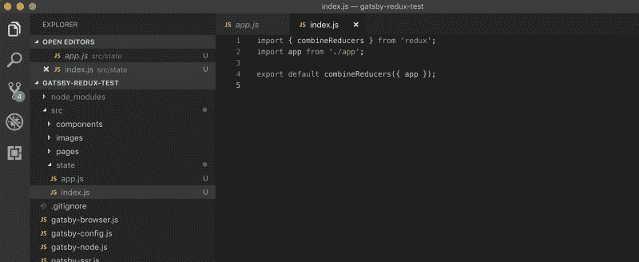
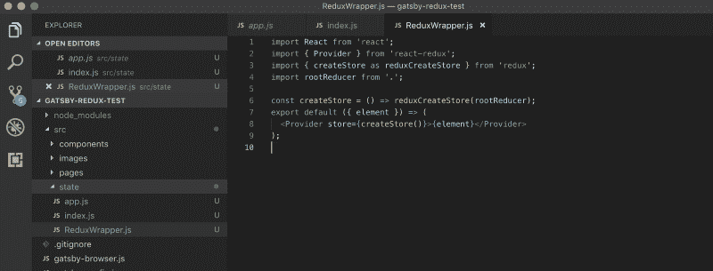
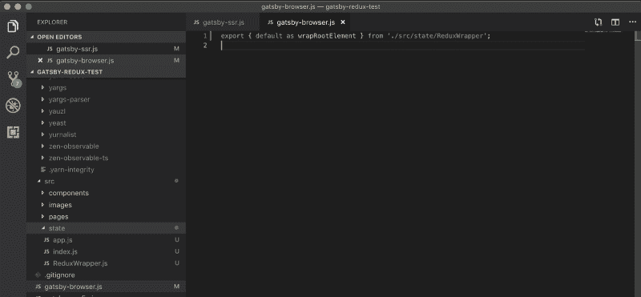
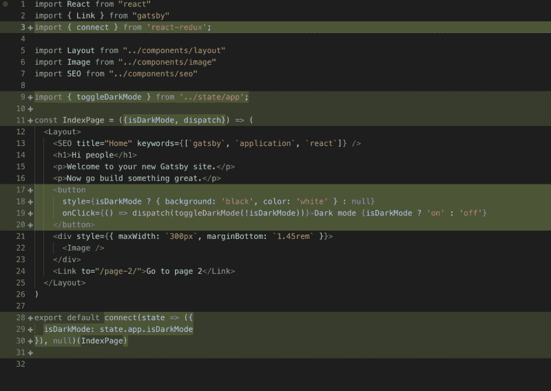
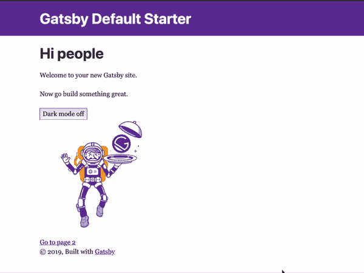

# 如何入门《盖茨比 2》和《Redux》

> 原文：<https://www.freecodecamp.org/news/how-to-get-started-with-gatsby-2-and-redux-ae1c543571ca/>

作者:卡尔-约翰·基尔

# 如何入门《盖茨比 2》和《Redux》


Gatsby 2 and Redux blends together like candy in a jar

在构建具有动态特性的静态 web 应用程序时，Gatsby + Redux 是一个强大的组合。有了《盖茨比 2》，启动和运行变得前所未有的简单。今天，我将指导您完成所需的步骤。

不太喜欢读书？？马上前往 Redux starter:
h[ttps://github . com/caki 0915/Gatsby-Redux-test/](https://github.com/caki0915/gatsby-redux-test/)
或使用 Gatsby CLI:

```
npx gatsby new gatsby-redux-test https://github.com/caki0915/gatsby-redux-test/
```

### 盖茨比是什么？

Gatsby 是最受欢迎的静态站点生成器之一。它预配置了 Webpack、React 和 GraphQL，在构建 web 应用程序时会给你一个很好的开端。它还带有丰富的插件生态系统，可以轻松连接到各种数据源。在他们的网站上阅读更多关于盖茨比的内容。

### Redux 是什么？

Redux 是一个状态容器，经常和 React 应用一起使用。本文将假设您已经知道 Redux 是如何工作的。如果你是 Redux 的新手或者需要一个回顾，你可以在他们的网站上找到更多的信息。

**？我们走吧！？**

首先创建一个新的 Gatsby 项目。在终端中，运行:*(将* *****替换为*****

```
*`npx gatsby new gatsby-redux-test && cd gatsby-redux-test`*
```

*下一步是安装来自 NPM 的`redux`和`react-redux`包。*

```
*`npm install --save redux react-redux`*
```

*

Redux and React-redux packages installed* 

*好极了，让我们添加一个州！*

*在你的`src`文件夹中创建一个名为`state`的新文件夹，并创建一个文件`app.js`。出于本教程的目的，我们将添加一个简单的功能，让您切换变量“ ****【黑暗模式】**** ”的开和关。*

*首先，添加初始状态:*

```
*`const initialState = {
  isDarkMode: false,
};`*
```

*添加动作创建者(切换**黑暗模式的开与关):***

```
***`const TOGGLE_DARKMODE = 'TOGGLE_DARKMODE';

export const toggleDarkMode = isDarkMode => ({
  type: TOGGLE_DARKMODE, isDarkMode
});`***
```

***添加减速器:***

```
***`export default (state = initialState, action) => {
  switch (action.type) {
    case TOGGLE_DARKMODE:
      return { ...state, isDarkMode: action.isDarkMode };
    default:
      return state;
  }
};`***
```

***

Initial State, Action Creator, and Reducer*** 

***好极了。现在，让我们添加根式缩减器。在`state`文件夹中创建一个新文件`index.js`。***

```
***`import { combineReducers } from 'redux';
import app from './app';

export default combineReducers({ app });`***
```

***

Our root reducer.*** 

***现在我们要创建一个商店和供应商。在`state`文件夹中创建一个新文件`ReduxWrapper.js`。这个组件将包装我们在 Gatsby 中的根组件。***

```
***`import React from 'react';
import { Provider } from 'react-redux';
import { createStore as reduxCreateStore } from 'redux';
import rootReducer from '.';

const createStore = () => reduxCreateStore(rootReducer);

export default ({ element }) => (
  <Provider store={createStore()}>{element}</Provider>
);`***
```

***

Create a Store and a Provider*** 

***Gatsby 将在服务器和浏览器上渲染我们的应用程序，幸运的是，Gatsby 有一个非常灵活的 API，让我们可以进行渲染。？我们可以从两个文件实现钩子:`gatsby-browser.js`和`gatsby-ssr.js`。***

***我们感兴趣的钩子叫做 ****wrapRootElement**** ，让你用一个定制元素包装你的应用。这正是我们的 Redux 提供者所需要的。？你可以在[文档](https://www.gatsbyjs.org/docs/browser-apis/#wrapRootElement)中阅读更多关于 ****wrapRootElement**** 的内容。***

***因为我们想从`gatsby-browser.js`和`gatsby-ssr.js`中导出我们的 ****ReduxWrapper**** 作为****wrapprootelement****，所以将这一行添加到两个文件中:***

```
***`export { default as wrapRootElement } from './src/state/ReduxWrapper';`***
```

***

Export our ReduxWrapper from gatsby-ssr.js and gatsby-browser.js*** 

***好的完成了。盖茨比和 Redux 现在合作了！？现在我们只需要一种方法来测试它。***

***让我们来看看我能想到的最简单的方法:在起始页上有一个按钮，你可以在这里打开和关闭**。当 ****darkMode**** 开启时，按钮将为黑色，文字为白色。*****

***

A simple test to see that Redux is actually working.*** 

***在终端运行中:***

```
***`npm run develop`***
```

***还有…看黑暗主题在行动！***

***

Minimal Redux example*** 

***好吧，也许这不是那么令人印象深刻，但这个例子做了它的工作，我相信你会在你的盖茨比应用程序中找到一个更好的 Redux 应用程序。？***

### ***摘要***

***如果你想构建具有动态特性的静态 web 应用程序，Gatsby + Redux 是一个强大的组合。我也在我的项目中使用它。如果你觉得这篇文章有用，请添加评论和链接到你的了不起的盖茨比/Redux-app。？？***

***

[https://carljohan.me](https://carljohan.me) - A Drawer is a good use-case for Redux***