# 如何开始 JavaScript 的国际化

> 原文：<https://www.freecodecamp.org/news/how-to-get-started-with-internationalization-in-javascript-c09a0d2cd834/>

亚历克斯·佩尔姆亚科夫

# 如何开始 JavaScript 的国际化


Photo by [Vladislav Klapin](https://unsplash.com/@lemonvlad) on [Unsplash](https://unsplash.com/photos/YeO44yVTl20)

通过使我们的应用适应不同的语言和国家，我们提供了更好的用户体验。对于用户来说，处理已知的日期、货币和数字符号更简单。

**国际化(i18n)** 包括在你的应用中添加对不同语言和国家的支持。数字 18 代表第一个‘I’和最后一个‘n’*之间的字母数。*

国际化的例子可以是 Unicode 支持、不同字母表的用户界面定制，或者非英语字符串的数组排序。

JavaScript 实现了[国际化 API](https://www.ecma-international.org/ecma-402/1.0/) 规范，定义了内置的 [Intl](https://developer.mozilla.org/en-US/docs/Web/JavaScript/Reference/Global_Objects/Intl) 对象。

让它如此有用的是它有很好的跨浏览器兼容性和对 Node.js 的支持:

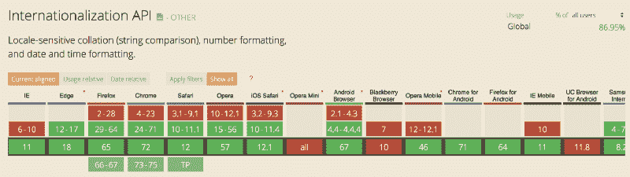

[https://caniuse.com/#search=intl](https://caniuse.com/#search=intl)

### 我们开始吧！

`**Intl**`对象提供了对几个构造函数的访问，比如:

*   国际机场。DateTimeFormat —区分语言的日期和时间格式。
*   国际机场。NumberFormat — 区分语言的数字格式。
*   国际机场。复数规则— 复数敏感格式和复数语言规则。
*   国际机场。Collator — 区分语言的字符串比较。

创建这些对象遵循一个简单的模式:

```
const formatter = new Intl.ctor(locales, options);
```

例如，在奥地利使用的" **de-AT"** locale:德语:

```
const dateFormatterAT = new Intl.DateTimeFormat("de-AT");
```

然后我们用提供的**日期**对象调用**格式()**方法:

```
const date = new Date("2018-11-25");const format = dateFormatterAT.format(date); // "25.11.2018"
```

它只包含语言和国家代码。很快，我们将看到更全面的例子。在这里，你可以找到更多的语言环境示例。

我们可以使用[navigator . language](https://developer.mozilla.org/en-US/docs/Web/API/NavigatorLanguage/language)——用户的首选语言，我们将它用作一个地区:

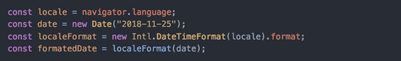

这里不用直接调用一个**格式**方法，我们可以把它赋值为一个函数。这很好，因为一旦我们创建了一个专门的格式函数，我们就可以多次使用它。

只要几行代码，你就有了一个本地化的日期！

因此，接下来，我们将深入探讨并了解更多关于语言环境的知识。如果你还没有准备好，只是想看看像下图这样的很酷的演示——去下面的例子部分！

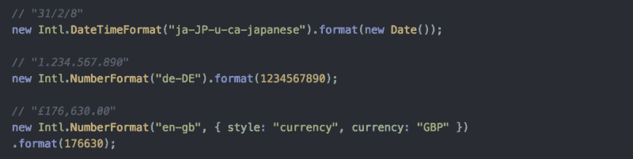

#### 潜得更深

嗯，这足以了解它是如何工作的，但真正的用例可能会更加复杂。如果我们想:

*   使用日本或波斯日历显示我们的日期
*   日期和数字都使用泰语或阿拉伯-印度语数字
*   使用简体中文
*   以上的任何组合？

### 什么是区域设置？

为了使用这个 API，我们必须学习更多关于语言环境的知识。首先，我们来定义一下。

区域设置是指一组用户首选项的标识符，例如:

*   日期和时间
*   数字和货币
*   时区、语言和国家的翻译名称
*   度量单位
*   排序顺序(归类)

区域设置不区分大小写。这只是一个惯例。

区域设置必须是一个包含 [BCP 47 语言标签](http://tools.ietf.org/html/rfc5646)的字符串，所有部分由连字符分隔。

让我们看下一个例子:


还是那句话，只有四行代码？让我们看看下面的图表，并检查我们的区域设置的每个部分:

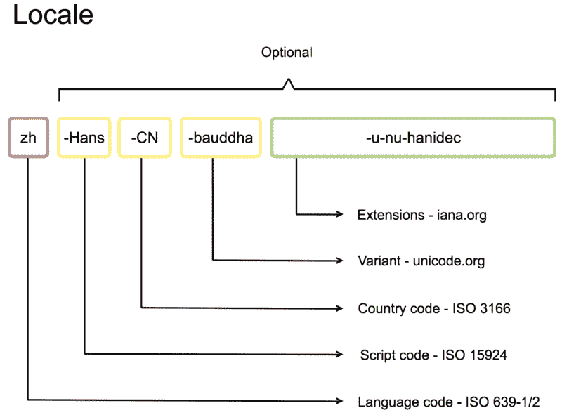

从这张图片中，您可以看到只有第一部分—语言代码—是必需的。你不太可能需要这样的场所。但是，这是一个很好的例子，看看每一个可能的语言环境部分，了解什么是语言环境。

我们的语言环境包含所有可能的部分:

*   **zh** (语言代码)—汉语
*   **汉斯**(脚本代码)——用简体字书写
*   **CN** (国家代码)——在中国使用。
*   波德哈(变体)——使用佛教混合梵语方言
*   **u-nu-hanidec** (扩展名)—使用汉十进制数

下面你可以找到更多关于脚本、变体和扩展的例子。

#### 脚本代码

它们和语言标签一起使用，表示一种语言是用哪种脚本编写的。例如:

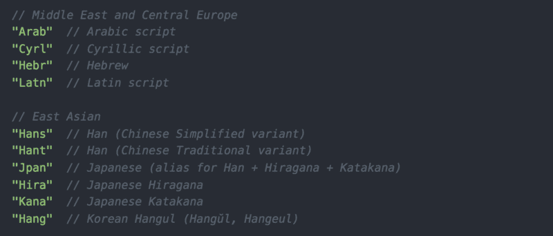

#### 变体代码

变体代表一种语言方言。

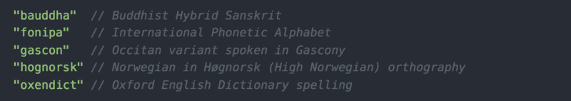

#### 扩展ˌ扩张

它包括不同的日历和数字系统。

**日历**有“u-ca-”前缀，可能的值(不包括全部):

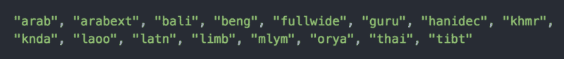

**数字系统**有“u-nu”前缀，可能的值(不包括全部):


Iana 组织负责保持此列表的[最新。](https://www.iana.org/assignments/language-subtag-registry/language-subtag-registry)

### 现场谈判

关于语言环境，我们需要了解的最后一件事是它们是如何被解析的。我们之前看到过这个例子:

```
const formatter = new Intl.ctor(locales, options);
```

`locales`参数指定了单个语言环境或一组语言环境。环境(browser 或 Node.js)将其与可用的语言环境进行比较，并选择最佳的语言环境。

有两种匹配算法:

*   **查找** —从多到少检查:如果 **zh-Hans-SG** 不可用，获取 **zh-Hans** ，如果不可用— **zh，** else **—** 默认区域设置。
*   **最佳拟合**(默认)—改进算法。如果请求了“es-GT”-危地马拉的西班牙语，但没有找到，那么将选择“es-MX”-墨西哥的西班牙语，而不是作为“es”提供后备。

如果我们提供一个区域设置数组，那么第一个匹配的就赢了。

所以，理论到此为止——现在是实践的时候了！

### 例子

示例代码可以在 [GitHub](https://gist.github.com/alexpermyakov/69706e1ec5bff64efc14c15bc9e0bbcb) 上找到。

#### 日期/时间格式


语言环境并不是 [Intl API](https://developer.mozilla.org/en-US/docs/Web/JavaScript/Reference/Global_Objects/Intl) 的唯一优点。您可以使用`options`参数以理想的方式修改结果。

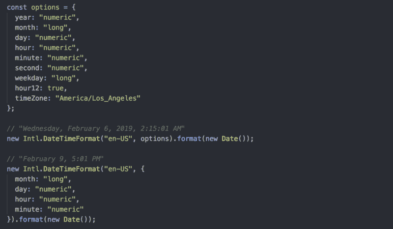

与**日期**对象相比，这是一个巨大的更新！

与 moment.js 不同的是，**不能手动交换**日期的任何部分，如年和月。您必须使用正确的语言环境。这听起来像是一个**限制**，但是它让我们的用户更加熟悉。

#### 数字格式

知道如何处理日期，你就知道如何处理数字。唯一的区别是选项列表:

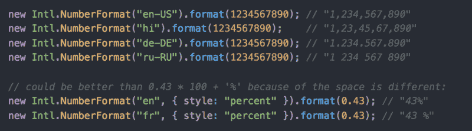

#### 货币格式

对于货币我们使用`Intl.NumberFormat`构造函数，但是提供了不同的选项列表:


注意，我们这里不兑换货币。我们所做的就是使用**适当的**货币规则格式化数字 172630。在这里你可以找到[货币代码](https://www.currency-iso.org/dam/downloads/lists/list_one.xml)的列表。

#### 复数规则格式

这将告诉您根据特定地区的给定数字应用哪种形式:

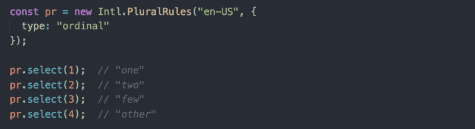

它对于格式化序数非常方便:

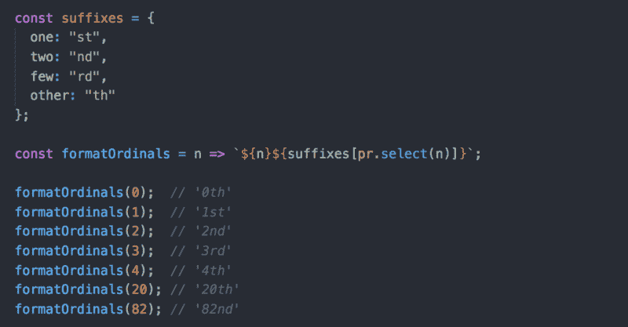

#### 排序字符串

对包含额外字母(如德语或瑞典语中的*)的字符串进行排序不是您想要手动完成的，因为排序取决于语言。幸运的是，我们有`Intl**.**Collator`。同样，我们所要做的就是提供一个必需的场所:*

*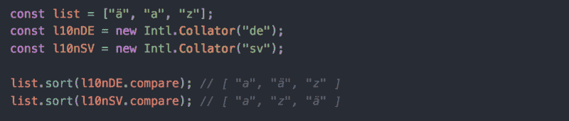*

### *结论*

*国际化是一个伟大而复杂的话题。但是如果你知道什么是语言环境以及如何构建它，剩下的就非常容易使用了。*

### *就是这样！*

*如果您有任何问题或反馈，请在下面的评论中告诉我，或者在 [Twitter](https://twitter.com/AlexDevBB) 上联系我。*

#### *如果这有用，请点击拍手？下面扣几下，以示支持！⬇⬇ ?？*

*以下是我写的更多文章:*

*[**如何用 JavaScript 中的 map()、reduce()和 filter()简化你的代码库**](https://medium.freecodecamp.org/15-useful-javascript-examples-of-map-reduce-and-filter-74cbbb5e0a1f)
[*当你读到 Array.reduce 以及它有多酷的时候，你发现的第一个、有时也是唯一一个例子是…*medium.freecodecamp.org](https://medium.freecodecamp.org/15-useful-javascript-examples-of-map-reduce-and-filter-74cbbb5e0a1f)[**生产就绪 Node.js REST APIs 设置使用 TypeScript、PostgreSQL 和 Redis 的总和。**](https://medium.com/@alex.permyakov/production-ready-node-js-rest-apis-setup-using-typescript-postgresql-and-redis-a9525871407)
[*一个月前，我接到一个任务，要构建一个简单的搜索 API。它所要做的就是从第三方获取一些数据……*medium.com](https://medium.com/@alex.permyakov/production-ready-node-js-rest-apis-setup-using-typescript-postgresql-and-redis-a9525871407)*

*感谢你阅读❤️*