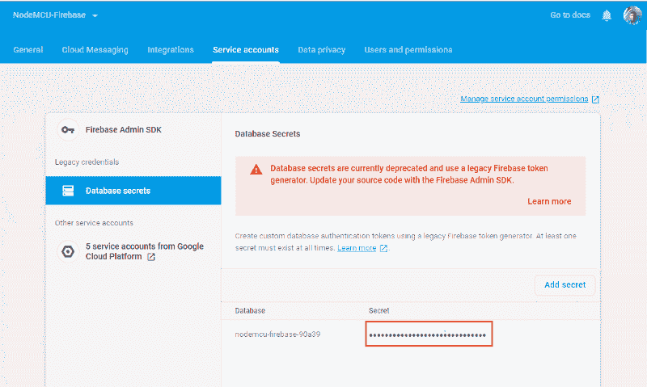
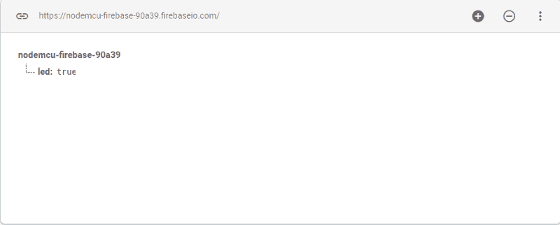
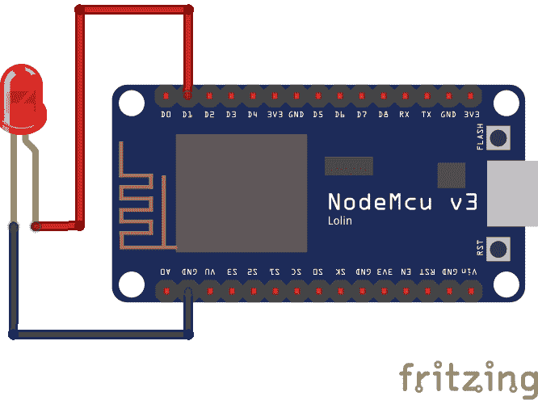

# 如何使用 NodeMCU Devkit 和 Firebase 数据库开始使用物联网

> 原文：<https://www.freecodecamp.org/news/how-to-get-started-with-iot-using-nodemcu-devkit-and-firebase-database-d43e8a408a88/>

作者季斌·托马斯

# 如何使用 NodeMCU Devkit 和 Firebase 数据库开始使用物联网

Photo by Tim Käbel on Unsplash

> ***“互联网会消失。将会有如此多的 IP 地址，如此多的设备，传感器，你戴着的东西，你与之互动的东西，你甚至不会感觉到它。它将一直是你存在的一部分。想象你走进一个房间，房间是动态的。经过你的允许，你可以和房间里发生的事情互动。”***

如今，我们日常使用的许多设备都与互联网相连，如电视、智能音箱、冰箱等。这些设备扩展了它们的主要功能，允许它们与互联网上的其他设备交互并被远程控制。

您可以使用一些传感器和微控制器来构建自己的物联网设备。有很多开发板会帮助你入门物联网，像 Arduino，NodeMCU，Raspberry Pi 等。通过这些设备，你可以实现家居自动化。

在这篇文章中，我们将使用 NodeMCU devkit 和 Firebase 来远程打开和关闭 LED。NodeMCU devkit 和 Firebase 是开始构建一些物联网项目的最佳组合。NodeMCU 价格便宜，内置 wifi 上网，Firebase 免费计划绰绰有余。

### 设置开发环境

1.我们将使用 Arduino IDE 编写代码，并将代码刷新到设备中。点击这里下载最新版本的 IDE [。](https://www.arduino.cc/en/main/software)

2.由于我们使用的是 Arduino IDE 官方不支持的 NodeMCU，所以我们必须添加设备的 JSON 文件。在 Arduino IDE 中，将此 URL 添加到

> 打开文件>首选项>附加 Board Manager URLs

> [http://arduino . esp8266 . com/stable/package _ esp8266 com _ index . JSON](http://arduino.esp8266.com/stable/package_esp8266com_index.json)

3.从中选择您的主板

> 工具>电路板>节点 MCU 1.o

4.要在 NodeMCU 中使用 firebase 数据库，您需要下载 firebase-arduino 库，该库抽象了 firebase 的 REST API。[在此下载 firebase-arduino](https://github.com/FirebaseExtended/firebase-arduino.git)。

5.在 Arduino IDE 中包含下载的 zip 文件。

> 草图>包含库>添加。zip >选择 zip 文件

6.您还需要安装 ArduinoJson 库，该库可以从 Arduino IDE 本身下载。

注意:库版本不应是 6.x.x —使用最新的 5.x.x

> 草图>包含库>管理库>搜索 ArduinoJson

### 设置 Firebase 数据库

7.从[控制台](https://console.firebase.google.com/)创建一个新的 firebase 项目，并指向数据库部分。选择 firebase 实时数据库。

8.从“设置”面板>“服务帐户”中复制用于身份验证的数据库密码。

Database secret

9.向 firebase 数据库添加一个 led 节点。该值将决定是打开还是关闭 LED。

### 配置 Arduino IDE 和 firebase 数据库协同工作

现在所有的设置程序都完成了，让我们开始编码。

您需要为您在步骤 8 中复制的数据库 URL 和 firebase secret 创建一个宏。

> #定义 FIREBASE _ HOST " yourfirebase database . FIREBASE io . com "

> #define FIREBASE_AUTH "***** "

为了简单起见，我们将编写一个简单的代码来远程打开和关闭 LED

10.LED 的正极应连接到 D1 引脚，负极应连接到 NodeMCU 的接地引脚。

11.从 Arduino IDE 上传您的代码。

> 草图>上传

12.现在尝试将数据库值更改为 true 和 false。led 现在应该开始打开和关闭。此外，您可以通过创建一个切换 LED 的 web 应用程序来扩展该项目，而不是手动更改数据库中的值。

现在你已经了解了如何将 NodeMCU 连接到互联网并远程控制它的基本知识，开始用它来开发一些新项目吧。