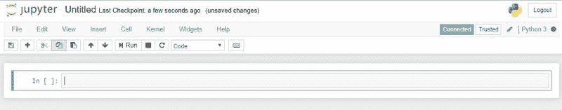
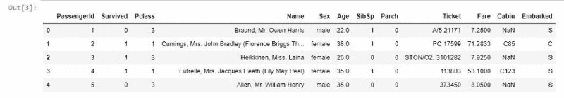
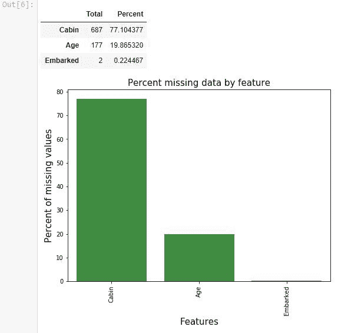
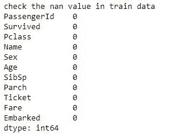
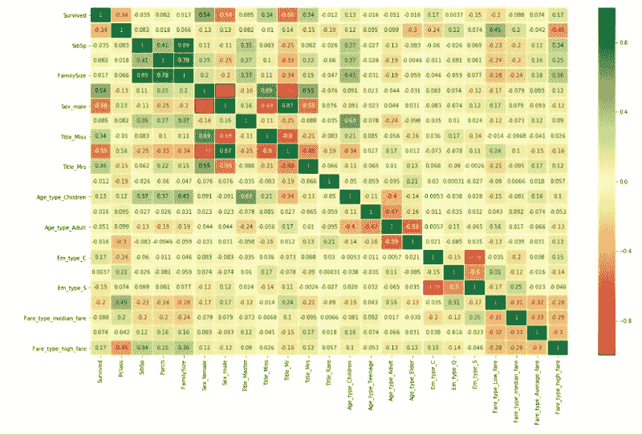
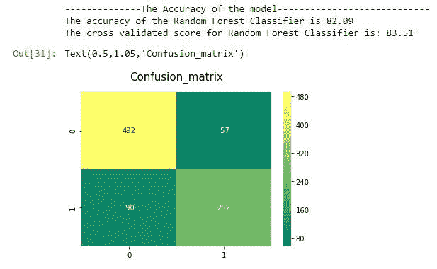

# 如何在 10 分钟左右开始机器学习

> 原文：<https://www.freecodecamp.org/news/how-to-get-started-with-machine-learning-in-less-than-10-minutes-b5ea68462d23/>

作者:Tirmidzi Faizal Aflahi

随着机器学习在行业内的兴起，对能够帮助您快速迭代流程的工具的需求变得至关重要。Python，机器学习技术的后起之秀，往往是带给你成功的首选。所以，用 Python 指导机器学习是非常必要的。

### Python 机器学习简介

那么，为什么选择 Python 呢？根据我的经验，Python 是最容易学习的编程语言之一。需要快速迭代该过程，数据科学家不需要对该语言有很深的了解，因为他们可以很快掌握它的窍门。

有多容易？

```
for anything in the_list:    print(anything)
```

**最简单的**。语法和英语(或者说人类语言，而不是机器)关系密切。也没有让人类困惑的傻傻的大括号。我有一个同事是做质量保证的，不是软件工程师，她能在一天之内写出生产级别的 Python 代码。(说真的！)

所以我们将在下面讨论的库的构建者选择 Python 作为他们的语言选择。作为数据分析师和科学家，我们可以使用他们的杰作来帮助我们完成任务。这些是不可思议的库，**是使用 Python 进行机器学习的必备工具**。

1.  **Numpy**

著名的数值分析库。它将帮助你做很多事情，从计算数据分布的中位数，到处理多维数组。

**2。熊猫**

用于处理 CSV 文件。当然，您将需要处理一些表格，并查看统计数据，这是您想要使用的正确工具。

**3。Matplotlib**

将数据存储在 Pandas 数据框中后，您可能需要一些可视化工具来了解有关数据的更多信息。图像仍然胜过千言万语。

**4。海博恩**

这也是另一个可视化工具，但更侧重于统计可视化。比如直方图，饼状图，曲线，或者相关表。

**5\. Scikit-Learn**

这是用 Python 做机器学习的最终 boss。所谓的用 Python 学习机器就是这个家伙。sci kit-学习。从算法到改进，你需要的所有东西都在这里。

**6\. Tensorflow and Pytorch**

这两个我就不多说了。但是如果你对深度学习感兴趣，看看它们，这将值得你花时间。(关于深度学习我下次再给教程，敬请期待！)


Photo by [Hitesh Choudhary](https://unsplash.com/photos/D9Zow2REm8U?utm_source=unsplash&utm_medium=referral&utm_content=creditCopyText) on [Unsplash](https://unsplash.com/search/photos/machine-learning?utm_source=unsplash&utm_medium=referral&utm_content=creditCopyText)

### Python 机器学习项目

当然，一个人读书学习并不会把你带到你需要去的地方。你需要实际的练习。正如我在我的博客上所说的，如果你不直接进入数据，学习工具是没有意义的。因此，我向您介绍一个可以轻松找到 Python 机器学习项目的地方。


Courtesy of [Kaggle.com](https://www.kaggle.com)

Kaggle 是一个你可以直接研究数据的平台。你会解决项目，并且非常擅长机器学习。一些可能让你对它更感兴趣的事情:它举办的机器学习比赛可能会给出高达 10 万美元的奖金。你可能想试试你的运气。哈哈。

但是，最重要的不是钱——这真的是一个你可以用 Python 项目找到机器学习的地方。有很多项目你可以尝试。但是如果你是一个新手，我假设你是，你会想参加这个比赛。

以下是我们将在以下教程中使用的示例项目:

#### [泰坦尼克号:机器从灾难中学习](https://www.kaggle.com/c/titanic)

是的，臭名昭著的泰坦尼克号。1912 年的一场悲剧夺走了 2224 名乘客和机组人员中 1502 人的生命。这个 Kaggle 比赛(或者我可以说教程)给你关于灾难的真实数据。你的任务是解释这些数据，这样你就可以预测一个人在事故中是否幸存。

### Python 机器学习教程

在深入研究泰坦尼克号的数据之前，我们先安装一些你需要的工具。

当然，Python。你需要先从 [Python 官方网站](https://www.python.org/downloads/)安装它。您需要安装 3.6+版以保持库的最新状态。

之后，您需要通过 Python pip 安装所有的库。Pip 应该会随着您刚刚下载的 Python 发行版自动安装。

然后通过 pip 安装你需要的东西。打开您的终端、命令行或 Powershell，并编写以下内容:

```
pip install numpypip install pandaspip install matplotlibpip install seabornpip install scikit-learnpip install jupyter
```

嗯，一切看起来都很好。但是等等，朱庇特是什么？Jupyter 代表 Julia、Python、R，因此 Jupytr。但这是一个奇怪的单词组合，所以他们把它改成了 Jupyter。这是一个著名的笔记本，您可以在其中交互式地编写 Python 代码。

只需在您的终端中键入 **jupyter notebook** ，您将打开一个如下所示的浏览器页面:



Jupyter Notebook

将代码写在绿色矩形内，您可以交互式地编写和评估 Python 代码。

现在您已经安装了所有的工具。我们走吧！

#### 数据探索

第一步是探索数据。你需要从 Kaggle 的[泰坦尼克页面下载数据。然后把提取的数据放入你启动 Jupyter 笔记本的文件夹中。](https://www.kaggle.com/c/titanic/data)

然后导入必要的库:

```
import numpy as np import pandas as pdimport matplotlib.pyplot as pltimport seaborn as snsimport warningswarnings.filterwarnings('ignore')%matplotlib inline
```

然后加载数据:

```
train_df=pd.read_csv("train.csv")train_df.head()
```

您将看到类似这样的内容:



这是我们的数据。它包含以下几列:

1.  乘客 Id，乘客的标识符
2.  幸存，不管他/她是否幸存
3.  服务等级，可能 1 是经济舱，2 是商务舱，3 是头等舱
4.  姓名，乘客的姓名
5.  性
6.  年龄
7.  Sibsp，或兄弟姐妹和配偶，船上兄弟姐妹和配偶的数量
8.  帕奇，或父母和孩子，他们在船上的数量
9.  票证，票证详细信息
10.  小屋，他们的小屋。NaN 的意思是未知
11.  登船，登船的起源，S 代表南安普敦，Q 代表皇后镇，C 代表瑟堡

在探索数据的时候，我们经常会发现**缺失数据**。让我们看看他们:

```
def missingdata(data):    total = data.isnull().sum().sort_values(ascending = False)    percent = (data.isnull().sum()/data.isnull().count()*100).sort_values(ascending = False)    ms=pd.concat([total, percent], axis=1, keys=['Total', 'Percent'])    ms= ms[ms["Percent"] > 0]    f,ax =plt.subplots(figsize=(8,6))    plt.xticks(rotation='90')    fig=sns.barplot(ms.index, ms["Percent"],color="green",alpha=0.8)    plt.xlabel('Features', fontsize=15)    plt.ylabel('Percent of missing values', fontsize=15)    plt.title('Percent missing data by feature', fontsize=15)    return ms
```

```
missingdata(train_df)
```

我们会看到这样的结果:



客舱、年龄和登机数据有一些缺失值。客舱信息基本缺失。我们需要对他们做些什么。这就是我们所说的数据清理。

#### 数据清理

这是我们 90%的时间都在用的东西。**我们会为每一个机器学习项目**做大量的数据清理工作。当数据干净时，我们可以轻松地跳到下一步，而不用担心任何事情。

数据清理中最常见的技术是**填充缺失数据**。您可以用**模式、平均值或中位数**来填充缺失的数据。这些选择没有绝对的规则——你可以试着一个接一个地选择，然后看表现。但是，根据经验，您只能对分类数据使用 mode，对连续数据可以使用 median 或 mean。

因此，让我们用 Mode 填充登机数据，用 median 填充年龄数据。

```
train_df['Embarked'].fillna(train_df['Embarked'].mode()[0], inplace = True)train_df['Age'].fillna(train_df['Age'].median(), inplace = True)
```

下一个重要的技术**是删除数据**，特别是对于大量丢失的数据。让我们为小屋数据做它。

```
drop_column = ['Cabin']train_df.drop(drop_column, axis=1, inplace = True)
```

现在我们可以检查我们已经清理的数据。

```
print('check the nan value in train data')print(train_df.isnull().sum())
```



完美！没有发现丢失的数据。意味着数据已经被清除。


Photo by [Robert Bye](https://unsplash.com/photos/BY34glOW7wA?utm_source=unsplash&utm_medium=referral&utm_content=creditCopyText) on [Unsplash](https://unsplash.com/search/photos/engineering?utm_source=unsplash&utm_medium=referral&utm_content=creditCopyText)

#### 特征工程

现在我们已经清理了数据。接下来我们可以做的是特征工程。

特征工程基本上是一种从现有数据中寻找特征或数据的技术。有几种方法可以做到这一点。更多时候是讲常识。

让我们来看看装载的数据:它填充了 Q、S 或 Python 库不能处理这些数据，因为它只能处理数字。所以你需要做一些叫做 **One Hot Vectorization** 的事情，把一列变成三列。假设登船 Q，登船 S 和登船 C，不管这个人是否从那个港口登船，它们都填有 0 或 1。

另一个例子是 SibSp 和 Parch。也许这两栏都没有什么有趣的内容，但是你可能想知道登船乘客的家庭有多大。你可能会想，如果家庭成员越多，生存的机会就会越大，因为他们可以互相帮助。另一方面，单身的人会过得很艰难。

所以您想**创建另一个名为 family size 的列**，它由 sibsp + parch + 1(乘客自己)组成。

最后一个例子叫做 **bin 列**。这是一种技术，它创建了一系列的值来将几个事物组合在一起，因为你假设很难区分具有相似值的事物。比如年龄。对于一个 5 岁和 6 岁的人来说，有什么显著的区别吗？或者对于 45 岁和 46 岁的人来说，有什么大的区别吗？

这就是我们创建 bin 列的原因。也许对于年龄，我们将创建 4 个箱子。儿童(0-14 岁)、青少年(14-20 岁)、成人(20-40 岁)和老年人(40 岁以上)

让我们对它们进行编码:

```
all_data = train_df
```

```
for dataset in all_data :    dataset['FamilySize'] = dataset['SibSp'] + dataset['Parch'] + 1
```

```
import re# Define function to extract titles from passenger namesdef get_title(name):    title_search = re.search(' ([A-Za-z]+)\.', name)    # If the title exists, extract and return it.    if title_search:        return title_search.group(1)    return ""# Create a new feature Title, containing the titles of passenger namesfor dataset in all_data:    dataset['Title'] = dataset['Name'].apply(get_title)# Group all non-common titles into one single grouping "Rare"for dataset in all_data:    dataset['Title'] = dataset['Title'].replace(['Lady', 'Countess','Capt', 'Col','Don',                                                  'Dr', 'Major', 'Rev', 'Sir', 'Jonkheer', 'Dona'], 'Rare')
```

```
dataset['Title'] = dataset['Title'].replace('Mlle', 'Miss')    dataset['Title'] = dataset['Title'].replace('Ms', 'Miss')    dataset['Title'] = dataset['Title'].replace('Mme', 'Mrs')
```

```
for dataset in all_data:    dataset['Age_bin'] = pd.cut(dataset['Age'], bins=[0,14,20,40,120], labels=['Children','Teenage','Adult','Elder'])
```

```
for dataset in all_data:    dataset['Fare_bin'] = pd.cut(dataset['Fare'], bins=[0,7.91,14.45,31,120], labels ['Low_fare','median_fare', 'Average_fare','high_fare'])                                                                                traindf=train_dffor dataset in traindf:    drop_column = ['Age','Fare','Name','Ticket']    dataset.drop(drop_column, axis=1, inplace = True)
```

```
drop_column = ['PassengerId']traindf.drop(drop_column, axis=1, inplace = True)traindf = pd.get_dummies(traindf, columns = ["Sex","Title","Age_bin","Embarked","Fare_bin"],                             prefix=["Sex","Title","Age_type","Em_type","Fare_type"])
```

现在，您已经完成了所有功能。让我们来看看每个功能的相关性:

```
sns.heatmap(traindf.corr(),annot=True,cmap='RdYlGn',linewidths=0.2) #data.corr()-->correlation matrixfig=plt.gcf()fig.set_size_inches(20,12)plt.show()
```



**相关性值为 1 表示高度正相关，-1 表示高度负相关**。例如，性别男性和性别女性将负相关，因为乘客必须识别为一个或另一个性别。除此之外，你可以看到，除了通过特征工程创建的那些之外，没有什么是高度相关的。这意味着我们可以走了。

> 如果一件事与另一件事高度相关，会发生什么？我们可以删除其中一个，因为通过新列添加其他信息不会给系统提供新的信息，因为它们是完全相同的。

### 用 Python 进行机器学习

现在我们已经到了教程的顶点:机器学习建模。

```
from sklearn.model_selection import train_test_split #for split the datafrom sklearn.metrics import accuracy_score  #for accuracy_scorefrom sklearn.model_selection import KFold #for K-fold cross validationfrom sklearn.model_selection import cross_val_score #score evaluationfrom sklearn.model_selection import cross_val_predict #predictionfrom sklearn.metrics import confusion_matrix #for confusion matrixall_features = traindf.drop("Survived",axis=1)Targeted_feature = traindf["Survived"]X_train,X_test,y_train,y_test = train_test_split(all_features,Targeted_feature,test_size=0.3,random_state=42)X_train.shape,X_test.shape,y_train.shape,y_test.shape
```

您可以选择 scikit-learn 库中包含的许多算法。

1.  逻辑回归
2.  随机森林
3.  SVM
4.  k 最近邻
5.  朴素贝叶斯
6.  决策树
7.  adaboost 算法
8.  皱胃向左移
9.  梯度推进

你可能会不知所措地试图弄清楚什么是什么。别担心，就把 is 当成黑盒:选一个性能最好的。(我稍后会创建一整篇关于这些算法的文章。)

让我们用我最喜欢的一个来试试:随机森林算法

```
from sklearn.ensemble import RandomForestClassifiermodel = RandomForestClassifier(criterion='gini', n_estimators=700,                             min_samples_split=10,min_samples_leaf=1,                             max_features='auto',oob_score=True,                             random_state=1,n_jobs=-1)model.fit(X_train,y_train)prediction_rm=model.predict(X_test)print('--------------The Accuracy of the model----------------------------')print('The accuracy of the Random Forest Classifier is', round(accuracy_score(prediction_rm,y_test)*100,2))kfold = KFold(n_splits=10, random_state=22) # k=10, split the data into 10 equal partsresult_rm=cross_val_score(model,all_features,Targeted_feature,cv=10,scoring='accuracy')print('The cross validated score for Random Forest Classifier is:',round(result_rm.mean()*100,2))y_pred = cross_val_predict(model,all_features,Targeted_feature,cv=10)sns.heatmap(confusion_matrix(Targeted_feature,y_pred),annot=True,fmt='3.0f',cmap="summer")plt.title('Confusion_matrix', y=1.05, size=15)
```



哇！它给我们 83%的准确率。对我们的第一次来说已经够好了。

交叉验证分数意味着 K 倍验证方法。如果 K = 10，这意味着你将数据分成 10 个变量，计算所有得分的平均值作为最终得分。

### 微调

现在，您已经完成了使用 Python 进行机器学习的步骤。但是，还有一个步骤可以给你带来更好的结果:微调。微调意味着找到机器学习算法的最佳参数。如果您看到上面随机森林的代码:

```
model = RandomForestClassifier(criterion='gini', n_estimators=700,                             min_samples_split=10,min_samples_leaf=1,                             max_features='auto',oob_score=True,                             random_state=1,n_jobs=-1)
```

有很多参数需要设置。顺便说一下，这些是默认值。你可以随意改变参数。但是当然，这需要很多时间。

别担心——有一个叫做**网格搜索**的工具，可以自动找到最优参数。听起来很棒，对吧？

```
# Random Forest Classifier Parameters tunning model = RandomForestClassifier()n_estim=range(100,1000,100)
```

```
## Search grid for optimal parametersparam_grid = {"n_estimators" :n_estim}
```

```
model_rf = GridSearchCV(model,param_grid = param_grid, cv=5, scoring="accuracy", n_jobs= 4, verbose = 1)
```

```
model_rf.fit(train_X,train_Y)
```

```
# Best scoreprint(model_rf.best_score_)
```

```
#best estimatormodel_rf.best_estimator_
```

嗯，你可以自己试试。享受机器学习的乐趣。

### 结论

怎么样？这似乎不是很难，是吗？用 Python 进行机器学习很容易。一切都为你准备好了。你可以变魔术。给人们带来快乐。

这篇文章最初发布在我的博客上，时间是[thedatamage.com](https://thedatamage.com/machine-learning-with-python/)