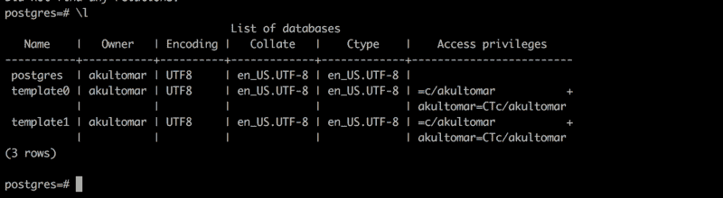
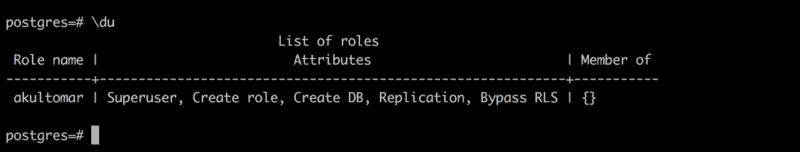
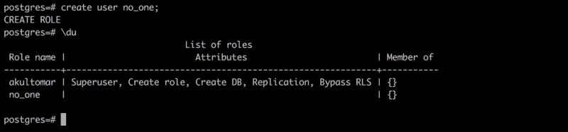
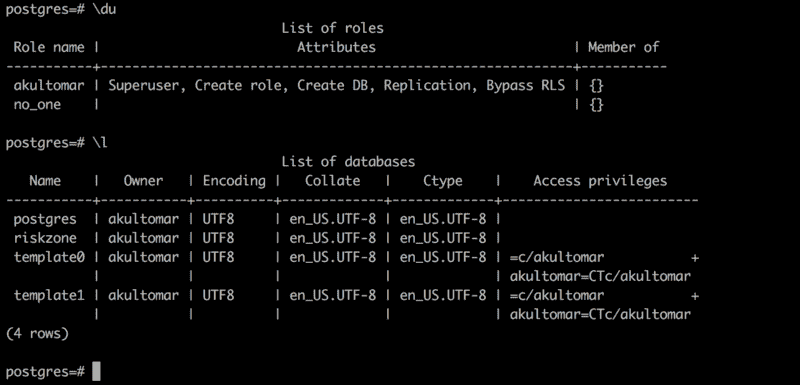

# 如何开始使用 PostgreSQL

> 原文：<https://www.freecodecamp.org/news/how-to-get-started-with-postgresql-9d3bc1dd1b11/>

作者阿库尔·托马尔

# 如何开始使用 PostgreSQL


PostgreSQL 是一个开源的关系数据库管理系统(RDBMS)。在本文中，我将介绍如何开始使用 PostgreSQL。以下是我们将要介绍的内容:

*   [安装](https://medium.com/p/9d3bc1dd1b11#d220)
*   [管理](https://medium.com/p/9d3bc1dd1b11#d003)
*   基本数据库操作

### 装置

如果您的系统上安装了 homebrew，您可以在终端上运行以下命令来快速安装 PostgreSQL:

```
brew install postgresql
```

其他人可以在这里下载最新版本的 PostgreSQL [并按照安装步骤操作。](https://www.postgresql.org/download/)

下载后，要验证您是否安装了 PostgreSQL，请运行以下命令检查您的 PostgreSQL 版本:

```
postgres --version
```

### 管理

通过运行以下命令，可以使用`psql`实用程序从命令行管理 PostgreSQL:

```
psql postgres
```

这应该会让 psql 实用程序运行起来。psql 是 PostgreSQL 的命令行工具。虽然有许多第三方工具可用于管理 PostgreSQL 数据库，但我还不觉得有必要安装任何其他工具。psql 非常简洁，运行良好。

> 要退出 psql 界面，你可以输入`\q`就可以了。

如果您需要帮助，请在 psql 终端上键入`\help`。这将列出所有可用的帮助选项。你可以输入`\help [Command Name]`，以防你需要某个特定命令的帮助。例如，在`psql`中输入`\help UPDATE`将会显示更新选项的语法。

```
Description: update rows of a table[ WITH [ RECURSIVE ] with_query [, ...] ]UPDATE [ ONLY ] table_name [ * ] [ [ AS ] alias ]    SET { column_name = { expression | DEFAULT } |          ( column_name [, ...] ) = ( { expression | DEFAULT } [, ...] ) |          ( column_name [, ...] ) = ( sub-SELECT )        } [, ...]    [ FROM from_list ]    [ WHERE condition | WHERE CURRENT OF cursor_name ]    [ RETURNING * | output_expression [ [ AS ] output_name ] [, ...] ]
```

如果你是初学者，你可能还是不明白。快速的谷歌搜索会给你提供它的用法的例子，或者你可以一直搜索官方的 [psql 文档](https://www.postgresql.org/docs/current/static/sql-update.html)，它会提供很多例子。

当您第一次安装 PostgreSQL 时，会经常执行一些常见的管理任务。

第一件事是检查现有的用户和数据库。运行以下命令列出所有数据库:

```
\list or \l
```



在上图中，您可以看到在安装 PostgreSQL 时创建的三个默认数据库和一个超级用户`akultomar`。

要列出所有用户，使用`\du`命令。用户的属性告诉我们他们是超级用户。



### 基本数据库操作

要执行基本的数据库操作，您需要使用结构化查询语言(通常称为 SQL)。

#### **创建数据库**

要创建一个数据库，可以使用`create database`命令。在下面的例子中，我们将创建一个名为`riskzone`的数据库。


如果您忘记了末尾的分号，postgres 提示符下的`=`符号将被替换为一个`-`，如下图所示。这基本上表明您需要终止查询。当您真正开始编写更长的查询时，您就会理解它的重要性。现在只需输入一个分号来完成 SQL 语句，然后点击 return。


#### **创建用户**

要创建一个用户，可以使用`create user`命令。在下面的例子中，我们将创建一个名为`no_one`的用户。



当您创建一个用户时，显示的消息是**创建角色**。用户是具有登录权限的角色。我交替使用了它们。您还会注意到，对于用户`no_one`，属性列是空的。这意味着用户`no_one`没有管理权限。他们只能读取数据，不能创建其他用户或数据库。

您可以为您的用户设置密码。要为现有用户设置密码，需要使用下面的`\password`命令:

```
postgres=#\password no_one 
```

要在创建用户时设置密码，可以使用以下命令:

```
postgres=#create user no_two with login password 'qwerty';
```

#### **删除用户或数据库**

`drop`命令可用于删除数据库或用户，如下面的命令所示。

```
drop database <database_name>drop user <user_name>
```

> 这个命令需要非常小心地使用。掉在地上的东西不会回来，除非你有备份。

如果我们运行前面学过的`\du`和`\l`来分别显示用户和数据库的列表，我们可以看到我们新创建的`no_one`用户和`riskzone`数据库。



当您指定`psql postgres`(没有用户名)时，它使用默认的超级用户(在我的例子中是`akultomar`)登录到 postgres 数据库。要使用特定用户登录数据库，可以使用以下命令:

```
psql [database_name] [user_name]
```

让我们使用`no_one`用户登录到`riskzone`数据库。点击`\q`退出之前的 postgres 数据库，然后运行下面的命令，用用户`no_one`登录`riskzone`。


我希望你喜欢 PostgreSQL 的简短介绍。我会写另一篇文章来帮助你更好地理解角色。如果你是 SQL 新手，我的建议是尽可能多地练习。动手制作自己的小桌子并练习。