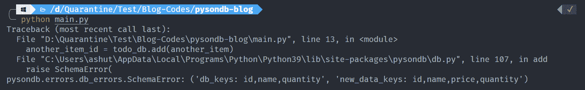
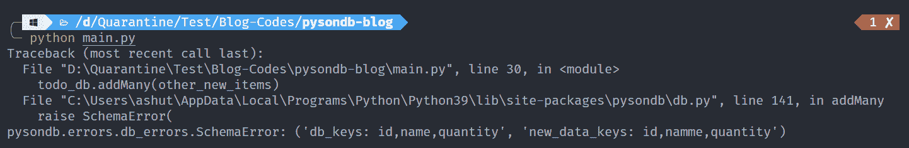
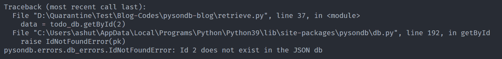
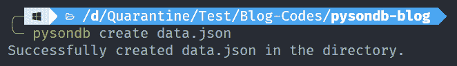
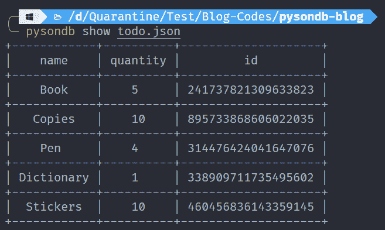
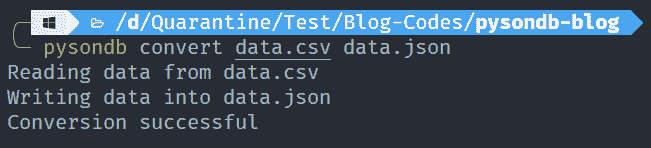
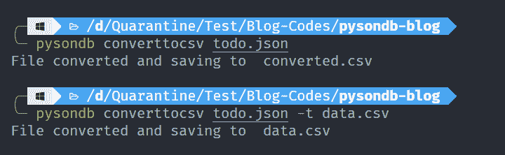

# 如何开始使用 PysonDB

> 原文：<https://www.freecodecamp.org/news/how-to-get-started-with-pysondb/>

我们在处理个人项目时，经常需要存储一些数据。我们可以在服务器上使用 SQL 或 NoSQL 数据库，但这需要我们做一些设置。

在我以前的一篇文章中，我们看到了使用 TinyDB 解决这个问题的方法。

但是我们不打算在本文中讨论 TinyDB。如果你有兴趣了解它，可以看看这个博客。

今天，我们将使用 **PysonDB** 来讨论这个问题的另一个类似解决方案。

## PysonDB 是什么？

[**PysonDB**](https://pysondb.github.io/pysonDB/) 是另一个用纯 Python 编写的面向文档的数据库。由[弗雷迪·索米](https://github.com/fredysomy)开发，它简单、轻便、高效。


PysonDB 这个词是由单词 **Python** 和 **JSON** 组成的(当然，还有 DB😋).因此它是一个基于 JSON 的数据库。

它有许多功能，例如:

*   它是轻量级的，基于 JSON 的。
*   它支持 **CRUD** 操作。
*   不需要数据库驱动程序。
*   一个唯一的 ID 被分配给每个 JSON 文档并自动添加。
*   对添加数据的**模式**要求严格。
*   它有一个内置的命令行界面来删除、显示和创建数据库。

请注意，您不能用 PysonDB 存储图像、视频等。

## 如何安装 PysonDB

安装 PysonDB 极其容易。只需在您的终端中运行以下命令:

```
pip install pysondb
```

## 如何使用 PysonDB

类似于 TinyDB 教程，让我们考虑一个 Todo 应用程序的例子，其中我们只需要执行 CRUD 操作。现在我们已经安装了 PysonDB，让我们看看如何使用它。

我们要做的第一件事是创建一个名为`todo.json`的数据库。使用 PysonDB 很容易做到这一点。

```
from pysondb import getDb

todo_db = getDb('todo.json')
```

我们只需要用 JSON 文件名调用`getDb()`方法，当您运行该文件时，它会自动为您创建一个空数据库(JSON 文件)。

```
{ "data": [] } 
```

## 如何在 PysonDB 中插入数据

在 PysonDB 中插入数据非常简单。我们有两种方法:`add()`插入一个对象，`addMany()`添加多个对象。

我们唯一需要注意的是数据库的模式。您首先添加的任何数据都将成为整个数据库的模式。任何模式不规则都拒绝不规则数据。如果您还不明白它是如何工作的，让我们看一个例子。

### **add()方法**

```
new_item = {"name": "Book", "quantity": 5}
item_id = todo_db.add(new_item)
print(item_id)

# Output
# 259596727698286139
```

首先，我们创建了一个名为`new_item`的新字典，将`name`和`quantity`分别设置为`Book`和`5`。然后我们使用`add()`方法将数据插入我们的数据库。`add()`方法返回插入对象的**唯一 ID** 。

让我们看看我们的 JSON 文件现在是什么样子:

```
{
  "data": [
    {
      "name": "Book",
      "quantity": 5,
      "id": 259596727698286139
    }
  ]
} 
```

现在让我们看一个**模式不规则**的例子。到目前为止，我们已经插入了一个带有**名称**和**数量**字段的对象。但是现在让我们给它添加另一个字段 **price** 并尝试添加数据。

```
another_item = {"name": "Milk", "quantity": "5L", "price": 310}
another_item_id = todo_db.add(another_item)
print(another_item_id) 
```

现在如果你试图运行程序，你会遇到一个`SchemaError`。



希望声明现在清楚了。

### **addMany()方法**

现在，让我们看看如何使用`addMany()`方法添加多个对象。

```
new_items = [
    {"name": "Copies", "quantity": 10},
    {"name": "Pen", "quantity": 4},
]
todo_db.addMany(new_items)
```

在本例中，我们创建了一个名为`new_items`的字典列表，并使用`addMany()`方法来插入条目。这个方法不返回任何东西。

在这种情况下，我们也可能会遇到模式不规则的问题。

```
other_new_items = [
    {"namme": "Dictionary", "quantity": 1},
    {"name": "Stickers", "quantity": 10},
]
todo_db.addMany(other_new_items) 
```

我们将**名称**字段拼错为**名称**，因此我们将遇到`SchemaError`。



## 如何检索数据

有几种方法可以从数据库中检索数据。我们一个一个来看。

### **get()方法**

默认情况下，`**get()**`方法从数据库中返回一个项目。

```
data = todo_db.get()
print(data) 
```

输出:

```
[{'name': 'Book', 'quantity': 5, 'id': 259596727698286139}]
```

`get()`方法采用一个可选参数 **n** ，其中 n 是要检索的对象的数量。

```
data = todo_db.get(2)
print(data)
```

输出:

```
[{'name': 'Book', 'quantity': 5, 'id': 259596727698286139}, {'name': 'Copies', 'quantity': 10, 'id': 313160125004626021}]
```

但是，如果我们给定一个比数据库中的对象数大 n 的值，它将返回一个带有字典的列表，该字典将一个空字符串作为键和值。

```
data = todo_db.get(10)
print(data)
```

输出:

```
[{'': ''}]
```

### **getAll()方法**

顾名思义，`getAll()`将从数据库中返回所有数据。

```
data = todo_db.getAll()
print(data)
```

输出:

```
[{'name': 'Book', 'quantity': 5, 'id': 259596727698286139}, {'name': 'Copies', 'quantity': 10, 'id': 313160125004626021}, {'name': 'Pen', 'quantity': 4, 'id': 588928180640637551}]
```

### **getByQuery()方法**

`getByQuery()`方法接受一个参数**查询**，其中查询本身是 JSON 数据。它返回与查询匹配的数据。

```
q = {"name": "Book"}
data = todo_db.getByQuery(query=q)
print(data)
```

输出:

```
[{'name': 'Book', 'quantity': 5, 'id': 259596727698286139}]
```

如果没有与查询匹配的数据，则返回一个空列表。

注意:该方法是`getBy(query)`方法的替代方法，很快就会被废弃。

### **getById()方法**

如果您希望使用一个对象的惟一 ID 来获取它，`getById()`方法将会派上用场。它采用一个整数参数 **pk** ，这是数据库中每个对象的惟一 ID。

```
data = todo_db.getById(pk=588928180640637551)
print(data)
```

输出:

```
{'name': 'Pen', 'quantity': 4, 'id': 588928180640637551}
```

如果没有与提供的 id 匹配的 id，我们会遇到一个`IdNotFoundError`。

```
data = todo_db.getById(2)
print(data)
```

输出:



注意:这个方法是`find(id)`方法的替代方法，很快就会被废弃。

### **研究()**

`reSearch()`方法有两个参数: **key** 和 **_re** ，其中 key 是数据库中的任意一个键，比如我们示例中的 name 和 quantity ，而 _re 是相应键的值的正则表达式模式。

```
data = todo_db.reSearch(key="name", _re=r"[A-Za-z]*")
print(data)
```

这里我们对任何包含字母的单词使用了正则表达式模式，关键字是 name。

```
[{'name': 'Book', 'quantity': 5, 'id': 259596727698286139}, {'name': 'Copies', 'quantity': 10, 'id': 313160125004626021}, {'name': 'Pen', 'quantity': 4, 'id': 588928180640637551}]
```

## 如何更新数据

要更新 PysonDB 中的数据，我们有三种方法。

### **updateById()方法**

`updateById()`方法有两个参数: **pk** 和 **new_data** ，其中 pk 是必须用 new_data 更新的对象的唯一 ID。

```
updated_data = {"name": "Book", "quantity": 100}
todo_db.updateById(pk=259596727698286139, new_data=updated_data) 
```

输出:

```
{
   "data": [
      {
         "name": "Book",
         "quantity": 100,
         "id": 259596727698286139
      },
      {
         "name": "Copies",
         "quantity": 10,
         "id": 313160125004626021
      },
      {
         "name": "Pen",
         "quantity": 4,
         "id": 588928180640637551
      }
   ]
}
```

如果 pk 值不存在，我们得到一个`IdNotFoundError`。

### **updateByQuery()方法**

`updateByQuery()`方法带两个参数: **db_dataset** 和 **new_dataset** ，其中 db_dataset 是指需要用 new_dataset 改变的查询。

```
query_data = {"name": "Copies"}
updated_data = {"name": "Copies", "quantity": 200}
todo_db.updateByQuery(db_dataset=query_data, new_dataset=updated_data) 
```

输出:

```
{
   "data": [
      {
         "name": "Book",
         "quantity": 100,
         "id": 259596727698286139
      },
      {
         "name": "Copies",
         "quantity": 200,
         "id": 313160125004626021
      },
      {
         "name": "Pen",
         "quantity": 4,
         "id": 588928180640637551
      }
   ]
}
```

如果查询不存在，我们得到一个`DataNotFoundError`。

## 如何删除数据

我们有两种方法从数据库中删除数据。

### **deleteById()方法**

它接受一个参数 pk，这是数据库中任何数据的惟一 ID。

```
is_deleted = todo_db.deleteById(pk=259596727698286139)
print(is_deleted) 
```

输出:

它返回数据是否被删除。

```
True
```

如果没有数据匹配 pk，我们得到`IdNotFoundError`。

### **deleteAll()方法**

您可能已经猜到了这个方法会做什么。它将清除数据库。

```
todo_db.deleteAll()
```

执行时，我们的数据将从数据库中删除。

```
{ "data": [] } 
```

## 使用 PysonDB 的命令行操作

PysonDB 的一个独特特性是我们可以使用它来执行命令行操作。让我们看看使用命令行能做些什么。

### **1。创建一个数据库**

如果我们运行`pysondb create [name]`，我们会得到以下结果:



这个命令帮助我们使用命令行创建一个数据库。

### **2。删除一个数据库**

如果我们运行`pysondb delete [name]`，我们会得到以下结果:


这个命令帮助我们使用命令行删除一个已经存在的数据库。

### **3。显示数据**

现在我们来看看`pysondb show [name]`。

我们有一个名为`todo.json`的数据库，其中包含以下内容:

```
{
   "data": [
      {
         "name": "Book",
         "quantity": 5,
         "id": 241737821309633823
      },
      {
         "name": "Copies",
         "quantity": 10,
         "id": 895733868606022035
      },
      {
         "name": "Pen",
         "quantity": 4,
         "id": 314476424041647076
      },
      {
         "name": "Dictionary",
         "quantity": 1,
         "id": 338909711735495602
      },
      {
         "name": "Stickers",
         "quantity": 10,
         "id": 460456836143359145
      }
   ]
}
```

让我们展示这些数据。



看起来很酷，不是吗？

### **4。将 CSV 数据转换为 JSON**

`pysondb convert **[path of csv file] [path of json file]**`

这个命令帮助我们将 CSV 数据转换成 JSON 数据库。

例如，我们有一个包含以下内容的 CSV 文件:

```
name,quantity,id
Book,5,241737821309633823
Copies,10,895733868606022035
Pen,4,314476424041647076
Dictionary,1,338909711735495602
Stickers,10,460456836143359145 
```

我们来换算一下。



### **5。将 JSON 数据库转换为 CSV 数据**

`pysondb converttocsv [path of json file] [optional name for target CSV file]`

这个命令帮助我们将 JSON 数据库转换成 CSV 数据。



注意:要为 CSV 文件指定自定义路径，请使用 **-t** 标志，然后使用 CSV 文件路径。参见上面的第二个例子。

### **6。合并两个 JSON 文件**

`pysondb merge [path of primary json file] [path of json file to merge] [optional name for target json file]`

我们有两个 JSON 文件——one . JSON 和 two.json

**one.json** :

```
{
  "data": [
    { "name": "Item1", "quantity": "5", "id": 9618007132 },
    { "name": "Item2", "quantity": "10", "id": 8052463398 },
    { "name": "Item3", "quantity": "4", "id": 1677865420 },
    { "name": "Item4", "quantity": "1", "id": 4466016920 },
    { "name": "Item5", "quantity": "10", "id": 9836191198 }
  ]
} 
```

**two.json** :

```
{
  "data": [
    { "name": "Item6", "quantity": "5", "id": 9618007232 },
    { "name": "Item7", "quantity": "10", "id": 8052464398 },
    { "name": "Item8", "quantity": "4", "id": 1677865520 },
    { "name": "Item9", "quantity": "1", "id": 4466016020 },
    { "name": "Item10", "quantity": "10", "id": 9836181198 }
  ]
} 
```

下面的命令将把来自 **two.json** 的数据合并到 **one.json** 中。

```
>>> pysondb merge one.json two.json
```

现在我们的 **one.json** 文件有以下内容:

```
{
  "data": [
    { "name": "Item6", "quantity": "5", "id": 9618007232 },
    { "name": "Item7", "quantity": "10", "id": 8052464398 },
    { "name": "Item8", "quantity": "4", "id": 1677865520 },
    { "name": "Item9", "quantity": "1", "id": 4466016020 },
    { "name": "Item10", "quantity": "10", "id": 9836181198 },
    { "name": "Item1", "quantity": "5", "id": 9618007132 },
    { "name": "Item2", "quantity": "10", "id": 8052463398 },
    { "name": "Item3", "quantity": "4", "id": 1677865420 },
    { "name": "Item4", "quantity": "1", "id": 4466016920 },
    { "name": "Item5", "quantity": "10", "id": 9836191198 }
  ]
} 
```

你看到来自 **two.json** 的数据被添加到 **one.json** 文件的数据之上了吗？

我们还可以将合并的内容放入一个单独的文件中，而不改变任何文件的数据:

```
>>> pysondb merge one.json two.json -o merged.json
```

上面的命令将创建一个 **merged.json** 文件，并将合并的内容放入该文件。在这种情况下， **one.json** 和 **two.json** 根本不会改变。

注意上面命令中输出文件名前的 **-o** 标志。

# **结论**

在本文中，我们讨论了 PysonDB 以及如何在数据库上执行 CRUD 操作。我们还看到了如何使用命令行与 PysonDB 进行交互。

感谢阅读！

如果你喜欢这篇文章，你可以考虑订阅我的简讯。