# 理性如何入门

> 原文：<https://www.freecodecamp.org/news/how-to-get-started-with-reason-cef7ab40660/>

在本文中，我们将在 Reason 中构建一个调度器。在这个过程中，我们将看到 rational 的一些核心特性是如何相互作用的，并使它非常适合这个项目。您可以在[资源库](https://github.com/Artris/reason-scheduler)中找到我们在这里讨论的所有内容。

大多数关于 Reason 的文章都展示了它在 ReasonReact 中是如何工作的。这是有道理的，因为脸书发展了理性。然而，在这篇文章中，我想展示作为 React 之外的一种语言，理性是如何闪耀光芒的。

本文假设您对 JavaScript 有基本的中级理解。熟悉一些函数式编程也不会有什么坏处。

[reason.svg](https://reasonml.github.io/img/reason.svg) converted to png with Imagemagic, [pixelated background with Imagemagick](https://stackoverflow.com/a/506662)

### 为什么选择理性？

Reason 是一种函数式语言，它鼓励不变性，提供一个推断的静态类型系统，并向下编译成 JavaScript。让我们仔细看看:

1.  Reason 和 OCaml 共享相同的语义。因此 OCaml 中可用的函数式编程结构(如模式匹配和 currying)可以直接转化为推理。
2.  按理说，几乎总是不需要写下类型——编译器会为您推断类型。例如，编译器将这个`() => {1 +` 1}视为一个接受 `a u` nit(无参数)并返回`an` int 的函数。
3.  理性中的大多数构造都是不可变的。`List`是不可变的。`Array`可变但大小固定。向数组中添加新元素将返回用新元素扩展的数组的副本。`Record` s(类似于 JavaScript 对象)是不可变的。
4.  [BuckleScript](https://bucklescript.github.io/) 将 Reason 编译成 JavaScript。您可以在原因代码中使用 JavaScript，并在 JavaScript 中使用原因模块。

Reason 以较低的成本为 JavaScript 带来了强类型语言的好处。您一定要阅读文档中的 [What and Why](https://reasonml.github.io/docs/en/what-and-why.html) 部分，因为它提供了关于这种语言及其特性的更多内容。

### 帮助您开始的一些资源

1.  [Reason 的官方文档](https://reasonml.github.io/docs/en/quickstart-javascript.html)简单扼要
2.  阿克塞尔·劳施迈尔博士的书《探索理性》以一种更实际的方式探索了理性
3.  [BuckleScript docs](https://bucklescript.github.io/docs/en/interop-overview.html) 详细讲述了 JavaScript 和 OCaml 的互操作性

在这篇文章中，我们将探索不同的概念，如模块、语句、变量绑定和不变性是如何一起工作的。每当我介绍一个新概念或语法时，我都会链接到相关的文档和文章。

### 整体情况

本教程的灵感来自于[节点调度](https://github.com/node-schedule/node-schedule)，这是 Node.js 的一个调度器，它始终使用一个定时器。你可以在这里了解更多关于节点计划如何工作的[。](https://medium.com/artris/lazy-jar-scheduling-recurring-events-3e7dd7d246cc)

今天，我们将创建一个始终使用单个计时器的合理调度程序。我们将使用我们的调度程序来执行循环作业。这个项目足够大，可以合理地展示一些关键概念。

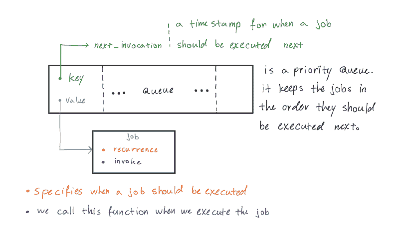

The Big Picture :P

为此，我们将定义两个模块——一个堆和一个调度程序。

堆是优先级队列的一种实现。它将作业保持在下一个应该执行的顺序中。堆元素的关键是作业的下一次调用时间。

调度器由一个堆组成，负责更新计时器并按照指定的循环规则执行作业。

1.  当一个作业执行时，调度程序将从队列中删除该作业，计算它的下一次调用时间，并使用更新后的调用时间将该作业插回到队列中。
2.  添加新作业时，调度程序会检查根(head /接下来要执行的作业)的下一次调用时间。如果新作业应该在磁头之前执行，调度程序将更新计时器。

### 堆模块

优先级队列的 API 定义了:

1.  向队列中插入一个新元素，并用一个关键字表示它的优先级
2.  提取具有最高优先级的元素
3.  队列的大小

堆按照顺序`O(log(n))`执行`insert`和`extract`操作，其中`n`是队列的大小。

*注意:我们将在文章的最后一节讨论算法复杂度。如果你不喜欢算法的复杂性，你可以忽略最后一部分。*

如果你对堆数据结构不熟悉或者需要复习，我推荐你看下面这个来自麻省理工学院开放式课程 6006 课程的讲座。在本节的剩余部分，我们将实现 6006 的[讲义](https://ocw.mit.edu/courses/electrical-engineering-and-computer-science/6-006-introduction-to-algorithms-fall-2011/lecture-videos/MIT6_006F11_lec04.pdf)中概述的伪代码。

#### 定义堆模块使用的类型

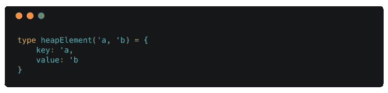

heapElement

`heapElement`定义了一个[记录的](https://reasonml.github.io/docs/en/record.html)类型。类似于 JavaScript 对象，您可以通过名称访问记录字段。`{ key: 1, value: "1" }`创建一个`heapElement(int, string)`类型的值。

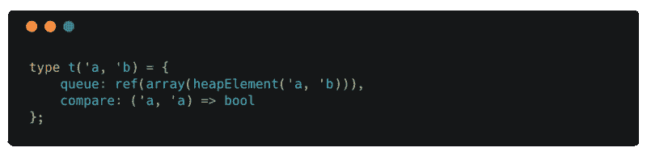

Heap.t

`t('a, 'b)`是另一种记录类型，代表堆。这是我们的`create`函数的返回类型，也是传递给堆模块的公共 API 中所有其他函数的最后一个参数。

为了维护 max heap 属性，heap 只需要比较数组中元素的键。因此，我们可以通过提供一个比较函数`compare`从堆中隐藏键的类型，当它的第一个参数比第二个参数优先级高时，返回 true。

这是我们第一次看到`ref`。`ref`是理智支持[突变](https://reasonml.github.io/docs/en/mutation.html)的方式。您可以使用`:=`操作符将`ref`赋值并更新`ref`以指向一个新值。

[Reason 中的数组](http://2ality.com/2018/01/lists-arrays-reasonml.html)是可变的——您可以更新特定索引处的值。然而，它们有固定的长度。为了支持添加和提取，我们的堆需要保存一个堆元素数组的`ref`。如果我们在这里不使用引用，我们将不得不在每次添加和提取之后返回一个新的堆。依赖堆的模块需要跟踪新的堆。

EmptyQueue exception

可以用新的构造函数来扩展。我们将在后面的`extract`和`head`函数堆模块中的`raise` `EmptyQueue`异常。

> 例外都是同一类型，`exn`。`exn`类型是 OCaml 类型系统中的一个特例。它类似于我们在第 6 章“变体”中遇到的变体类型，除了它是开放的，这意味着它没有在任何一个地方被完全定义。— [RealWorldOcaml](https://v1.realworldocaml.org/)

#### 签名

Heap signature

默认情况下，[模块](http://2ality.com/2017/12/modules-reasonml.html)中的所有绑定(变量赋值)在任何地方都是可访问的，甚至在定义它们的模块之外。`signature`是一种机制，通过这种机制，您可以隐藏特定于实现的逻辑，并为模块定义 API。您可以在与以结尾的模块同名的文件中定义签名。`rei`后缀。例如，您可以在`Heap.rei`文件中为`Heap.re`定义签名。

这里，我们公开了`heapElement`的定义，因此堆模块的用户可以使用由`head`和`extract`返回的值。但是我们没有为我们的堆类型`t`提供定义。这使得`t`成为一个[抽象类型](http://2ality.com/2017/12/modules-reasonml.html#abstract-types-hiding-internals)，确保只有堆模块中的函数才能使用堆并转换它。

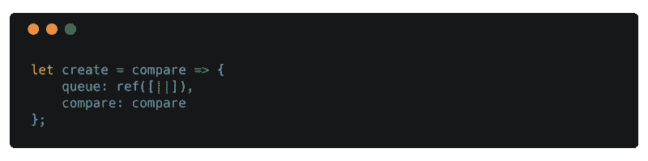

Heap initializer

除了`create`之外，每个函数都将堆作为参数。`create`接受一个比较函数并创建一个空的`Heap.t`，它可以被堆模块中的其他函数使用。

#### 助手功能

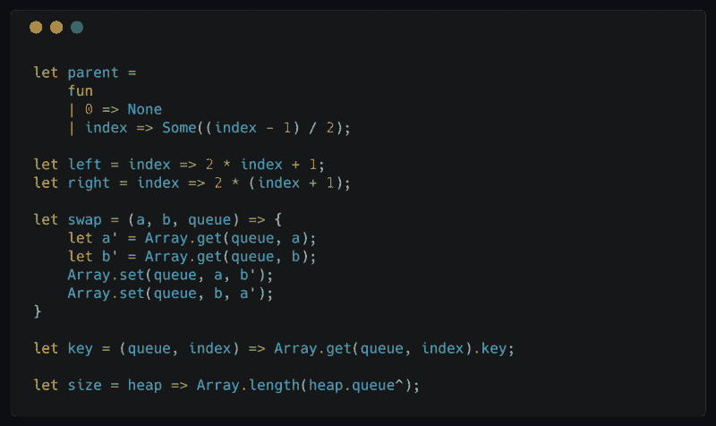

Helper functions

`parent`是一个接受单个参数的函数——index。当索引为`0`时，它返回`None`。索引`0`表示树根，树根没有父级。

`left`和`right`返回一个节点的左右子节点的索引。

`swap`取两个索引`a`和`b`和一个数组`queue`。然后它交换索引`a`和`queue`的`b`中的值。

`key`简单地返回队列中指定索引处的`heapElement`的关键字段。

`size`返回队列的长度

#### 增加

`add`是我们在`heap`签名中公开的主要函数之一。它需要一个值和一个表示值的优先级的键来插入到队列中。我们将在后面的`Scheduler`模块中使用这个函数向我们的执行队列添加新的任务。

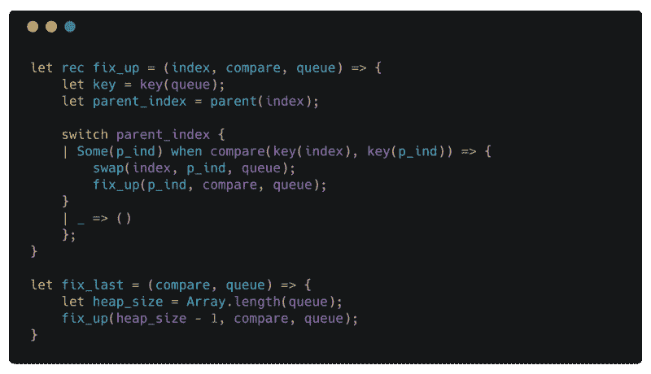

fix up

`let rec`让我们定义[递归](https://reasonml.github.io/docs/en/function.html#recursive-functions)函数。用`rec`你可以引用函数体内的函数名。

我们将`key`定义为一个以`queue`和`index`为参数的函数。通过声明`let key = key(queue)`，我们通过[部分应用](https://reasonml.github.io/docs/en/function.html#currying)我们之前定义的助手函数`key`来[隐藏](https://reasonml.github.io/docs/en/let-binding.html#bindings-are-immutable) `key`。

当您向一个函数提供参数的子集时，它会返回一个新函数，该函数将剩余的参数作为输入——这被称为 [currying](https://reasonml.github.io/docs/en/function.html#currying) 。

您提供的参数可用于返回的函数。由于`queue`在`fix_up`中是固定的，我们将其部分应用到`key`函数中，使我们的代码更加[干燥](https://en.wikipedia.org/wiki/Don%27t_repeat_yourself)。

您可以使用`<cas[e>](https://reasonml.github.io/docs/en/pattern-matching.html#when-clauses); when <c`条件>来指定模式匹配中的附加条件。当(在`our e`示例中，p_ind 是一个`vailable in compare(key(index),`键(p_ind))时，用例中的值 bind `ings`可用于表达式`n fo`。只有当条件满足时，我们才在= >之后执行相关的语句`t` 。

add

将一个新元素连接到队列的末尾。如果新元素的优先级高于其父元素，则违反了最大堆属性。`fix_up`是一个递归函数，通过在树中向上移动新元素(与其父元素成对交换)来恢复最大堆属性，直到它到达树的根或其优先级低于其父元素。

`fix_last`只是包装了`fix_up`并用队列中最后一个元素的索引来调用它。

`heap.queue^`是我们访问值`ref`引用的方式。

`[||]`是空数组的数组文字语法。

#### 提取

从队列中移除具有最高优先级的元素(在我们的例子中，是具有最小键的元素)并返回它。`extract`通过首先与数组中的最后一个元素交换来删除队列的头。这在队列的根/头处引入了对最大堆属性的单个违反。

正如讲座中所描述的，`heapify`——也称为[——向下筛选](https://en.wikipedia.org/wiki/Heap_(data_structure))——修复单个违规。假设节点`n`的左右子树满足最大堆属性，在`n`上调用`heapify`可以修复这个冲突。

每次调用`heapify`时，它都会在`index`、`left(index)`和`right(index)`的堆元素之间找到最高优先级元素的`max_priority_index`索引。如果`max_priority_index`不等于`index`，我们知道仍然违反了最大堆属性。我们交换`index`和`max_priority_index`处的元素来修复`index`处的违规。我们用`max_priority_index`递归调用`heapify`来修复我们可能通过交换两个元素而产生的可能的冲突。

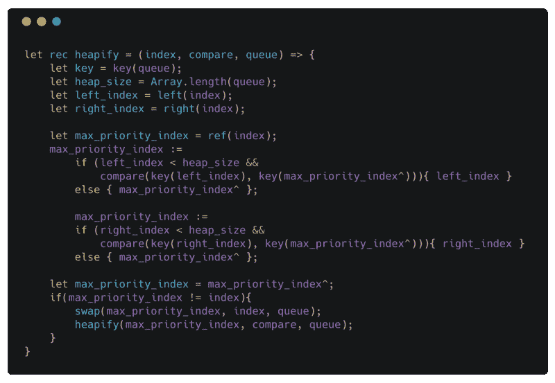

heapify

`index`是表示违反最大堆属性的子树的根的`int`，但是它的子树满足该属性。`compare`是用堆定义的比较函数。`queue`是保存堆元素的数组。

`[if](https://reasonml.github.io/docs/en/if-else.html)` [语句](https://reasonml.github.io/docs/en/if-else.html)在理智中像其他表达式一样评估出一个值。在这里,`if`语句计算出一个`int`,表示在比较中哪个指数更小。

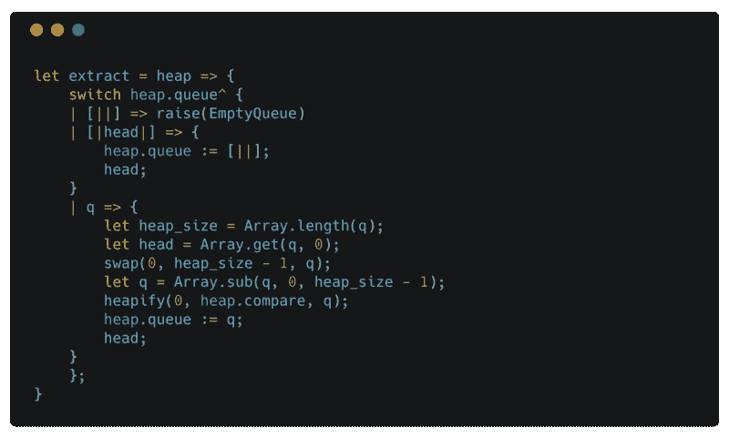

extract

`extract`模式匹配`queue`(数组而非参考)。

`[|head|]`仅匹配具有单个元素的数组。

当队列`[||]`为空时，我们引发之前定义的`EmptyQueue`异常。但是为什么呢？我们为什么不返回`None`呢？这是一个偏好问题。我更喜欢`raise`是个例外，因为当我使用这个函数时，我会得到一个`heapElement`，而不是一个`option(heapElement)`。这让我可以根据`extract`的返回值进行模式匹配。需要注意的是，在使用这个函数时需要小心，确保`queue`永远不为空。

当我们有不止一个元素时，我们交换队列的第一个和最后一个元素，删除最后一个元素并在第一个元素(树的根)上调用`heapify`。

### 测试

我们使用`bs-jest`——用于`Jest`的 BuckleScript 绑定——来编写测试。`Jest`是由脸书创建的测试框架，带有内置的模仿库和代码覆盖报告。

1.  [https://github.com/glennsl/bs-jest](https://github.com/glennsl/bs-jest)
2.  [https://Facebook . github . io/jest/docs/en/getting-started . html](https://facebook.github.io/jest/docs/en/getting-started.html)

按照 [bs-jest](https://github.com/glennsl/bs-jest#installation) 中的说明设置`Jest`。

确保在您的`bsconfig.json`中添加`@glennsl/bs-jest`到`bs-dev-dependencies`。否则 BuckleScript 将找不到`Jest`模块，您的构建将会失败。

如果你在除了`src`之外的目录中编写测试用例，你必须在`bsconfig.json`中的`sources`中指定它，以便 BuckleScript 编译器选择它们。

### 测试同步功能

随着`Heap`模块的就位和`Jest`的安装，我们已经准备好编写我们的第一个测试用例。

为了测试我们的`Heap`模块，我们将进行一次堆排序。

1.  创建一个堆
2.  将元素插入堆中
3.  使用`extract`操作按升序删除元素

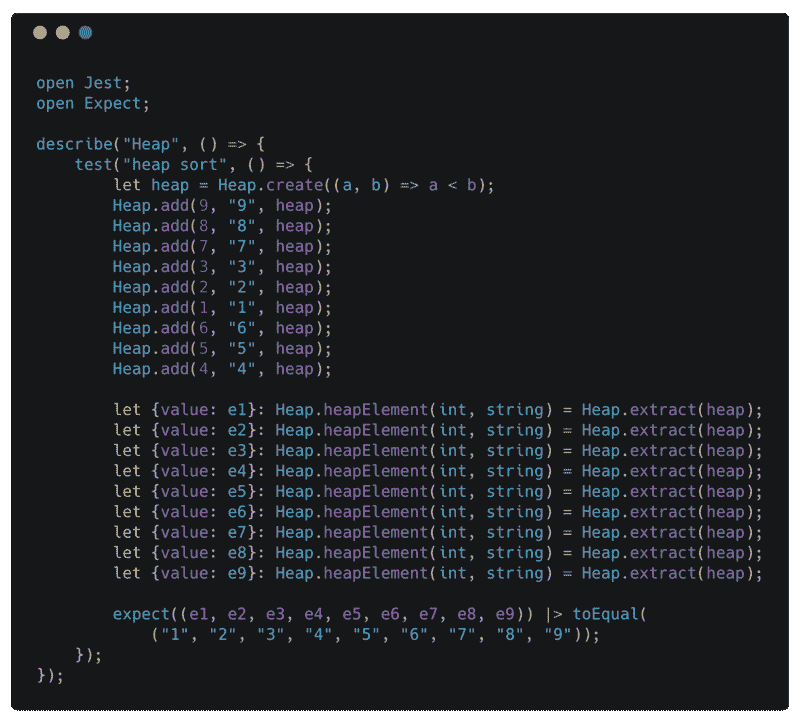

Heap sort test

`open Jest`打开模块，这样我们就可以引用`Jest`模块中可用的绑定，而不用在它们前面加上`Jest.`。例如，我们可以只写`expect`，而不写`Jest.expect`。

我们使用`let {value: e1} =`来析构由`extract`返回的值，并为`value`创建一个别名`e1`——`e1`现在被绑定到由`extract`返回的值的`value`字段。

带着`|&`g[t；我们可以创建一个复合函数，并将结果函数立即应用到输入中。这里我们简单地将调用`ng exp` ect 和`th (e1, ...,` e9)的结果传递给 t `he toEq` ual 函数。](http://2ality.com/2017/12/functions-reasonml.html#the-reverse-application-operator)

### 调度模块

Scheduler 使用堆模块来维护一个按下次调用时间排序的循环作业列表。

#### 让我们定义调度器模块中使用的类型

recurrence

`recurrence`是[变体](https://reasonml.github.io/docs/en/variant.html)类型。`recurrence`类型的任何值可以是`Second`、`Minute`或`Hour`。`Second`、`Minute`和`Hour`是`recurrence`的构造器。您可以像调用普通函数一样调用构造函数，并获取 Variant 类型的值。在我们的例子中，如果你用 int 调用`Second`，你会得到一个类型为`recurrence`的值。您可以将这个值与`Second(number_of_seconds)`进行模式匹配，以访问传递给`Second`构造函数的参数。

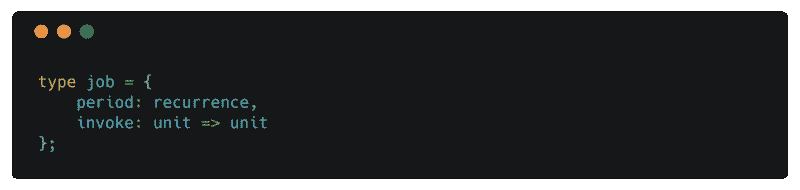

job

`job`是一个[记录类型](https://reasonml.github.io/docs/en/record.html)。`period`属于`recurrence`类型，表示每次执行作业之间的延迟。`invoke`是一个采用`unit`(无参数)并返回`unit`(无结果)的函数。`invoke`是作业运行时执行的功能。

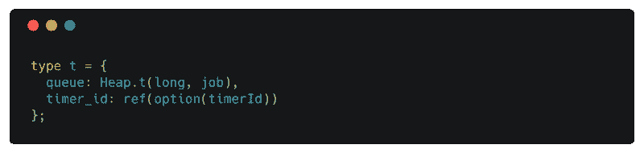

Scheduler.t

`t`是代表调度程序的记录类型。一个调度器保留一个按下次调用时间排序的`queue`任务。`timer_id`引用`queue`中第一个作业的`timerId`——将被首先调用的作业。

#### 互操作

您可以从 Reason 内部调用 JavaScript 函数。有不同的方法可以做到这一点:

1.  如果可以的话，可以使用 BuckleScript 绑定，比如`Js.log`和`[Js.Global.setTimeout](https://bucklescript.github.io/bucklescript/api/Js.Global.html)`
2.  声明一个`external`如`[@bs.val] external setTimeout`
3.  使用`[%raw ...]`执行原始 JavaScript 代码

大多数 JavaScript 函数的绑定由 BuckleScript 提供。例如，`[Js.Date.getTime](https://bucklescript.github.io/bucklescript/api/Js.Date.html#VALgetTime)`取一个`Js.Date.t`——一个`date`值——并返回自 epoch 以来的毫秒数。`Js.Date.getTime`是 JavaScript 日期对象的`getTime`方法的绑定。`Js.Date.getTime`返回一个`float`值。

使用 bucklescript 绑定与使用用户定义的模块完全相同。你可以在这里阅读更多关于可用绑定[的信息。在本节的其余部分，我们将重点关注`external`和`[%raw ...]`。](https://bucklescript.github.io/docs/en/stdlib-overview)

#### 外部的

使用`[external](https://bucklescript.github.io/docs/en/intro-to-external.html)`你可以将一个变量绑定到一个 JavaScript 函数。例如，我们将变量`setTimeout`绑定到 JavaScript 的 setTimeout 全局函数。

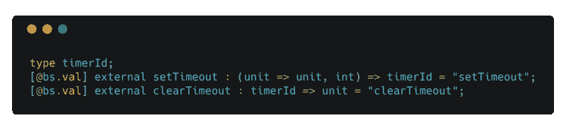

setTimeout and clearTimeout definition in [BuckleScript docs](https://bucklescript.github.io/docs/en/bind-to-global-values.html#abstract-type)

`setTimeout`返回一个`float`，一个我们可以传递给`clearTimeout`来取消计时器的标识符。唯一使用由`setTimeout`返回的值的函数是`clearTimeout`。所以我们可以将`setTimeout`返回的值定义为一个[抽象类型](https://bucklescript.github.io/docs/en/bind-to-global-values.html)。这确保了只有由`setTimeout`返回的值可以传递给`clearTimeout`。

#### [%raw …]

`new Date.getTime()`在 JavaScript 中返回一个整数。[JavaScript 中的数字是 64 位长](https://www.w3schools.com/js/js_numbers.asp)。`[int](https://reasonml.github.io/docs/en/integer-and-float.html#integers)` [按道理只有 32bit 长](https://reasonml.github.io/docs/en/integer-and-float.html#integers)。这是个问题！

按理说，我们可以通过预期返回值为`Float`来处理它。这其实就是 BuckleScript 提供的`[Js.Date.getTime](https://bucklescript.github.io/bucklescript/api/Js.Date.html#VALgetTime)`的预期收益类型。

相反，让我们使用`[%raw ...]`并创建一个抽象类型`long`，类似于我们为`setTimeout`所做的。这样做，我们隐藏了`long`的实现。我们的原因代码可以传递类型为`long`的值，但是它不能真正对它们进行操作。为此，我们定义了一组助手绑定，它们接受类型为`long`的值，并将计算委托给原始 JavaScript 表达式。

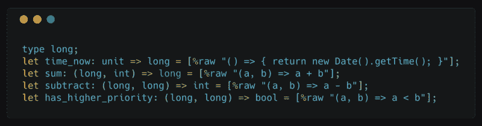

working with JavaScript values

我们可以用`[[%raw ...]](https://bucklescript.github.io/docs/en/embed-raw-javascript.html)`定义一个 JavaScript 表达式。这里我们定义了一个[抽象类型](https://bucklescript.github.io/docs/en/bind-to-global-values.html#abstract-type) `long`和一组函数，这些函数消费并返回类型`long`的值。所有表达式的类型在`let`绑定中指定。

`time_now`返回从 epoch 开始的毫秒数。

我们使用`sum`来计算一个作业的下一次调用时间，方法是传入`time_now`的结果和一个`int`,后者表示从现在起该作业应该执行多少毫秒。

我们可以通过从`time_now`调用一个作业的时间`subtract`来计算从现在开始一个作业将被调用多长时间。`subtract`的结果被传递给`setTimeout`。

`has_higher_priority`比较两次调用时间。这是我们用来初始化堆的比较函数。

#### 祈祷

在任何时间点，我们只有一个计时器，当队列中的第一个作业应该运行时，计时器就会到期。当定时器到期时，我们需要做一些清理工作。当计时器到时，我们应该

1.  从队列中提取第一个作业
2.  计算它的下一次调用时间(作业的新密钥)
3.  用更新后的关键字将作业重新插入队列
4.  查看队列的头部以找到下一个应该执行的作业
5.  为此作业创建新的计时器

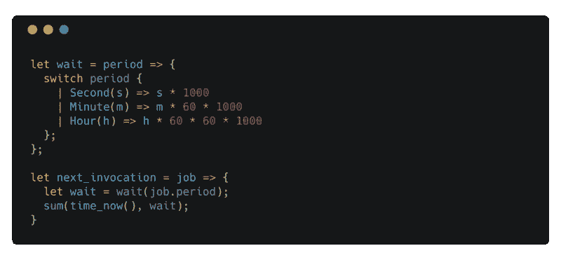

helpers

`wait`取一个句点——一个类型为`recurrence`的值——并返回一个 int，表示一个作业在再次执行之前必须等待多少毫秒。我们将由`wait`返回的值传递给`setTimeout`。

`next_invocation`计算作业的下一次调用时间。`time_now`返回一个`long`值。`sum`接受一个`long`和一个`int`值并返回一个`long`值。`sum`通过在其参数上调用 JavaScript `+`操作符，将两个数相加。

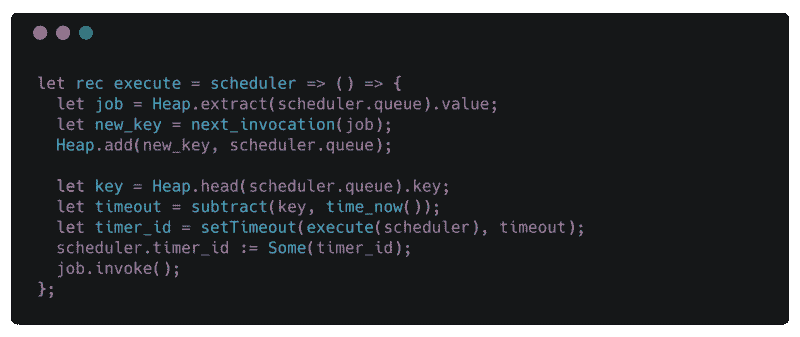

Invoking a job

`execute`是一个递归函数，负责执行作业和进行清理。它在一个闭包中捕获调度程序，并返回一个函数，当定时器到期时可以调用这个函数。

在前三行中，我们删除了具有最高优先级(最低键或最近调用时间)的作业，并在下一次调用时将其重新插入到队列中。

然后，我们继续为队列头的作业创建一个新的计时器(这个调用之后应该执行的下一个作业)。我们更新`timer_id`引用以指向新的`timerId`。

最后，我们调用作业的`invoke`字段来执行指定的任务。

#### 添加新作业

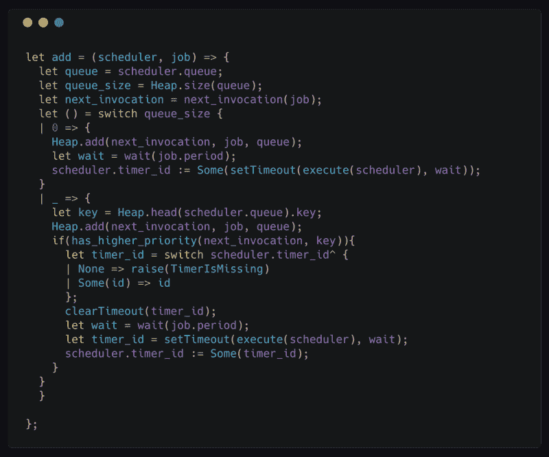

adding a new job

当`queue`为空时，添加新任务很简单。我们创建了一个计时器，它在作业的下一次调用时到期。

更有趣的情况是当队列不为空时！这里我们可以有两种情况。要么`queue`的头有一个大于作业下次调用时间的键，要么没有。

第一种情况是当`queue`的头有一个小于或等于作业下一次调用时间的键时。当新作业需要在当前定时器之前执行时，就是这种情况。在这种情况下，我们需要通过用`timer_id`调用`clearTimeout`来取消计时器，并创建一个新的计时器，它将在新作业的下一次调用时到期。

在另一种情况下，因为新的作业需要在当前定时器到期后执行，我们可以只将新的作业插入到`queue`中。

### 测试异步函数

堆模块中的所有函数都是[同步](https://medium.com/@siddharthac6/javascript-execution-of-synchronous-and-asynchronous-codes-40f3a199e687)。例如，当您调用`add`时，您会被阻塞，直到一个新的堆元素被添加到队列中。当`add`返回时，您知道堆已经用新元素扩展了。

另一方面，调度程序中的函数有[异步](https://medium.com/@siddharthac6/javascript-execution-of-synchronous-and-asynchronous-codes-40f3a199e687)副作用。当您向调度程序添加一个新任务时，调度程序会将该任务添加到队列中并返回。稍后，根据`recurrence`规则，该作业被调用。您的代码不会等待作业被调用，而是继续执行。

现在，让我们编写一个测试用例，以确保当一个作业被添加到调度程序中时，它会根据它的重复规则被调用。

为此，我们将

1.  `add`调度程序每秒要执行的一个作业。该作业增加一个`ref(int)`计数器。
2.  创建一个在 4 秒后解决的`Promise`
3.  返回一个期望计数器增加 4 倍的`Jest.assertion`承诺。

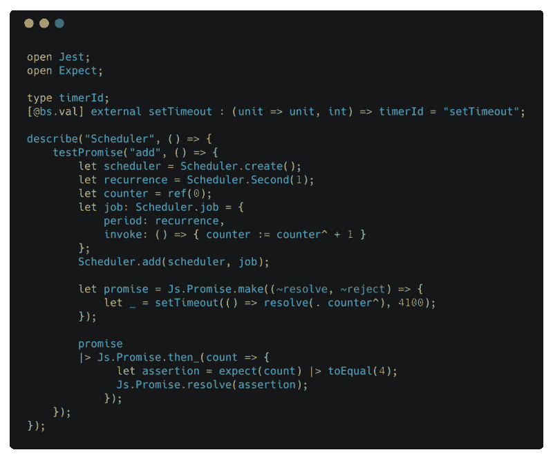

Test Scheduler add

我们可以用`testPromise`来测试承诺。`testPromise`期待一个`Js.Promise.t(Jest.assertion)`。请看测试用例的最后一行。

表示我们希望我们的工作每秒执行一次。

`counter`是一个`ref`，每次`invoke`被调用时，它都会递增。

`promise`是一个将在 4s 后得到解决的`[Js.Promise.t](https://reasonml.github.io/docs/en/promise.html)`。注意，我们正在等待 4.1s 来确保对`invoke`的最后一次调用已经执行完毕。否则，当我们只增加了三次计数器时，我们可能会解决承诺。

可以用`|&`gt；兑现承诺。在我们的示例中，`e, prom` ise 将在 4 秒后解析计数器的值。该值作为 t `he co` unt 提供给传递给 t `he Js.Promise.th` en_ 的函数。

### 使最优化

我们实现了我们的堆和调度器模块，类似于我们在 JavaScript 中所做的。这样做，我们降低了在堆上操作的函数的性能，例如`add`和`extract`到`O(n)`。

我们知道数组的长度是固定的。每次我们添加或删除一个新作业时，我们的数组的大小都会改变，因此会创建一个新的副本。我们可以通过创建一个实现[表加倍](https://ocw.mit.edu/courses/electrical-engineering-and-computer-science/6-006-introduction-to-algorithms-fall-2011/lecture-videos/lecture-9-table-doubling-karp-rabin/)的动态数组模块来解决这个问题。

如果你对[实现](https://github.com/Artris/algorithms)感兴趣，我已经创建了一个堆和动态数组的版本，但是，我认为这超出了本文的范围。所以现在我们专注于通过调用成本较低的操作来优化调度程序。

在调度器中有两个地方我们调用`Heap.add`和`Heap.extract`——当添加一个新的作业和当执行一个作业时。

我们不能帮助`Scheduler.add`但我们可以修复`Scheduler.execute`的性能。`execute`函数不需要调用`extract`或`add`，因为我们在`execute`前后的队列大小应该是相同的。

让我们为堆签名引入一个新函数。`decrease_root_priority`降低堆根的优先级。我们可以使用这个新函数将根键更新到它的下一次调用时间，而无需首先提取队列头，然后用更新后的调用时间将其添加回去。

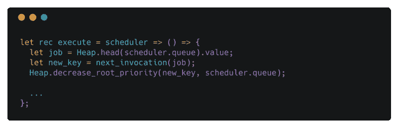

execute optimized

`decrease_root_priority`获取根的新优先级，检查以确保新优先级小于根的当前优先级，并将实际工作委托给助手函数`update_priority`。

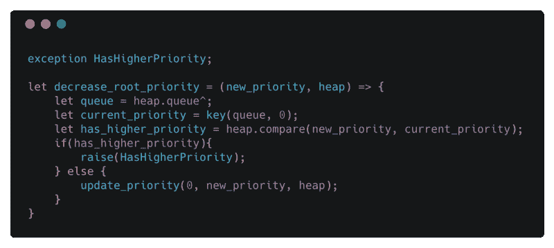

decrease root priority

`update_priority`可以在`O(log(n))`中降低或增加堆中任何元素的优先级。它检查新的优先级是否违反了节点的子节点或父节点的最大堆属性。当我们增加一个节点的优先级时，我们可能会违反该节点相对于其父节点的最大堆属性，所以我们`fix_up`。当我们降低一个节点的优先级时，我们可能会违反与其子节点相关的最大堆属性，因此我们调用`heapify`来修复可能的违反。

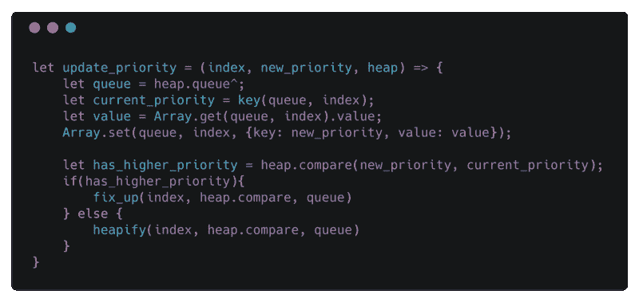

decrease priority

### 后续步骤

到目前为止，这篇文章并不是对 Reason 特性的完整概述。我们已经看到了许多语言结构，但是还没有详细研究它们。还有一些特性被遗漏了，比如函子和对象。我强烈建议你阅读[文档](https://reasonml.github.io/docs/en/overview)或[探索推理和函数式编程](http://reasonmlhub.com/exploring-reasonml/index.html)，以便在开始编码之前了解你能得到什么。

我们今天讨论的内容的完整源代码可以在[https://github.com/Artris/reason-scheduler](https://github.com/Artris/reason-scheduler)的`master`分支获得

如果你想练习，我鼓励你给调度器添加`remove`功能。具体来说，用扩展`Scheduler`的签名

*   `type jobId`和
*   `let remove = (t, jobId) => u` nit

我也鼓励你为`Heap`和`Scheduler`模块的签名中暴露的函数添加测试用例。

`Heap`和`Scheduler`模块中所有功能的测试用例以及`remove`功能的实现可在[解决方案](https://github.com/Artris/reason-scheduler/tree/solutions)分支中获得。

### 属性

我要感谢 Reason/BuckleScript 社区提供了详细的文档。阿克塞尔·劳施迈尔博士因《探索理性的 T2》一书和许多关于理性的有趣文章而获奖。

代码片段使用 [carbon.now.sh](https://carbon.now.sh/) 生成。

我还要感谢[格雷斯](https://twitter.com/graziettahof)、[萨米](https://twitter.com/sami_elfeki)、[弗里曼](https://twitter.com/freestellar)和[普里特帕尔](https://github.com/preetpalS)帮助审阅这篇文章。