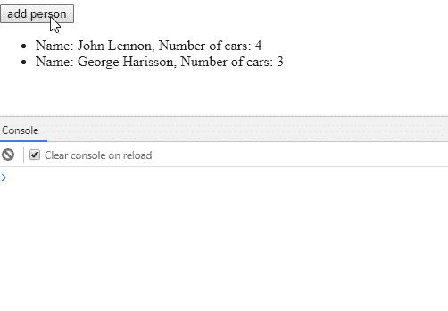

# 如何让您的 Angular 应用发挥最佳性能

> 原文：<https://www.freecodecamp.org/news/how-to-get-the-best-performance-out-of-your-angular-apps-d5132a6c3335/>

马克·格里沙尼克

# 如何让您的 Angular 应用发挥最佳性能

photo by [Guillaume Jaillet](https://unsplash.com/@i_am_g?utm_source=medium&utm_medium=referral) on [Unsplash](https://unsplash.com?utm_source=medium&utm_medium=referral)

Angular 是一个很好的框架，可以用于开发大规模的应用程序，但是要进行微调并获得良好的加载时间和运行时性能可能很困难。在这篇文章中，我将详细介绍我在这个过程中学到的一些最佳实践，这样你就不会犯和我一样的错误。

### 变化检测

变化检测是 Angular 的一种机制，用于查看是否有任何值发生了变化，并需要更新视图。默认情况下，Angular 会在几乎每次用户交互时运行变化检测。为了知道是否应该再次渲染视图，Angular 访问新的更新值，将其与旧值进行比较并做出决定。随着应用程序的增长，它将包含大量的表达式，对每个表达式进行变更检测会导致性能问题。

如果我们创建一个具有特定属性的“哑”组件来处理变更检测周期，我们可以优化事情。该组件仅依赖于非特定的输入数据，这样，我们可以告诉 Angular 仅在输入发生变化或手动触发时运行变化检测。当引用类型不可变时，每次更新对象时，堆栈内存上的引用都必须改变。现在我们可以对内存地址和堆栈之间的对象进行简单的引用检查。如果内存地址改变了，那么我们检查所有的值。这将跳过组件中的更改检测。

我们需要记住，数字、布尔、字符串等基本类型是通过值传递的。对象、数组和函数也通过值传递，但是值是引用的副本。

> 你可以在这里找到关于那个[的更多细节。](https://codeburst.io/explaining-value-vs-reference-in-javascript-647a975e12a0)

现在我们将看到两个如何实现的例子。

#### 例如:*changetectionstrategy。默认*

**您不必指定 changeDetection 类型，它将是‘changededitionstrategy’。默认情况下为“默认”。**

Default change detection

Photo by [Tim Mossholder](https://unsplash.com/@timmossholder?utm_source=medium&utm_medium=referral) on [Unsplash](https://unsplash.com?utm_source=medium&utm_medium=referral)

#### 更改检测策略。OnPush

为了使用 OnPush 变更检测，我们需要修改第一个示例中的子组件。

OnPush change detection

### 最小化 DOM 操作

如果你有一些从某个服务器获取的数据列表，并且你需要显示它，你可能会使用 Angular 指令，[***ngFor***](https://angular.io/api/common/NgForOf)***。*** Angular 会为你列表中的每一项创建一个新的模板。

如果在某个时候一些数据被改变了，Angular 并不知道，它会替换整个列表，而不仅仅是被改变的条目。为了改善这一点，Angular 为我们提供了`trackBy`函数。`trackBy`接受一个有两个参数的函数:`index`和`[item](https://angular.io/api/core/IterableChangeRecord#item)`。如果`trackBy`给定，角轨迹随函数的返回值而变化。

语法:

最常见的用法是返回索引本身或 item.id 作为条目的惟一标识符:`trackByFn(index, item){ return item.id; }`。

这样，Angular 可以根据唯一标识符跟踪哪些项目被添加或删除，并只创建或销毁被更改的项目。

### 避免在模板中使用方法

虽然在 Angular 模板中使用方法非常方便，但 Angular 会在每次变化检测时重新计算它们。对于较大的列表，这会影响渲染时间，应用程序甚至可能由于巨大的内存消耗而停滞。在下面的例子中，Angular 将在每个变化检测周期运行`getNumberOfCars`(即在添加新行时)。

我们该如何处理这种情况？我们可以预先计算结果，然后只访问我们计算的数据。在我们的示例中，我们可以向 person 对象添加一个新属性 vehiclesNumber，它预先保存每个人拥有的车辆数量。另一种方法是将 getNumberOfCars 方法实现为一个纯管道。

根据[弯管文件](https://angular.io/guide/pipes):

> Angular 仅在检测到输入值的*纯变化*时执行*纯管道*。纯粹的改变或者是对原始输入值(`String`、`Number`、`Boolean`、`Symbol`)的改变，或者是改变的对象引用(`Date`、`Array`、`Function`、`Object`)。

> 角度忽略(复合)对象内的更改。

> 这可能看起来有限制，但也很快。对象引用检查速度很快，比深度差异检查快得多，因此 Angular 可以快速确定是否可以跳过管道执行和视图更新。

管道仍将在每个变化检测周期被执行。但是，如果使用相同的参数多次执行管道，则返回第一次执行的结果。也就是说，Angular 将缓存结果以获得更好的性能。

让我们看一个例子。

不带管道:

而用烟斗我们会得到:

我们可以看到它将只在新数据上重新计算，而不是整个列表。

### 在生产中使用生产标志

它将禁用 Angular 的开发模式，关闭框架内的断言和其他检查。这也会提高你的表现。你可以在这里找到更多细节[。](https://angular.io/api/core/enableProdMode)

### 不要在生产代码中使用 console.log

console.log 打印确实会降低应用程序的速度，因为它需要一些时间来计算要打印的内容。此外，对于长信息，打印过程也会消耗更多的时间。

### 不要忘记取消订阅你的观察

您的订阅包含对您的组件实例的引用。如果不取消订阅，垃圾收集器将不会清除该实例，这将导致内存泄漏。使用`ngOnDestory(){this.subscription.unsubscribe();}`可以轻松退订。你可以在这里了解更多信息。

### 最后的话

如果你遇到任何问题，随时给我写信，地址:[*markgrichanik[at]Gmail[dot]com*](mailto:markgrichanik@gmail.com)。

我也很乐意听到您在使用 Angular 开发大规模应用程序时的任何反馈/建议。

> 如果你喜欢这篇文章？以便其他人也能阅读