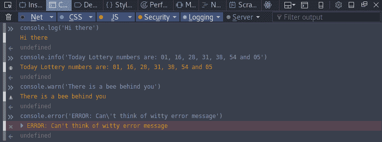
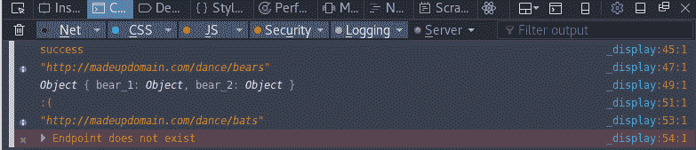
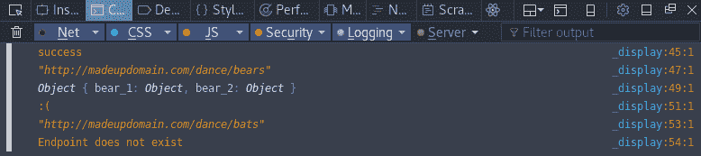
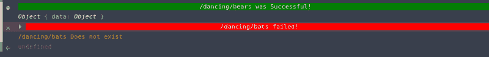
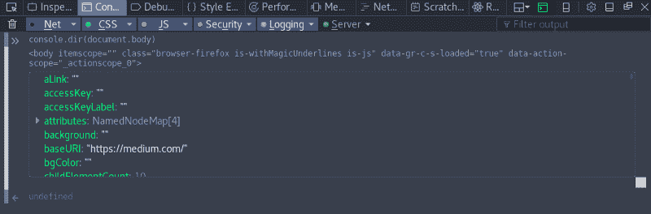
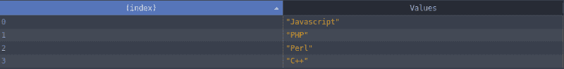
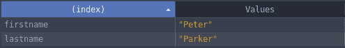
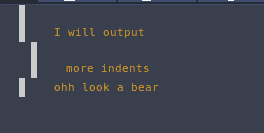
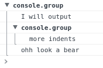

# 如何充分利用 JavaScript 控制台

> 原文：<https://www.freecodecamp.org/news/how-to-get-the-most-out-of-the-javascript-console-b57ca9db3e6d/>

作者:达里尔·帕盖特

# 如何充分利用 JavaScript 控制台


JavaScript 中最基本的调试工具之一就是`console.log()`。`console`附带了几个其他有用的方法，可以添加到开发人员的调试工具包中。

您可以使用`console`执行以下一些任务:

*   输出一个计时器来帮助进行简单的基准测试
*   输出表格，以易读的格式显示数组或对象
*   使用 CSS 将颜色和其他样式选项应用于输出

### 控制台对象

`console`对象让你可以访问浏览器的控制台。它允许您输出帮助调试代码的字符串、数组和对象。`console`是`window`对象的一部分，由[浏览器对象模型(BOM)](https://www.w3schools.com/js/js_window.asp) 提供。

我们可以通过两种方式之一访问`console`:

1.  `window.console.log('This works')`
2.  `console.log('So does this')`

第二个选项基本上是对前者的引用，所以我们将使用后者来节省击键次数。

关于 BOM 有一个简单的说明:它没有一个固定的标准，所以每个浏览器实现它的方式略有不同。我在 Chrome 和 Firefox 上测试了我所有的例子，但是你的输出可能会因浏览器的不同而有所不同。

### 输出文本



Logging text to the console

`console`对象最常见的元素是`console.log`。对于大多数情况，您将使用它来完成工作。

有四种不同的方式向控制台输出消息:

1.  `log`
2.  `info`
3.  `warn`
4.  `error`

这四种方式都一样。您所要做的就是向选定的方法传递一个或多个参数。然后，它会显示一个不同的图标来指示其日志记录级别。在下面的例子中，您可以看到信息级日志和警告/错误级日志之间的区别。



Simple and easy to read output



With many things going on this can become hard to read

您可能已经注意到了错误日志消息——它比其他的更显眼。它显示红色背景和[堆栈跟踪](https://en.wikipedia.org/wiki/Stack_trace)，而`info`和`warn` 不显示。尽管`warn`在 Chrome 上确实有黄色背景。

当您需要快速识别控制台中的任何错误或警告时，这些视觉差异很有帮助。您可能希望确保为生产就绪的应用程序删除它们，除非它们是为了警告其他开发人员他们对您的代码做了一些错误的事情。

### 字符串替换

这种技术在字符串中使用一个占位符，该占位符由传递给该方法的其他参数替换。例如:

**输入** : `console.log('string %s', 'substitutions')`

**输出** : `string substitutions`

`%s`是逗号后面第二个参数`'substitutions'`的占位符。任何字符串、整数或数组都将被转换成字符串，并替换掉`%s`。如果你通过一个物体，它会显示`[object Object]`。

如果你想传递一个对象，你需要使用`%o`或者`%O`而不是`%s`。

`console.log('this is an object %o', { obj: { obj2: 'hello' }})`


#### 数字

通过使用，字符串替换可用于整数和浮点值:

*   `%i`或`%d`为整数，
*   `%f`为浮点型。

**输入** : `console.log('int: %d, floating-point: %f', 1, 1.5)`

**输出** : `int: 1, floating-point: 1.500000`

通过使用`%.1f`，可以将浮点数格式化为小数点后只显示一位数字。您可以做`%.nf`来显示小数点后的 n 位数。

如果我们将上面的示例格式化为在浮点数的小数点后显示一位数字，它将如下所示:

**输入** : `console.log('int: %d, floating-point: %.1f', 1, 1.5)`

**输出** : `int: 1, floating-point: 1.5`

#### 格式规范

1.  `%s` |用字符串替换元素
2.  `%(d|i)` |用整数替换元素
3.  `%f` |用浮点数替换元素
4.  `%(o|O)` |元素显示为对象。
5.  `%c` |应用提供的 CSS

#### 字符串模板

随着 ES6 的出现，模板文字是替换或连接的替代物。他们使用反斜杠(``)代替引号，变量放在`${}`里面:

```
const a = 'substitutions';
```

```
console.log(`bear: ${a}`);
```

```
// bear: substitutions
```

对象在模板文本中显示为`[object Object]`,所以您需要用`%o`或`%O`替换来查看细节，或者单独记录。

与使用字符串连接相比，使用替换或模板创建的代码更容易阅读。

#### 漂亮的颜色插曲！

现在是时候来点更有趣、更多彩的东西了！

是时候用字符串替换让我们的`console`弹出不同的颜色了。

我将使用一个模拟的 Ajax 示例来显示成功(绿色)和失败(红色)。下面是输出和代码:



Successful bears and failing bats

```
const success = [ 'background: green', 'color: white', 'display: block', 'text-align: center'].join(';');
```

```
const failure = [ 'background: red', 'color: white', 'display: block', 'text-align: center'].join(';');
```

```
console.info('%c /dancing/bears was Successful!', success);console.log({data: { name: 'Bob', age: 'unknown'}}); // "mocked" data response
```

```
console.error('%c /dancing/bats failed!', failure);console.log('/dancing/bats Does not exist');
```

您在带有`%c`占位符的字符串替换中应用 CSS 规则。

```
console.error('%c /dancing/bats failed!', failure);
```

然后将 CSS 元素作为字符串参数，这样就可以得到 CSS 样式的日志。您也可以在字符串中添加多个`%c`。

```
console.log('%cred %cblue %cwhite','color:red;','color:blue;', 'color: white;')
```

这将输出单词“红”、“蓝”和“白”各自的颜色。

控制台支持相当多的 CSS 属性。我建议尝试一下，看看什么有效，什么无效。同样，您的结果可能会因浏览器而异。

### 其他可用的方法

这里有一些其他可用的`console`方法。请注意，以下某些项目的 API 尚未标准化，因此浏览器之间可能存在不兼容。这些例子是用 Firefox 51.0.1 创建的。

#### 断言()

`Assert`接受两个参数—如果第一个参数的值为 falsy，则显示第二个参数。

```
let isTrue = false;
```

```
console.assert(isTrue, 'This will display');
```

```
isTrue = true;
```

```
console.assert(isTrue, 'This will not');
```

如果断言为假，它将输出到控制台。如上所述，它显示为一个错误级别的日志，给你一个红色的错误消息和一个堆栈跟踪。

#### 目录()

`dir`方法显示传递给它的对象的交互列表。

```
console.dir(document.body);
```



Chrome displays dir differently

最终，`dir`只节省了一两次点击。如果您需要从 API 响应中检查一个对象，那么以这种结构化的方式显示它可以节省一些时间。

#### 表格()

方法将一个数组或对象显示为一个表格。

```
console.table(['Javascript', 'PHP', 'Perl', 'C++']);
```



Output for an array

数组的索引或对象属性名称位于左侧的索引列下。然后，这些值显示在右边的列中。

```
const superhero = {     firstname: 'Peter',    lastname: 'Parker',}console.table(superhero);
```



Output for an object

**Chrome 用户注意:**这是一位同事让我注意到的，但上面的`table`方法的例子似乎在 Chrome 中不起作用。您可以通过将任何项放入数组的数组或对象的数组来解决此问题:

```
console.table([['Javascript', 'PHP', 'Perl', 'C++']]);
```

```
const superhero = {     firstname: 'Peter',    lastname: 'Parker',}console.table([superhero]); 
```

#### 群组()

`console.group()`至少由三个`console`调用组成，可能是需要最多输入的方法。但它也是最有用的之一(尤其是对使用 [Redux Logger](https://github.com/evgenyrodionov/redux-logger) 的开发者来说)。

一个有点基础的调用如下所示:

```
console.group();console.log('I will output');console.group();console.log('more indents')console.groupEnd();console.log('ohh look a bear');console.groupEnd();
```

这将输出多个级别，并根据您的浏览器显示不同。

Firefox 显示一个缩进列表:



Chrome 以一个对象的样式显示它们:



每次调用`console.group()`都会创建一个新的组，或者创建一个新的关卡，如果在组内调用的话。每次你调用`console.groupEnd()`时，它将结束当前的组或级别，并向上移动一级。

我发现 Chrome 输出风格更容易阅读，因为它看起来更像一个可折叠的对象。

您可以向`group`传递一个将在`console.group`上显示的标题参数:

```
console.group('Header');
```

如果调用`console.groupCollapsed()`，可以从一开始就将组显示为折叠状态。根据我的经验，这似乎只适用于 Chrome。

#### 时间()

与上面的`group`方法一样，`time`方法分为两部分。

启动计时器的方法和结束计时器的方法。

一旦计时器结束，它将以毫秒为单位输出总运行时间。

使用`console.time('id for timer')`启动定时器，使用`console.timeEnd('id for timer')`结束定时器。您可以同时运行多达 10，000 个计时器。

输出看起来有点像这样`timer: 0.57ms`

当您需要快速进行基准测试时，这非常有用。

### 结论

现在我们有了它，对控制台对象和它附带的一些其他方法有了更深入的了解。当您需要调试代码时，这些方法是非常有用的工具。

有几个方法我没有谈到，因为它们的 API 仍在变化。你可以在 [MDN Web API 页面](https://developer.mozilla.org/en/docs/Web/API/console)和它的[live spec 页面](https://console.spec.whatwg.org/)上阅读更多关于它们或控制台的内容。


[https://developer.mozilla.org/en/docs/Web/API/console](https://developer.mozilla.org/en/docs/Web/API/console)