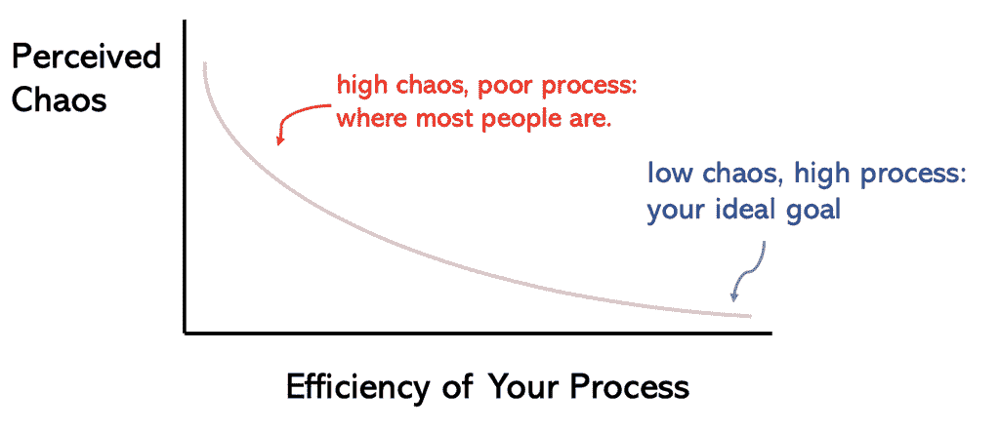
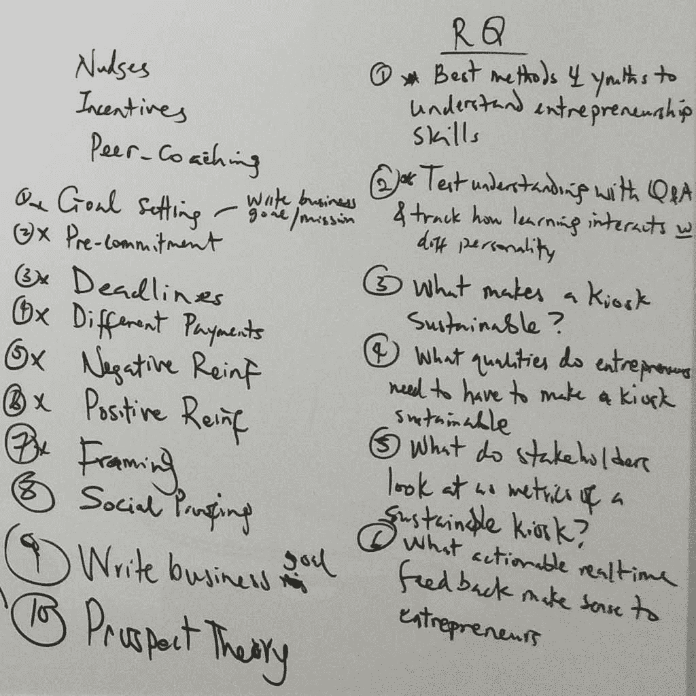
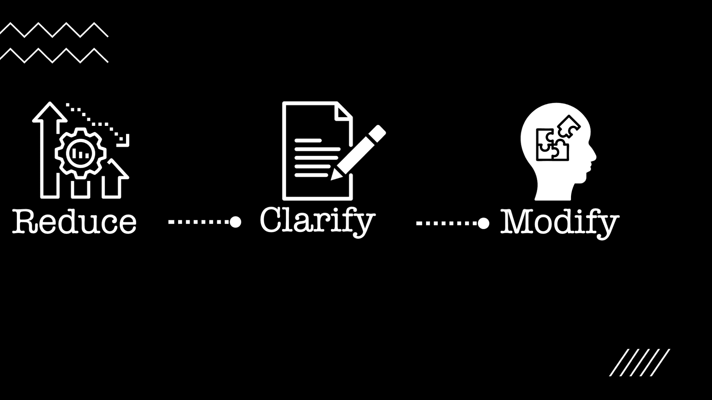
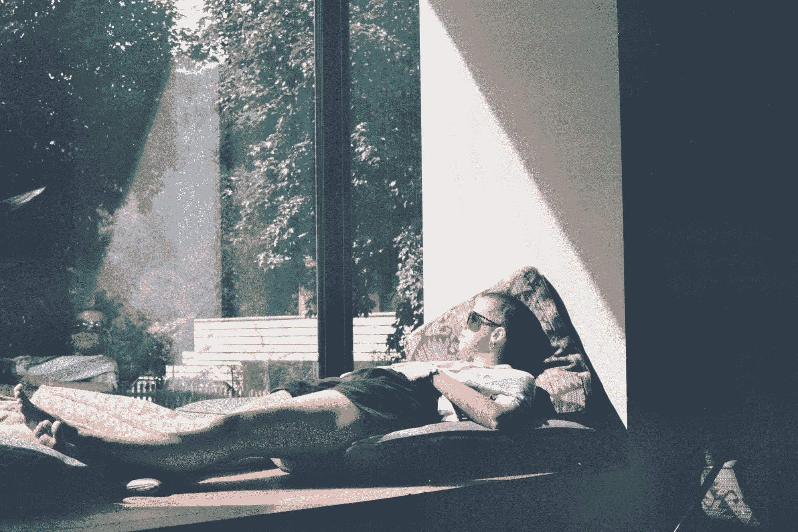
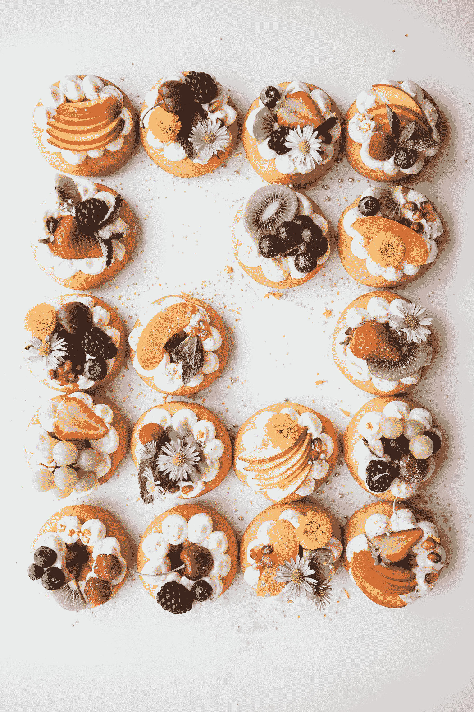

# 如何变得更有效率，感觉不那么不堪重负，并把事情做完

> 原文：<https://www.freecodecamp.org/news/how-to-get-things-done-lessons-in-productivity/>

这个指南是基于 5 年来应用行为心理学的技术和对生产力的研究。我用它作为开发者、导师和创造者。这很有效。

如果你从这篇文章中只记住了一个教训，那就是:

> 有效的生产力技巧是建立在原则之上的。不是快速黑客。或者花哨的工具。

如果你理解并运用这一点，你就能保持头脑清醒，保持专注。它会派上用场，尤其是当事情变得不可收拾的时候。

## 这篇文章将涵盖的内容

*   **第一部分:**流程>工具>
*   第二部分:当你无法停止拖延时该怎么办
*   第三部分:将理智置于执行之上

让我们开始吧。

## 第一部分:流程>>工具

每当你感到不知所措时，很可能是因为你现有的过程让你失望了。不是工具。

一个合理的过程将随时击败花哨的工具。

The more chaotic you feel, the less efficient your process is. Conversely, you could have way more to do than everyone around yet operate more efficiently due to a well-designed process.

在我明白这一点之前，我一直在努力保持稳定的生产力。这里的关键词是*一致。*

任何人都可以偶尔有所作为，但要持之以恒，需要一定的技巧。

那时候，我做了很多事情。但我一直觉得我错过了什么。我的方法是速度和执行力。这在短期内行得通，但从长期来看是不可持续的。

我到处都知道生活窍门，并且尝试了世界上所有的工具，包括流行的工具:

*   [Evernote](https://evernote.com/) :你的笔记。有条理。毫不费力。
*   Google Keep :快速捕捉你的想法。
*   [One Note](https://www.onenote.com/) :适用于您设备的数字笔记应用。
*   [任何。Do](https://www.any.do/) :待办事项 app，带日历，规划，&提醒。
*   [待办事项](https://todoist.com/):组织工作&生活的待办事项。

哦，我尝试了至少 3 次，因为每个人都发誓这是有史以来最伟大的应用。

但是我受不了。

每隔几个月，我就会在应用程序之间切换。

偶尔，我会抛弃数码产品，转而使用纸质产品。但是我会把笔记本忘在家里，或者讨厌带着它到处走，因为它放不进我的口袋。

什么都没用——我仍然觉得有很多任务要完成。但是随着时间的推移，我明白了:

> 在错误的过程中使用的最好的工具感觉像是失败的工具。

所以我改变了我的方法，专注于过程。而且成功了。我的生产力和时间管理技能飞速提高。

你更喜欢用什么 app 都没关系，**我分享的这 4 个简单流程都可以用在你最喜欢的 todo app** 里。

我的恰好是 Google Keep。但是当你通读的时候，我希望你把*“Google Keep”*换成*【Todoist】**【一笔账】*，或者任何你最爱的应用。

关注事物如何匹配的大画面，因为这是使用任何工具的最重要的方面。

有道理吗？

我们开始吧！

### 1)找到你唯一的真理来源

[Image Credi](https://unsplash.com/@timonrets?utm_source=ghost&utm_medium=referral&utm_campaign=api-credit)[t](https://unsplash.com/?utm_source=ghost&utm_medium=referral&utm_campaign=api-credit) – First, find your main productivity tool. Next revolve other tools around it.

我使用 Google Keep 作为我唯一的信息来源，并将其输入到其他生产力工具中。这意味着这是我的第一站。

第一站:

*   杂货清单
*   日志
*   锻炼计划
*   财务战略
*   网飞向收银台展示
*   任何闪过我脑海的想法

这些都有自己的标签，所以捕捉东西通常需要在我的手机上点击几下，或者在谷歌 Keep 一直打开的 Chrome 标签上点击三次。

从那里，我转到日历上的固定约会，观察每周会议消耗多少时间。

然后 Trello 负责团队跟踪协作。

接下来，我在笔记和谷歌文档之间切换，前者用于个人写作，后者用于合作。有趣的是，我的大部分文章都是从手机上的 Keep 开始的。

包括这篇报道。

当它变得越来越长时，我会切换到我的笔记本电脑，将谷歌 Keep web 上的内容复制到 Notes 或谷歌文档中。

任何时候，当我感觉需要特殊的格式，或者我渴望用我最喜欢的字体( [Montserrat 字体](https://fonts.google.com/specimen/Montserrat#pairings))书写时，这就是我需要切换到书写工具的信号。

切换到另一个工具不一定是一件坏事。

但没有多少人相信这一点。

如果找到你唯一的真理来源是你马上付诸行动的唯一想法，你会看到一个戏剧性的变化。

但如果你错过了这一点，当你开始感到不知所措时，你会挣扎着保持漂浮。相信我，事情会变得不可收拾。

### 2)停止追逐一切应用程序

[Image Credit](https://unsplash.com/@miikola?utm_source=ghost&utm_medium=referral&utm_campaign=api-credit) – We rush so fast to the newest productivity and time management tools. But using tools alone won't cut it.

这个有点争议。

在过去，一些人质疑我的立场，尤其是在新工具变得流行之后(例如[概念](https://www.notion.so/login))。

大多数人试图将他们最喜欢的生产力应用程序变成一个写作应用程序，一个协作工具，一个日历应用程序，一个万能工具。

> 事实是，没有一种工具可以解决所有问题。

我犯这个错误太久了。

相信我，你最好选择一个单一的事实来源，然后围绕它建立其他来源。

*   用 Keep 和 Trello 就可以了。
*   有想法和笔记很好。
*   使用待办事项提醒和日历是没问题的。

一个不一定要取代另一个。它们可以相互补充。

### 3)不是纸质*或*数码——是纸质*和*数码

[Image credit](https://unsplash.com/@gerandeklerk?utm_source=ghost&utm_medium=referral&utm_campaign=api-credit) – Mix paper and digital to get the best of your productivity.

偶尔我会很想在纸上写字。

当我计划大目标时，这种感觉尤其强烈。我喜欢描绘出我面前的一切。

用我最喜欢的笔写作可以让想法保持流畅。

在纸上的情况下，我在纸上乱写，然后当我完成时，我会截图并将其添加到 Keep 中的相关标签下。

例如，如果你看到我的*“大创意”*标签，你会在那里看到很多截图。

当我和同事在白板上讨论编码项目或头脑风暴会议时，我也会这样做。

*   搞定。
*   拍照。
*   添加到特定标签。

然后我把纸扔了。

A screenshot from my Google Keep showing what I wrote while brainstorming on techniques from Behavioral Psychology for entrepreneurs to reduce their procrastination tendencies.

多年的纸上写作经验告诉我，我写的纸只有在那一刻感觉良好。

几个星期后，看起来我把纸垃圾弄得到处都是。

所以我截图并尽快删除。

这个过程满足了我对我的计划器的数字访问(胜过任何一天的小笔记本)。但这也让我一有纸痒就挠。

> 我不忠于只有数字或只有纸张。那是胡说八道。

我更感兴趣的是什么能帮助我减轻压倒性的工作量。两者并用效果很好。

你可能只想要纸质的或数字的。没关系。请记住，你不必觉得你必须只使用一个是富有成效的。

有人推荐 *[Rocketbook(一款智能笔记本)](https://getrocketbook.com/)* 。这是一个可重复使用的笔记本，让你写，上传到云，然后把页面擦干净！

我从未使用过它，但我想强调这一点，以防你觉得它有用。

### 4)经常审查——每周、每月、每年

[Image Credit](https://unsplash.com/@rpnickson?utm_source=ghost&utm_medium=referral&utm_campaign=api-credit) – To build strong time management skills, you need frequent reviews.

工作日的每天早上，我都会在笔记本上浏览一遍，看看当天应该优先考虑的事情。

这是主动防止我因为错过太多事情而感到不堪重负的关键。

白天，我会在手机或笔记本上添加一些东西。这个循环一直持续到周五。

每周五，我都会检查我的 Keep 来清理任何失败的或者应该转移到其他工具中的任务。

然后重复。

遵循这个过程会让你有效地粉碎事情，但有时，拖延会阻碍你的进步。

## 第二部分:当你无法停止拖延时该怎么办

You start by reducing perfectionism. Next clarify your next tiny action. And finally modify your behavior when you don't feel like doing any work

你知道吗？我们中 80%的人无法实现新年决心。

太疯狂了。

可悲的是，拖延在其中起了很大的作用。

但是不用担心，你可以通过这三个技巧打败拖延症:减少你的“完美”目标，明确你的下一步行动，通过行为心理学修改你的步骤。

让我们一个一个地挖掘这些。

### 1)将你的第一步从“A+”减少到“B”

如果你是一个完美主义者，你会拖延。如果你的目标太大而无法迈出第一步，你就会拖延。

如果你是一个拖延的完美主义者，你会多次感到麻痹和沮丧，因为你的大目标停留在你的脑海中，而现实中却没有任何行动。

你将什么都不做，因为你希望你的每一步都完美无缺。

> 作为一个完美主义者，要解决你的拖延症，从“B”目标开始，而不是“A+”。这意味着你应该回头把你的第一步改成“足够好”而不是“完美”。

### 2)阐明下一个微小的动作

每当你不清楚下一步该做什么的时候，你的思维就会阻止你前进。

例如，您的待办事项列表有:

> 建立最好的作品集页面来找工作。然后创建惊人的登陆页面向大家炫耀。

[Image Credit](https://unsplash.com/@i_am_nah?utm_source=ghost&utm_medium=referral&utm_campaign=api-credit) – Anytime you create vague tasks, you open the doors to procrastination.

但是:

*   *“最佳”*是什么意思？
*   我的投资组合中应该有什么类型的编程项目？
*   从头开始构建我的应用程序还是使用现有模板是明智之举？
*   我应该学哪种语言？多久了？什么时候？怎么会？

当你的头脑中有太多漂浮的想法时，你的头脑会逃离任何行动，并重新陷入拖延症。

解决方法是花 90 秒回答:

> 对于我想要完成的任务，下一个最小的行动是什么？

例如:

*   如果你正在建立一个投资组合，接下来最微小的行动就是打开一个文件，写一个粗略的计划。不要打开 visual studio 并与 C++中的怪癖作斗争。
*   如果你正在为新程序员写一本关于课程的书，你最微小的行动不是写第一章。这是为所有的书的章节想出你的大纲的第一个草稿。
*   如果你完全是编程新手，你最好的选择是[从你可以学习编码的地方开始](https://lifetechpsych.com/free-learn-to-code)，这样你就可以缩小选择范围。不要漫无目的地跳来跳去，几个月后仍然感到失落。

下一步行动越小，你越有可能完成它。

把多个小动作叠加起来，你，我的朋友，就是金子。

### 3)通过行为心理学的技巧进行修改

[Image Credit](https://unsplash.com/@acharki95?utm_source=ghost&utm_medium=referral&utm_campaign=api-credit) – Procrastination is a psychological issue that needs psychological techniques.

有些日子就是懒的日子。

你知道你应该忽略自己的感受，开始工作，但这并没有发生。

你可以运用行为心理学的这些原则。

*   **最后期限效应:**去 www.tomato-timer.com，点击 5 分钟，以最快的速度开始你的下一个最小的行动。大多数时候你会超过 5 分钟。这是完美的，因为[蔡加尼克效应](https://www.psychologistworld.com/memory/zeigarnik-effect-interruptions-memory)已经开始，你会觉得想要完成你已经开始的工作。
*   **负强化直到你工作:**如果不知何故你什么都没做，定时器结束了，重启它。一个额外的提示是去设置，设置你最讨厌的声音。这样做至少 5 次，每次通过观察计时器倒数来“惩罚”自己！
*   **重温你的动力:**如果过了 5x，你什么也做不了，这意味着你的动力已经没有了，你有更深层次的问题要回答:

> “从事这项工作我能获得什么？”

有时候，看看其他开发者如何改变他们的生活会给你需要的动力。

如果你仍然不知道你会得到什么，那就放弃这个任务，因为是时候去寻找其他更有内在动力的事情了。

但是不管你完成了多少，重要的是要认识到生产力不是不停地工作。

你需要平衡来持续前进。

## 第三部分:将理智置于执行之上

[Image Credit](https://unsplash.com/@darthxuan?utm_source=ghost&utm_medium=referral&utm_campaign=api-credit) – You can dominate your work and reduce stress if you have a well-built process that bakes in self care.

把事情做好并不总是意味着做得更多。有时候你不需要更快，更好。

你需要来自自我照顾的理智。

> 自我照顾从来都不是自私的行为。任何时候，我们都可以倾听真我，给予它所需要的关怀，这不仅是为了我们自己，也是为了那些我们接触过的人。——帕克·帕尔默

如果你不把自我保健放在首位，你肯定会精疲力尽。相信我，开发人员精疲力竭是真的。

筋疲力尽太多次，你会开始想也许你不适合这份工作。

你是。

你的方法只会害死你。

这里有一些简单的方法让你开始关心自己。这些小活动没有达到人们听到“生产力”时所期望的大肆宣传。

但是你需要它们。

### 拥有不同的工作和休闲场所

[Image Credit](https://unsplash.com/@katiebarrett?utm_source=ghost&utm_medium=referral&utm_campaign=api-credit) – Having a dedicated place to relax will help you fully unplug.

我发现在同一个地方放松，然后试着工作并不能达到目的。

翻转时也是一样:在同一个地方工作，然后试图切换到放松模式是很困难的。

你不需要为此分开房间。

你只需要有意识地创造一个物理差异，这样你就可以从一个切换到另一个。不这样做让我在几个星期内循环往复。

### 通过每天淋浴充电

[Image Credit](https://unsplash.com/@phammi?utm_source=ghost&utm_medium=referral&utm_campaign=api-credit) – A daily shower is simple yet powerful enough to reset.

这很简单。早点洗澡更好，但如果你不能做到，那就在晚上一天结束前洗一次。你会觉得你已经完成了一些事情。

### 烹饪作为治疗

[Image Credit](https://unsplash.com/@brookelark?utm_source=ghost&utm_medium=referral&utm_campaign=api-credit) – Cooking is one of the most gratifying ways to reboot yourself.

我不像我想的那样经常做饭。但是按照食谱上的说明做一些新的东西感觉很神奇。

> “没有做饭的人，独自做饭。即使在最孤独的时候，厨房里的一名厨师身边也有几代过去的厨师、现在的厨师的建议和菜单，以及烹饪书作者的智慧。—劳丽·科尔文

随便挑一顿饭——结果好不好并不重要。

脱离这个世界的过程是有帮助的。将烹饪与爵士乐搭配起来，你会自动传送到另一个世界。

### 获得任何数量的阳光

[Image Credit](https://unsplash.com/@frankiefoto?utm_source=ghost&utm_medium=referral&utm_campaign=api-credit) - Sometimes, stepping out to bright light is the productivity kick you need.

我从来不相信天气会影响一个人的情绪，但它确实会。

呆在家里太久，事情会变得令人沮丧。幽居病来袭，你像一只疯狂的浣熊一样来回收拾你的生活空间。

但是你不需要走出去解决这个问题。我已经意识到，如果我一大早打开窗户，我的幽居病就会完全消失。

不需要巨大的窗户或者在外面走很长的路。只需要几分钟的安静，单独的阳光。

## 关闭

[Image Credit](https://unsplash.com/@attentieattentie?utm_source=ghost&utm_medium=referral&utm_campaign=api-credit) – Small, hidden steps prepare you for any big battle out there.

> 虽然看起来很小，但小事的连锁反应是非同寻常的。–[马特·贝文](https://www.brainyquote.com/authors/matt-bevin-quotes)

想想你到目前为止读过的东西。

你会注意到每一个听起来都很简单，因为它们本身都是微小的调整。

但是将它们结合在一起改变了我如何掌控一切。如果你遵循这些原则，你也可以实现这种改变。

请记住:

*   流程>>工具
*   战胜拖延症，否则它会控制你
*   将自我关心和理智置于持续执行之上

## 感谢阅读

如果你喜欢这个，还有更多。

*   [**加入我的邮件社区**](https://lifetechpsych.ck.page/) :我为新程序员和初级开发者分享技巧，让他们成长更快，信心倍增。如果你有兴趣，[加入这个社区。](https://lifetechpsych.ck.page/)
*   [**在 Twitter 上关注我**](https://twitter.com/LifeTechPsych) :想要更多连发提示？还是有疑问？我是推特上最活跃的，所以请放心[联系我。](https://twitter.com/LifeTechPsych)我的 DM 开了。
*   **[阅读更多文章](https://www.freecodecamp.org/news/author/lifetechpsych/) :** 如果你想要更多文章，[查看我的其他帖子](https://www.freecodecamp.org/news/author/lifetechpsych/)。

注意——我喜欢研究，所以我倾向于用行为心理学和神经科学的概念来支持我的建议和方法。