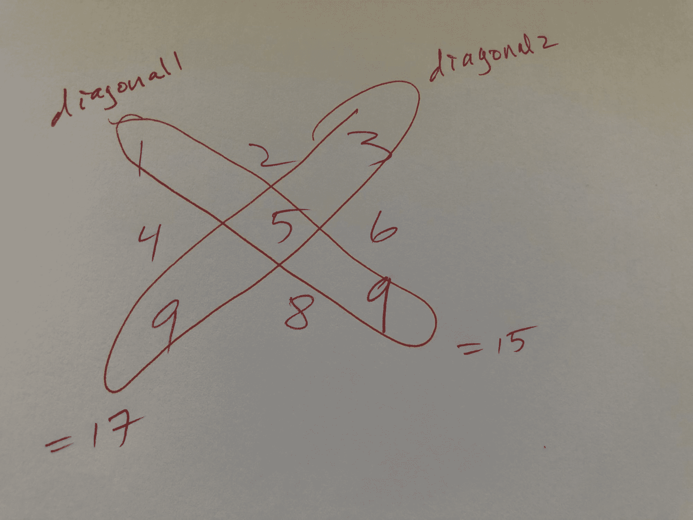

# 当你遇到编程障碍时，如何摆脱困境

> 原文：<https://www.freecodecamp.org/news/how-to-get-unstuck/>

陷入困境是程序员的一部分，不管水平如何。所谓“容易”的问题，其实挺难的。你不确定该如何前进。你认为有用的东西并不有用。

做程序员的另一部分是让自己摆脱困境。

最近我一直被卡住，所以我一直在想办法让自己摆脱卡住的状态。以下是我一直使用的一些策略。也许他们也能帮助你。

## 把问题具体化

创建一个图表，快速绘制草图，或使用实际的对象给自己一个视觉效果。这会让问题更容易思考。

我遇到的一个问题要求我找出一个方阵的对角线之和的绝对差。我脑子里有一大堆东西要记。所以我把它画了出来:我创建了一个数字方阵，并圈出对角线。



一个简单的草图让我眼前一亮:将一条对角线(15)相加，然后是另一条(17)，然后找出它们之间的绝对差值(2)。

这种方法也适用于其他问题。当我学习 for 循环时，我遍历了一堆杏仁。当我在处理一个递归问题时，我会画一个图来看看调用栈上发生了什么，直到我碰到我的基本情况。

共同点是:把抽象变得具体。

## 写下你想做的事情

当你感到非常熟悉的“转动你的轮子”周期来临时，写下你正在进行的具体步骤。

花五到十秒钟在一张纸上草草写下几个词，会帮助你巩固你的思维过程，转移你的注意力。

以下是一些例子:

*   将课程名称作为关键字存储在对象中
*   将参数传递给回调函数
*   将“最大值”变量重置为 0

例如，重置“maxValue”变量并没有解决问题。但这是过程中重要的一步。写下这个简短的短语让我回到了正轨:它提醒了我要做什么。这也确保了我专注于一件事，而不是很多。

所以下一次你发现自己一遍又一遍地尝试同样的方法并得到同样的结果时，停下来问自己:“我到底想做什么？”

然后，把你的答案写在一张纸上。

想到你的反应还不够。如果我漫不经心地对自己“思考”,我会加速这个过程，但不会有太多收获(如果有的话)。我得把它写下来。

## 简化你的输入

做几件事比做很多事要轻松得多。这就是为什么简化你的输入是有帮助的。

一个问题给了我三本字典的列表。只有三本字典，但还是多了两本。

```
names = [
    {'first':'John', 'last':'Smith', 'email':'johns@example.com'},
    {'first':'Mary', 'last':'McDonald', 'email':'marym@example.com'},
    {'first':'Sam', 'last':'Davey', 'email':'samd@example.com'}
] 
```

我的工作是先按姓氏，再按名字对每本词典进行排序(例如，Davey，Sam: samd@example.com)。然而，当我把三本词典列成一本时，这个问题就更容易思考了。

```
name = [
    {'first':'John', 'last':'Smith', 'email':'johns@example.com'}
] 
```

我用一本字典解决了这个问题。然后，我将同样的逻辑应用于手头的更大的问题。

当你简化给定的输入时，你就使问题变得更容易处理。

## 解决一个小问题

当你解决一个小问题时，更容易发现模式并理解你真正被要求做什么。

这里有一个来自鲁文·勒纳的书 *Python 测试*的示例问题:

"使用列表理解来颠倒文本文件中各行的词序。也就是说，如果第一行是 abc def，第二行是 ghi jkl，那么你应该返回 list ['def abc '，' jkl ghi']。”

当解决一个较小版本的问题时，我发现去掉复杂的层次并使用我理想的数据结构很有帮助。在这个例子中，这意味着忽略文本文件和列表理解(复杂的层次)并使用列表(我理想的数据结构)。

然后我解决了问题。我打开编辑器，打出我理想的数据结构。

```
letters = ['abc def', 'ghi jkl'] 
```

我颠倒了顺序，使用 for 循环得到了预期的结果。

```
reversed_letters = []
for letter in letters:
   letter_list = letter.split(" ")
   letter_list.reverse()
   reversed_letters.append(" ".join(letter_list)) 
```

一旦我开始工作，我就一次一层地增加复杂性，直到我按照问题陈述的要求解决了问题。

解决一个小版本的问题有助于你了解你需要做什么。这也是化繁为简的另一种方式。

## 休息一会儿

你的大脑不会因为你的手指停止打字而停止思考。

当你在做编程以外的事情时，有没有一个想法突然出现在你的脑海里？你有没有在锻炼后回到一个问题，而解决方案就在你面前？我也经历过。

当你在做其他事情的时候——当你没有刻意工作的时候——你想到了你的想法或解决方案，这不是巧合。《科学美国人》解释道:“顿悟可能看似无处不在，但它们通常是停工期间无意识思维活动的产物。”

如果你觉得自己碰到了一堵砖墙，你很有可能就是。休息一下可能是最好的。给你的大脑一些时间来消化你正在做的事情，然后重新回到问题上来。

## 与另一个程序员配对

和别人一起工作是产生想法和从另一个角度看问题的好方法。但是我强烈建议你首先尽你所能让自己摆脱困境。

总会有路障。学习如何解决自己的问题是一项需要学习的关键技能。说“我不明白”很容易。我来问问这位高级工程师。”然后，让高级工程师为你解决问题。自己想清楚更难，但你至少需要去尝试。

如果你已经真诚地展示了你最好的一面，那么就带着一个具体的问题去找程序员。这显示了对其他程序员时间的尊重，并且会使你们的配对会话更加有效。

然后，寻求一个提示——不要让程序员为你解决问题。毫无疑问，你会遇到类似的情况，所以把结对练习作为一个学习的机会。从长远来看，这对你有帮助。

## 包扎

毫无疑问，陷入困境令人沮丧。你可以尝试上述策略中的一个，然后有一个“灵光乍现”的时刻，或者你可能需要尝试一个组合，然后发现自己只是在这个过程中缓慢前进。

但我从拥抱奋斗中学到了两件事:我学到了很多，突破即将到来。坚持下去。

我写的是学习编程，以及学习编程的最佳方式【amymhaddad.com】()。