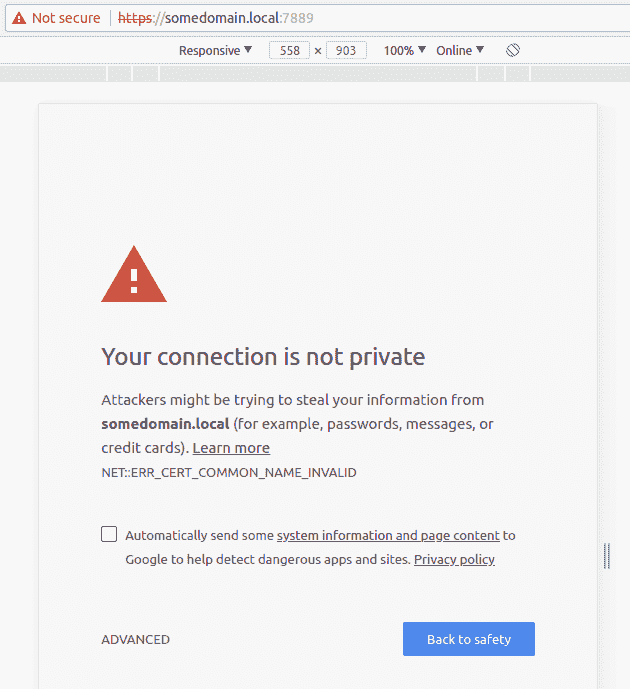
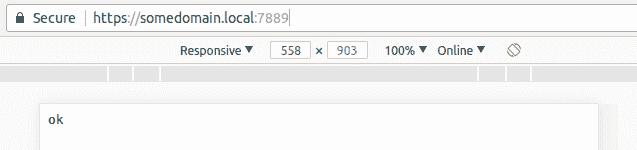

# 如何为本地开发获取有效的 SSL 证书

> 原文：<https://www.freecodecamp.org/news/how-to-get-valid-ssl-certificates-for-local-development-ca228240fad2/>

亚历克斯·纳达林

# 如何为本地开发获取有效的 SSL 证书

几周前，我碰到了由[菲利普](https://github.com/FiloSottile)编写的工具 [mkcert](https://github.com/FiloSottile/mkcert) 。他是流行的[心脏出血测试工具](https://filippo.io/Heartbleed/)的幕后黑手。

这个工具满足了一个简单的需求:



通过创建一个安装在系统中的本地根 CA 文件，它使得所有由`mkcert`发布的证书都是可信的。



从 GitHub 下载最新版本后，只需运行`mkcert -install`即可“安装”它。完成后，您就可以创建您的第一个可信(由您自己的系统)证书了:

```
$ mkcert somedomain.local

Using the local CA at "/home/alex/.local/share/mkcert" ✨

Created a new certificate valid for the following names ?
 - "somedomain.local"

The certificate is at "./somedomain.local.pem" and the key at "./somedomain.local-key.pem" ✅
```

例如，如果您必须引导一个支持 SSL 的节点服务器，看起来会是这样:

```
const fs = require('fs')

const options = {
  key: fs.readFileSync(__dirname + '/somedomain.local-key.pem'),
  cert: fs.readFileSync(__dirname + '/somedomain.local.pem')
};

require('https').createServer(options, (req, res) => {
  res.writeHead(200)
  res.end(`Got SSL?`)
}).listen(443)
```

很漂亮，是吧？

`mkcert`所做的只是在您的系统中添加另一个 CA 文件。(我猜在`/etc/ssl/certs/ca-certificates.crt`下，但不完全确定)。浏览器认为这些证书是可信的——这是欺骗任何 HTTP 客户端的好办法。

今天到此为止！再见！

*最初发布于[odino.org](https://odino.org/valid-ssl-certificates-for-local-development/)(*2018 年 9 月 1 日*)。*
*你可以在[推特](https://twitter.com/_odino_)上关注我——欢迎吐槽！*？