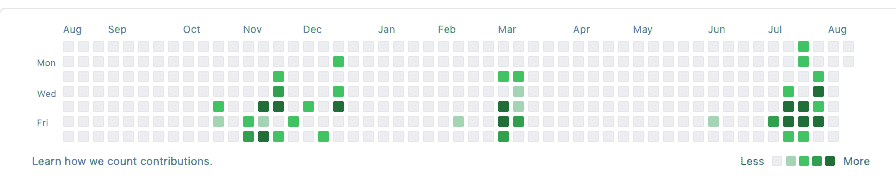
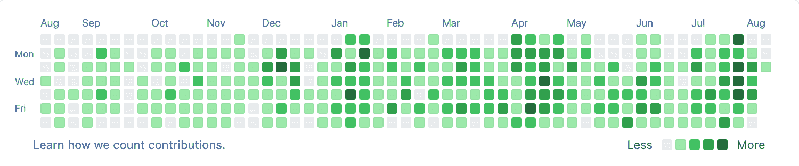
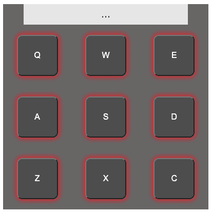
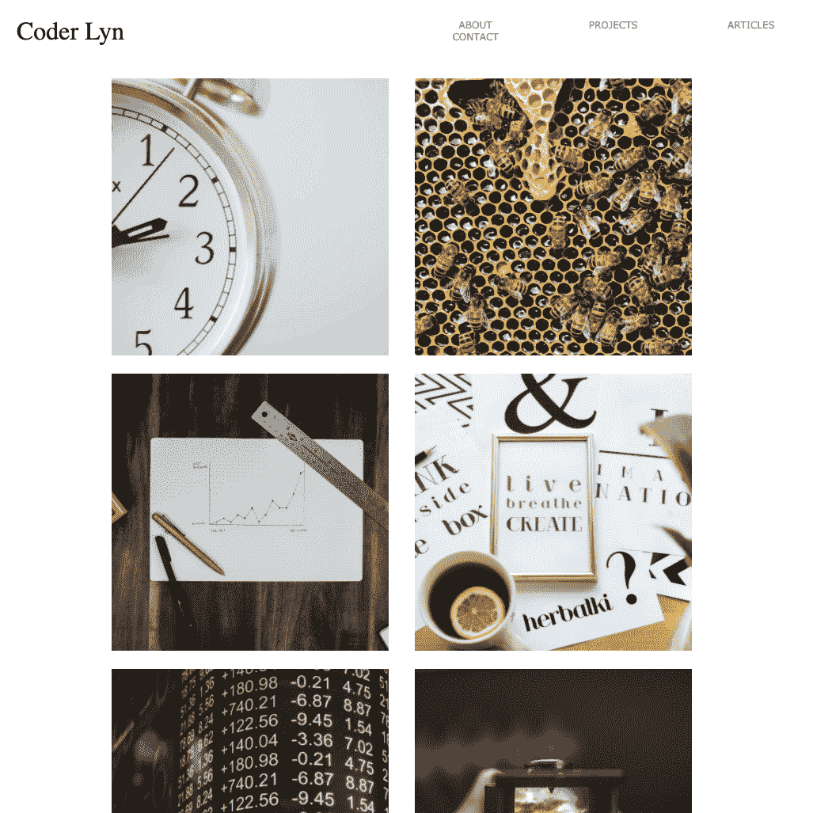
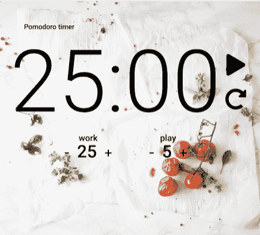
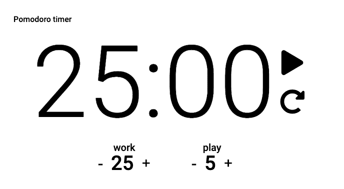
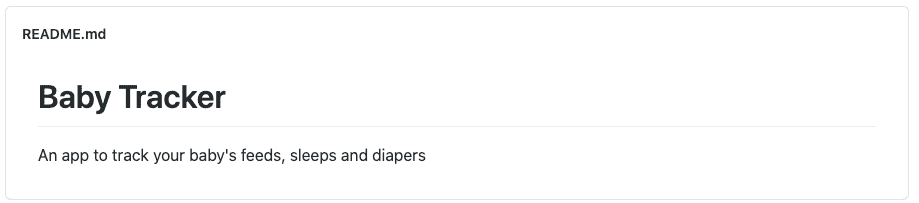

# 如何获得你的第一份开发工作——回顾职业转换者的简历

> 原文：<https://www.freecodecamp.org/news/how-to-get-your-first-dev-job/>

求职的时候，大家都说自己对编码和开发充满热情。作为一名开发人员和招聘经理，我寻找的是这种激情的证据。

本周，我看了一些转行并寻找第一份开发工作的人的简历。我花了每个人大约 2-5 分钟的时间来决定他们是否能晋级。

给一个陌生人留下深刻印象的时间可不多！以下是我寻找的物品清单:

*   GitHub 上的常规提交
*   个性化项目
*   良好书面沟通的证据

## GitHub 上的常规提交

你的 GitHub 贡献历史是什么样的？如果你对编码充满热情，那么我假设你经常编码。

展示这种热情的简单方法是公开编码。在 GitHub 上建立一个存储库，学习如何进行原子提交，并推送它们。

这给了雇主一个很好的信号，表明你每天都在编码，当你说你对编码充满热情时，你是认真的。我要找的是一张漂亮的绿色图表。我们来看看这个人在 GitHub 上的公开贡献历史:

Example contribution history on GitHub

这个人只在一年中的特定时间公开编码:11 月、12 月、3 月和 7 月。我怀疑这与训练营项目不谋而合，也就是强制性项目。当看到来自同一个训练营的候选人时，每个人都有相同的贡献图，很难脱颖而出。

作为一名雇主，它并没有向我发出强烈的激情信号。一年中有几个月是空的。

这个人可能每天都在她的个人笔记本电脑上写代码，但作为一名雇主，我无法看到并认可这种努力。

让我们看看另一个人的贡献历史:

Almost daily contributions to GitHub

这个人几乎每天都向 GitHub 提交信息。这是一个非常强烈的信号，表明她对编码感兴趣，并且在过去的 12 个月里每天都在编码。

这太棒了，尤其是如果她不是程序员的话。我想和这个人谈谈，了解她在做什么！即使她的大部分提交是对一个`README.md`文件的文本编辑，这仍然是承诺和一致性的一个很好的标志。

## 个性化项目

链接到你的项目，并确保他们闪耀！

一些方法可以做到这一点:

*   放入真实的内容
*   注入你自己的个性。寻找对你有意义的图像。
*   为你的工作感到自豪:它不需要设计得很漂亮——我要找的是工程师，不是视觉设计师。但是有一个基本的关心水平:事情有重叠吗？是否有足够的空白空间？它在手机和网络上都有效吗？

我注意到的常见陷阱:

*   没有项目链接
*   开展一个没有个性的训练营项目，或者和 lorem ipsum 一起。当我收到来自同一个训练营的 20 名毕业生的简历时，这些简历很快就过时了。如果你没有费心去个性化你的投资组合，这并不能肯定“我充满激情”的一面。
*   链接到不再工作的项目。确保你让一个朋友在不同于你的设备上测试它。
*   链接到需要设置的项目。让我们轻松一点！有一个很棒的`README.md`文件，里面有如何设置的细节。放入大量的截图、UX 流、序列图等等。雇主可能会点击你的项目，但我认为雇主不太可能会下载你的项目。所以截图，UX 流，等等需要展示你的项目是做什么的。

寻找一些“好”与“坏”的例子？我不想挑剔任何人的工作，所以这里有一个我的项目的例子，没有个性。

My drum machine project

眼熟吗？这是我在 freeCodeCamp 课程中的鼓机项目。我一点都没有个性化。更糟糕的是，有成千上万的其他人已经完成了这个项目，并使它变得更酷！我绝不会让雇主来参观这个项目，以此来表达我的热情。

与 freeCodeCamp 课程不同的一个项目是个人作品集。我花了更多的时间来个性化这个项目。无论从哪方面来说，它都不是完美的(它没有响应，这真的让我很烦！)，但却是我独有的。

My personal portfolio project

我的作品集还展示了上面列出的另一个隐藏的陷阱:链接到中断的项目。当我创作这个作品集的时候，我的番茄定时器看起来很漂亮。

What my pomodoro timer used to look like, with a nice background image

几年后，我所依赖的股票形象已经不复存在。所以我的[活番茄定时器](https://ailyntang.github.io/pomodoro/)看起来有点悲伤。这不是世界末日，但绝对不是我全力以赴。它告诉雇主，虽然我要求他们点击链接，但我自己并没有费心去做同样的事情。

What my pomodoro timer looks like now - no images

一句话:如果你告诉雇主点击一个链接，那么你应该先点击它，看看你是否满意。

## 良好书面沟通技巧的证明

我想说，所有的技术工作都依赖于书面技能。您的代码中有文档(尽管理想情况下您的代码是自文档化的)。作为你日常工作的一部分，还有松弛和拉动请求。

这是另一个容易写进简历的要点:“优秀的沟通技巧”。每个简历都列了。作为雇主，我忽略了这一点，因为很难通过简历进行评估。

然而，如果你在 GitHub 上链接到一些结构良好的`README.md`文件，或者你写的在线文章，或者你的个人博客，那么就对了！

作为雇主，我肯定会点击那些链接。它们帮助我判断你的个性是什么样的，你的沟通风格，你在构建你的想法时所付出的细节和努力，等等。

下面是我的一个垃圾文件的例子。我没有在这个文件中投入任何精力，所以在没有首先更新`README.md`文件的情况下，我不会在我的 CV 中链接到这个项目。

然而，我肯定会放一个链接到我在 freeCodeCamp 上写的一些教程。

## 包扎

作为一名职业转换者，找到你的第一份开发工作可能会令人生畏。请坚持下去！你带来了大量可转移的技能。

我希望这篇文章告诉你，制作一份脱颖而出的简历，展示你独特的个性，并帮助你获得第一份工作，是在你自己的控制范围之内的。