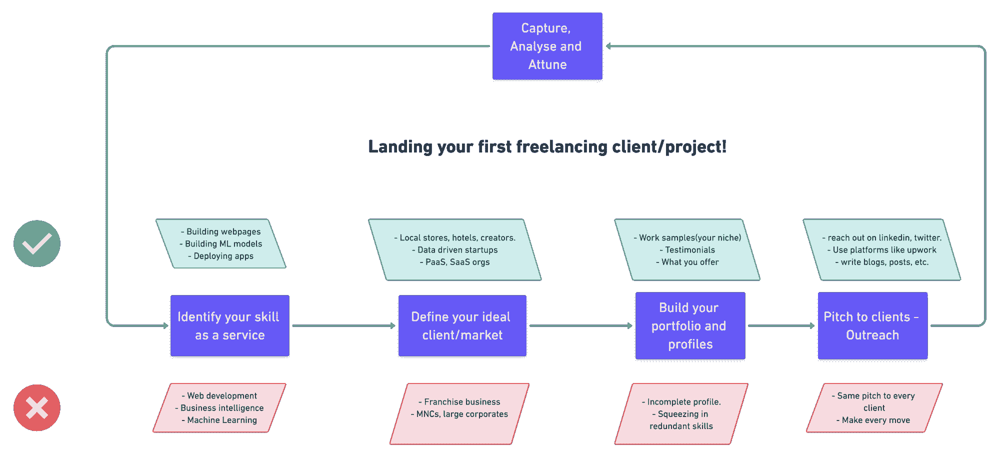

# 如何获得你的第一个自由职业客户或项目

> 原文：<https://www.freecodecamp.org/news/how-to-get-your-first-freelancing-client-project/>

自从我辞去全职数据工程师的工作，开始全职从事自由职业以来，已经过去将近三年了。当我忙于获得我的第一个客户或新项目时，我的职业发展出现了急剧的上升。

比起成长和金钱，我更想找到我真正的兴趣所在。更不用说，努力实现自己的想法给了我巨大的快乐。

关于我的职业，我经常遇到的一个问题是，

> 你是如何获得你的第一个自由职业项目的？

因为每个人都知道获得第一份工作可能是自由职业者最难的部分。这篇博文和视频(底部)是关于建立一个策略来开始你的自由职业生涯。

## 为什么是自由职业者？

如果你有时间，谁不想建立一个副业收入？也许你想攒钱买车，或者你想休息一年。这就是自由职业的用武之地。

更不用说，你可以成为“你自己的老板”，穿着短裤在海滩别墅工作，同时，你可以赚多少钱没有限制。你掌控着自己的成长。

所以，给你！

## 获得第一个自由职业项目的五个步骤

在我看来，你需要遵循五个步骤来帮助你获得第一份工作，建立自由职业生涯。他们在这里:

1.  将您的技能确定为一项服务
2.  定义你的理想客户或市场
3.  建立您的投资组合和档案
4.  向客户推销你的服务
5.  捕捉结果/差距，分析每一步的结果，调整方法以保持增长。

## 步骤 1 —将您的技能识别为服务

简历的技能部分简单地列出了你在技术和技巧方面的知识。但是你必须确定在现实世界中你能用这些技能做什么。

明确表达，让客户明白你能为他们做什么。

你的技能可能是:

*   Web 开发
*   装帧设计艺术
*   数字营销
*   数据分析

您的服务可以是:

*   构建高性能的端到端网站和 web 应用程序。
*   为网站、视频和海报创作美丽的插图和数字艺术作品。
*   帮助个人和中小企业在网上推广他们的产品和服务。
*   处理数据以发现模式并回答重要的以业务为中心的问题，从而做出明智的决策。

在这张信息图中，您可以看到每个步骤的注意事项:

大多数人都很难迈出第一步。他们不确定是否准备好了。我相信你永远不会准备好。开始吧！

以下是 Gumroad 创始人 Sahil Lavingia 的推文:

> 你不学，那就开始。你开始，然后学习。
> 
> — Sahil (@shl) [January 15, 2021](https://twitter.com/shl/status/1350102029675290630?ref_src=twsrc%5Etfw)