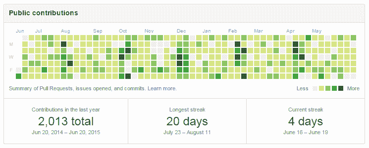

# 如何获得你的第一份软件开发工作

> 原文：<https://www.freecodecamp.org/news/how-to-get-your-first-software-developer-job-da3ca0de5d2/>

作者:德米特里·格拉博夫

# 如何获得你的第一份软件开发工作

几乎每周都会有新闻提到科技人才争夺战。然而，当涉及到获得你的第一个软件开发角色时，事情可能会很艰难。

用我们内部人才专家的睿智的话来说:“你职业生涯中最困难的部分将是获得第一个职位。”

我花了大量的时间来申请开发人员的职位和雇佣开发人员。我想分享一些我们给 [Constructor Labs](http://constructorlabs.com/) 的学生的建议，这些建议可以帮助你创建一个强大的应用程序，并获得梦寐以求的第一个角色。

### 面试前的技术准备

#### 电子邮件地址

这将是你简历上传达信息的第一条。这是最容易给人留下好印象的方式。

不要使用雅虎电子邮件地址。它们被黑客攻击了，使用它们会让人觉得你不了解安全。

Gmail 地址通常被视为一个好兆头。不过，请在用户名部分使用您的真实姓名。像 flowertiger@gmail.com 这样的人会被认为是不专业的。

最好的选择是使用类似 yourfirstname@yourname.com 的东西。它创造了一个专业的形象，并表明你已经做了额外的一步。很多开发者，一看到它，就会把域名贴在浏览器里看你的网站。现在你有机会得分了。

#### 你的网站

确保你在 yourname.com 有一个网站，或者有一个特定国家的网址，比如 yourname.co.uk。这个网站应该看起来尽可能干净和有吸引力。如果你对设计不在行，可以随意使用一个有令人愉快的调色板和干净的布局的模板。

您的网站应包含以下信息:

*   你和你为什么想成为一名开发者
*   你对哪些技术感兴趣
*   你想做什么工作

它还应该包含两到三个展示你技能的作品集项目。对于每个项目，解释它是做什么的，你为什么要建立它，它解决了什么问题。一定要包括它使用的技术。此外，如果项目是由几个人完成的，说明你的角色是什么，你创建了哪些部分。对于每个项目，包括一个到其 [GitHub](https://github.com/) repo 的链接。稍后会有更多关于 GitHub 的内容。

#### 投资组合项目

作品集项目可以是你课程的一部分，为真实世界的客户完成，或者是一个有趣问题的解决方案。这是你展示自己的机会。就像你的作品集网站一样，确保设计是干净和吸引人的。好的设计代表着质量和对细节的关注。

每个项目应该解决一个明确的问题。你可以构建一些无处不在的东西，比如选股软件或者天气预报软件。不过，选择原创的东西会帮助你脱颖而出。面试官也是人，他们希望看到新鲜刺激的东西。你很可能会被邀请参加面试，因为那个人想更多地了解你的成就。

虽然你可能是软件开发的新手，但你可以用你的项目展示一些招聘公司可能不具备的知识。大多数公司倾向于使用几年前的技术。你可以通过使用一些公司可能没有机会使用的全新技术来展示你的技能。

例如，使用 CSS 网格或 async / await JavaScript 函数将很快证明你紧跟最新发展，比面试你的人更了解一些技术。这是扭转局面的好方法。

#### 开源代码库

你建立的每个项目都应该在 Github 上有一个公共回购。然而，没有所有者的许可，不要分享任何专有的作品。

每个 Github repo 都应该有一个 **README** 来解释这个项目做什么以及如何在本地运行它。它还应该有一个链接，在那里可以看到该项目的现场运行。

你所有的代码应该尽可能的简洁。使用一致缩进以及合理的函数和变量名。添加注释来解释您的代码做了什么，尤其是当它不明显的时候。

[http://www.loganfranken.com/blog/1167/github-contribution-calendar-considered-whatever-you-make-of-it/](http://www.loganfranken.com/blog/1167/github-contribution-calendar-considered-whatever-you-make-of-it/)

Github 会显示你的公开提交的图表。目标是每天提交和推送代码。这是雇主看重的奉献和专注的标志。

#### 履历

把简历的重点放在你想做的事情上，而不是你过去做过的事情上。先简单总结一下你为什么要转行，你想找什么样的角色。您可能希望为您申请的每个角色量身定制。在申请前端职位时说自己对数据库充满热情是一个糟糕的举动。

在你的简历中加入项目组合，并解释它们的作用。列出每个项目使用的主要技术。

对于过去的工作，只包括与你申请的工作相关的信息。阅读职位说明书，如实修改你的简历以符合要求。

### 采访本身

#### 面试前

很少有公司有原创的面试问题。对于所需的主要技术，大多数人会使用 100 个常见问题的组合。一定要在谷歌上搜索面试前的问题，并提醒自己答案。此外，尽可能多地进行编码练习，例如使用 [Codewars](https://www.codewars.com/) 。

#### 面试后

开始写面试日记。每次面试后，写下你被问到的问题和你给出的答案。一定要找到完美的答案并写下来。更有可能的是，同样的问题会在下一次面试中出现。

如果你喜欢这份工作，给面试官发邮件，告诉他们你喜欢什么，并重申你对这个职位的兴趣。

跟进。在面试的两到三天内，给决策者发邮件，感谢他们的时间，并重申你对这个职位的兴趣。对于他们来说，这总是一个有用的提示，至少可以提供反馈。

对于一些人来说，面试可能会有压力。做好以上准备，会提高你每个阶段的胜算，提振你的信心。你最初的几次面试可能是场灾难，但这绝对没关系。我的的确是。目标是从每次经历中学习，在每次尝试中提高。你将很快建立起实践和信心，这将使你获得你的第一个开发者角色。

*Constructor Labs 在伦敦举办了为期 12 周的[编码训练营，教授](http://constructorlabs.com/)[使用 JavaScript 的全栈 web 开发](http://constructorlabs.com/course)。5 月 29 日开始上课，费用为 3000 英镑。[申请现已开始](http://constructorlabs.com/admission)，名额将以先到先得的方式分配。*