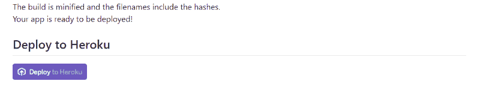
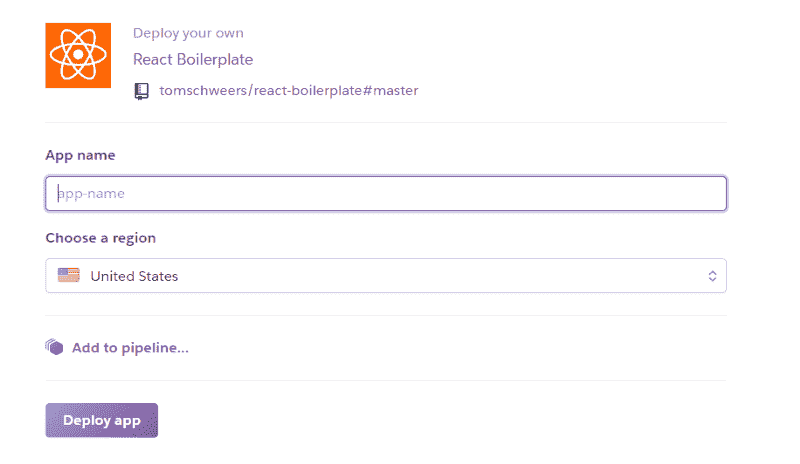
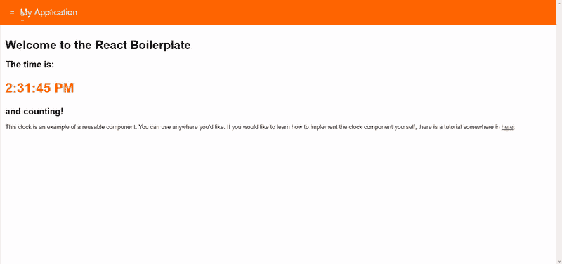
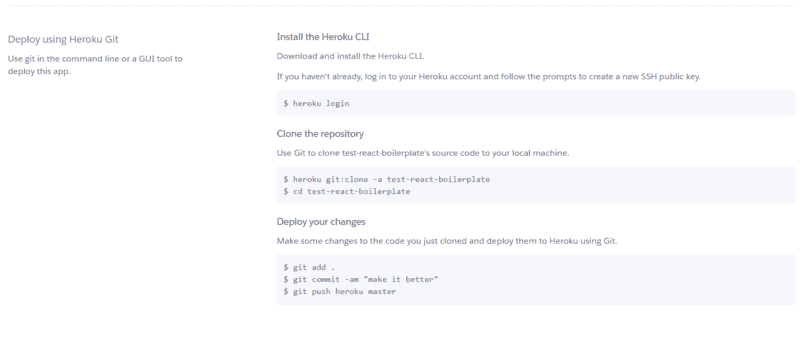
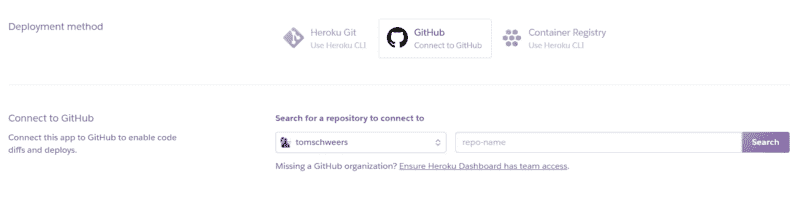
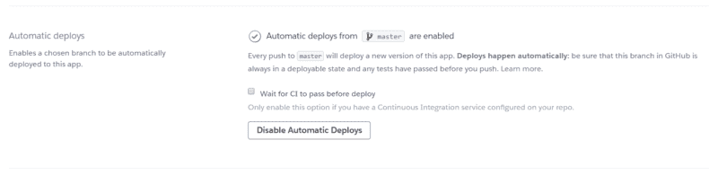
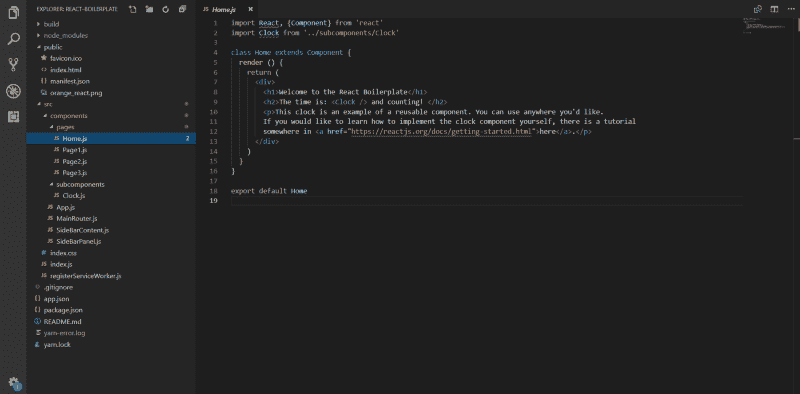
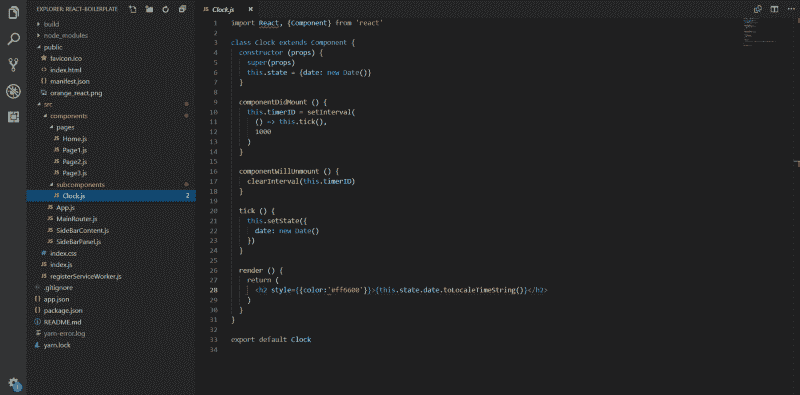
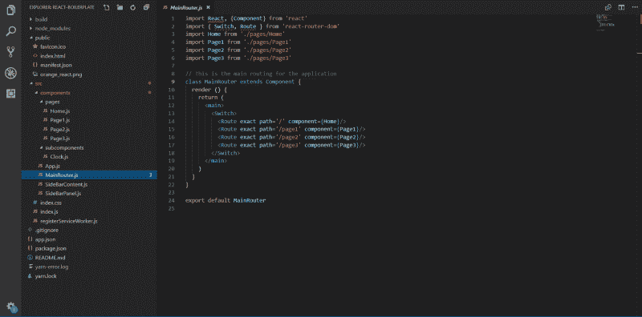
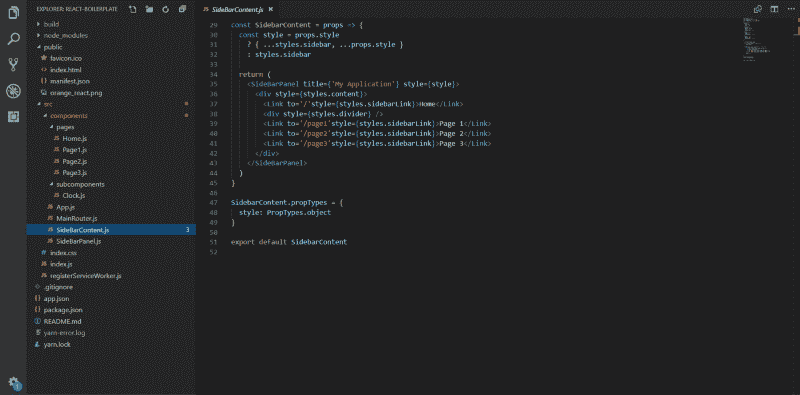

# 如何用 React.js 和 Heroku 快速从 idea 到 URL

> 原文：<https://www.freecodecamp.org/news/how-to-go-from-idea-to-url-quickly-with-react-js-and-heroku-d94c293c0d9c/>

作者汤姆·施韦尔斯

# 如何用 React.js 和 Heroku 快速从 idea 到 URL

当我刚开始做开发人员的时候，我想做的一件事就是开发一个 web 应用程序。我想让全世界都看到它。我不关心它的外观，它有什么功能，甚至不关心是否有人会看到或使用它。我唯一的愿望是理解整个端到端的过程。我想知道一堆文件和文件夹是如何在互联网上转化成一个活生生的应用程序的。

我不是工科出身，不知道这些是如何工作的。我所知道的就是如何用 JSFiddle 或类似的东西编码。我知道如何为我的客户设计漂亮的前端功能。我唯一的真实经历是配置 SaaS 应用程序，这是在一个预建的应用程序中编程。所以很自然地，我想更深入一点…

Inception (2010)

长话短说，我写这篇文章是为了那些有类似情况的人。有人想要一个简单易行的方法让你的应用程序上线。这让您可以专注于实际构建功能，而不是基础设施。

### 入门指南

外面有大量的样板文件。根据我的经验，它们可能有点过于复杂，尤其是对于开发新手来说。我试过 Vue.js starter 应用程序、MEAN stack 应用程序，甚至是 [create-react-app](https://github.com/facebook/create-react-app) 。所有这些都花了一些时间，让我可以放心地开始我的应用程序的实际开发。然而，我发现脸书的 create-react-app 是最容易设置的。我的样板文件最初就是从它派生出来的。

#### 反应样板

我最初只是为自己创建了 [react-boilerplate](https://github.com/tomschweers/react-boilerplate) 。然后我想，如果别人觉得它有用，那就更好了。因此，如果您正在跟进，请导航到上面的链接，它将带您到我的 GitHub 库。

这里你可以做的第一件事(也是最简单的事)是滚动到页面的最底部，点击 **Deploy to Heroku** 按钮。

如果你还没有帐号，Heroku 会首先提示你创建一个帐号。去做吧，你不会后悔的(而且是免费的)。之后，你会看到一个屏幕提示你创建一个新的应用程序。

为你的应用程序键入一个名称。该名称在整个 Heroku 平台上必须是唯一的，而不仅仅是您的帐户。然后点击**部署 app** 。

#### Heroku

如果你不熟悉 Heroku，它是一个 PaaS 应用程序，为你处理所有的幕后事务。Heroku 使应用程序的部署、配置、扩展、调整和管理过程尽可能简单明了。

> Heroku 是一个云平台，让公司能够构建、交付、监控和扩展应用程序——我们是从想法到 URL 的最快方式，绕过了所有这些令人头疼的基础设施。

按照上面的说明，您已经成功地将一个应用程序部署到了互联网上。要查看您的应用，请进入 ***设置*** 选项卡，向下滚动到 ***域和证书*** 部分。在那里你会看到一个链接到你的生活应用。

#### 应用程序功能

现在你可以用任何一个初学者应用程序来做这件事。因为您使用了 [react-boilerplate](https://github.com/tomschweers/react-boilerplate) ，所以您已经准备好了一些显著的特性。我想包含最少的内容，这样就容易理解，但也足以让我快速开始未来的想法。

1.  文件夹结构组织有序，易于理解。该应用程序是专门为快速推进项目而开发的。没有太多的膨胀，组件结构是有意义的。下面是关于如何构建组件的更多信息。
2.  [**反应过来——侧边栏**](https://github.com/balloob/react-sidebar) 。这个侧边栏菜单反应灵敏、现代，并针对移动浏览进行了优化。打开手机上的[演示应用](https://react-boilerplate-sidenav.herokuapp.com/)，试着用手指滑动关闭菜单；或者，您可以在菜单外点击。这是迄今为止我见过的 React.js 最好的侧边栏。
3.  [**React-font awesome**](https://github.com/FortAwesome/react-fontawesome)。这个包为 React.js 应用程序提供了漂亮的、可伸缩的、免费的 SVG 图标。查看我的[个人网站](https://www.tomschweers.com/)，看看他们中的几个住在右上角。我已经将包添加到样板文件中，但是它实际上没有导入任何图标。您所要做的就是取消 App.js 文件中的代码注释，开始导入。
4.  **。这是一个命令行工具，用于扫描您的应用程序中未使用的依赖项。它会告诉你哪些包没有被使用，这样你就可以删除它们。我发现这在试验 JavaScript 包时非常有用。我零星的思维会整天导入包，一旦意识到它们不完全符合我的要求，就丢弃它们。**

**

React Boilerplate Demo Site** 

**就是这样！查看我的存储库中的 README.md，了解关于特性或如何配置它们的更多信息。**

#### **下载代码**

**Heroku 提供了一种非常简单的方法来获取您刚刚部署的应用程序的源代码。你所要做的就是使用 Heroku CLI 按照应用程序中 ***部署*** 选项卡上的指示进行操作。**

****

**或者，如果您不想使用 Heroku CLI，您可以直接从 GitHub 克隆或下载 [react-boilerplate](https://github.com/tomschweers/react-boilerplate) 存储库，然后自己创建一个新的存储库。然后将 ***部署方式*** 改为***GitHub****并搜索你的新资源库。***

******

***您还可以启用自动部署。当您将提交推送到您的存储库时，您的 Heroku 站点将自动更新。***

******

#### ***添加页面和组件***

***此时，您应该有自己的文件夹连接到 Heroku 应用程序。构建页面和组件非常简单，我将向您展示如何操作。本教程假设你知道 [ES6](http://es6-features.org/#Constants) 和 [React.js](https://reactjs.org/) 的基础知识。截图是我的文字编辑器——[Visual Studio 代码](https://code.visualstudio.com/)(强烈推荐)。***

***首先，导航到 ***Home.js*** 文件。***

******

***您可以在这里更改您的主页。如您所见，我正在导入一个 ***时钟*** 组件作为示例。我将组成应用程序页面的较小组件保存在 ***子组件*** 文件夹中。***

******

***子组件是页面的可重用构件。将按钮、表格、图形、动画、表单和其他可重复使用的组件放入该文件夹。在 ***pages*** 文件夹中构建你的页面，导入到 ***MainRouter.js*** 中。***

******

***这个文件将你的 ***页面*** 文件路由到指定的 URL 路径。您可以随意命名您的 URL 路径，我只是添加了一些示例路径来演示。之后，在***sidebar content . js***文件中添加页面链接，这样用户就可以浏览它们了。***

******

***就是这样！***

***这些链接现在将显示在你的应用程序的侧边栏导航中，并被路由到你在上面指定的页面。要在应用程序中添加新页面，您只需遵循这三个简单的步骤。不需要接触 ***App.js*** 文件和 ***SideBarPanel.js*** 文件，您可以专注于构建应用程序的实际内容。***

### ***结论***

***现在，您已经有了一个功能齐全的开发应用，它具有桌面和移动优化的导航和路线。现在，您可以构建组件和页面，而不必担心应用程序的结构。向任何人展示您的 web 应用程序，只需向他们发送自定义的 Heroku 链接。***

***下一步是建立一个自定义域名，并让应用程序准备好真正的流量。如果你觉得这个教程有帮助或者有任何问题，请在评论中告诉我。***