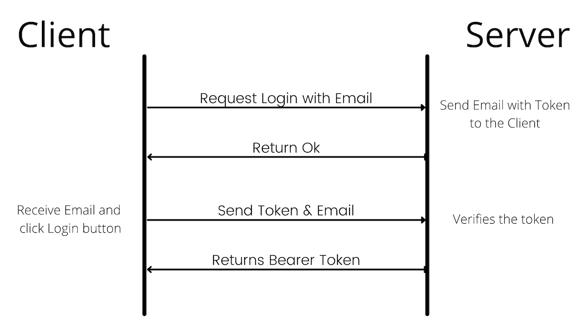

# 无密码登录-如何无密码登录？网络身份

> 原文：<https://www.freecodecamp.org/news/how-to-go-passwordless-with-dotnet-identity/>

每天都有大量的新应用推出，所以你需要让你的应用脱颖而出。它应该具有独特的功能，并且应该易于使用。

许多应用程序的一个主要难点是它们需要用户名和密码才能登录。我个人必须记住 10-15 个 Gmail、脸书、Instagram 等应用程序的密码。你明白了。

在本文中，我们将为您的 API 创建一个解决方案，允许您的用户无需密码即可登录。

## 如何不用密码

为了省略对密码的需求，你的应用程序应该为用户生成某种类型的令牌。

然后，该令牌被发送给用户，只有他们可以访问它，例如通过他们的电子邮件或电话。这里是流程的概述。



。NET Identity 是一个[包](https://www.nuget.org/packages/Microsoft.AspNetCore.Identity/)，它提供了管理用户、密码、配置文件数据、角色、声明、令牌等等的方法。

此外，Identity 还提供了为电子邮件确认或更改用户的电子邮件或电话生成令牌的方法。我们将使用 Identity 生成的令牌来验证我们的用户。

有两种主要的令牌提供程序可用:

*   `TotpSecurityStampBasedTokenProvider`(基于时间的一次性密码)。
*   `DataProtectionTokenProvider`

### TotpSecurityStampBasedTokenProvider

这个令牌提供者生成基于时间的令牌，这些令牌的有效期大约为 3 分钟(您可以在这里引用[源代码)。根据令牌提供者，令牌是从电子邮件、电话号码或用户 id 以及用户的安全戳生成的。](https://github.com/aspnet/AspNetIdentity/blob/b7826741279450c58b230ece98bd04b4815beabf/src/Microsoft.AspNet.Identity.Core/Rfc6238AuthenticationService.cs#L75)

Dotnet Identity 提供了实用程序类`EmailTokenProvider`和`PhoneNumberTokenProvider`，它们是`TotpSecurityStampBasedTokenProvider`的子类。

### DataProtectorTokenProvider

如果您想要生成一个长期不会过期的令牌，那么可以使用`DataProtectorTokenProvider`。

`DataProtectorTokenProvider`使用`DataProtector`和加密算法生成令牌。你可以在这里查看更多细节[的实现。](https://github.com/aspnet/AspNetIdentity/blob/main/src/Microsoft.AspNet.Identity.Owin/DataProtectorTokenProvider.cs)

在本文中，我们将子类化`DataProtectorTokenProvider`,这样我们的令牌在 10 分钟内有效。

## 如何设置身份

让我们从一个新项目开始。通过执行 **`dotnet new webapi –-name NoPasswordProject`** 命令创建一个项目。

```
dotnet add package Microsoft.EntityFrameworkCore.InMemory --version 5.0.4
dotnet add package Microsoft.AspNetCore.Identity.EntityFrameworkCore --version 5.0.4 
```

在本教程中，我们将创建一个内存数据库。但是您可以使用自己选择的数据库，并相应地更改上面的包。

注意:内存数据库将在服务器每次重启时清除用户。

## 如何创建自定义令牌提供程序

让我们创建一个自定义令牌提供程序，它生成 10 分钟内有效的令牌。

### NPTokenProvider

创建一个名为`NPTokenProvider.cs`的新文件。NP 前缀代表没有密码。

```
using Microsoft.AspNetCore.DataProtection;
using Microsoft.AspNetCore.Identity;
using Microsoft.Extensions.Logging;
using Microsoft.Extensions.Options;

public class NPTokenProvider<TUser> : DataProtectorTokenProvider<TUser>
where TUser : IdentityUser
{
    public NPTokenProvider(
        IDataProtectionProvider dataProtectionProvider,
        IOptions<NPTokenProviderOptions> options, ILogger<NPTokenProvider<TUser>> logger)
        : base(dataProtectionProvider, options, logger)
    { }
} 
```

这里我们对`DataProtectorTokenProvider`进行子类化。没有什么不寻常的，除了在构造函数中我们传递了`NPTokenProviderOptions`。选项需要是`DataProtectionTokenProviderOptions`的子类。

### NPTokenProviderOptions

创建一个名为`NPTokenProviderOptions.cs`的新文件，并粘贴以下代码。

```
using System;
using Microsoft.AspNetCore.Identity;

public class NPTokenProviderOptions : DataProtectionTokenProviderOptions
{
    public NPTokenProviderOptions()
    {
        Name = "NPTokenProvider";
        TokenLifespan = TimeSpan.FromMinutes(10);
    }
} 
```

我们正在为要创建的令牌设置选项。您可以根据自己的喜好更改`Name`和`TokenLifeSpan`。

### dbcontext(dbcontext)

几乎每个项目都需要一个数据库来存储它的用户和其他与项目相关的数据。Dotnet EF 框架提供了一个很好的助手`DbContext`来处理与数据库的会话以及查询和保存实体。

所以创建一个`IdentityDbContext`的子类，它又是`DbContext`的子类。将文件命名为`NPDataContext.cs`。

```
using Microsoft.AspNetCore.Identity.EntityFrameworkCore;
using Microsoft.EntityFrameworkCore;

public class NPDataContext : IdentityDbContext
{
    public NPDataContext(DbContextOptions<NPDataContext> options)
        : base(options)
    { }
} 
```

### Startup.cs

我们已经创建了类。现在是时候在我们的`Startup.cs`文件中配置它们了。在`ConfigureServices`中，在开头添加以下代码。

```
var builder = services
.AddIdentityCore<IdentityUser>()
.AddEntityFrameworkStores<NPDataContext>();

var UserType = builder.UserType;
var provider = typeof(NPTokenProvider<>).MakeGenericType(UserType);
builder.AddTokenProvider("NPTokenProvider", provider);

services.AddDbContext<NPDataContext>(options =>
    options.UseInMemoryDatabase(Guid.NewGuid().ToString()));

services.AddAuthentication(options =>
{
    options.DefaultScheme = IdentityConstants.ExternalScheme;
}); 
```

还要在`Configure`方法中的`app.UseAuthorization();`上面加上 **`app.UseAuthentication();`** 。

### NoPasswordController.cs

让我们为我们的登录创建一个控制器，并验证 API。在您的`Controllers`文件夹中创建一个`NoPasswordController.cs`文件。将以下内容添加到文件中。

```
using System;
using System.Threading.Tasks;
using Microsoft.AspNetCore.Identity;
using Microsoft.AspNetCore.Mvc;

namespace NoPasswordProject.Controllers
{
    [ApiController]
    [Route("[controller]/[action]")]
    public class NoPasswordController : ControllerBase
    {
        private readonly UserManager<IdentityUser> _userManager;

        public NoPasswordController(UserManager<IdentityUser> userManager)
        {
            _userManager = userManager;
        }
    }
} 
```

我们在控制器中注入了一个`UserManager`的实例。UserManager 用于用户的 CRUD 操作，以及生成令牌并验证它们。

### Login API

让我们添加一个接受电子邮件作为输入的`Login` API。电子邮件是用户的唯一标识符，也就是说，用户和电子邮件之间应该是一对一的关系。

在控制器中创建一个新函数，如下所示。

```
[HttpGet]
public async Task<ActionResult<String>> Login([FromQuery] string Email)
{
    // Create or Fetch your user from the database
    var User = await _userManager.FindByNameAsync(Email);
    if (User == null)
    {
        User = new IdentityUser();
        User.Email = Email;
        User.UserName = Email;
        var IdentityResult = await _userManager.CreateAsync(User);
        if (IdentityResult.Succeeded == false)
        {
            return BadRequest();
        }
    }

    var Token = await _userManager.GenerateUserTokenAsync(User, "NPTokenProvider", "nopassword-for-the-win");

    // DON'T RETURN THE TOKEN.
    // SEND IT TO THE USER VIA EMAIL.
    return NoContent();
} 
```

这里我们从数据库中获取一个用户。如果用户不存在，那么我们创建一个用户。一定要设置用户名，否则会出现运行时错误。

然后基于用户，我们生成一个`UserToken`。`GenerateUserTokenAsync`接受用户、令牌提供者和生成令牌的目的。

令牌提供者字符串应该是您在`NPTokenProviderOptions`中使用的字符串。目的可以是你想要的任何东西。

通过设计精美的电子邮件中的链接将令牌发送给用户。当用户点击电子邮件中的链接时，它将打开您的前端页面。因此，该页面将请求验证 API。

### 验证 API

让我们添加另一个名为`Verify`的 API，它将`Email`和`Token`作为查询参数。

```
[HttpGet]
public async Task<ActionResult<String>> Verify([FromQuery] string Token, [FromQuery] string Email)
{
    // Fetch your user from the database
    var User = await _userManager.FindByNameAsync(Email);
    if (User == null)
    {
        return NotFound();
    }

    var IsValid = await _userManager.VerifyUserTokenAsync(User, "NPTokenProvider", "nopassword-for-the-win", Token);
    if (IsValid)
    {
        // TODO: Generate a bearer token
        var BearerToken = "";
        return BearerToken;
    }
    return Unauthorized();
} 
```

我们再次基于电子邮件获取用户。因此，如果我们找不到用户，我们将返回 404 Not Found。

然后，我们继续验证用户。`VerifyUserTokenAsync`将用户、令牌提供者、目的和令牌作为输入参数。目的应该与生成令牌时使用的目的相同。

如果令牌无效，返回 401 未授权。否则，返回不记名令牌。[这是一篇关于如何为用户生成不记名令牌的好文章](https://arjavdave.com/2021/03/31/net-5-setup-authentication-and-authorisation/)。

你可以在这里找到整个项目[。](https://github.com/shenanigan/dotnet-passwordless)

## 结论

优秀的功能曾经是创建应用程序时最重要的事情。但是今天，除了强大的功能之外，方便是用户优先考虑的事情。

在这篇文章中，我们探讨了一种让你的应用程序更加用户友好的方法。如果您有其他方法来改进您的应用程序，请告诉我。

点击这里查看更多类似的教程。