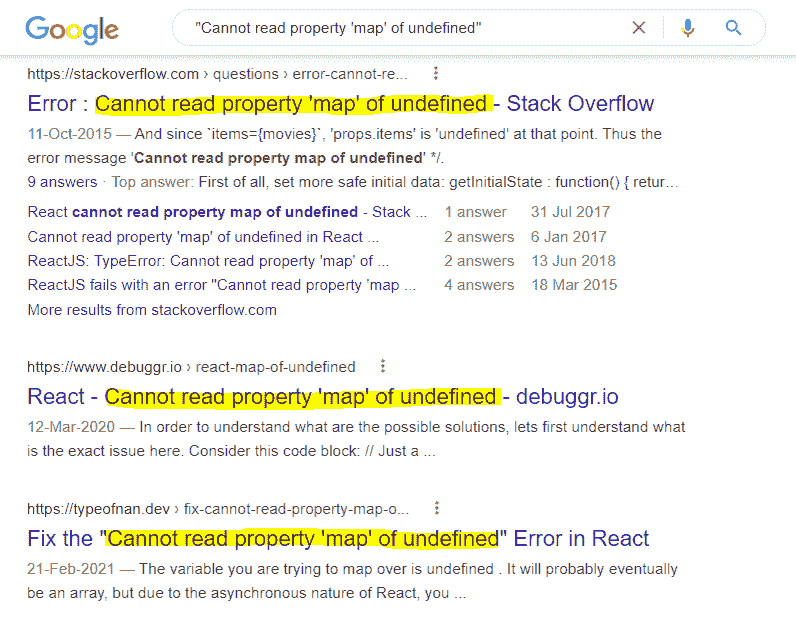
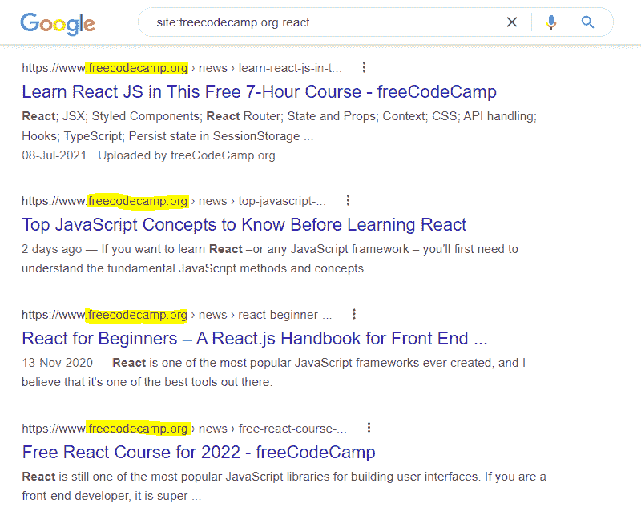
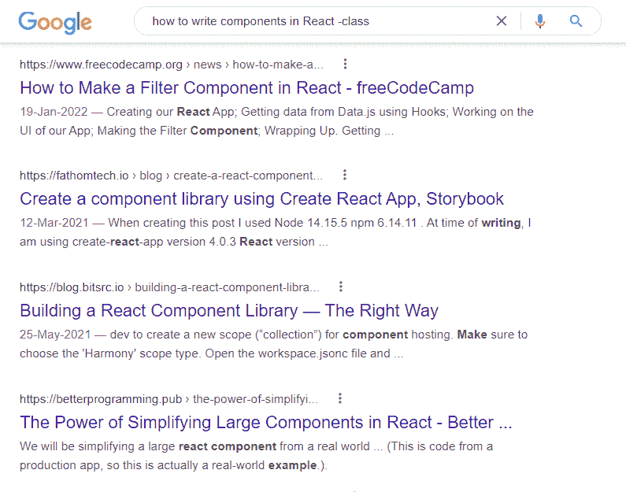
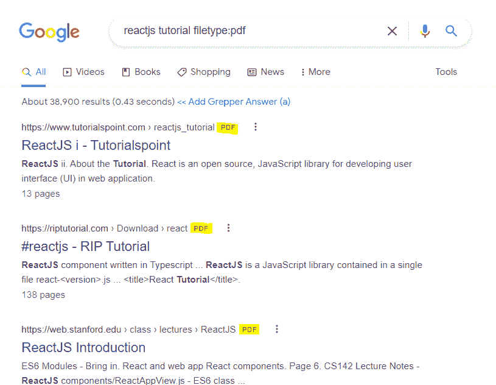
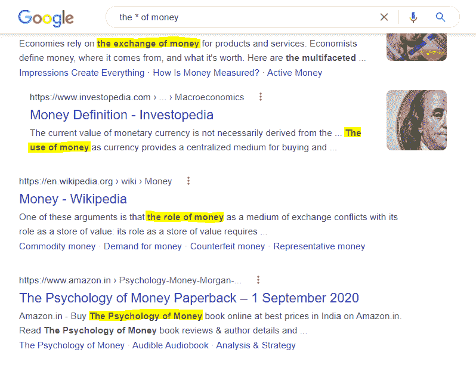
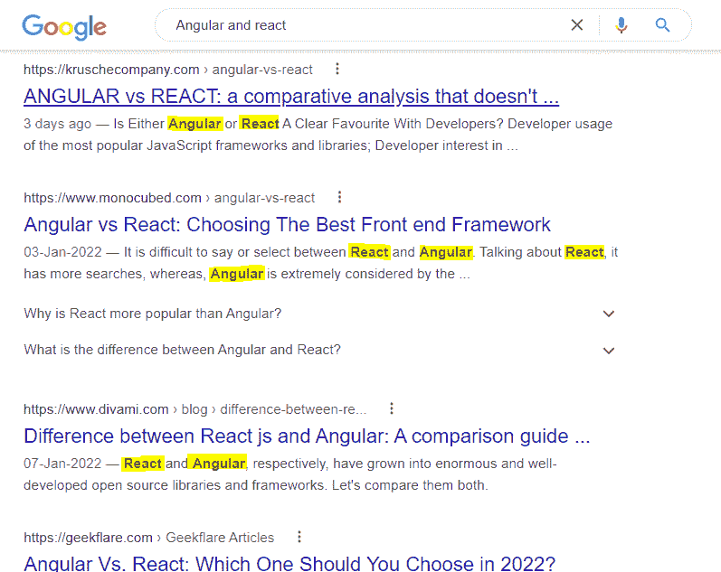
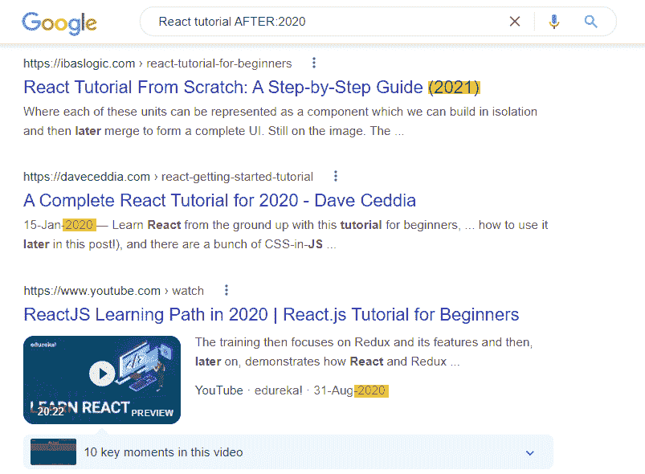
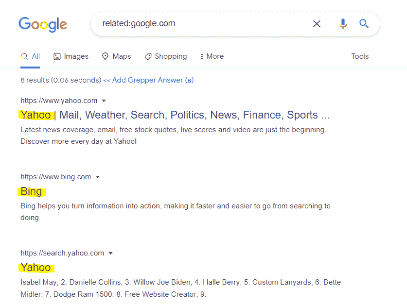
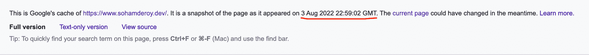

# 如何像专家一样搜索——更有效搜索的 10 个技巧

> 原文：<https://www.freecodecamp.org/news/how-to-google-like-a-pro-10-tips-for-effective-googling/>

几乎所有的东西都可以在互联网上找到，谷歌是人们搜索信息的主要途径之一。

虽然你可能认为这是显而易见的，但许多互联网用户不知道如何有效地使用谷歌搜索和 T2。

事实上，谷歌搜索是一门艺术。

为了得到正确的答案，你需要问正确的问题。为了快速得到正确的答案，你必须知道**如何**提出正确的问题。

每个人都应该学习 **how** 部分，这也是本教程的全部内容。下面是一些有用的提示和技巧，你可以用它们来有效地找到问题的正确答案。

## 如何有效搜索谷歌

### 1.使用引号获得“精确”匹配

一般来说，当我们在谷歌上进行常规搜索时，它会进行**浅层**搜索。这可能会导致页面不一定包含您在搜索查询中提到的所有单词。

但是如果你把你的搜索查询或者问题(一个术语或者一个短语)用引号括起来，就像这样:`"your question goes here"`那么谷歌会进行深度搜索。这意味着所有的搜索结果都将包含那些**包含你在问题中用引号括起来的所有术语**的页面。

当您绝对希望某个特定的术语或短语出现在您的搜索结果中时，这很有帮助。

### 2.使用`site:`在特定站点内搜索

如果你想让谷歌从一个特定的网站返回结果，只需在你搜索的问题前加上`site:`。

当你想在一个没有内部搜索选项或者可能没有一个非常有效的选项的网站中搜索一些东西时，这也是很有帮助的。

例如，搜索**site:freecodecamp . org react**将仅填充来自 www.freecodecamp.org 网站关于 React 主题的搜索结果。

### 3.使用`-`从搜索结果中排除一个术语

如果你不想让一个词或短语出现在你的搜索结果中，那么只需在这个词前面加上`-`。

例如，搜索=> **如何在 React -class** 中编写组件将返回所有不包含“class”一词的搜索结果。所以，(如果你懂一点 React)它只会给你一些在 React 中编写功能组件的方法。

### 4.使用`imagesize:`搜索特定尺寸的图像

如果你想搜索特定尺寸的图像，那么在搜索查询中使用标签`imagesize:`以及以**像素**表示的宽度和高度。

尺寸应以**像素**为单位–例如，`imagesize:500x500`将填充尺寸为 500px x 500px 的图像结果。因此，在= >“可爱的狗狗图片 imagesize:500x600”(为什么不呢)上搜索将会得到图片大小为`500px x 600px`的可爱狗狗图片。

### 5.使用`filetype:`搜索特定文件类型

如果您想获得包含特定文件类型(如 PDF 或 PPT)的搜索结果，则添加`filetype:<extension>`(不带尖括号)。例如，**react tutorial filetype:pdf**将生成包含 PDF 的结果，如下图所示:

### 6.使用通配符`*`进行搜索

如果您不确定或忘记了搜索查询/问题中的任何术语，请使用通配符`*`。谷歌会用相关术语替你替换。

例如，搜索= > money *将会得到以下结果。它将是一堆页面，包括诸如“金钱的*交换*、“金钱的*使用*、“金钱的*角色*、“金钱的*心理*”等短语。

### 7.用`OR`、`AND`逻辑组合搜索

如果你想让你的搜索结果包含两个词，那么就在两个词之间插入关键字`AND`。例如，在= > **React 和 Angular** 上的搜索将获取同时包含 React 和 Angular 两个术语的结果。

类似地，如果你想在你的搜索结果中找到任何一个词，那么在它们之间使用`OR`关键字。例如，对= > **React 或 Angular** 的搜索将获取包含其中一项甚至两项的结果。

### 8.过滤掉两个数字之间带有`AFTER:`、`BEFORE:`或`..`的搜索

如果您希望 Google 填充在特定年份之后发布的搜索结果，那么使用标签`AFTER:`。例如，在= > **React 教程上搜索 2020 年后**将填充 2020 年后发布的搜索结果。

类似地，添加标签`BEFORE:`将返回特定年份之前发布的结果。

您也可以搜索在某一年范围内发表的结果，或者任何数字之间的结果。只需在您想要搜索的两个数字之间加上`..`以及单位，如果有的话。

### 9.使用`related:`查看相关网站

如果你想知道互联网上有哪些与某个网站相似的网站，那么使用`related:`标签。

例如，在**上搜索 related:google.com** 将获取所有与 google 相似的网站，如 Bing、Yahoo、DuckDuckGo 等等。

### 10.使用`cache:`查看谷歌网站的缓存版本

谷歌储存了网站的缓存版本，以快速提供搜索结果。要查看 Google 是否缓存了任何网站，只需在网站的 URL 前使用标签`cache:`。

这对于网站开发者来说特别有帮助，如果他们想要检查他们当前是否正在查看一个缓存的网站或者在他们对网站进行了一些修改之后网站的最新版本。例如，在撰写本教程的当天(即 2022 年 8 月 4 日)，搜索=>**cache:www . sohamderoy . dev**会返回以下结果:

如你所见，即使我在搜索 2022 年 8 月 4 日的网站，我仍然看到 2022 年 8 月 3 日网站的副本，因为那是谷歌缓存网站的时间。

重要的是要注意“不是所有的搜索操作符都返回详尽的结果。”正如 [Google](https://support.google.com/websearch/answer/2466433?visit_id=637790664879774647-1036329470&p=adv_pages_similar&hl=en&rd=1) 自己提到的。

尽管如此，我相信这些都是非常有用的提示，可以帮助你进行有效和高效的谷歌搜索。我希望我已经恰当地解释了它们，并鼓励你在常规的谷歌搜索中使用它们。

## 包扎

感谢阅读！我真的希望你喜欢阅读这篇关于如何高效地使用谷歌的短文，并且觉得这篇教程很有用。

请考虑与你的朋友分享，我会非常感激。在 LinkedIn 和 Twitter 上关注我，关注更多精彩内容！安静点。🖖

### 社会联系

*   [LinkedIn](https://www.linkedin.com/feed/)
*   [网站](https://www.sohamderoy.dev/)
*   [我的其他博客](https://blogs.sohamderoy.dev)
*   [推特](https://twitter.com/_sohamderoy)