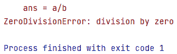
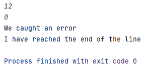
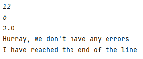

# 如何在 Python 中处理错误——解释了 try、except、else 和 finally 关键字

> 原文：<https://www.freecodecamp.org/news/how-to-handle-errors-in-python/>

> “当你在寻找错误时，在你的代码中找到一个错误已经够难的了；如果你认为你的代码没有错误，那就更难了。”史蒂夫·麦康奈尔

在程序员的一生中，错误是不可避免的。事实上，在编写程序时，错误确实有助于识别代码中的逻辑错误和语法错误。

但是，如果您可以在执行之前预见到特定代码行中的错误，那么您就可以处理这些错误并使代码没有错误。

## 为什么错误处理很重要

处理或注意您意识到的错误有助于代码顺利流动和执行，没有任何中断。如果任何代码行中出现错误，错误处理会处理它们，然后代码继续执行。

让我们举一个例子来理解为什么我们需要错误处理:

```
a = 12
b = 6
result = a/b
print(result)
print("I have reached the end of the line")
```

Program with no error

从上面的代码，你期待什么？。嗯，`result`变量打印`2.0`，在下一行，控制台打印`I have reached the end of the line`。那正是我们所期待的。

让我们将`b`的值从`b = 6`改为`b = 0`并运行。

```
1\. a = 12
2\. b = 0
3\. result = a/b
4\. print(result)
5\. print("I have reached the end of the line")
```

Program with error

当执行这段代码时，我们将得到如下错误:



Error message displayed when b is set to 0

代码没有打印出`result`值，也没有打印出`I have reached the end of the line`

上面的错误信息显示`division by zero`，这意味着如果我们试图用任意一个数除以`0`，就会得到这个错误。

问题在第`3`行。即使代码没有打印出`result`值，它也应该打印出`I have reached the end of the line`。但是，它没有——为什么？

嗯，因为当`a`被`0`除时，Python 解释器停在了第 3 行。此时，它在控制台中引发一个错误并退出代码。

解决这个问题的一个简单方法是对值进行硬编码。如果`a`和`b`的值是硬编码的，那么运行代码会在一定程度上解决这个错误。

但是可能出现的另一个主要问题是，当用户希望在执行时给出`a`和`b`的值时。

```
a = int(input())
b = int(input())
result = a/b
print(result)
print("I have reached the end of the line")
```

values of a and b are taken from user

此时，用户很有可能将`0`作为`b`的输入。为了处理这种预期的错误，我们将使用特定的错误处理方法，以避免中断执行流程(即使用户可能会给任何无效的输入，如`0`作为`b`的输入)。

## 如何在 Python 中使用 Try 和 Except 关键字

任何更容易出错的代码行都保存在`try`块中。如果出现任何错误，那么`except`模块将会处理这些错误。

代码结构如下所示:

```
try:
   code that may/may not produce errors
except:
   when error arises, then this block of code exceutes.
   Otherwise, this block of code doesn't exceute 
```

Code Structure of try/except keywords

让我们回到我们一直在讨论的标准例子。我们将使用`try/except`块来处理`division by zero`问题。

让我们插入极有可能产生错误的代码行。在我们的例子中，代码的行`1-4`很有可能产生错误。因此，我们将这四行放在`try`块中:

```
try:
  a = int(input())
  b = int(input())
  result = a/b
  print(result)
except:
  print("We caught an error")

print("I have reached the end of the line")
```

Try and Except block to divisible problem

现在，当我们给`b`一个值`0`时，就会出现错误。因此，`except`块执行，解释器打印`We caught an error`并从异常块中出来，继续打印`I have reached the end of the line`。

另一方面，当我们给`b`一个非零值时，我们打印`result`的值。代码从 try 块中出来并继续打印`I have reached the end of the line`。

在这两种情况下，我们都能够没有任何中断地执行到最后一行代码。

除了 try 和 except，理解伴随`try`和`except`而来的`else`和`finally`关键词也是相当重要的。

`else`代码块出现在`try`和`except`代码块之后，当`try`代码块没有产生错误时执行。类似地，`finally`代码块出现在`else`代码块之后，无论是否出现错误都会执行——这个代码块肯定会执行。

既然您已经理解了`try`、`except`、`else`和`finally`代码块是如何工作的，流程的顺序将是:

```
try:
   code that may/may not produce errors

except:
   when error arises, then this block of code exceutes

else:
   when error doesn't arise, then this block of code exceutes

finally:
   This block will exceute whether error occurs or not.
```

Code Structure of Error Handling keyword Blocks

将同样的结构应用于数字除法问题，我们得到这样的结果:

```
try:
  a = int(input())
  b = int(input())
  result = a/b
  print(result)

except:
   print("We caught an error")

else:
   print("Hurray, we don't have any errors")

finally:
   print("I have reached the end of the line")
```

Code Structure of number division problem after Error Handling keyword blocks

当`b`被赋值`0`时，我们得到一个错误。因此，except 块执行并打印`We caught an Error`，最后代码块执行并打印`I have reached the end of the line`。



Code execution flow when error occurs

另一方面，如果`b`得到例如`6`(或者任何非零值)，那么我们将`a`值除以`6`并将其存储在`result`变量中。然后代码打印出`result`值。

然后，`else`块执行并打印`Hurray, we don't have any errors`，最后代码块执行并打印`I have reached the end of the line`。



Code execution flow when no error raises

## 摘要

现在我希望你明白如何用 Python 实现错误处理，以便用`try/except`块捕捉潜在的错误。

您还学习了如何使用与这些错误处理方法相关的`else`和`finally`代码块。

快乐编程...