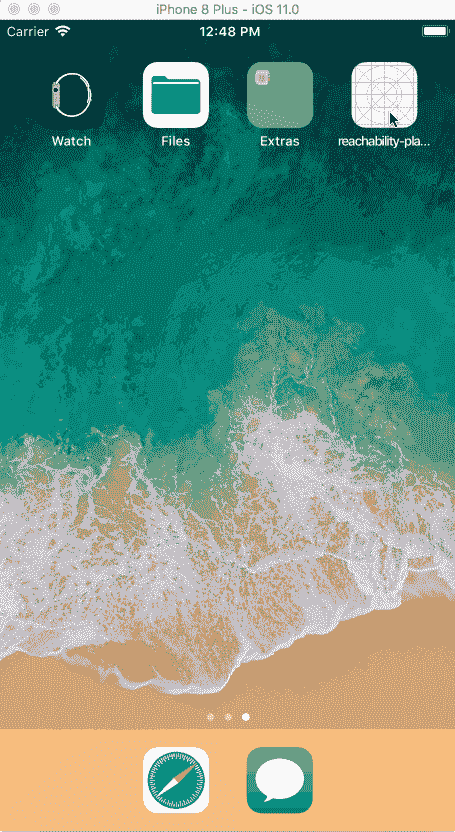
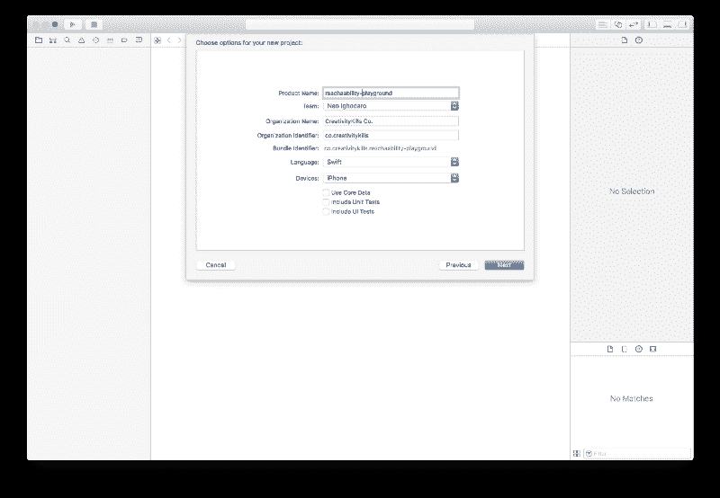
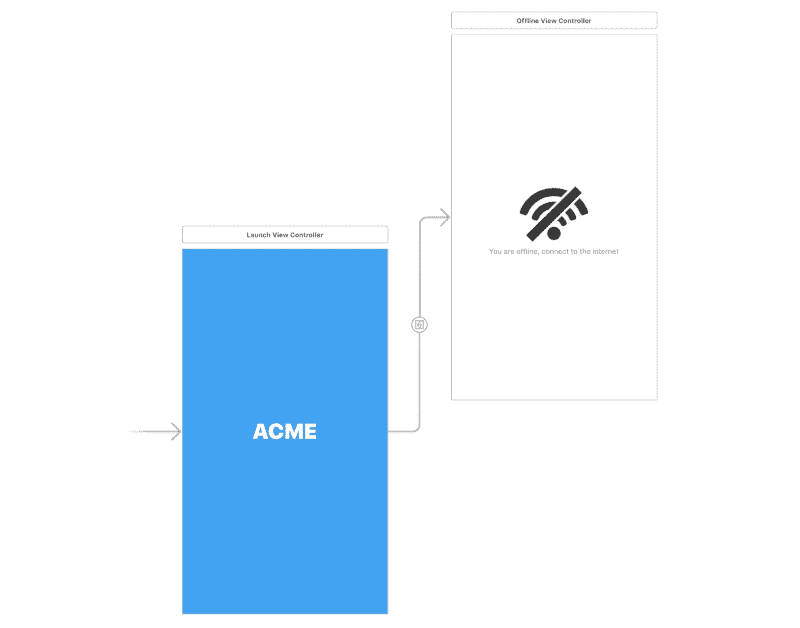
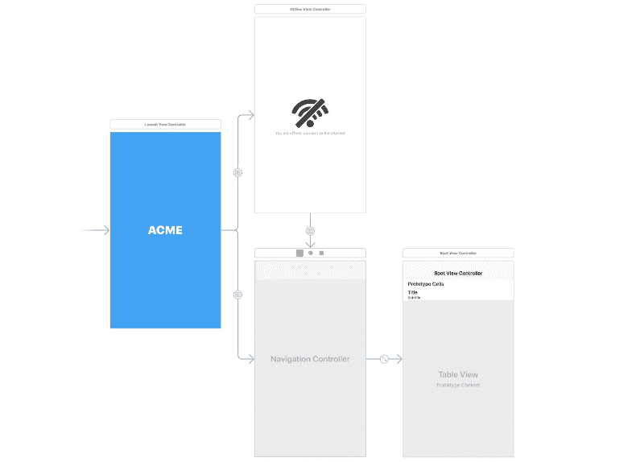

# 如何在 Swift 中处理互联网连接可达性

> 原文：<https://www.freecodecamp.org/news/how-to-handle-internet-connection-reachability-in-swift-34482301ea57/>

作者:尼奥·伊戈达罗

# 如何在 Swift 中处理互联网连接可达性


通常情况下，移动应用程序需要活跃的互联网连接才能正常工作。然而，失去互联网连接是正常的。在这种情况下，开发人员需要想出一些方法让用户可以忍受这种体验，或者至少通知用户。

在本文中，我们将了解如何在 Swift 中检测互联网连接问题，以及我们可以处理这些问题的一些方法。

下面是我们将要构建的示例应用程序，以及它如何处理不同的互联网连接场景:



### 要求

为了能够理解本文，您需要满足以下要求:

*   安装在您机器上的 Xcode 。
*   了解 Swift 编程语言。
*   安装在您机器上的 Cocoapods 。

当你有了以上要求，我们就一头扎进去吧。

### 设置我们的工作空间

在我们开始之前，我们将创建一个操场。这是我们将编写所有用例并处理它们的地方。

Swift 自带检测连接问题的可达性实现，但我们将使用第三方库。我们这样做是因为它比内置的更容易，API 更有表现力。

打开 Xcode 并设置一个新项目。



这个项目将是一个简单的游乐场，我们可以进行实验。

为了检测连接何时离线，我们将使用[**reachability . swift**](https://github.com/ashleymills/Reachability.swift)* * * *包。它是一个“用闭包来替代用 Swift 重写的苹果可达性”。

打开您的终端并运行以下命令:

```
$ pod init
```

这将创建一个新的`Podfile`，我们可以在其中声明 Cocoapods 依赖项。打开`Podfile`并用以下代码替换内容:

```
platform :ios, '9.0'
```

```
target 'project_name' do    use_frameworks!    pod 'ReachabilitySwift'    pod 'Alamofire'end
```

> ***你需要将*** *`**project_name**` **替换为你的项目名称。***

保存文件并运行以下命令，将 pod 安装到您的项目中:

```
$ pod install
```

安装完成后，打开项目根目录下的`*.xcworkspace`文件。这将启动 Xcode。

### 创建我们的网络可达性管理器

创建一个新的`NetworkManager`类。这个类将存储网络状态，并作为`Reachability`包的简单代理。在文件中，粘贴以下代码:

```
import Foundationimport Reachability
```

```
class NetworkManager: NSObject {
```

```
 var reachability: Reachability!
```

```
 static let sharedInstance: NetworkManager = {         return NetworkManager()     }()
```

```
 override init() {        super.init()
```

```
 // Initialise reachability        reachability = Reachability()!
```

```
 // Register an observer for the network status        NotificationCenter.default.addObserver(            self,            selector: #selector(networkStatusChanged(_:)),            name: .reachabilityChanged,            object: reachability        )
```

```
 do {            // Start the network status notifier            try reachability.startNotifier()        } catch {            print("Unable to start notifier")        }    }
```

```
 @objc func networkStatusChanged(_ notification: Notification) {        // Do something globally here!    }
```

```
 static func stopNotifier() -> Void {        do {            // Stop the network status notifier            try (NetworkManager.sharedInstance.reachability).startNotifier()        } catch {            print("Error stopping notifier")        }    }
```

```
 // Network is reachable    static func isReachable(completed: @escaping (NetworkManager) -> Void) {        if (NetworkManager.sharedInstance.reachability).connection != .none {            completed(NetworkManager.sharedInstance)        }    }
```

```
 // Network is unreachable    static func isUnreachable(completed: @escaping (NetworkManager) -> Void) {        if (NetworkManager.sharedInstance.reachability).connection == .none {            completed(NetworkManager.sharedInstance)        }    }
```

```
 // Network is reachable via WWAN/Cellular    static func isReachableViaWWAN(completed: @escaping (NetworkManager) -> Void) {        if (NetworkManager.sharedInstance.reachability).connection == .cellular {            completed(NetworkManager.sharedInstance)        }    }
```

```
 // Network is reachable via WiFi    static func isReachableViaWiFi(completed: @escaping (NetworkManager) -> Void) {        if (NetworkManager.sharedInstance.reachability).connection == .wifi {            completed(NetworkManager.sharedInstance)        }    }]
```

在上面的类中，我们已经定义了几个帮助函数，它们将帮助我们开始网络状态监控。我们有一个单独的`sharedInstance`，如果我们不想创建`NetworkManager`类的多个实例，我们可以调用它。

在`init`方法中，我们创建了一个`Reachability`的实例，然后我们使用`NotificationCenter`类注册了一个通知。现在，每次网络状态改变，就会调用`NotificationCenter`(也就是`networkStatusChanged`)指定的回调。我们可以用它来做一些全球性的事情，当网络不可达时，这些事情就会被激活。

我们已经定义了其他的助手函数，根据我们的网络连接状态，这些函数通常会使运行代码变得轻而易举。我们有`*isReachable*`、`*isUnreachable*`、`*isReachableViaWWAN*`和`*isReachableViaWiFi*`。

这些助手之一的用法通常如下所示:

```
NetworkManager.isReachable { networkManagerInstance in  print("Network is available")}
```

```
NetworkManager.isUnreachable { networkManagerInstance in  print("Network is Unavailable")}
```

> ***这不是一个事件监听器，只会运行一次。要使用监听器实时获取网络变化，您需要使用*** *`NetworkManager.sharedInstance.reachability.whenReachable` **。我们将在本文后面展示一个例子。***

现在我们有了一个管理器类，让我们看看如何在应用程序中使用它。

### 应用程序启动时处理网络可用性

有时，您的应用程序严重依赖于互联网连接，您需要在启动时检测状态。让我们看看如何使用`NetworkManager`类来处理这个问题。

创建一个名为`LaunchViewController`的新控制器。我们将把故事板上的第一个控制器视图视为启动控制器。我们将尝试检测用户的设备是否在线，如果不在线，我们将创建一个离线页面来处理这个问题，这样用户就根本无法进入应用程序。

在`LaunchController`中，用以下代码替换内容:

```
import UIKit
```

```
class LaunchViewController: UIViewController {    let network: NetworkManager = NetworkManager.sharedInstance
```

```
 override func viewDidLoad() {        super.viewDidLoad()
```

```
 NetworkManager.isUnreachable { _ in            self.showOfflinePage()        }    }
```

```
 private func showOfflinePage() -> Void {        DispatchQueue.main.async {            self.performSegue(                withIdentifier: "NetworkUnavailable",                 sender: self            )        }    }}
```

在这个类中，当网络不可用时，我们使用我们的`NetworkManager`的`*isUnreachable*`方法来触发`showOffline`方法。让我们创建视图控制器。创建一个名为`OfflineViewController`的新视图控制器。

打开`Main.storyboard`文件，将第一个视图的自定义类设置为`LaunchViewController`。

接下来，在故事板中创建一个新的视图控制器。将`OfflineViewController`设置为这个新视图控制器的定制类。现在在新的视图控制器和`LaunchViewController`之间创建一个名为`NetworkUnavailable`的手动序列。完成后，您应该看到类似于以下内容的内容:



现在让我们运行应用程序。但是请注意，在运行应用程序之前，您的开发机器应该离线，因为 iOS 模拟器使用机器的互联网连接。当您运行应用程序时，您应该会看到我们创建的脱机页面。

现在让我们创建一个视图控制器，它在有连接时显示。

### 设备联机时处理事件

现在我们已经创建了一个脱机视图控制器，它在设备脱机时也能工作，让我们来处理设备重新联机时会发生什么。

在离线视图控制器下面的故事板上创建一个新的导航视图控制器。我们将创建一个显示最新 Reddit 帖子的控制器。创建一个名为`PostsTableViewController`的新视图控制器类。现在将它作为附加到导航视图控制器的视图控制器的定制类。

现在创建一个名为`MainController`的手动序列，从导航视图控制器到启动视图控制器和离线视图控制器。您应该有类似的东西:



现在，打开`LaunchViewController`类，在`viewDidLoad`方法的底部添加以下内容:

```
NetworkManager.isReachable { _ in    self.showMainPage()}
```

然后将下面的方法添加到控制器中:

```
private func showMainPage() -> Void {    DispatchQueue.main.async {        self.performSegue(            withIdentifier: "MainController",             sender: self        )    }}
```

这将确保当应用程序启动时，它将检查连接，然后，如果连接可用，它将显示`PostsTableViewController`。否则会出现`OfflineViewController`。

太好了！但是，当用户点击了`OfflineViewController`然后网络恢复在线时会发生什么呢？让我们来处理这种情况。

打开`OfflineViewController`并用以下代码替换代码:

```
import UIKit 
```

```
class OfflineViewController: UIViewController {    let network = NetworkManager.sharedInstance
```

```
 override func viewDidLoad() {        super.viewDidLoad()
```

```
 // If the network is reachable show the main controller        network.reachability.whenReachable = { _ in            self.showMainController()        }    }
```

```
 override func viewWillAppear(_ animated: Bool) {        super.viewWillAppear(animated)
```

```
 navigationController?.setNavigationBarHidden(true, animated: animated)    }
```

```
 override func viewWillDisappear(_ animated: Bool) {        super.viewWillDisappear(animated)
```

```
 navigationController?.setNavigationBarHidden(false, animated: animated)    }
```

```
 private func showMainController() -> Void {        DispatchQueue.main.async {            self.performSegue(withIdentifier: "MainController", sender: self)        }    }}
```

在上面的控制器中，你可以看到，在`viewDidLoad`方法中，我们设置了`whenReachable`完成来显示主控制器。这意味着，只要它离线，你就可以观察设备何时恢复在线。当它出现时，呈现出`PostsTableViewController`。

我们还覆盖了`viewWillAppear`和`viewWillDisappear`方法，以确保导航栏不会显示在离线视图控制器上。

#### **从 Swift 中的 Reddit API 获取帖子**

现在让我们添加从 Reddit 获取数据并显示在我们的`PostsTableViewController`上的逻辑。打开文件，用下面的代码替换内容:

```
import UIKitimport Alamofire
```

```
struct RedditPost {    let title: String!    let subreddit: String!}
```

```
class PostsTableViewController: UITableViewController {    var posts = [RedditPost]()
```

```
 let network = NetworkManager.sharedInstance
```

```
 override func viewDidLoad() {        super.viewDidLoad()        navigationItem.title = "Latest Posts"
```

```
 // Fetch the posts and then reload the table        fetchPosts { posts in            self.posts = posts            self.tableView.reloadData()        }    }
```

```
 private func fetchPosts(completion: @escaping (_ posts: [RedditPost]) -> Void) -> Void {        // Send a request to the Reddit API        Alamofire.request("https://api.reddit.com").validate().responseJSON { response in            switch response.result {            case .success(let JSON):                let data = JSON as! [String:AnyObject]                guard let children = data["data"]!["children"] as? [AnyObject] else { return }                var posts = [RedditPost]()
```

```
 // Loop through the Reddit posts and then assign a post to the posts array                for child in 0...children.count-1 {                    let post = children[child]["data"] as! [String: AnyObject]
```

```
 posts.append(RedditPost(                        title: post["title"] as! String,                        subreddit: "/r/" + (post["subreddit"] as! String)                    ))                }
```

```
 DispatchQueue.main.async {                    completion(posts)                }            case .failure(let error):                print(error)            }        }    }
```

```
 override func didReceiveMemoryWarning() {        super.didReceiveMemoryWarning()    }
```

```
 // MARK: - Table view data source    override func numberOfSections(in tableView: UITableView) -> Int {        return 1    }
```

```
 // Return the number of posts available    override func tableView(_ tableView: UITableView, numberOfRowsInSection section: Int) -> Int {        return self.posts.count    }
```

```
 override func tableView(_ tableView: UITableView, cellForRowAt indexPath: IndexPath) -> UITableViewCell {        let cell = tableView.dequeueReusableCell(withIdentifier: "PostCell", for: indexPath)        let post = posts[indexPath.row] as RedditPost        cell.textLabel?.text = post.title        cell.detailTextLabel?.text = post.subreddit        return cell    }}
```

在`fetchPosts`方法中，我们使用`Alamofire`向 Reddit API 发送 GET 请求。然后我们解析响应，并将其添加到我们在文件顶部创建的`RedditPost`结构中。这使得我们传递给`tableView`的数据是一致的。

### 设备离线时处理事件

现在，让我们处理另一个场景。想象一下，在查看最新的 Reddit 帖子时，您失去了连接。会发生什么？发生这种情况时，让我们再次显示离线页面。

如前所述，从`PostsTableViewController`到`OfflineViewController`创建一个名为`NetworkUnavailable`的手动序列。现在将这段代码添加到`viewDidLoad`方法的底部:

```
network.reachability.whenUnreachable = { reachability in    self.showOfflinePage()}
```

现在将下面的方法添加到控制器中:

```
private func showOfflinePage() -> Void {    DispatchQueue.main.async {        self.performSegue(withIdentifier: "NetworkUnavailable", sender: self)    }}
```

这将监听设备何时离线，如果发生，它将`showOfflinePage`。

仅此而已！我们已经能够使用 Swift 中的 NetworkManager 处理离线和在线事件。

### 结论

在本文中，我们考虑了如何确保您的应用程序能够处理发生的在线和离线事件。您可以随时按照自己的意愿实现这一点。如果你有任何问题或反馈，请在下面的评论中留下。

这个游乐场的源代码可以在 GitHub 上找到。

本文首发于[推手](https://blog.pusher.com/handling-internet-connection-reachability-swift/)。