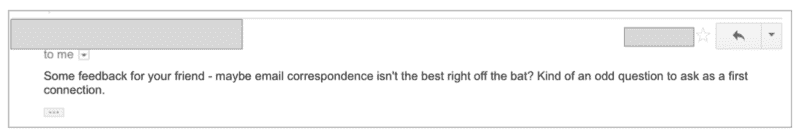
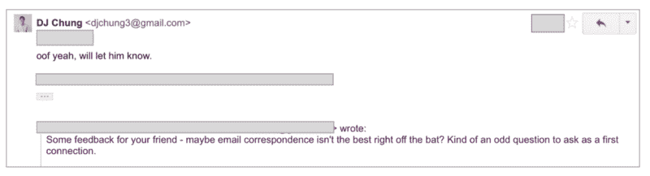

# 如何优雅有效地处理介绍邮件

> 原文：<https://www.freecodecamp.org/news/how-to-handle-intro-emails-gracefully-and-effectively-da0fba3b9eaf/>

DJ 钟

# 如何优雅有效地处理介绍邮件

#### 当你请求帮助时，你不想听起来不领情…

让我告诉你激发这篇文章的故事。我发了一封电子邮件介绍我的朋友拉里和大卫。拉里很想被推荐到大卫公司的一个职位。我的介绍邮件是这样的，

> 嘿大卫，

> 正如我提到的，拉里对[公司]的一个职位感兴趣。

> 拉里，

> 大卫是一个已经在[公司]工作两年的好朋友。他会是回答你问题的最佳人选。我会让你接手的！

几个小时后，我收到了大卫的回复:

呃。这是我最不想听到的话。拉里对介绍的后续回复给大卫留下了不好的印象。

大卫愿意推荐拉里，但这可能不是一个强有力的支持。不用说，拉里的申请当场就被拒绝了，即使有推荐。

这种情况让我很犹豫以后要不要把拉里介绍给我的任何一个熟人，而大卫可能更害怕被介绍给我的熟人。

我把这个反馈给了拉里，当然拉里并不想表现得忘恩负义。当向素未谋面的人寻求推荐时，他只是不知道展示自己的最佳方式。

### 回复介绍邮件的 3 个原则

作为基线，请记住，如果你的朋友把你介绍给他们的一个联系人，在某种程度上他们是在为你担保。不要认为这是理所当然的。

### 1.第一个回复

如果你是要请求帮助的人，例如，一个推荐人，第一个回复介绍邮件。你不必在几分钟内回复，但当你第一次看到邮件时，就去回复吧。

不要等着对方主动联系你。很有可能，你不回复，他们也不会回复。另外，如果你对介绍的内容反应迅速，会显示出你的热情。如果几天过去了，你还没有回复这个介绍，这似乎表明你不太感兴趣，或者这个介绍并不重要。

当然，有些情况下你不能很快回复，但是如果你要求介绍，一定要跟进——越快越好。

### 2.当你要求什么的时候，给他们一个出口

一般来说，如果你被介绍给某人，你会向他们要一些东西。确保你提出一个[非常具体的问题](http://hackcareer.com/tips-to-make-it-easy-for-others-to-help-you-in-your-job-search/)，同时也给他们一个机会。给他们一个更容易或更省时的方法来帮助你。

例如，一个常见的要求是“喝着咖啡见面 30 分钟，了解更多关于‘X 公司’的情况。”

这是一个完全合理的要求，但是要明白，虽然 30 分钟不是很长时间，但有往返于咖啡店的时间，有一天中的上下文切换，并且可能会有一些犹豫，以满足你从未见过的陌生人。

如果你的主要要求是面谈，给他们一个通过电话联系的选择，这不是一个承诺:

> 你愿意边喝咖啡边和我见面 30 分钟吗？这样我可以更多地了解 X 公司。如果咖啡不起作用，很乐意安排时间通过电话联系。不管怎样，如果你想喝杯咖啡或者打个电话，我可以派人过去几次，找一个对我们双方都最合适的时间。

这是一种非常体贴的请求别人时间的方式。请注意，我不仅给出了一个额外的、较小的承诺请求，而且，我首先会询问他们是否愿意联系。然后我接着说，如果他们同意的话，我会承担日程安排的责任。我在努力让他们尽可能容易地帮助我。

作为一个经验法则，当提供一个选项时，建议一个在承诺方面比你的主要要求低一级的选项。因此，如果你要求面对面的会面，给他们一个打电话的选择。如果你要求打电话，给他们一个选项，让你“通过电子邮件发送一些具体的问题”。

### 3.表明你已经做了一些研究

包括一句关于你为什么对你询问的公司感到兴奋的话。也许是最近的产品发布会，或者是商业合作。浏览公司的博客或搜索最近的新闻文章。你可以这样说，

> 我看到[X 公司]刚刚推出了一个新的[插入功能]。这非常令人兴奋，我认为它有很大的潜力来获得牵引力。

尽管这句话很笼统，但它至少证明了你已经做了一些调查，了解了公司目前的情况。

把所有这些放在一起，这里有一个模板，当你想联系时，你可以用它来回复一封介绍邮件，以寻求推荐或关于一家公司的更多信息。

> 嘿[姓名]，

> 很高兴见到你！谢谢你主动联系我。看起来[公司]最近做了很多事情-我注意到你们都刚刚推出了新产品/合作伙伴关系[插入任何公司新闻]。我希望听到更多关于这方面的信息，以及(公司)今年打算采取的任何其他重大举措。

> 这些时间你有空打个电话吗？[插入可用性]

> 如果电话不通，很乐意通过电子邮件发送几个问题。

> 谢谢大家！

> –[您的姓名]

### 记住，你的朋友为你担保！

请记住，你的朋友和他们的关系都是在帮你的忙。当你回复一封介绍邮件时，用感激和兴奋的语气。亲切和热情大有帮助，尤其是当你有所要求的时候！

#### 你的求职被卡住了吗？想知道如何突破并在技术领域找到一份工作吗？

点击此处获得获得你想要的工作的一步一步的策略，并查看我在 Dropbox 获得工作的确切简历。

*最初发表于[hackcareer.com](http://hackcareer.com/)*