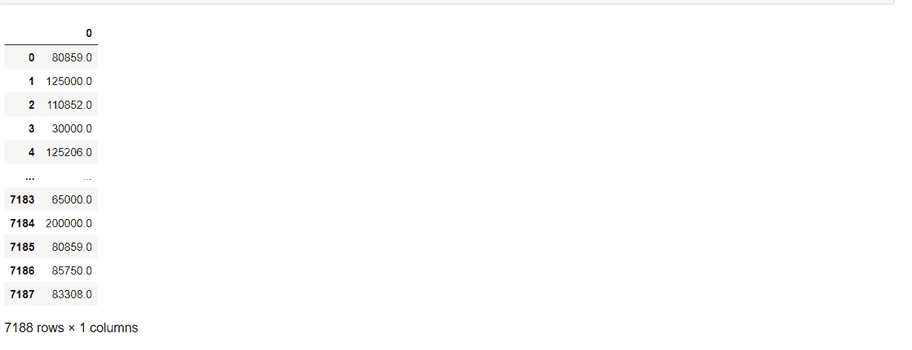
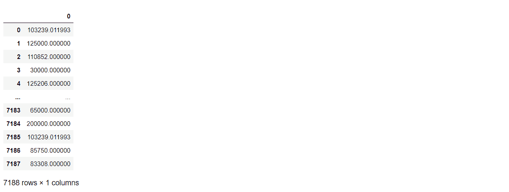

# 如何处理数据集中的缺失数据

> 原文：<https://www.freecodecamp.org/news/how-to-handle-missing-data-in-a-dataset/>

在处理真实世界的数据集时，缺少值是很常见的——例如，Kaggle 上没有干净的值。

缺失数据可能是由人为因素(例如，有人故意不回答调查问题)、电子传感器问题或其他因素造成的。当这种情况发生时，您可能会丢失重要信息。

现在，没有完美的方法来处理丢失的值，从而给出准确的结果，即丢失的值是什么。但是有几个技巧你可以利用，给你体面的表现。

在本文中，我们将研究如何以正确的方式处理缺失数据(正确的方式意味着为我们的数据集可能代表的任何场景选择适当的技术)。

请记住，这些方法没有一个是完美的——它们仍然会引入一些偏见，比如偏袒某一类人，但它们是有用的。

在我们开始之前，我想引用乔治·博克斯的话来支持前面的陈述:

> 所有的模型都是近似值:本质上所有的模型都是错误的，但有些是有用的。

现在事不宜迟，让我们开始吧。

## 有哪些类型的缺失数据？

您可能想知道缺失值是否有类型。是的，的确如此——在现实世界中，这些缺失的价值观可以分为三类。

了解这些类别将使您对如何处理数据集中缺失的值有所了解。

这些类别包括:

*   完全随机失踪(MCAR)。
*   随机失踪(MAR)。
*   不是随意失踪(NMAR)。

### 完全随机丢失的丢失数据(MCAR)

这些是完全随机缺失的数据。也就是说，缺失与数据无关。这种类型的数据丢失没有可辨别的模式。

这意味着您无法预测该值是否由于特定情况而丢失。他们完全是随机失踪的。

### 随机缺失的缺失数据(MAR)

这些类型的数据是随机缺失的，但不是完全缺失的。数据的缺失是由你看到的数据决定的。

举例来说，假设你制作了一款智能手表，可以每小时跟踪一次人们的心率。然后，您将手表分发给一组人佩戴，以便收集数据进行分析。

收集完数据后，您发现有些数据丢失了，这是因为有些人不愿意在晚上戴手表。因此，我们可以得出结论，这种缺失是由观测数据引起的。

### 不是随机丢失的丢失数据(NMAR)

这些数据不是随机丢失的，也称为可忽略数据。换句话说，缺失数据的缺失由感兴趣的变量决定。

一个常见的例子是一项调查，学生被问及他们拥有多少辆汽车。在这种情况下，一些学生可能会故意不完成调查，从而导致缺失值。

## 你应该如何处理丢失的数据？

正如我们刚刚了解到的，这些技术在确定缺失值时不可能如此精确。他们似乎有一些偏见。

处理缺失值通常分为两类。我们将看看每个类别中最常见的。这两个类别如下:

*   删除
*   归罪

## **如何通过删除处理缺失数据**

处理缺失数据最流行的方法之一是删除。删除方法中最常用的方法之一是使用列表删除方法。

### 什么是列表式删除？

在列表式删除方法中，如果数据集中的记录或观察值包含一些缺失值，则删除该记录或观察值。

您可以对上述任何缺失值类别执行列表式删除，但是它的一个缺点是潜在的信息丢失。

何时执行列表式删除的一般经验法则是，有缺失值的观察值的数量超过没有缺失值的观察值的数量。这是因为数据集没有足够的信息来填充丢失的值，所以最好删除这些值或完全丢弃数据集。

您可以简单地使用 Pandas `.dropna`方法在 Python 中实现列表式删除，如下所示:

```
df.dropna(axis=1, inplace=True) 
```

## **如何用插补处理缺失数据？**

另一种处理缺失数据的常用方法是用替代值填充缺失值。

这种方法包含各种方法，但是我们在这里将集中讨论最流行的方法。

### 理想数的先验知识

这种方法需要用特定的值替换丢失的值。要使用它，您需要拥有数据集的领域知识。您使用它来填充 MAR 和 MCAR 值。

要在 Python 中实现它，可以像这样在 Pandas 中使用`.fillna`方法:

```
df.fillna(inplace=True) 
```

### 回归插补

回归插补方法包括创建一个模型，根据一个变量预测另一个变量的观察值。然后，您使用模型来填充该变量的缺失值。

当数据集中的要素相互依赖时，可将此方法用于 MAR 和 MCAR 类别。例如使用线性回归模型。

### 简单插补

这种方法包括利用出现缺失值的变量的数字汇总(即使用特征或变量的集中趋势汇总，如平均值、中值和众数)。

当您使用此策略来填充缺失值时，您需要评估变量的分布，以确定要应用哪个集中趋势汇总。

您可以在 MCAR 类别中使用此方法。并且使用 Scikit-learn 库中的`SimpleImputer`转换器在 Python 中实现它。

```
from sklearn.impute import SimpleImputer
#Specify the strategy to be the median class
fea_transformer = SimpleImputer(strategy="median")
values = fea_transformer.fit_transform(df[["Distance"]])
pd.DataFrame(values) 
```



### KNN 插补

KNN 插补是一种比简单插补方法更公平的方法。它的工作原理是用最接近它的邻居的平均值替换丢失的数据。

您可以对 MCAR 或马尔类别使用 KNN 插补。要在 Python 中实现它，你可以使用 ScikitLearn 中的 KNN 插补转换器，如下所示:

```
from sklearn.impute import KNNImputer
# I specify the nearest neighbor to be 3 
fea_transformer = KNNImputer(n_neighbors=3)
values = fea_transformer.fit_transform(df[["Distance"]])
pd.DataFrame(values) 
```



### 如何使用学习算法

我们将在本帖中提到的最后一个策略是使用机器学习算法来处理缺失数据。

一些学习算法允许我们用缺失值来拟合数据集。然后，数据集算法在数据集中搜索模式，并使用它们来填充缺失的值。这类算法包括 XGboost、梯度增强等。但是进一步的讨论超出了本文的范围。

## 结论和了解更多信息

在本文中，我们介绍了一些日常处理缺失数据最常用的技术。

但是学习并没有就此结束。还有其他几种技术可以帮助我们填充数据集，但关键是要掌握这些技术中的底层机制，以便我们可以正确地管理缺失值。感谢阅读。