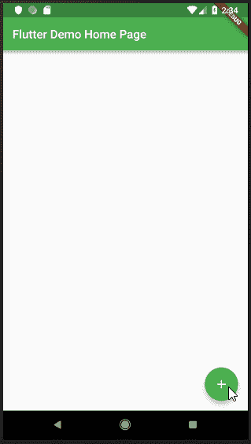
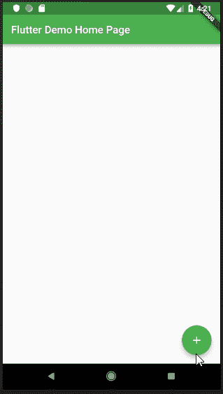

# 如何在你的 Flutter 应用中处理导航

> 原文：<https://www.freecodecamp.org/news/how-to-handle-navigation-in-your-flutter-apps-ceaf2f411dcd/>

Flutter 是 Google 的一款产品，用于构建混合移动应用，以 Dart 为编码语言。

Flutter 中的应用页面是一个小部件，是对 UI 的描述。要制作一个合法的应用程序，你需要许多这样的页面，显示大量的功能。在你创建了一个新的页面之后，一切都好了。但是，你如何在它们之间移动呢？

非常简单:您使用内置在 Flutter SDK 中的 [Navigator](https://docs.flutter.io/flutter/widgets/Navigator-class.html) 类。

### 航海家

Navigator 是另一个以类似堆栈的格式管理应用程序页面的小部件。在导航器中使用时，全屏页面称为路线。导航器像普通的堆栈实现一样工作。它有两个众所周知的方法，`push` 和`pop`。

1.  push:push 方法用于将另一条路由添加到当前堆栈的顶部。新页面显示在前一个页面之上。
2.  Pop:由于导航器像堆栈一样工作，它使用后进先出(LIFO)原则。pop 方法从堆栈中移除最顶层的路由。这将向用户显示上一页。

在这篇文章中，我将展示:

1.  两种导航方式和
2.  将数据传递到下一页。

### 正常导航。

有两种方法可以做到这一点:

#### 在`push` 方法中创建新页面

在这个方法中，使用`MaterialPageRoute`类创建一个新的路由。其中会创建一个新页面(小部件)。这两个创建语句包含在`push`方法中，并将该页面添加到堆栈的顶部。

为了展示一个简单的例子，我使用了以前的回购和[博客文章](https://medium.freecodecamp.org/https-medium-com-rahman-sameeha-whats-flutter-an-intro-to-dart-6fc42ba7c4a3)中的代码。我对它进行了编辑，在`CustomCard`组件上添加了一个按钮。该按钮使用`push`方法，同时在其中创建新的路线和页面。

```
Widget build(BuildContext context) {  
	return Card(    
    	child: Column(      
        	children: <Widget>[        
            	Text('Card $index'),        
                FlatButton(          
                	child: Text("Press Me"),          
                    onPressed: () {            
                    	Navigator.push(context, MaterialPageRoute<void>(
                        	builder: (BuildContext context) {                
                            	return Scaffold(                  
                                	appBar: AppBar(title: Text('My Page')),
                                    body: Center(                    
                                    	child: FlatButton(
                                        	child: Text('POP'),
                                           	onPressed: () {
                                            	Navigator.pop(context);
                                            },                    
                                        ),                  
                                    ),                
                                );              
                            },            
                        ));          
                    }),    
            ],  
        ));
}
```


#### 向应用程序的入口点添加路线

回想起来，应用程序有很多页面，而且通常有复杂的编码。不断创建新页面并不容易。如果从许多不同的区域访问页面，这一点尤其正确。您可能会忘记每条相同路线的代码。

因此，在第二种方法中，页面被创建一次，但是作为路线被添加到应用程序的入口点`main.dart`。这些路径被命名为文件路径，因为应用程序的根页面是路径`/`。

你首先建立一个新的应用程序页面，就像这样:

```
class SecondPage extends StatelessWidget {
	@override
	Widget build(BuildContext context) {
		return Scaffold(
			appBar: AppBar(
				title: Text('Second Page'),
			),
			body: Center(
				child: RaisedButton(
					child: Text('Back To HomeScreen'),
					color: Theme.of(context).primaryColor,
					textColor: Colors.white,
					onPressed: () => Navigator.pop(context)),
			),
		);
	}
}
```

然后，在`main.dart`文件中导入新页面，并将其添加到 MaterialApp 构造函数内的路径列表中。

```
class MyApp extends StatelessWidget {
// This widget is the root of your application.
	@override
	Widget build(BuildContext context) {
		return MaterialApp(
			title: 'Flutter Demo',
			theme: ThemeData(
				primarySwatch: Colors.green,
			),
			home: MyHomePage(title: 'Flutter Demo Home Page'),
			routes: <String, WidgetBuilder>{
				'/a': (BuildContext context) => SecondPage(),
			});
	}
}
```

然后我们将`CustomCard`中的`FlatButton`的 onPressed 方法编辑为:

```
Navigator.pushNamed(context, '/a');
```



在上面的例子中，用户被重定向到创建的`SecondPage`类，因为它是路径`/a.`的对应页面

### 在页面之间传递数据

现在是演示的最后一部分，将数据传递到下一页。以一种简单的方式做到这一点需要混合上述两种导航方法。

`pushNamed`和在 push 方法中创建新的路由都可以用来将数据传递给新页面。对于后者，不需要另起一页。`MaterialPageRoute`的构建器参数现在将调用`SecondPage`类的构造器。

更新`SecondPage`类以接受传递给它的数据，如下所示:

```
class SecondPage extends StatelessWidget {
	SecondPage({@required this.title});
	final title;

	@override
	Widget build(BuildContext context) {
		return Scaffold(
			appBar: AppBar(
				title: Text('Card No. $title'),
			),
			body: Center(...),
		);
	}
}
```

压缩方法上的`FlatButtons`现在被编辑为:

```
Navigator.push(context,
	MaterialPageRoute(
		builder: (context) => SecondPage(title: index)
	)
);
```

或者这个:

```
Navigator.pushNamed( context, '/a',
	arguments: <String, String>{
		'title': index + "",
	},
);
```

卡片的索引现在被传递给`SecondPage`类，并显示在`AppBar`中。



感谢阅读！这里可以找到回购、[。](https://github.com/samsam-026/flutter-example)

在这里找到对下面[变更的提交。](https://github.com/samsam-026/flutter-example/commit/166122bf68f3a17ed516f91cb9d9341571c3da50)