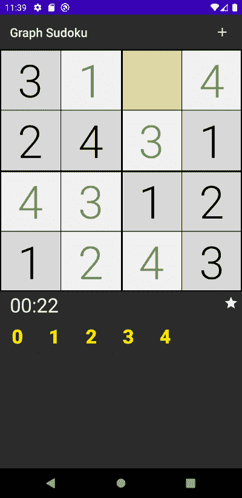
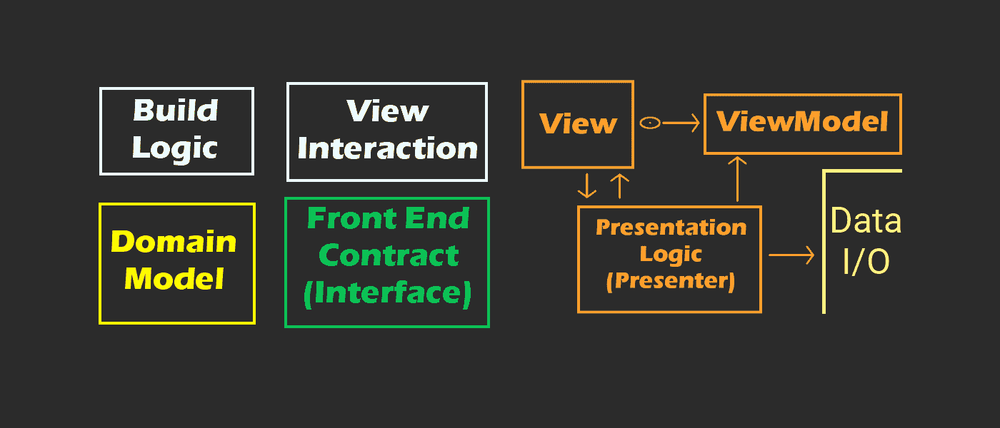

# 如何在 Jetpack Compose 中处理 UI 事件

> 原文：<https://www.freecodecamp.org/news/how-to-handle-ui-events-in-jetpack-compose/>

在这篇简短实用的文章中，我们将讨论如何在 Jetpack Compose 中处理 UI 事件。

在旧系统中，我们使用 OnClickListeners 和其他接口。在 Compose 中，我们可以充分利用 Kotlin 的**密封类**、**函数类型**和 **Lambda 表达式**。

如果你不知道什么是可组合的，可以考虑阅读这篇解释基础知识的文章。

[https://www.youtube.com/embed/LrNPw1LQHEw?feature=oembed](https://www.youtube.com/embed/LrNPw1LQHEw?feature=oembed)

This article is summarized in under 3 minutes in this video.

## 如何用密封类对 UI 事件建模

首先，我们必须了解 UI 事件的含义，以及如何用密封类对其建模。

我之前已经描述过 [Java 和 Kotlin](https://medium.com/swlh/simplify-your-ui-interactions-with-events-java-kotlin-any-language-5062c1b1e0e4) (使用旧的视图系统)的相同过程，所以我将保持简短。

### 该过程

对于用户界面的每个屏幕或子屏幕，问自己这样一个问题:用户可以用哪些不同的方式与之交互？

让我们从我的第一个完全内置在 compose 中的应用程序 [Graph Sudoku](https://play.google.com/store/apps/details?id=com.bracketcove.graphsudoku) 中举个例子:



Screenshot of a Sudoku Android App

我用来表示这个屏幕的 UI 交互的密封类如下所示:

```
sealed class ActiveGameEvent {
    data class OnInput(val input: Int) : ActiveGameEvent()
    data class OnTileFocused(val x: Int, 
    val y: Int) : ActiveGameEvent()
    object OnNewGameClicked : ActiveGameEvent()
    object OnStart : ActiveGameEvent()
    object OnStop : ActiveGameEvent()
}
```

简单解释一下:

*   OnInput 表示用户触摸输入按钮(如 0，1，2，3，4)
*   OnTileFocused 表示用户选择了一个图块(就像琥珀色突出显示的那个)
*   OnNewGameClicked 不言自明
*   OnStart 和 OnStop 是我的组件不关心的生命周期事件，但是它们在充当组件容器的活动中使用

一旦设置了密封类，现在就可以使用单个事件处理函数来处理各种各样的事件。有时拥有多个事件处理函数可能更有意义，所以请记住**这种方法必须适应您项目的特定需求**。

## 如何连接您的软件架构

你如何处理这些事件完全取决于你自己。有些人认为 MVVM 是软件架构的黄金标准，但是似乎越来越多的人意识到没有一个单一的架构适合所有的情况。

对于带有 Compose 的 Android，我目前的方法是使用非常第三方的极简方法，通常在每个功能(屏幕)中都有这些东西:

*   作为事件处理器的(表示)逻辑类
*   **一个 ViewModel，用于存储呈现视图所需的数据(顾名思义)**
*   **充当容器的活动(不是上帝的对象)**
*   **构成视图的组件**

**

Model-View-Whatever** 

**我不在乎你用什么，只要你应用[关注点分离](https://youtu.be/B_C41SF0KbI)。这就是我如何得到这个架构的，通过简单地问什么应该和不应该放在同一个类中。**

**无论您希望您的 ViewModel、片段还是活动成为您的事件处理程序，它们都可以以相同的方式设置:**函数类型！****

**在您选择的类中，设置一个事件处理函数，该函数接受您的密封类作为其参数:**

```
`class ActiveGameLogic(
    private val container: ActiveGameContainer?,
    private val viewModel: ActiveGameViewModel,
    private val gameRepo: IGameRepository,
    private val statsRepo: IStatisticsRepository,
    dispatcher: DispatcherProvider
) : BaseLogic<ActiveGameEvent>(dispatcher),
    CoroutineScope {
    //...
    override fun onEvent(event: ActiveGameEvent) {
        when (event) {
            is ActiveGameEvent.OnInput -> onInput(
                event.input,
                viewModel.timerState
            )
            ActiveGameEvent.OnNewGameClicked -> onNewGameClicked()
            ActiveGameEvent.OnStart -> onStart()
            ActiveGameEvent.OnStop -> onStop()
            is ActiveGameEvent.OnTileFocused -> onTileFocused(event.x, event.y)
        }
    }
    //...
}`
```

**这种方法非常有条理，使得通过单一入口点测试第三方库免费类中的每个单元变得容易。**

**然而，我们还没有完成。自然，我们需要一种方法来获取对这个事件处理函数`onEvent`的引用，以引用我们的组件。我们可以使用一个**函数引用**来做到这一点:**

```
`class ActiveGameActivity : AppCompatActivity(), ActiveGameContainer {
    private lateinit var logic: ActiveGameLogic

    override fun onCreate(savedInstanceState: Bundle?) {
        super.onCreate(savedInstanceState)

        val viewModel = ActiveGameViewModel()

        setContent {
            ActiveGameScreen(
                onEventHandler = logic::onEvent,
                viewModel
            )
        }

        logic = buildActiveGameLogic(this, viewModel, applicationContext)
    }

  	//...
}`
```

**我确信你们中的一些人想知道为什么我要使用一个活动。你可以在某个时候在[直播 Q & A 问我一个详细的答案](https://youtu.be/-xV8k-4UW50)。**

**简而言之，按照我的架构方法，片段似乎对组合没有什么意义(我不使用 Jetpack 导航)，使用活动作为特定于功能的容器也没有什么错。**基本避免写神活动就行了。****

**具体来说，在 Kotlin 中引用一个函数的方法是提供**类/接口名**(或者**跳过这一点，如果它是一个顶级函数**)，后跟**两个冒号**，以及不带任何参数或括号的函数名**:****

```
`onEventHandler = logic::onEvent`
```

## **如何用 Jetpack Compose onClick 修饰符替换 onClickListener**

**准备好这些东西后，我们可以看看这在 composable 中是如何工作的。自然，您的根可组合组件将需要事件处理函数作为参数:**

```
`@Composable
fun ActiveGameScreen(
    onEventHandler: (ActiveGameEvent) -> Unit,
    viewModel: ActiveGameViewModel
) {
//...
}`
```

**正确获取函数类型语法可能有点棘手，但是要理解这个**实际上是对函数的引用，**与对类的引用没有太大区别。**

**正如你不应该建造上帝的物品，你也不应该建造巨大的组件:**

1.  **将你的 UI 分解成**个最小的合理部分****
2.  **将它们包装在一个可组合的函数中**
3.  **对于每个与 UI 交互相关联的可组合组件，**必须给它一个对事件处理函数**的引用**

**下面是一个表示 Sudoku 应用程序的输入按钮的 composable，它通过引用被赋予事件处理程序:**

```
`@Composable
fun SudokuInputButton(
    onEventHandler: (ActiveGameEvent) -> Unit,
    number: Int
) {
    Button(
        onClick = { onEventHandler.invoke(ActiveGameEvent.OnInput(number)) },
        modifier = Modifier
            .requiredSize(56.dp)
            .padding(2.dp)
    ) {
        Text(
            text = number.toString(),
            style = inputButton.copy(color = MaterialTheme.colors.onPrimary),
            modifier = Modifier.fillMaxSize()
        )
    }
}`
```

**为了将事件真正传递给逻辑类，我们必须使用`invoke` 函数，它将根据函数类型定义接受参数(在本例中接受一个`ActiveGameEvent` )。**

**至此，通过充分利用这种漂亮而现代的编程语言，您已经准备好在 Kotlin 中处理 UI 交互事件(无论是否合成)。**

**如果你喜欢这篇文章，请在社交媒体上分享，并考虑查看下面的资源，以支持独立的程序员和内容创作者。**

### **社会的**

**你可以在 [Instagram 这里](https://www.instagram.com/rkay301/)和 [Twitter 这里](https://twitter.com/wiseAss301)找到我。**

### **这里是我的一些教程和课程**

**[https://youtube.com/wiseass](https://www.youtube.com/channel/UCSwuCetC3YlO1Y7bqVW5GHg)https://www.freecodecamp.org/news/author/ryan-michael-kay/T2[https://skl.sh/35IdKsj](https://skl.sh/35IdKsj)(安卓工作室安卓入门)**