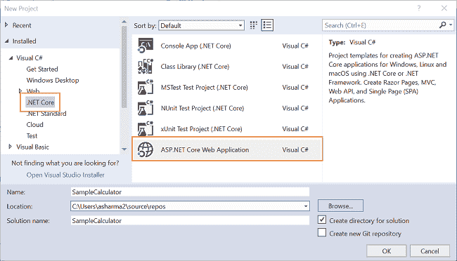
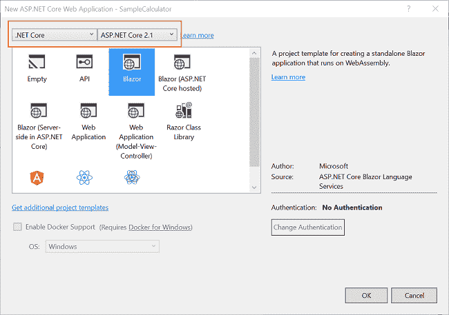
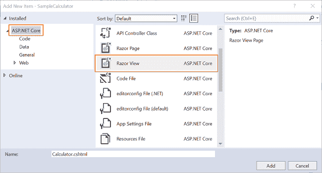
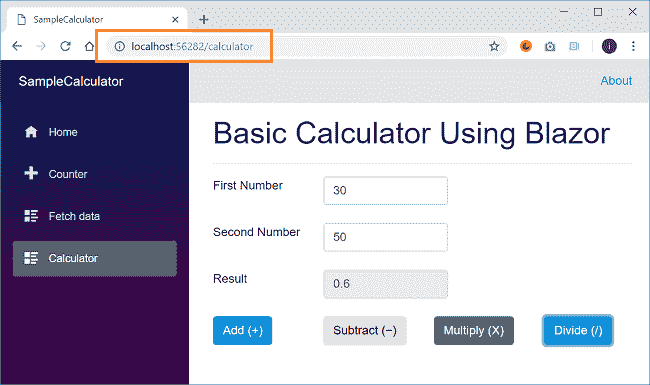
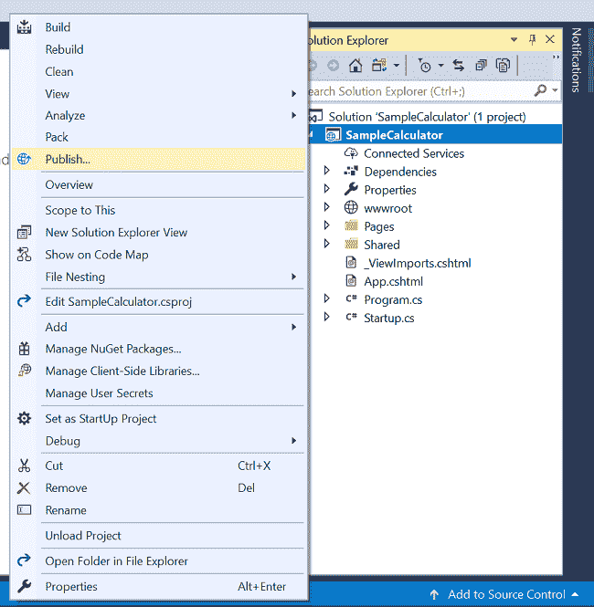
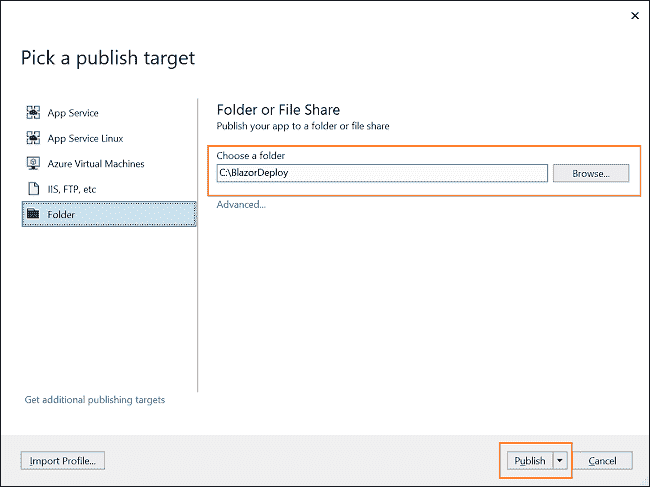
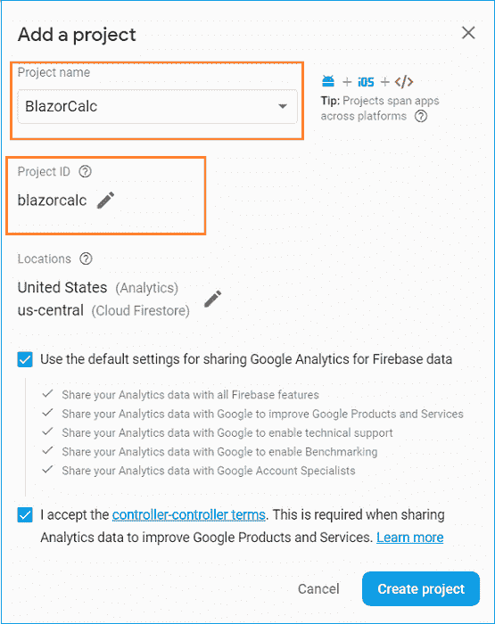
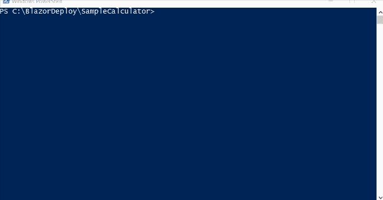
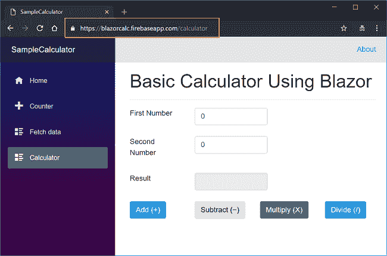

# 如何在 Firebase 上托管 Blazor 应用程序

> 原文：<https://www.freecodecamp.org/news/how-to-host-a-blazor-application-on-firebase-67c4ee956a22/>

### 介绍

在本文中，我们将学习如何在 Firebase 上部署 Blazor 应用程序。我们将使用 Blazor 创建一个基本的计算器应用程序，并将其托管在 Firebase 上。这个应用程序没有任何服务器端代码或 web API 逻辑。我们将使用 Visual Studio 2017 来构建和发布应用程序。我们将使用 CLI 在 Firebase 上部署应用程序。

### 先决条件

您需要安装以下先决条件来创建 Blazor 应用程序。

*   安装。NET Core 2.1 以上 SDK 从[这里](https://www.microsoft.com/net/learn/get-started-with-dotnet-tutorial#windowscmd)
*   从[这里](https://www.visualstudio.com/downloads/)安装最新版本的 Visual Studio 2017
*   从[这里](https://marketplace.visualstudio.com/items?itemName=aspnet.blazor)安装 ASP.NET 核心 Blazor 语言服务扩展

### 创建 Blazor 应用程序

我们将为这个演示创建一个基本的计算器应用程序。因为这是一个基本的计算器，它将接受两个操作数，并支持四个算术函数——加、减、乘和除。

打开 Visual Studio 并选择文件>>新建>>项目。选择项目后，将会打开一个“新项目”对话框。选择。NET Core 里面的 Visual C#菜单从左侧面板。可用项目类型的应用程序。输入 `project as Samp`电子计算器的名称，然后按 OK。



单击 OK 后，将打开一个新对话框，要求您选择项目模板。您可以在模板窗口的左上角看到两个下拉菜单。选择”。NET Core”和“ASP。NET Core 2.1 英寸。然后，选择“Blazor”模板并按下 OK。



这将创建您的 Blazor 应用程序。我们现在将创建我们的计算器组件。

### 创建计算器组件

对于这个应用程序，我们将使用单页面组件结构。逻辑和 UI 将在同一个文件中。

要创建我们的组件，右击`SampleCalculator/Pages`文件夹，然后选择添加> >新项目。将打开“添加新项”对话框，要求您从提供的项列表中选择所需的项模板。从左侧面板中选择 ASP.NET 核心，然后从模板面板中选择 Razor 视图。输入 fi 的名字`le as Calculator.` cshtml，点击 Add。

参考以下截图:



打开`Calculator.cshtml`文件，将以下代码放入其中:

```
@page "/calculator"<h1>Basic Calculator Using Blazor</h1><hr /><div>    <div class="row">        <div class="col-sm-3">            <label class="control-label">First Number</label>        </div>        <div class="col-sm-4">            <input class="form-control" type="text" placeholder="Enter First Number" bind="@operand1" />        </div>    </div>    <br />    <div class="row">        <div class="col-sm-3">            <label class="control-label">Second Number</label>        </div>        <div class="col-sm-4">            <input class="form-control" type="text" placeholder="Enter Second Number" bind="@operand2" />        </div>    </div>    <br />    <div class="row">        <div class="col-sm-3">            <label class="control-label">Result</label>        </div>        <div class="col-sm-4">            <input readonly class="form-control" bind="@finalResult" />        </div>    </div>    <br />    <div class="row">        <div class="col-md-3">            <button onclick="@AddNumbers" class="btn btn-primary">                Add                (+)            </button>        </div>        <div class="col-md-3">            <button onclick="@SubtractNumbers" class="btn btnwarning">Subtract (−)</button>        </div>        <div class="col-md-3">            <button onclick="@MultiplyNumbers" class="btn btn-success">Multiply (X)</button>        </div>        <div class="col-md-3">            <button onclick="@DivideNumbers" class="btn btn-info">Divide (/)</button>        </div>    </div></div>@functions {double operand1 { get; set; }double operand2 { get; set; }string finalResult { get; set; }void AddNumbers(){    finalResult = (operand1 + operand2).ToString();}void SubtractNumbers(){    finalResult = (operand1 - operand2).ToString();}void MultiplyNumbers(){    finalResult = (operand1 * operand2).ToString();}void DivideNumbers(){    if (operand2 != 0)    {        finalResult = (operand1 / operand2).ToString();    }    else    {        finalResult = "Cannot Divide by Zero";    }}}
```

在代码的 HTML 部分，我们定义了两个文本框来读取用户输入的操作数。我们有一个文本框来显示算术运算的结果。我们还定义了四个按钮，每个按钮对应一个算术运算。按钮的 onclick 事件将调用提供输出的方法。一旦它对两个操作数都执行了相应的操作。

在@functions 部分，我们定义了两个属性来绑定到用户输入值，并定义了另一个属性来显示计算结果。为了处理我们的算术运算，我们定义了四个方法，它们将对操作数执行所需的运算，并设置 finalResult 的值，该值将绑定到 UI 上的结果字段。

在`Shared/NavMenu.cshtml`文件中添加该组件的导航链接。按 F5 运行应用程序，您可以看到如下图所示的输出屏幕:



该应用程序仍处于开发环境中。在 Firebase 上托管它之前，我们需要发布它。

### 发布 Blazor 应用程序

右键单击项目，然后单击发布。请参考下图:



您将看到类似于下图的屏幕。从左侧菜单中选择文件夹，并提供文件夹路径。您可以提供想要发布应用程序的任何文件夹路径。



点击发布。Visual Studio 将开始发布您的应用程序。如果没有构建错误，那么您的应用程序将成功发布到您提到的文件夹中。

发布成功后，我们将继续在 Firebase 上托管这个应用程序。

### 在 Firebase 上添加项目

在 Firebase 上托管任何应用程序的第一步是在 Firebase 控制台上添加一个新项目。

导航到 https://console.firebase.google.com 的，用你的谷歌账户登录。点击`Add Project`链接。将会打开一个弹出窗口，如下图所示。提供您的项目名称并点击底部的`Create project`按钮。



请在此处记下项目 id。Firebase 项目 id 是全球唯一的。您可以在创建新项目时编辑您的项目 id。项目一旦创建，您就不能更改您的项目 id。我们将在下一节初始化应用程序时使用这个项目 id。

### 使用 Firebase 部署

打开发布 Blazor 应用程序的文件夹。这里您可以看到一个文件夹“SampleCalculator”和一个 web.config 文件。在“SampleCalculator”中，我们将有另一个名为“dist”的文件夹。我们将发布这个“dist”文件夹中的内容。

在“SampleCalculator”文件夹中打开命令提示符/PowerShell 窗口。现在遵循下面提到的步骤:

**步骤 1** :使用 Firebase 登录

执行以下命令:

```
firebase login
```

它将打开一个浏览器窗口，并要求您登录到 Firebase。使用您的 Google 帐户登录。成功登录后，导航回您的 CLI。

第二步:初始化你的应用程序

执行以下命令

```
firebase init
```

这个命令将初始化一个 firebase 项目。你会被问到一系列问题。如下所示回答它们:

*   你准备好继续了吗？—按 Y 键
*   您想为此文件夹设置哪些 Firebase CLI 功能？—选择托管
*   为此目录选择一个默认的 Firebase 项目:—如果您在上一节中添加的项目出现在列表中，请选择它，否则请选择“不要设置默认项目”。
*   您想将什么用作您的公共目录？—地区
*   配置为单页 app(将所有 URL 重写为/index.html)？— y
*   文件 dist/index.html 已经存在。覆盖？— N

你将得到一个“Firebase 初始化完成！”消息。

**第三步**:添加默认项目

如果您已经在步骤 2 中选择了默认项目，那么您可以跳过这一步。

如果您没有选择默认项目，那么您需要在这里手动添加它。运行以下命令:

```
firebase use --add yourProjectId
```

在这种情况下，它将是

```
firebase use --add blazorcalc
```

您将获得一条成功消息，显示为“现在正在使用项目 blazorcalc”。

**第四步**:在 Firebase 上部署

最后，运行以下命令在 Firebase 上部署您的应用程序。

```
firebase deploy
```

这个命令将在 Firebase 上部署您的 Blazor 应用程序，一旦成功，它会给您一个托管 URL。

上面提到的所有步骤都显示在下面的 GIF 中:



### 执行演示

打开托管 URL。您可以在浏览器中看到该应用程序，如下图所示:



### 文章扩展

我们可以按照相同的步骤在 Firebase 上托管一个角度应用程序。

运行以下命令为 prod 构建一个 Angular 应用程序。

```
ng build --prod
```

它将在应用程序的根文件夹中创建“dist”文件夹。一旦你得到了“dist”文件夹，按照上述相同的步骤。

### 结论

我们学习了如何使用 Blazor 创建一个示例计算器应用程序。我们还学习了如何将这个应用程序部署到 Firebase。

您可以在 [Github](https://github.com/AnkitSharma-007/ASPCore.BlazorDemo) 找到这个示例计算器应用程序的代码。

获取我的书 [Blazor 快速入门指南](https://amzn.to/2OToEji)以了解更多关于 Blazor 的信息。

准备面试？阅读我关于技术面试的 C#编码问题的文章

### 请参见

*   [Blazor Grid——Blazor 的可重用网格组件](https://ankitsharmablogs.com/blazorgrid-reusable-grid-component-for-blazor/)
*   [将 Blazor 组件发布到 Nuget Gallery](https://ankitsharmablogs.com/publishing-blazor-component-to-nuget-gallery/)
*   [在 IIS 上部署 Blazor 应用程序](https://ankitsharmablogs.com/deploying-a-blazor-application-on-iis/)
*   [在 Azure 上部署 Blazor 应用](https://ankitsharmablogs.com/deploying-a-blazor-application-on-azure/)
*   [使用 Blazor 和 MongoDB 进行 CRUD】](https://ankitsharmablogs.com/crud-using-blazor-with-mongodb/)
*   [使用服务器端 Blazor 的单页面应用](https://ankitsharmablogs.com/single-page-application-using-server-side-blazor/)

最初发表于[https://ankitsharmablogs.com/](https://ankitsharmablogs.com/)