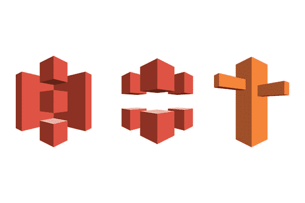
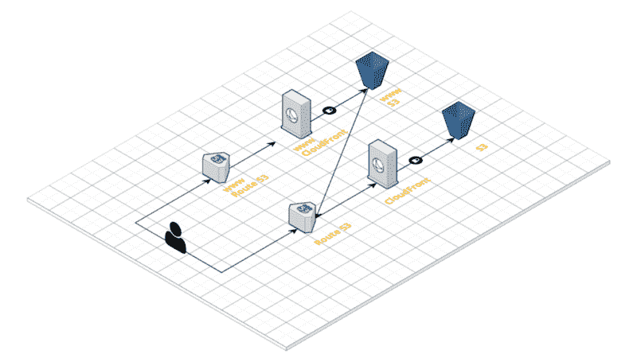
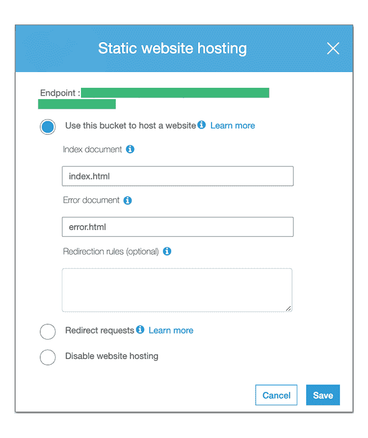
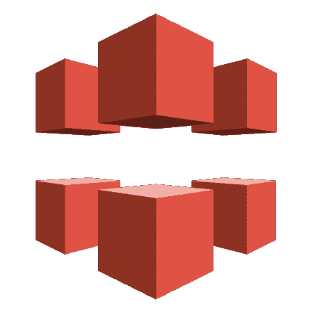
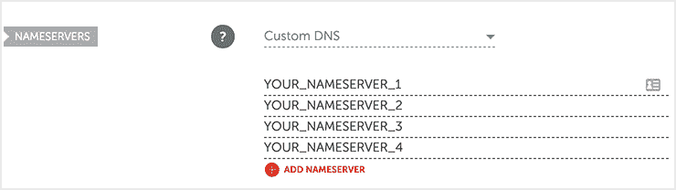
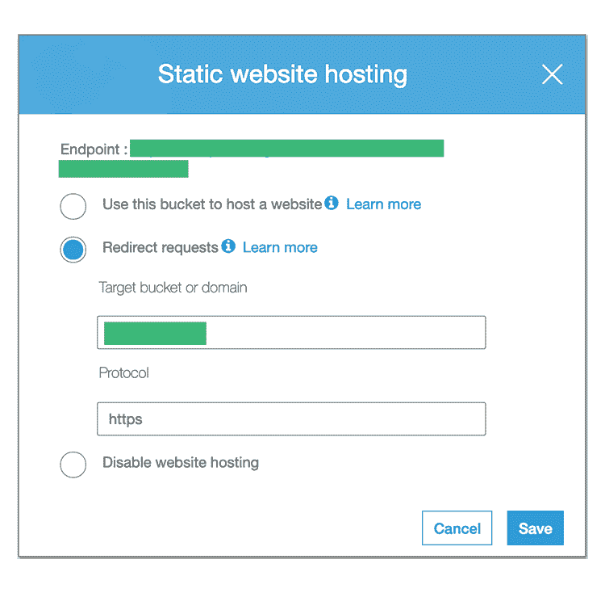

# 如何用 S3、CloudFront 和 Route53 托管一个静态网站

> 原文：<https://www.freecodecamp.org/news/how-to-host-a-static-website-with-s3-cloudfront-and-route53-7cbb11d4aeea/>

作者:保罗·贝格

# 如何用 S3、CloudFront 和 Route53 托管一个静态网站

我最近建立了自己的个人博客，我低估了我为使它完全符合我的要求所付出的努力。所以我决定写一个教程，帮助别人用更少的开销去做。

本文将详细介绍如何勾选下面的所有框，重点是后端组件。

1.  现收现付托管
2.  SSL 证书
3.  功能性 www 子域
4.  高度可定制但简约的设计
5.  降价商品

对于上面的 4 和 5，我使用了[雨果](https://gohugo.io/)和[最小](https://themes.gohugo.io/minimal/)主题。

#### 警告

请注意，这是一个冗长的教程，面向那些重视灵活性和与其他 AWS 服务的互操作性胜过一切的人。如果你只是想找一些又轻又快的东西，你可能会想用 [Netlify](https://netlify.com/) 或 [Amplify](https://aws-amplify.github.io/) 。

#### 先决条件

我将进一步假设:

1.  你设计和编码你的网站，或者至少有一个模型。
2.  你有一个 AWS 账户(如果没有，去[注册一个](https://portal.aws.amazon.com/billing/signup)。AWS 帐户包括一年的免费层访问)。
3.  你熟悉 DNS 和[它是如何工作的](https://www.cloudflare.com/learning/dns/what-is-dns/)，至少在高层次上是如此。

关于 DNS，一个简单的解释是，它是互联网的目录，就像谷歌拥有`google.com`一样，你也可以拥有自己的域名，比如`example.com`。要做到这一点，你必须去一个 DNS 注册商，购买你想要的域名。我强烈推荐使用 [Namecheap](https://namecheap.pxf.io/c/1243704/386170/5618) 作为你的注册商，因为他们有很棒的用户界面和很低的价格。或者，你可以选择 [GoDaddy](https://godaddy.com) 。

以防你的”。com”域名被占用，并且您想要一些巧妙的混搭，下面的网站会很有帮助:

*   [LeanDomainSearch](https://leandomainsearch.com/)
*   [Wordoid](https://wordoid.com/)
*   [域名](https://domainr.com/)

购买后，不要设置任何 DNS 记录。我们到了 53 号公路后再做。

#### 使用亚马逊 AWS 托管

如上所述，我们的目标是使用现收现付服务，因为这是目前为止最划算的选择。我曾经每月为一台服务器支付几十美元的固定费用，即使我有段时间几乎没有任何活动。

然而，从我的经验来看，我会建议您采用模块化，并使用像 AWS 这样的现收现付服务。

在开始之前，掌握术语很重要:

*   AWS:亚马逊网络服务
*   S3:简单的存储服务，用于存储文件
*   Route53:处理 DNS 记录的服务
*   CloudFront:内容交付网络(CDN ),用于加速您的网站，也需要生成 SSL 证书

这里有一个简洁的[思维导图](https://cloudcraft.co/view/d2391653-9c67-4bcd-84f2-977b0e32ecfc?key=aoBnq-ksfVXmgA4yjWIWSQ)，是用 [Cloudcraft](https://cloudcraft.co/) 为你将要构建的东西设计的:

我们将首先关注右侧**的路径**，因此是普通配置(使用 Route53、CloudFront 和 S3)，而不是 www 子域的配置。重要的是，使用这种模块化配置，您根本不会运行任何后端 Linux 服务器，因此您不必担心更新或修补任何东西。多方便啊？

#### 亚马逊简易仓储服务(S3)

这是您存储静态文件(HTML、CSS、JavaScript)的地方。如果您使用 Create React App 或其他前端开发框架，请查找您生成的“build”或“public”文件夹。

你要做的是:

1.  设置一个名为“example.com”的 S3 存储桶。请注意，S3 域名是全球的 T2，就像域名一样，如果有人在你之前取了 T0，你必须找到另一个名字。根据您的需要，您可以启用或禁用 AWS 为您提供的选项:版本控制、服务器访问日志、加密等。
2.  确保取消选中提及阻止和删除公共访问 ACL 和策略的复选框。很多时候，S3 存储桶用于存储私有数据，因此 AWS 优化了高度安全的配置。但是，在您的情况下，您希望可以公开访问这个存储桶。
3.  确保设置一个策略，这里有一个[例子](https://gist.github.com/PaulRBerg/61e0c998f105fedb627fa66ff2c6aea6)。
4.  为您的存储桶激活“静态网站托管”并选中“使用此存储桶托管网站”
5.  上传你的文件，确保“index.html”在你的 bucket 的根目录下

以上所有操作均可使用 [AWS 管理 Web 控制台](http://console.aws.amazon.com/)或 [AWS CLI](https://github.com/aws/aws-cli) 完成。具体到第 4 步，我建议在控制台中完成，这样您就可以获得新托管网站的端点(出于隐私原因，我隐藏了我的端点):

在浏览器中进行测试，以确保您正确设置了 S3 存储桶。应该是这样的:

> example.com.s3-website.your-region.amazonaws.com

#### 云锋

要托管一个静态网站，你实际上不需要 CloudFront 或任何其他 CDN，因为没有太多的数据要存储，效率和 UX 的收益也很小。然而，最初的目标之一是拥有一个受 SSL 证书保护的网站，所以我们将使用 CloudFront。

现在，您可能听说过 CloudFlare，它可以说是启动和运行 CDN 的最简单的方法，并且它还提供了一些 SSL 安全性的好处。我说“一些”,是因为他们有一个被称为“灵活 SSL”的误导性特性，这个特性[没有自签名 SSL 证书所具有的安全保证](http://disq.us/p/1ycwtny)。

因此，您不打算使用它，而是使用 AWS 中一个类似的服务 CloudFront。您可以将其视为拥有自己的内容分发服务器，因为数据被缓存在世界各地的多个位置，以便为您的用户提供快速响应时间。对静态网站来说更重要的是，它还使得使用 SSL 证书成为可能。

同样，您可以使用 AWS 管理员界面或 CLI 工具创建您的 CloudFront 发行版。这里有一个[配置](https://gist.github.com/PaulRBerg/7d946e54c8f5cfc22f514855c6b6e864)的例子。

警告:

1.  源名称应该是您在 S3 桶上激活“静态网站托管”后获得的端点。
2.  不要设置任何“DefaultRootObject”。让它空着。
3.  允许 HTTP 和 HTTPS。在签署并安装证书后，您将能够自动将用户从 HTTP 重定向到 HTTPS。

确保等待一段时间，让发行版正常启动(可能需要 15 分钟)。通过打开您收到的端点来测试它，您的 S3 静态网站应该会弹出。端点应该如下所示:

> *13fb4knzujxq0b.cloudfront.net*

记下您的 CloudFront 端点，因为我们将在 Route53 中使用它。

### 53 号公路

是时候将你在 DNS 注册商处购买的域名与 CloudFront 和 S3 连接起来了。53 号公路充当了这个桥梁。

下面是您必须要做的事情:配置 Route53 并将域与 CloudFront 连接起来:

1.  创建 Route53 托管区域并设置您的域。公之于众。
2.  会给你 4 NS 的记录。在外部域管理页面中复制并粘贴名称服务器。如果你正在使用 [Namecheap](https://namecheap.pxf.io/c/1243704/386170/5618) ，以下是你更新域名服务器的方法。在 name price 中，进入帐户- >仪表板- >管理- >域名服务器- >自定义 DNS，将您的 4 个域名服务器放入其中:

3.创建一个记录集，并将名称留空(默认为 example.com)。那么你需要:

*   将类型设置为“A-IP v4 地址”
*   对“Alias”回答“Yes ”,并将别名目标设置为您的 CloudFront 发行版 URL。
*   保持路由策略“简单”，并根据您的预算和需求，启用或禁用“评估目标健康状况”。

4.如果您启用了兼容 IPv6 的 CloudFront 发行版，请对“AAAA - IPv6 地址”类型重复步骤 3。如果您遵循本教程，默认情况下 IPv6 是启用的。

请注意，DNS 传播可能需要长达 [72 小时](https://www.youtube.com/watch?v=Gr8RzCZWh5M)，尽管它通常应该在几个小时或更短时间内更新。如果您之前设置了任何其他 DNS 记录(如工作邮件的 MX)，您必须在 Route53 中重置它们。

#### 设置您的 WWW 子域

恭喜你走了这么远！我很抱歉地告诉你，现在你必须重复前面的三个步骤。是的，你没听错，因为互联网难以捉摸的工作方式，`www`不是 HTTP 的一个整体组成部分。

需要指出的是，在你的网站上添加一个 www 子域并不是强制性的，如果你不介意你的终端用户不能通过`www.example.com`访问你的网站，你可以安全地进入下一步*。我对此有点迂腐，我只是简单地添加了 www 子域。*

注意事项:

1.  只重做 S3、CloudFront 和 Route53 的步骤，你不用(也不能)去 [Namecheap](https://namecheap.pxf.io/c/1243704/386170/5618) 买`www.example.com`。
2.  对于所有被要求输入`example.com`的字段，现在输入`www.example.com`。

如果您想知道创建 S3 存储桶是否意味着您需要将您的静态文件部署到这两个存储桶，答案是否定的，您不需要这样做。当您为第二个 S3 存储桶激活“静态网站托管”时，请选择“重定向请求”而不是“使用此存储桶托管网站”:

#### SSL 证书

LetsEncrypt 是过去几年互联网上发生的最好的事情之一。他们已经实现了 SSL 证书的民主化，这是一个巨大的成就，值得称赞！如果 LetsEncrypt 对你这么有帮助，那就考虑捐赠[吧](https://letsencrypt.org/donate/)。

这一步是至关重要的，也是整个教程中最难的，所以要小心进行。您可以使用您自己的机器或 Linux 服务器来生成证书，但是我选择了前者，它更简单也更便宜。

1.  前往 [certbot-s3front](https://github.com/dlapiduz/certbot-s3front) repo 并安装工具。您需要安装 Python 和 pip。
2.  按照他们的指示，但是(1)跳过 S3 和 CloudFront 部分，你已经这样做了，(2)设置“example.com，[www.example.com](http://www.example.com/)”作为“-d”(域)参数的值。在乐[论坛](https://community.letsencrypt.org/t/certification-is-not-working-in-firefox-your-connection-is-not-secure/43090/6?u=paulrberg)上阅读更多相关内容。
3.  成功生成 SSL 证书后，您可以选择在您的裸域(即“example . com”)CloudFront 发行版上启用“将 HTTP 重定向到 HTTPS”。不要为“www”这样做，因为它会重定向到你的裸域。
4.  确保备份您的`/etc/letsencrypt/live/example.com`证书。

注意事项:

1.  由于[神秘原因](https://github.com/dlapiduz/certbot-s3front/issues/70)，我无法通过设置“AWS_ACCESS_KEY_ID”和“AWS_SECRET_ACCESS_KEY”环境变量使 certbot 的认证工作。这可能是因为我的`~/.aws/credentials`中有几个不同的个人资料，但我不确定。为了避免“NoCredentialsError ”,只需临时设置一个“默认”配置文件，certbot 就会选择它。
2.  如果你像我一样不幸，又收到一个“IAMCertificateId”错误，请查看这个解决方案。

#### 美国计算机协会(Association for Computing Machinery)

在这篇文章发表后不久，许多人都说使用 AWS 证书管理器(ACM)来生成证书会容易得多。不需要考虑续订，但这意味着您被 AWS 锁定了。

#### 瓶颈

1.  无服务器逻辑:本教程只适用于静态网站，所以不能使用 [ExpressJS](https://expressjs.com/) 这样的 Node.js 模块运行任何后端逻辑。为此，您可以创建一个 EC2 实例，编写 Lambda 函数，或者通过 ECS/ Kubernetes 使用 Docker。
2.  LetsEncrypt 证书将在 90 天后过期:您可以用两种方法解决这个问题。首先，你可以在日历上设置一个提醒，我承认这不是最理想的，但是我还在试验阶段，所以我不会被一点手工操作所困扰。其次，您可以设置一个 cron 作业，但是您需要一个 Linux 服务器，并在与 certbot 交互时使用“—默认更新—文本”选项。
3.  丰富的链接预览可能会一团糟:这可能是我的 Hugo 主题特有的问题，但我也认为每个人在分享他们的网站链接时都希望有一个合适的预览图像和描述。下面是我是如何做到的。

#### 总结

恭喜你，你现在有了一个非常便宜但仍然高度灵活的静态网站！每月 100 - 1000 个活跃访客和相当频繁的 S3 部署的计费统计数据在 1 美元到 2 美元之间，所以这是一个偷窃！对于超出这个范围的用法，您可能需要升级您的 AWS 组件，但是这超出了本教程的范围。

如果你是一个有经验的开发者，有兴趣在多个 AWS 账户上复制这个教程，你可能想看看 [Terraform](https://terraform.io/) 。这是一个超级酷的基础设施即服务工具，你可以用它来定义你的 S3、CloudFront 和 Route53 代码片段。科技是不是太神奇了？

希望这篇教程对你有帮助！想聊天就在 [**Twitter**](https://twitter.com/PaulRBerg) 或者 [**Keybase**](https://keybase.io/PaulRBerg) 上找我。

### 信用

*   [亚马逊](https://amazon.com/)AWS、S3、CloudFront 和 Route53 标志

*原载于[paulrberg.com](https://paulrberg.com/post/static-website-aws/s3.png)*