# 如何将静态网站或 JAMstack 应用程序托管和部署到 AWS S3 和 CloudFront

> 原文：<https://www.freecodecamp.org/news/how-to-host-and-deploy-a-static-website-or-jamstack-app-to-s3-and-cloudfront/>

S3 和 CloudFront 是 AWS 云服务，使服务静态资产变得强大而廉价。如何在上面托管一个简单的静态网站或者 JAMstack app？

*   [关于 AWS 的一点点](#a-little-about-aws)
*   从 S3 和 CloudFront 提供服务有什么好处？
*   [在我们开始之前，你需要一个 AWS 账户](#before-we-start-you-ll-need-an-aws-account)
*   [在 S3 上存储您的网站](#storing-your-website-on-s3)
*   [在 S3 为您的网站提供服务](#serving-your-website-on-s3)
*   [在 CloudFront 上发布您的网站](#distributing-your-website-on-cloudfront)
*   [自定义域名](#custom-domain-names)
*   [高级 AWS 用法](#advanced-aws-usage)
*   [资源](#resources)

[https://www.youtube.com/embed/1lDGDzmbQWg?feature=oembed](https://www.youtube.com/embed/1lDGDzmbQWg?feature=oembed)

## 关于 AWS 的一点点

如果你不熟悉的话，AWS(亚马逊网络服务)是一个云服务提供商，它给开发者提供了在云中构建他们所能想象的任何东西的机会。

尽管他们的[服务](https://aws.amazon.com/products/)超越了像[机器学习](https://aws.amazon.com/machine-learning/)和[人工智能](https://aws.amazon.com/ai/)这样的服务，我们将坚持使用入门级服务，这将使我们能够轻松地托管一个 HTML 网站。

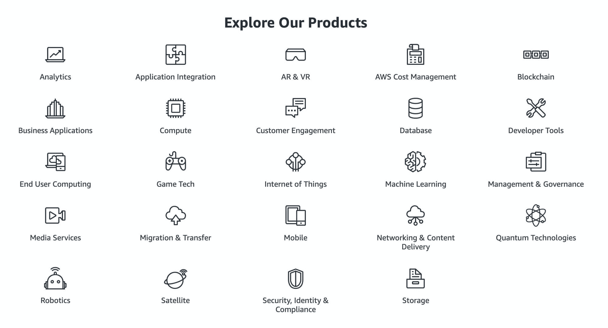

Types of AWS services available

用 S3 和 CloudFront 建立一个网站是小型和大型网络公司常用的方法，但是让我们来分析一下每个服务实际上是做什么的。

### 使用 S3 的对象存储

S3(简单的存储服务)为你的静态网站提供托管服务。可以把它想象成云中的硬盘，我们不能用它来进行处理，而只能用于简单的文件存储和访问。

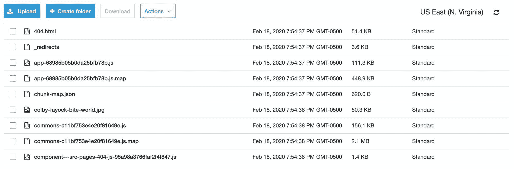

List of files from a static site in an AWS S3 bucket

当一个应用程序或网站以静态形式编译时，这就是我们向访问我们网站的人提供服务所需要的一切。HTML 在初始请求中“按原样”发送(除非有您的提供商的处理)，任何额外的工作都发生在页面加载到浏览器之后，通常由 JavaScript 执行。这使得我们可以通过从 S3 提供这些文件来采取这种简单(并且便宜)的方法。

### 使用 CloudFront 的内容交付网络

[CloudFront](https://aws.amazon.com/cloudfront/) 作为一个 [CDN](https://en.wikipedia.org/wiki/Content_delivery_network) (内容交付网络)位于你的网站前面，缓存文件，并直接提供给访问你网站的人。


CDN Diagram

你托管和服务你的网站的地方，通常称为原点，是你的文件的主要来源，可以服务于网站本身。但是在它前面放一个 CDN 给访问你的内容的人提供了一个更短更快的方式来提出他们的请求。

## 从 S3 和 CloudFront 提供服务有什么好处？

鉴于 JAMstack 时代的兴起，许多为静态站点提供类似服务的服务正在涌现，这使得部署变得非常容易。有些甚至提供了慷慨的免费等级，如 [Netlify](https://www.netlify.com/) 和 [Zeit](https://zeit.co/) ！

但有时开发者需要对他们的服务有更多的控制，或者他们需要集成到更大的云管道中，这在 AWS 中已经占了 99%,这正是 S3 的亮点。此外，有可能在你的第一年，你仍然有资格获得 AWS 的[免费等级](https://aws.amazon.com/free/)。

### 适应 AWS 良好架构的框架

作为云服务的领先提供商，AWS 发布了许多指南，以帮助开发人员和团队在性能、成本和安全性方面努力实现解决方案的卓越。

一个特别的指导方针是他们所谓的[“架构良好的”基础设施的 5 个支柱](https://aws.amazon.com/architecture/well-architected/)。


AWS Well-Architected Framework

默认情况下，我们通过使用 S3 和 CloudFront 来检查我们的托管解决方案的所有这些框。开箱即用，你提供的 HTML 和资产将是快速、廉价、安全和可靠的。

### 静态和 JAMstack 站点的魅力

构建在这些支柱之上，您实际服务的是一个静态 HTML 文件和一组资产，在初始请求时不需要任何类型的呈现资源。在此之前，一个常见的问题是不得不担心网站因负载过重而崩溃。但是有了 S3 和 CloudFront，你的网站可以无限扩展。

类似地，当服务器试图为你的帖子提供数百万次点击时，你的成本也会增加。为静态站点提供服务是很便宜的，并且可以大大降低运行 web 服务器的相关成本。

## 在我们开始之前，您需要一个 AWS 帐户

要完成本指南，您需要一个 AWS 帐户。幸运的是，创建帐户是免费的，你只需为所使用的服务付费。

最重要的是，AWS 为它的一些服务提供了一个慷慨的免费层。一些服务只提供 12 个月的免费等级(如 S3)，而其他服务总是有资格获得免费等级(如 T1)，所以请确保做好准备，以免产生意想不到的高额账单。

要创建您的帐户，请访问 AWS 网站，然后继续进入:[https://aws.amazon.com/](https://aws.amazon.com/)。

## 在 S3 上存储您的网站

首先，我们将从一个简单的 HTML 文件开始，它将作为我们的网站。这将使我们更加关注托管的过程，而不是网站本身的错综复杂。

### 创建我们的网站文件

首先创建一个名为`my-static-site`的新文件夹。在该文件夹中，让我们创建一个名为`index.html`的新文件，并将以下内容添加到该文件中:

```
<!DOCTYPE html>
<html lang=“en”>
<head>
  <meta charset=“UTF-8”>
  <meta name=“viewport” content=“width=device-width, initial-scale=1.0”>
  <title>My Static Website</title>
</head>
<body>
  <h1>Hello World!</h1>
  <p>This is my static website. ?</p>
</body>
</html> 
```

如果你在你的电脑上用你最喜欢的浏览器打开这个文件，你应该会看到这个。

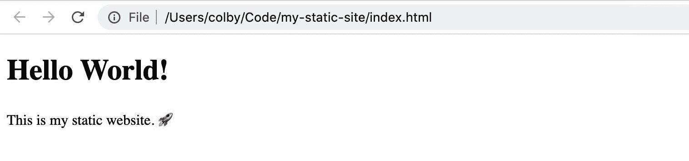

Hello World! Opening a local webpage

### 创建新的存储桶

前往你的 AWS 账户，登录，并导航到你的 [S3 控制台](https://s3.console.aws.amazon.com/s3/)。

在那里，让我们通过点击蓝色的**创建存储桶**按钮来创建我们的存储桶:


Creating a bucket in AWS S3

AWS 希望我们做的第一件事是输入一个**桶名**。bucket 名称必须是全局唯一的，也就是说，您使用的名称可以是世界上唯一的，所以让我们试试类似于`[yourname]-static-website`的东西，这里我将使用`colbyfayock-static-website`。


Naming a bucket in AWS S3

接下来，我们来设置 [**区域**](https://aws.amazon.com/about-aws/global-infrastructure/regions_az/) 。这是 AWS 将托管存储桶和您的网站的地理位置。您可能对默认位置满意，但是如果您愿意，您可以在允许的情况下选择离您最近的位置。因为我在弗吉尼亚州，所以我将坚持使用我的默认值**美国东部(N. Virginia)** 。

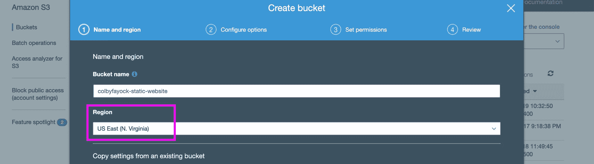

Setting the region of a bucket in AWS S3

最后，点击页面左下角的**创建**按钮。

*注意:即使你使用`[yourname]-static-website`模式，这个名字也有可能被采用。如果它被占用，AWS 将显示一个错误，说明“Bucket name 已经存在”，此时您需要尝试自己选择的新名称。*

或者，你可以点击**下一个**来获得高级用法，但是对于本指南，我们可以接受 S3 提供的所有默认设置。

如果成功，您现在应该会在 S3 控制台仪表板的列表中看到您的存储桶。

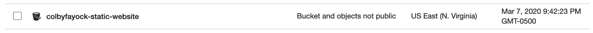

New bucket in AWS S3

### 将您的网站上传到桶中

让我们通过单击我们的存储桶所在的行来导航到我们的新存储桶。你将会看到一条信息“这个桶是空的。上传新对象以开始”，这就是我们要做的。

点击**上传**按钮开始。

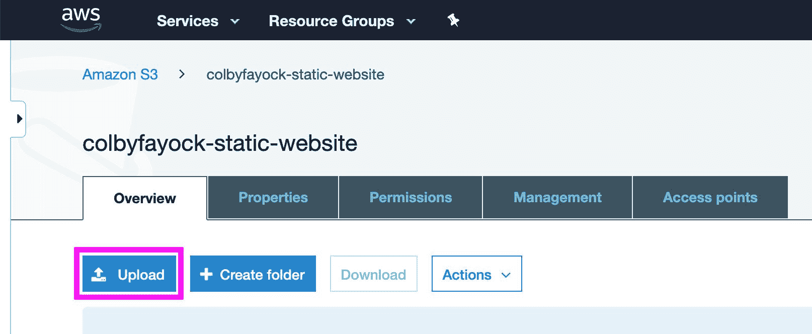

Uploading files to AWS S3

然后你会看到一个弹出窗口，要求你上传一个文件。点击**添加文件**按钮，选择我们之前创建的`index.html`文件。

选中后，点击左下角的**上传**按钮。

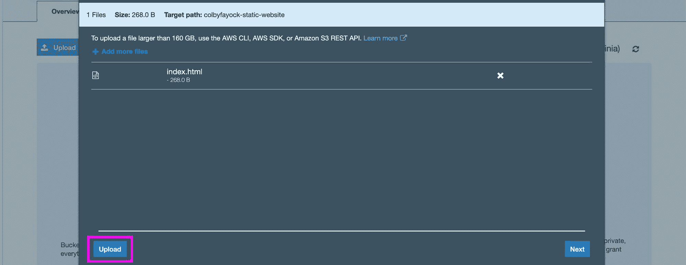

Selecting files to upload in AWS S3

现在你的文件被上传到 S3 了！

## 在 S3 为你的网站服务

如果你试图导航到你的`index.html`文件并打开它，你会注意到一个很大的难看的“拒绝访问”信息。

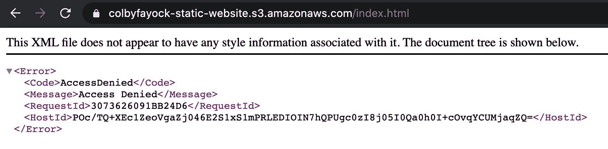

Access Denied to bucket file

这是因为您的文件当前没有向公众提供该文件所需的权限和设置，所以让我们来解决这个问题。

### 将存储桶设置为网站

导航到桶内的**属性**选项卡，然后点击**静态网站托管**。

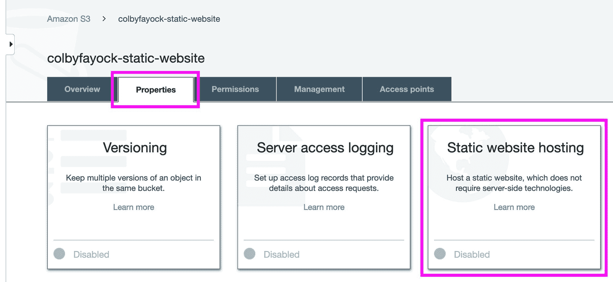

Setting up an AWS S3 bucket for statice website hosting

到了那里，我们想做几件事:

*   记下块顶部的**端点**。我们稍后将使用它来访问我们的站点(您可以在这里再次找到它)
*   选择“使用此存储桶托管网站”选项
*   在**索引文件**字段输入`index.html`
*   最后点击**保存**

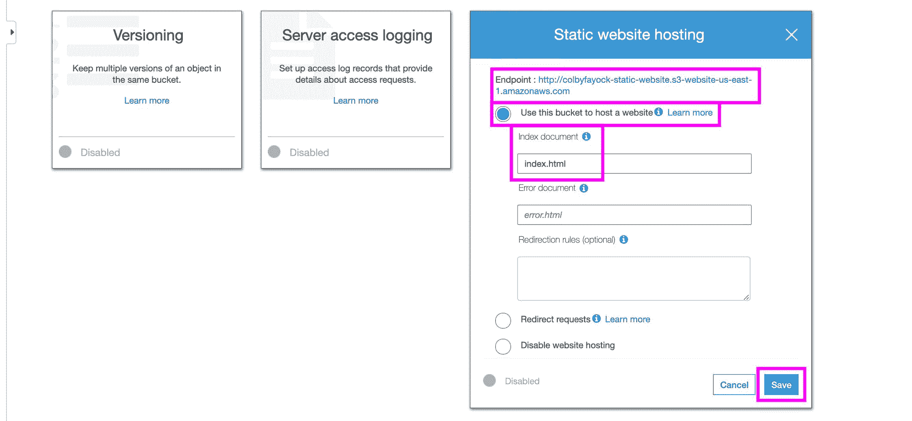

Configuring an AWS S3 bucket for static website hosting

### 设置您的存储桶策略和权限

接下来，导航到**权限**选项卡。在这里，我们要做两件事:解除对所有公共访问的封锁，并添加一个存储桶策略。

首先，在主页面上，让我们点击**编辑**来取消所有访问。

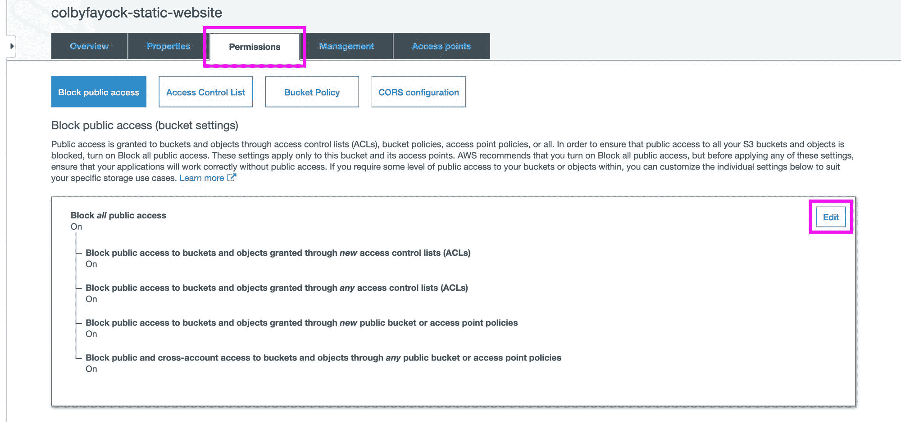

Configuring an AWS S3 bucket permissions

然后，取消选中“阻止所有公共访问”复选框，点击**保存**。


Allowing public access to an AWS S3 bucket

AWS 将要求您确认这些设置，因为这可能并不总是您想要的。但是为了主办一个网站，我们想让全世界都看到，所以输入单词“确认”并点击**确认**按钮。

确认后，点击 **Bucket policy** 按钮，您将进入一个文本编辑器。

在这个文本框中，我们需要粘贴以下代码片段。在这个代码片段中，确保用您的 bucket 的名称替换`[your-bucket-name]`,否则您将无法保存这个文件。

```
{
  "Version":"2012-10-17",
  "Statement":[{
	"Sid":"PublicReadGetObject",
        "Effect":"Allow",
	  "Principal": "*",
      "Action":["s3:GetObject"],
      "Resource":["arn:aws:s3:::[your-bucket-name]/*”
      ]
    }
  ]
} 
```

[这个策略](https://docs.aws.amazon.com/AmazonS3/latest/dev/WebsiteAccessPermissionsReqd.html#bucket-policy-static-site)声明它允许公众在 S3 资源上执行 GetObject 请求，这是您的 S3 桶。

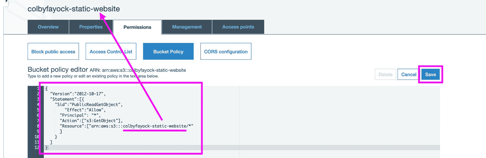

Setting up a public policy for an AWS S3 bucket

添加完策略后，点击**保存**按钮。您现在应该会看到一条消息，说明“这个存储桶具有公共访问权限。”

### 预览您的新网站

如果您从属性页记下了端点，现在您可以访问该地址来查看您的网站。端点应该如下所示:

```
http://[your-bucket-name].s3-website-[region-id].amazonaws.com 
```

如果你不知道，跳回去几个步骤，提醒自己如何找到它，或者查看属性标签下。

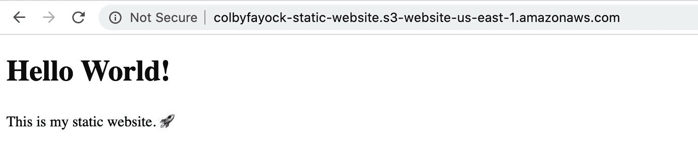

Hello World! Opening an AWS S3 website

恭喜，你成功了一半！？

## 在 CloudFront 上发布你的网站

现在我们已经有了一个从 S3 的桶中提供服务的静态网站，让我们把它提升到另一个层次，使用 CloudFront 在全世界范围内提供服务。

### 创建 CloudFront 发行版

导航到您的 [CloudFront 仪表板](https://console.aws.amazon.com/cloudfront)并点击**创建发行版**按钮。

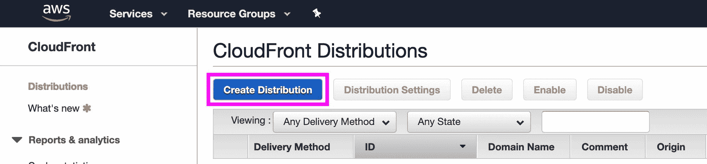

Creating a new distribution in AWS CloudFront

接下来，在**网络**交付方式下选择**开始**。

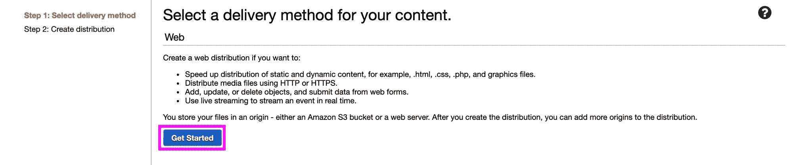

Getting started with an AWS CloudFront distribution with Web delivery

在这里，我们将输入一些自定义参数来设置我们的发行版。

点击进入**原域名**字段。选中后，应该会出现一个下拉列表，您可以在其中选择刚刚创建的 S3 存储桶。继续选择你的 S3 桶。

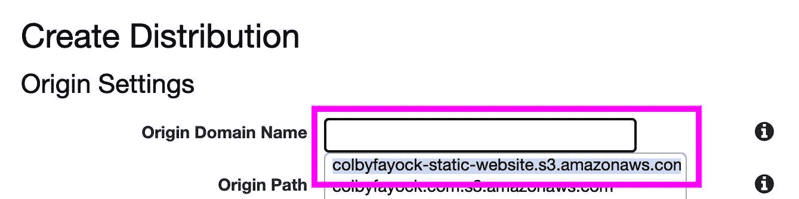

Setting the origin domain name in AWS CloudFront to your bucket

虽然您可以根据自己的喜好[定制大多数设置](https://docs.aws.amazon.com/AmazonCloudFront/latest/DeveloperGuide/distribution-web-values-specify.html)，但出于我们的目的，我们将保留所有设置的默认值，只有一个除外。

向下滚动到**默认根对象**字段并输入`index.html`。

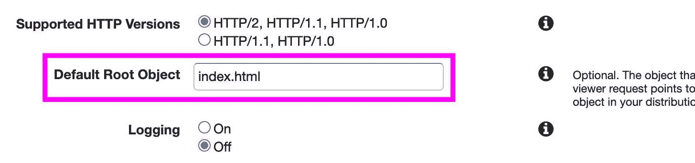

Setting the Default Root Object for a distribution in AWS CloudFront

之后，向下滚动到底部，点击右下角的**创建发行版**。

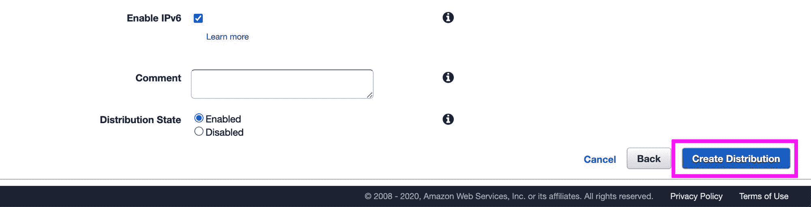

Creating an AWS CloudFront distribution

### 预览您的新 CloudFront 发行版

点击 **Create** 按钮后，需要一些时间来创建和设置您的发行版。你会注意到在 **CloudFront 发行版**列表页面上，你的新发行版的**状态**是**进行中**。

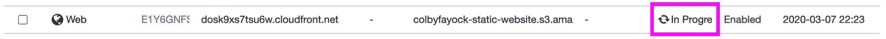

AWS CloudFront distribution deployment is In Progress

一旦完成，它将显示**已部署**。然后你可以在同一行找到你的**域名**。

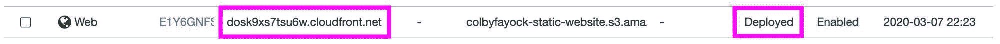

AWS CloudFront distribution is Deployed

使用域名列中的值，在浏览器中打开您的发行版并成功！您现在正在通过 CloudFront 的分销网络查看您的 S3 桶。

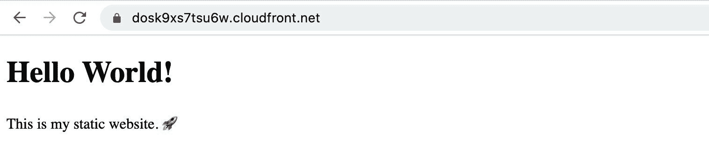

Hello World! Opening an AWS CloudFront website

## 自定义域名

虽然我们中的大多数人可能会希望在我们的网站上使用自定义域名，但我们不会在本指南中深入探讨，因为有许多方法可以根据您购买域名的地点来设置。

然而，这里有一些事情需要考虑。

### HTTPS / SSL 证书

如果您正在创建使用自定义域名的 CloudFront 发行版，您很可能希望使用 AWS 的[证书管理器](https://aws.amazon.com/certificate-manager/)为您的发行版配置一个 [SSL 证书](https://www.cloudflare.com/learning/ssl/what-is-an-ssl-certificate/)。或者，你可以用像[让我们加密](https://letsencrypt.org/)这样的工具来提供你自己的证书，但是通过使用 ACM，AWS 可以很容易地获取记录用于你的发行版。

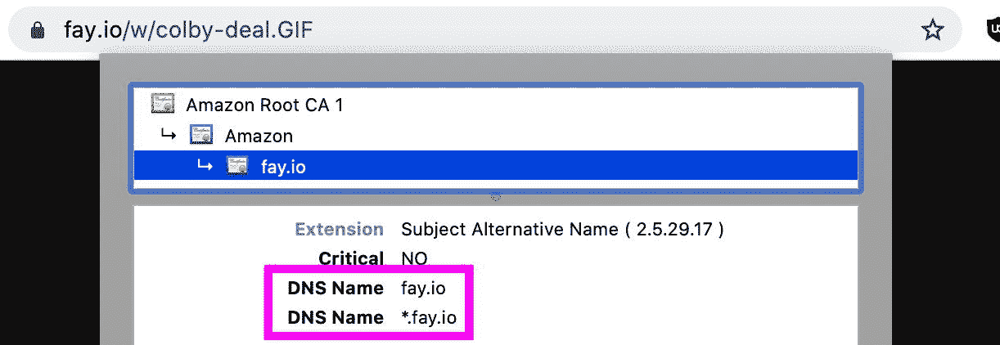

一旦进入 ACM，您将需要配置证书，映射应该匹配的域和子域(通常是`*.domain.com`)，然后创建您的证书以用于您的发行版。

首先，您可以查看 AWS 指南中关于[请求公共证书](https://docs.aws.amazon.com/acm/latest/userguide/gs-acm-request-public.html)的内容。

### CNAMEs 和别名

设置自定义域的常用方法是使用 CNAME。CloudFront 使这变得非常容易，因为在配置发行版时，您将把它作为配置选项添加进来。

要开始在 CloudFront 中设置 CNAME，[请参见 AWS 指南](https://docs.aws.amazon.com/AmazonCloudFront/latest/DeveloperGuide/CNAMEs.html)。

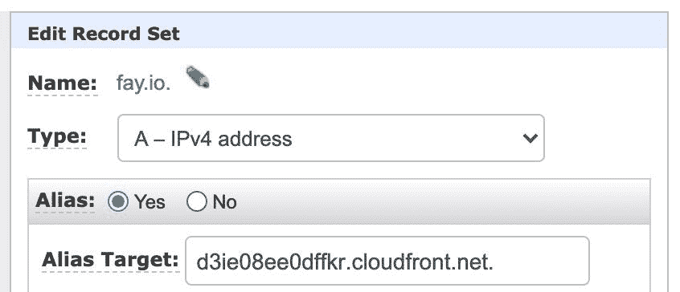

如果您使用 [Route53](https://aws.amazon.com/route53/) 来管理您的 [DNS](https://www.cloudflare.com/learning/dns/what-is-dns/) ，那么您可以设置一个 A 记录(别名)来指向您的发行版。使用本指南，你可以了解更多[。](https://aws.amazon.com/premiumsupport/knowledge-center/route-53-create-alias-records/)

## 高级 AWS 用法

在本指南中，我们将引导您使用 AWS 控制台设置一个新的静态网站和应用程序。但是，无论您是想了解更多信息、提高部署效率，还是想自动化这一过程，您都需要借助 AWS CLI 或 CloudFormation 更进一步。

虽然我们不会在这里指导您如何使用这些工具，但是我们会让您对自己面临的问题有一点了解。

### AWS CLI

[AWS CLI](https://aws.amazon.com/cli/) 允许某人从命令行执行 AWS 操作。当您想要脚本化您的资源创建时，或者如果您只是喜欢从终端完成所有工作，这将是非常强大的。

在本地设置好之后，您将能够使用以下命令执行诸如创建 bucket 之类的操作:

```
aws s3api create-bucket —-bucket [your-bucket-name] —-region [bucket-region]
```

要开始，请查看 AWS CLI [Github 页面](https://github.com/aws/aws-cli)或 AWS CLI [用户指南](https://docs.aws.amazon.com/cli/latest/userguide/cli-chap-welcome.html)。

### AWS 云阵

AWS 宣扬“基础设施即代码”它的想法是，你可以使用写在文件中的东西来旋转你的基础设施，在这个特定的例子中，它将是一个云形成模板。这允许您拥有一个可重复的过程，每次执行部署时都是相同的。

[CloudFormation](https://aws.amazon.com/cloudformation/) 允许您设置一个配置文件，通过使用 CLI 指向该文件或在控制台中上传该文件来部署您选择的服务和资源。

这里有一个来自 AWS 的[例子，展示了一个静态的 S3 桶可以作为一个网站的样子。](https://docs.aws.amazon.com/AWSCloudFormation/latest/UserGuide/quickref-s3.html#scenario-s3-bucket-website)

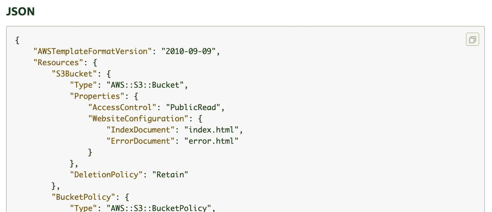

AWS CloudFront template example

要开始，查看 AWS 的 CloudFormation [示例模板](https://aws.amazon.com/cloudformation/resources/templates/)或他们的[入门指南](https://docs.aws.amazon.com/AWSCloudFormation/latest/UserGuide/GettingStarted.Walkthrough.html)。

## 资源

如果您有兴趣更深入地了解 AWS 生态系统，以下是一些入门资源:

*   [AWS 认证云从业者培训 2019-4 小时免费视频课程](https://www.freecodecamp.org/news/aws-certified-cloud-practitioner-training-2019-free-video-course/)(freeCodeCamp.org)
*   [介绍 AWS 认证挑战:通向您的第一个 AWS 认证之路](https://www.freecodecamp.org/news/awscertified-challenge-free-path-aws-cloud-certifications/)(freeCodeCamp.org)
*   [10 分钟教程](https://aws.amazon.com/getting-started/tutorials/) (AWS)
*   [云专家](https://acloud.guru/)(付费课程)
*   [AWS 案例研究](https://aws.amazon.com/solutions/case-studies/) (AWS)

[](https://twitter.com/colbyfayock)

*   [？在 Twitter 上关注我](https://twitter.com/colbyfayock)
*   [？️订阅我的 Youtube](https://youtube.com/colbyfayock)
*   [✉️注册我的简讯](https://www.colbyfayock.com/newsletter/)