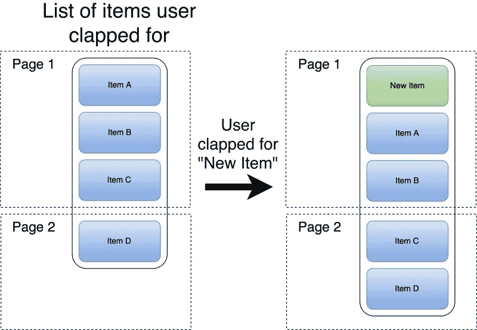

# 如何实现频繁变化内容的“可缓存”分页

> 原文：<https://www.freecodecamp.org/news/how-to-implement-cacheable-pagination-of-frequently-changing-content-c8ddc8269e81/>

尼基塔·科兹洛夫

# 如何实现频繁变化内容的“可缓存”分页

每当我们需要显示存储在后端的大量内容时，我们就把它们分成块，然后一次一个地加载它们。这是一种常见的方法，它如此伟大有多种原因:

1.  **提升用户体验**。加载一个小的单个页面需要更少的时间，因此用户可以更快地开始使用内容。
2.  **减少网络负载**。就带宽而言，单个页面又小又轻。此外，我们可以通过调整单个页面的大小来优化移动设备的电池和网络消耗。
3.  **减少后端**的负荷。加工较小的工件比加工较大的工件要快。用户通常不需要立刻获得所有的内容，所以每个用户的平均负载较低。

每个人都赢了。在大多数情况下。但不是全部。正如通用解决方案经常发生的那样，越是针对特定领域，找到的解决方案就越好。在这篇文章中，我想分享一个有趣的解决方案。

### 定义任务

让我们想象一个随时间频繁变化的集合。例如，我们可以查看用户在媒体上为之鼓掌的文章列表，或者购物应用程序中的愿望列表，或者任何其他用户行为的历史记录。用户可以向该集合中“添加”任意多的项目。

我们的任务是以一种方便的方式显示这个集合，同时尽最大努力避免滥用网络，从而滥用电池和带宽。

#### 分页的问题

最小化网络使用的方法之一是缓存响应。大多数移动和 web 应用程序严重依赖 HTTP 缓存。它在响应头中指定的一段时间内保存响应。每次应用程序发出请求时，HTTP 客户端都会尝试从缓存中获取相应的响应。只有当它不可用时，它才会实际调用后端。

有时，这种缓存对于分页内容来说效果不佳。如果集合经常改变，内容需要更新，那么缓存响应*根本没有意义。作为一个例子，让我们想象以下场景:*

1.  用户在这里打开他们为之鼓掌的文章列表，在媒体上。第一页从后端获取。
2.  之后，用户搜索了一些新的东西，发现了另一篇有趣的文章，并决定推荐它。
3.  现在他们想再次检查他们推荐的文章列表。

应用程序需要对第一页执行完全相同的请求，但是结果是不同的。无法缓存响应。

如果您的特定领域任务允许您重新排列这个集合中的项目，那么您的问题就更严重了。因为同样的原因:反应是不断变化的。

### 另一种方法

让我们仔细看看从后端获取的第一页数据。响应本身是一个按特定顺序排列的条目列表。每一项都不太可能改变。改变的是元素的顺序和列表中的项目。

这意味着，如果我们可以分别获取商品 id 的顺序和商品细节，那么第二个调用可能会被缓存。事实上，即使缓存第二个调用也并不简单——但是我们会做到的。现在，让我们对每一项分别提出要求:

正如您在上面的图表中看到的，因为项目不太可能改变，所以我们可以缓存项目详细信息调用。不幸的是，这样的分割会使网络调用的数量成倍增加。但是我们可以做些什么。

#### 我们到底想要什么？

如果我们只是请求一堆项目，我们会遇到与通用分页方法相同的问题。HTTP 缓存不会像我们想要的那样运行，所以让我们使用类似但更谨慎的逻辑来编写自己的缓存。

这个缓存不会存储批处理，而是存储特定时间内的单个项目。我们将获取响应，访问它的 HTTP 头，并检索关于缓存时间的信息。然后，我们将把每个项目分别放入缓存。下次我们需要显示项目时，我们可以轻松地访问缓存的项目并请求其余的项目。代码看起来比听起来简单:

让我们快速浏览一下代码。方法 *getOrderedItemsIds()* 返回元素的顺序并分页。最重要的部分是方法 *getItemsByIds()。*在这里，我们首先检查缓存中有哪些项目，然后从后端请求剩余的项目。请注意，为了简单起见，上面的代码是同步的，可能不会编译。

在实现这种方法之后，向列表的头部添加一个新项目将会导致请求订购该新项目的一个项目 id 和细节。其余的来自缓存。

对于每个连续的页面，将会发生类似的一对调用。主要的想法是，我们可以从缓存中检索大多数项目细节。但不幸的是，我们不得不要求每个页面的项目 id 的顺序。

#### 做得更好

商品 ID 通常是一个小对象，比如一个*字符串*或*通用唯一标识符(UUID)。*因此，我们可以发送更大的页面。增加 order 调用返回的商品 id 数量可以减少调用次数，而不会滥用网络带宽。

例如，我们可以请求 100-200 个商品 id，而不是请求 20-40 个。稍后，UI 层可以调节需要显示的项目细节的数量，并相应地请求它们。那么一系列的调用看起来会像这样:

1.  请求前 100 个项目 id，并将它们保存在内存中。
2.  请求前 20 项的详细信息(当然缓存它们)并显示给用户。
3.  用户滚动前 20 个项目后，请求第二批 20 个项目的详细信息。
4.  重复上述步骤三次以上，并对下一页的项目 id 执行类似的步骤。

现在，向顶部添加一个新项目仍然会导致两个请求(一个请求 id，另一个请求这个新项目的详细信息)。但是我们暂时不用请求下一页，因为页面更大了。我们也不需要请求项目细节，因为它们被缓存了！

小免责声明:UI 调节项目细节请求的方式可能更有趣。例如，如果用户滚动得太快，它可以跳过对某些项目的请求，因为他们对这些项目不感兴趣。但是这值得另写一篇文章。

### 结论

一般解决方案通常不会针对特定情况进行优化。了解细节可以帮助我们编写更快、更优化的应用程序。在这种情况下，内容经常变化以及它是带有 id 的项目集合的知识是至关重要的。让我们回顾一下新方法带来的所有改进:

1.  单独请求项目的顺序使我们能够缓存细节，即使我们必须编写一个修改过的 HTTP 缓存。
2.  缓存项目详细信息会减少带宽的使用。
3.  订单请求页面大小的增加减少了调用次数。

最后一件事:优化很棒，我发现编写高效的代码很令人兴奋——但是不要忘记首先对它进行分析。过早的优化可能会导致问题，我们都应该避免它。

[**尼基塔·科兹洛夫(@尼基塔 _ E _ 科兹洛夫)|推特**](https://twitter.com/Nikita_E_Kozlov)
[*尼基塔·科兹洛夫(@尼基塔 _ E _ 科兹洛夫)最新推文:“https://t . co/wmg SJ 7 snw 1”*twitter.com](https://twitter.com/Nikita_E_Kozlov)

感谢您抽出时间阅读本文。喜欢的话别忘了点一下？乙*埃洛。*