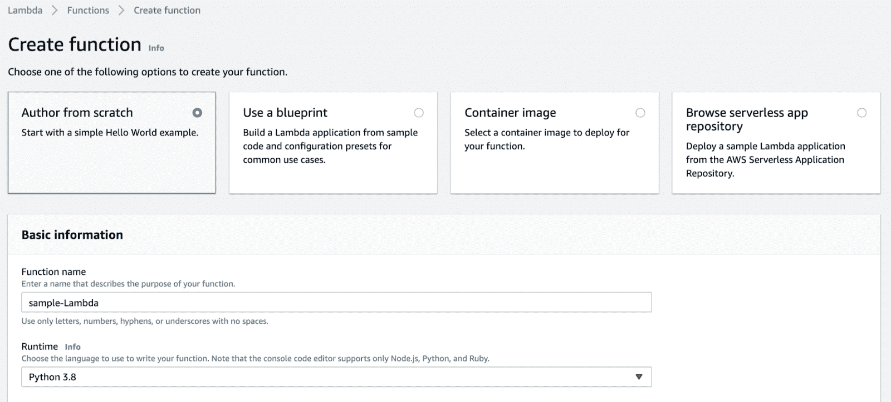
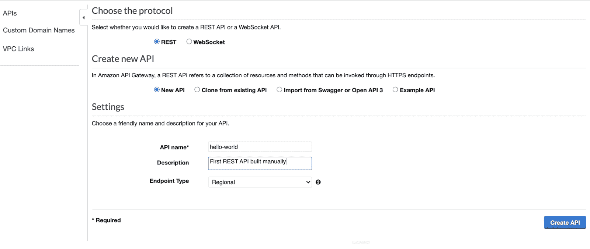
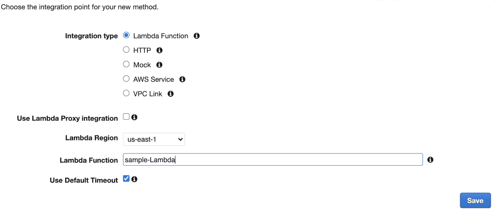
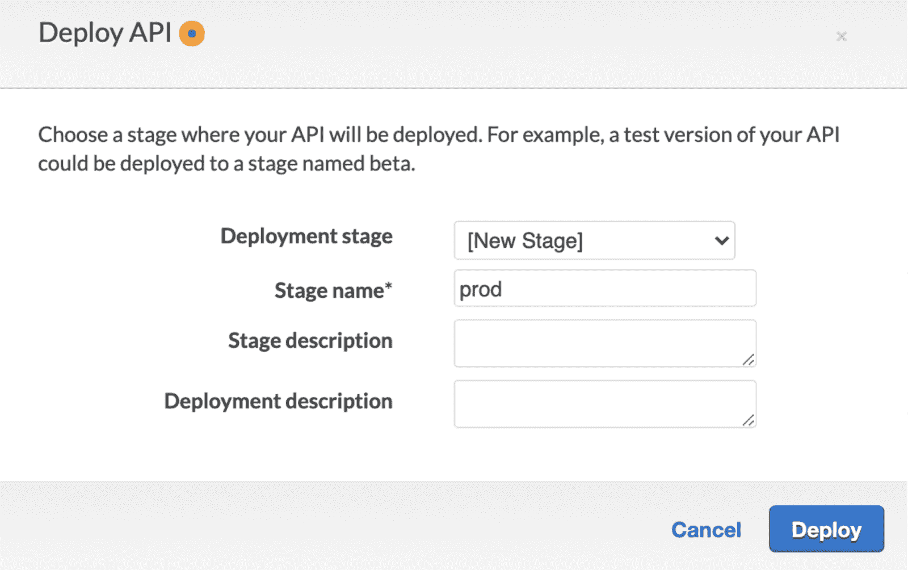
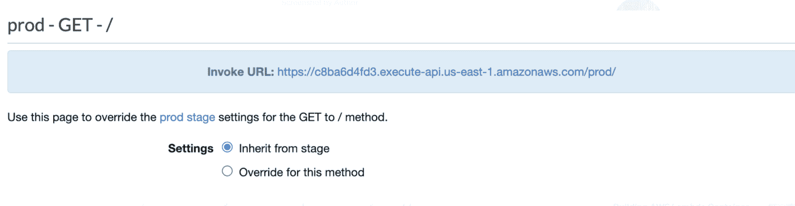
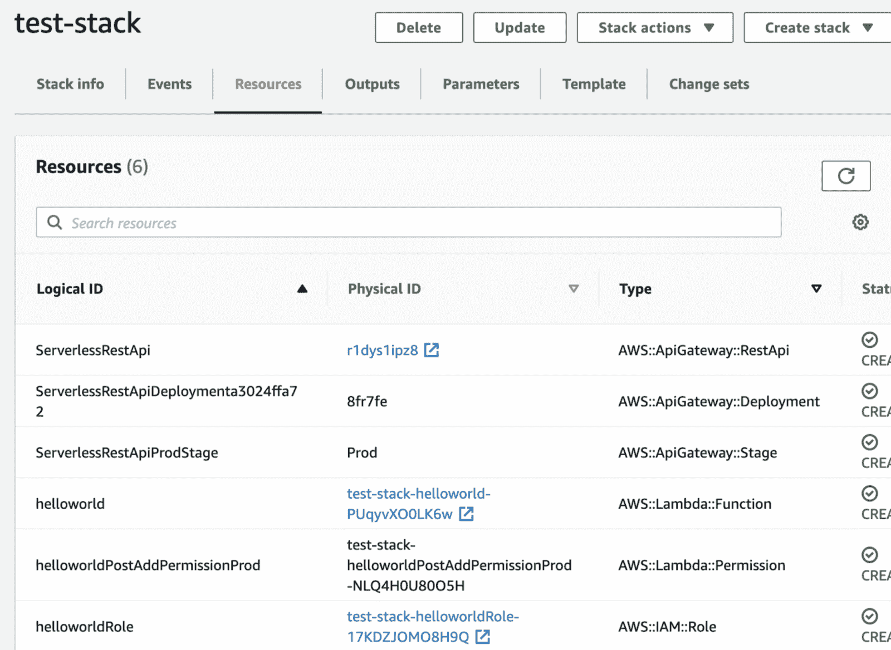

# 如何用 AWS 将基础设施实现为代码

> 原文：<https://www.freecodecamp.org/news/how-to-implement-infrastructure-as-code-with-aws/>

基础设施即代码是通过编写一个可供人阅读和机器使用的模板文件来调配和管理云资源的过程。

对于 AWS 云开发，作为代码的基础设施的内置选择是 AWS CloudFormation。

使用 IaC，开发人员可以有效地管理项目的基础设施，使他们能够轻松地配置和维护项目架构和资源的变化。

有许多 IaC 工具可用，如 Ansible、Puppet、Chef 和 Terraform。

但是对于本指南，我们将使用 CloudFormation，它是专门为 AWS 资源开发的。

## 您将在本教程中学到什么

阅读完本教程后，您将了解如何在一个软件文件中维护您的资源。

除此之外，您还将了解基础设施作为代码带来的与速度相关的好处。如果没有 IaC，手动部署各种基础设施的时间和成本会比将基础设施作为软件来维护要高得多。

在本文中，我们将考虑一个例子。它将演示手动配置资源与部署 CloudFormation 脚本在 AWS 上创建无服务器 Lambda 函数和 REST API。

### 我们将在本教程中使用的服务

我们将使用以下服务在 AWS 中将基础设施实现为代码:

| AWS 服务名称 | 描述 |
| AWS API 网关(API GW) | 我们将使用这个服务来创建我们的 REST API。它还允许创建、发布和监控安全套接字和 Restful APIs。 |
| AWSλ | 我们将使用该服务在后端建立一个示例无服务器功能，该功能将与我们的 REST API 集成。 |
| 身份访问和管理(IAM) | 允许您通过角色和权限管理对各种 AWS 服务的访问的服务。我们将为 Lambda 函数创建一个角色，这样我们就可以访问 API 网关。 |
| AWS CLI | 要使用 AWS 服务和资源，您可以使用命令行界面，而不是控制台，以便于访问。 |
| AWS SAM | 配置的抽象允许开发无服务器应用程序。 |

对于那些不熟悉 AWS 的人来说，了解一些它的知识以理解这篇文章是有好处的。所以，你可以跟着我在 AWS [这里](https://aws.amazon.com/console/)创建一个帐户，并确保你已经安装了 [AWS CLI](https://aws.amazon.com/cli/) 来处理这个例子。

### 示例概述

对于本文，我们将实现一个带有 API 网关的 REST API。它将与一个无服务器后端 Lambda 函数集成，该函数处理 POST 并获取我们的 API 发出的请求。

第一步将向您展示如何使用 AWS 控制台手工构建和部署这些资源。第二步将向您展示如何使用 CloudFormation 自动化该过程。

## 如何手动部署

在手动部署中，我们将在 AWS 控制台内部工作。在本地 ide 之外工作时，跟踪变更有点困难，尤其是对于大型项目。

第一步，我们将创建一个 Lambda 函数。



如果你想让你的 Lambda 函数和其他服务一起工作，比如 understand，你必须给这个服务权限。因此，请确保创建具有这些权限的角色。

下面是我们的 Lambda 函数，当与 API 网关集成时，它将返回“Hello World”。

```
import json

def lambda_handler(event, context):
    # TODO implement
    return {
        'statusCode': 200,
        'body': json.dumps('Hello World!')
    }
```

现在我们已经配置了 Lambda 函数，下一步是创建一个 REST API 来与 Lambda 函数交互。

为此，请转到 Amazon API Gateway，单击 create API，并从提供的选项中选择 REST API。



现在我们将 Lambda 与 API 集成。为此，从 actions 菜单创建一个 GET 方法，并将我们的 REST API 指向 Lambda 函数。



我们可以部署和测试我们的 API 与 Lambda 的正确集成。选择您想要的任何阶段名称—在本例中，我使用“prod”。



部署 API 后，您可以在“prod”阶段看到一个 URL。点击这个 URL 将触发 Lambda 函数。因为我们已经从 Lambda 函数返回了“Hello World ”,所以您应该能够看到想要的结果。



## 如何使用 CloudFormation 部署

到目前为止，我们已经看到了手动部署是如何工作的，这通常需要几分钟。

但是让我们想象一下，我们有不止一个 API、方法和不止一个开发人员在为它们工作。在这种情况下，跟踪所有的资源和变化将是具有挑战性的。

因此，在本节中，我们将使用 AWS CloudFormation。这将给开发者带来灵活性，允许他们用一个简单的脚本来调整他们的基础设施。

### 云的形成是如何工作的？

我们将使用 YAML 文件来提供和声明这些资源，并将它们部署到 AWS 以创建一个 CloudFormation 堆栈。CloudFormation 是一个堆栈，包含项目所需的所有资源。

我们将使用服务部分中描述的 SAM 模板。它是云信息的一种抽象，用较少的 YAML 代码构建无服务器应用。

对于那些不了解 YAML 的人，你可以像 JSON 一样考虑一下。但是 CloudFormation 使用这两种文件格式。

**第一步，**我们前往本地 IDE，编写与在 AWS 控制台中相同的 Lambda 函数。

**helloworld.py** :

```
import json

def lambda_handler(event, context):
    # TODO implement
    return {
        'statusCode': 200,
        'body': json.dumps('Hello World!')
    }
```

接下来，我们将创建一个**模板**。包含我们的基础设施的 yaml 文件。我们将在这个文件中定义我们的 Lambda 函数和 API 网关。

为了构建这个文件，我们需要添加一些对所有 SAM 模板通用的信息。

**template.yaml** :

```
AWSTemplateFormatVersion: '2010-09-09'
Transform: AWS::Serverless-2016-10-31
Description: First CloudFormation template
```

现在，我们必须将“Globals”添加到这个 CloudFormation template.yaml 文件中。**全局**是您将要部署的资源的通用配置。全局变量允许您为特定的资源类型全局声明信息，而不是为不同的资源一次又一次地指定它。

**template.yaml** :

```
Globals:
    #Common to all Lambda functions you create
    Function:
      MemorySize: 128
      Runtime: python3.6
      Timeout: 5
```

我们必须在 template.yaml 文件中定义 Resources 标记。Lambda 函数和 REST API 将在这个标签下。

**template.yaml** :

```
Resources:

    ##Lambda and API GW Integrated
    helloworld:
        Type: AWS::Serverless::Function
        Properties:
          #filename.functionname
          Handler: helloworld.lambda_handler

          #REST API created
          Events:
            PostAdd:
              Type: Api
              Properties:
                Path: /helloworld
                Method: get
```

在上面的代码中，我们定义了创建 Lambda 函数的参数。对于该事件，我们创建一个触发 Lambda 函数的 REST API。

**注意:**有一个像 CodeURI 和 description 这样的参数数组，您可以为您的无服务器函数指定。创建模板文件的最佳方式是浏览 CloudFormation 文档，并查看可用于您指定的资源/服务的参数。

## 如何部署模板文件

我们可以部署我们的**模板**。yaml 文件，使用以下两个 AWS CLI 命令:

```
##s3 bucket stores our sam template which we need to deploy
aws cloudformation package --template-file template.yaml --output-template-file sam-template.yaml --s3-bucket helloworld-sam
```

运行以上命令后，您将能够看到一个 SAM 模板文件。我们将在下面的第二个命令中使用这个文件。

在该命令中，给出 sam-template.yaml 文件的适当路径:

```
#Deploy stack
#point to template file created by a previous command and a stack name as well as your region you're deploying

aws cloudformation deploy --template-file /path to sam-template.yaml file --stack-name test-stack --capabilities CAPABILITY_IAM --region us-east-1
```

执行这两个命令后，您将看到在 CLI 中创建的堆栈。您可以在控制台中使用 CloudFormation 来验证它。

在这里，您将看到通过使用 template.yaml 文件创建和部署的代码提供的所有资源。



您可以单击 API 并访问 URL 来检查输出，就像我们对手动部署所做的那样。

## 包扎

就是这样——您已经使用 CloudFormation 成功地在 AWS 中将基础设施实现为代码。

我希望这篇文章对想要理解在 AWS 中将基础设施实现为代码的人有所帮助。

在 [LinkedIn](https://www.linkedin.com/in/kadeniyi/) 和 [Twitter](https://twitter.com/mkbadeniyi) 上与我联系

再见了！