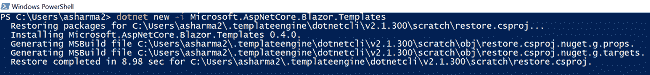
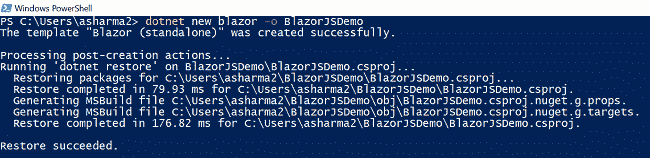
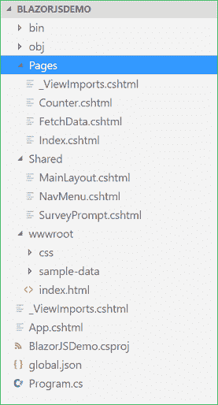
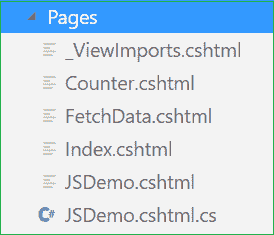
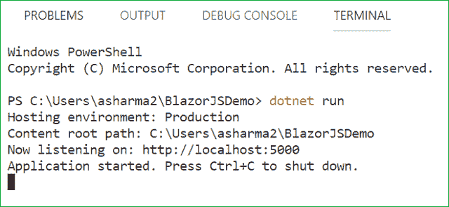
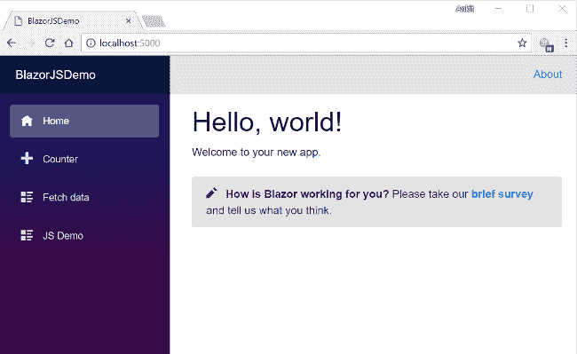

# 如何在 Blazor 中实现 JavaScript 互操作

> 原文：<https://www.freecodecamp.org/news/how-to-implement-javascript-interop-in-blazor-9f91d263ec51/>

### 介绍

在本文中，我们将学习 Blazor 中的 JavaScript Interop。我们将了解什么是 JavaScript Interop，以及如何借助一个示例应用程序在 Blazor 中实现它。

我们将使用 Visual Studio 代码进行演示。

### 什么是 JavaScript 互操作？

Blazor 使用 JavaScript 来引导。NET 运行时。它可以使用任何 JS 库。C#代码可以调用 JS 函数/API，JS 代码可以调用任何 C#方法。这种从 C#代码调用 JS 方法的特性被称为 JavaScript Interop，反之亦然。Blazor 使用 JavaScript Interop 来处理 DOM 操作和浏览器 API 调用。

JavaScript Interop 是 WebAssembly 提供的特性，因为 Blazor 运行在 mono 上，Mono 编译成 WebAssembly。因此，Blazor 也可以实现这个特性。

### 先决条件

*   安装。NET Core 2.1 以上 SDK 从[这里](https://www.microsoft.com/net/learn/get-started/windows#windowscmd)。
*   在此安装[中的 visual Studio 代码。](https://code.visualstudio.com/)

### 源代码

从 [Github](https://github.com/AnkitSharma-007/Blazor-JSInterop) 获取源代码。

### 创建 Blazor 应用程序

我们将使用 Windows PowerShell 创建一个 Blazor 应用程序。

#### **第一步**

首先，我们将在我们的机器上安装 Blazor 框架模板。

打开要在其中创建项目的文件夹。用 shift +右键打开 Windows PowerShell > >在此打开 PowerShell 窗口。

键入以下命令:

```
dotnet new -i Microsoft.AspNetCore.Blazor.Templates
```

请参考下图:



#### **第二步**

键入以下命令来创建我们的 Blazor 应用程序:

```
dotnet new blazor -o BlazorJSDemo
```

这将创建一个名为 **BlazorJSDemo** 的 Blazor 应用程序。参考下图。



### 向我们的应用程序添加 Razor 页面

使用 VS 代码打开 **BlazorJSDemo** app。您可以在解决方案资源管理器中观察文件夹结构，如下图所示。



我们将在 **Pages** 文件夹中添加我们的 Razor 页面。

通过右键单击 Pages 文件夹并选择 new file 来创建一个新文件。将文件命名为 **JSDemo.cshtml** 。这个文件将包含 HTML 代码来处理我们的应用程序的用户界面。

同样，再添加一个文件 **JSDemo.cshtml.cs** 。这个文件将包含处理我们的业务逻辑的 C#代码。

现在，我们的**页面**文件夹将具有以下结构:



### 从 C#调用 JavaScript 函数

首先，我们将在**index.html 文件**中编写 JavaScript 函数。打开 **wwwroot/index.html** 文件，放入以下代码:

```
<!DOCTYPE html>
<html>

<head>
    <meta charset="utf-8" />
    <meta name="viewport" content="width=device-width">
    <title>BlazorJSDemo</title>
    <base href="/" />
    <link href="css/bootstrap/bootstrap.min.css" rel="stylesheet" />
    <link href="css/site.css" rel="stylesheet" />

    <script src="https://ajax.googleapis.com/ajax/libs/jquery/3.3.1/jquery.min.js"></script>

</head>

<body>
    <app>Loading...</app>

    <script src="_framework/blazor.webassembly.js"></script>

    <script>
        function JSMethod() {
            $("#demop").text("JavaScript Method invoked");
        }
    </script>

</body>

</html>
```

这里我们在部分包含了对 JQuery 库的 CDN 引用，这样我们就可以处理 DOM 操作。

在部分，我们已经定义了 JS 函数。函数 na *me 是 JS* 方法，它不接受任何参数。当被触发时，它会将 id 为“demop”的< p >标签的文本设置为“调用 JavaScript 方法”。

**重要提示**

1.  不要在**中写你的 JS 代码。cshtml** 文件。这在 Blazor 中是不允许的，编译器会抛出一个错误。总是把你的 JS 代码放在 **wwwroot/index.html** 文件中。
2.  总是在 **<正文& g** t 中的之后添加您的自定义

打开 **JSDemo.cshtml.cs** ，放入以下代码:

```
using Microsoft.AspNetCore.Blazor.Components;
using Microsoft.JSInterop;
using System;
using System.Collections.Generic;
using System.Linq;
using System.Threading.Tasks;

namespace BlazorJSDemo.Pages
{
    public class JSDemoModel : BlazorComponent
    {
        protected static string message { get; set; }

        protected void CallJSMethod()
        {
            JSRuntime.Current.InvokeAsync<bool>("JSMethod");
        }
    }
}
```

方法**调用 JSMethod** 将通过使用“JSRuntime”调用我们的 JS 函数“JSMethod”。Current.InvokeAsync "方法。这个方法可以接受两个参数——JS 函数名和任何需要提供给 JS 函数的参数。在这种情况下，我们不向 JS 函数传递任何参数。

打开 **JSDemo.cshtml** ，放入以下代码:

```
@page "/demo"
@using BlazorJSDemo.Pages

@inherits JSDemoModel  

<h1>JavaScript Interop Demo</h1>

<hr />

<button class="btn btn-primary" onclick="@CallJSMethod">Call JS Method</button>

<br />
<p id="demop"></p>
```

这里我们在顶部定义了页面的路径。因此，在这个应用程序中，如果我们将“/demo”附加到基本 URL，那么我们将被重定向到这个页面。我们还继承了**jsdemomomodel**类，它是在 **JSDemo.cshtml.cs** 文件中定义的。这将允许我们使用在**jsdemomomodel**类中定义的方法。

在这之后，我们定义了一个按钮。单击此按钮将调用“CallJSMethod”方法。id 为“demop”的

元素也被定义，其值将由 JS 函数“JSMethod”设置。

### 调用 C#/。来自 JavaScript 的 NET 方法

现在我们将在 **wwwroot/index.html** 文件中定义我们的 JS 方法，它将调用 **JSDemo.cshtml.cs** 文件中我们的 C#方法。

从 JavaScript 调用 C#方法的语法如下:

```
DotNet.invokeMethodAsync('C# method assembly name', 'C# Method Name');
```

因此，我们将遵循相同的方法调用语法。打开 **wwwroot/index.html** 文件，并向其中添加以下脚本部分:

```
<script>
  function CSMethod() {
    DotNet.invokeMethodAsync('BlazorJSDemo', 'CSCallBackMethod');
  }
</script>
```

这里我们定义了一个 JS 函数“CSMethod”。该函数将回调我们的 C#方法“CSCallBackMethod ”,该方法在**jsdemomomodel**类中定义。

调用 C#/。NET 方法从 JavaScript，目标。NET 方法必须满足以下标准:

1.  该方法需要是静态的。
2.  它必须是非泛型的。
3.  该方法不应有重载。
4.  它有具体的 JSON 可序列化参数类型。
5.  它必须用[JSInvokable]属性来修饰。

打开 **JSDemo.cshtml.cs** 文件，在 **JSDemoModel** 类中添加以下代码。

```
protected static string message { get; set; }

[JSInvokable]
public static void CSCallBackMethod()
{
  message = "C# Method invoked";
}

protected void CallCSMethod()
{
  JSRuntime.Current.InvokeAsync<bool>("CSMethod");
}
```

这里我们定义了两种方法:

1.  调用 CSMethod :这将调用我们的 JS 函数“CSMethod”
2.  **CSCallBackMethod** :这是一个静态方法，将从 JavaScript 函数“CSMethod”中调用。因此，它是用[JSInvokable]属性修饰的。该方法将设置一个字符串变量**消息**的值，该值将显示在 UI 上。

打开 **JSDemo.cshtml** 文件，向其中添加以下代码:

```
<button class="btn btn-primary" onclick="@CallCSMethod">Call C# Method</button>
<br />
<p>@message</p>
```

这里我们定义了一个按钮，它将调用“onclick”事件上的“CallCSMethod”方法。变量 message 的值在单击按钮时设置。

### 向导航菜单添加链接

打开**\ BlazorJSDemo \ Shared \ nav menu . cs html***页面，将以下代码放入其中。这将在导航菜单中包含一个到我们的 **JSDemo.cshtml** 页面的链接。*

```
*`<div class="top-row pl-4 navbar navbar-dark">
    <a class="navbar-brand" href="">BlazorJSDemo</a>
    <button class="navbar-toggler" onclick=@ToggleNavMenu>
        <span class="navbar-toggler-icon"></span>
    </button>
</div>

<div class=@(collapseNavMenu ? "collapse" : null) onclick=@ToggleNavMenu>
    <ul class="nav flex-column">
        <li class="nav-item px-3">
            <NavLink class="nav-link" href="" Match=NavLinkMatch.All>
                <span class="oi oi-home" aria-hidden="true"></span> Home
            </NavLink>
        </li>
        <li class="nav-item px-3">
            <NavLink class="nav-link" href="counter">
                <span class="oi oi-plus" aria-hidden="true"></span> Counter
            </NavLink>
        </li>
        <li class="nav-item px-3">
            <NavLink class="nav-link" href="fetchdata">
                <span class="oi oi-list-rich" aria-hidden="true"></span> Fetch data
            </NavLink>
        </li>
         <li class="nav-item px-3">
            <NavLink class="nav-link" href="demo">
                <span class="oi oi-list-rich" aria-hidden="true"></span> JS Demo
            </NavLink>
        </li>
    </ul>
</div>

@functions {
    bool collapseNavMenu = true;

    void ToggleNavMenu()
    {
        collapseNavMenu = !collapseNavMenu;
    }
}`*
```

### *执行演示*

*导航至视图>>集成终端，打开终端窗口。*

*键入命令 **dotnet run** 来启动应用程序。请参考下图:*

**

*您可以观察到应用程序正在侦听 [*http://localhost:5000。*](http://localhost:5000.) 打开你机器上的任何浏览器，导航到这个网址。您可以看到应用程序主页。点击导航菜单中的“JS Demo”链接，打开 **JSdemo** 视图。请注意，URL 后面附加了“/demo”。*

*点击按钮调用 JS 函数和 C#方法。*

*参考下面的 GIF。*

**

### *结论*

*在本文中，我们学习了 JavaScript Interop。我们还创建了一个示例应用程序来演示 JavaScript Interop 如何与 Blazor 框架一起工作。*

*请从 [Github](https://github.com/AnkitSharma-007/Blazor-JSInterop) 获取源代码，并四处播放，以便更好地理解。*

*获取我的书 [Blazor 快速入门指南](https://www.amazon.com/Blazor-Quick-Start-Guide-applications/dp/178934414X/ref=sr_1_1?ie=UTF8&qid=1542438251&sr=8-1&keywords=Blazor-Quick-Start-Guide)以了解更多关于 Blazor 的信息。*

*你可以看看我关于 ASP 的其他文章。网芯[这里](http://ankitsharmablogs.com/category/asp-net-core/)。*

### *请参见*

*   *[ASP.NET 核心 Blazor 入门](http://ankitsharmablogs.com/asp-net-core-getting-started-with-blazor/)*
*   *[ASP.NET 核心—使用 Blazor 的 CRUD 和实体框架核心](http://ankitsharmablogs.com/asp-net-core-crud-using-blazor-and-entity-framework-core/)*
*   *[使用 Blazor 的 Razor 页面创建 SPA](http://ankitsharmablogs.com/creating-a-spa-using-razor-pages-with-blazor/)*
*   *[使用 EF 核心在 Blazor 中级联 DropDownList](http://ankitsharmablogs.com/cascading-dropdownlist-in-blazor-using-ef-core/)*
*   *[在 IIS 上部署 Blazor 应用程序](http://ankitsharmablogs.com/deploying-a-blazor-application-on-iis/)*

*最初发表于*