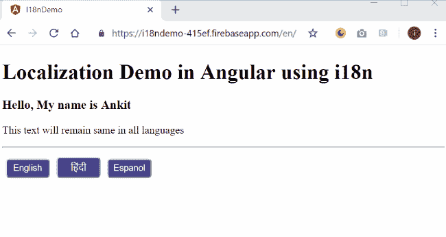
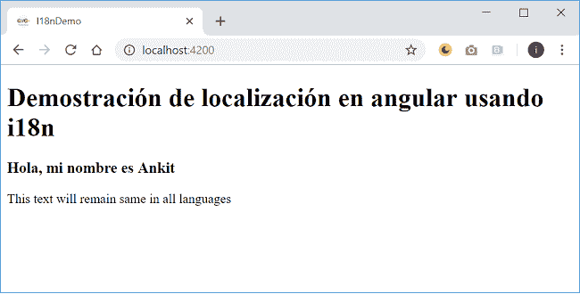
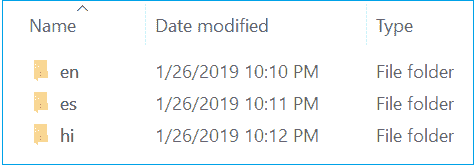
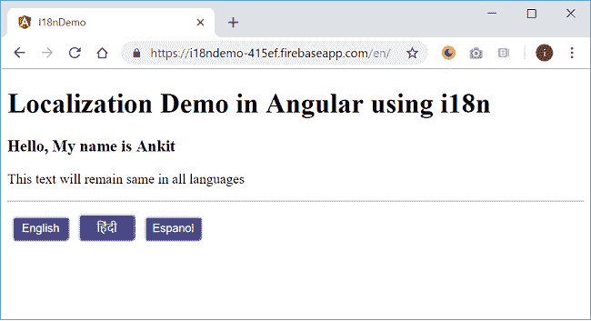

# 如何使用 i18n 工具在 Angular 中实现本地化

> 原文：<https://www.freecodecamp.org/news/how-to-implement-localization-in-angular-using-i18n-tools-a88898b1a0d0/>

### 介绍

在本文中，我们将学习如何使用 i18n 和本地化使我们的 Angular 应用程序在不同的语言中可用。我们将创建一个 Angular 应用程序，并将其配置为提供三种不同语言的内容。我们还将把我们的应用程序部署到 Google Firebase，看看本地化是如何实时进行的。

我们将使用 Angular 7 和 VS 代码开发我们的应用程序。看看应用程序的输出。



### 源代码

从 [GitHub](https://github.com/AnkitSharma-007/angular-i18n-localization) 获取该应用的源代码。

### i18n 是什么？

`I18n`，也称为国际化，是让我们的应用程序支持各种语言以扩展到全球受众的过程。

### 什么是本地化？

本地化是将应用程序翻译成特定语言的过程。我们需要对应用程序应用国际化，然后我们可以对它进行本地化。本地化允许我们用不同的语言来服务我们的应用程序。

### 创建 Angular 7 应用程序

第一步是创建一个 Angular 7 app。如果您是 Angular 的新手，我建议您阅读我的文章【Angular 7.0 入门，了解如何在您的机器上设置 Angular 开发环境。

运行以下命令创建应用程序。

```
ng new i18nDemo
```

使用 VS 代码打开 i18nDemo 应用程序。

### 设置应用程序组件

打开`app.component.html`文件。用下面的代码替换现有的文本。

```
<h1 i18n>  Localization Demo in Angular using i18n</h1><h3 i18n="@@myName">  Hello, My name is Ankit</h3><p>This text will remain same in all languages</p><hr />
```

你可以观察到我们用 i18n 属性标记了`<`h1>d<H3>标签。这是告诉 Angular 将该文本视为可翻译内容的一种方式。我们将在下一节详细探讨 i18n 属性。

### 创建翻译源文件

在 CLI 中运行以下命令创建翻译源文件。

```
ng xi18n --output-path translate
```

它将创建一个名为 translate 的文件夹，并在其中创建一个`messages.xlf`文件。打开该文件，您可以看到其中的以下 XML 代码。

```
<?xml version="1.0" encoding="UTF-8" ?><xliff version="1.2" >  <file source-language="en" datatype="plaintext" original="ng2.template">    <body>      <trans-unit id="3f2feb6d5fb690628177afa3ade2519db69ba838" datatype="html">        <source>Localization Demo in Angular using i18n</source>        <context-group purpose="location">          <context context-type="sourcefile">app/app.component.html</context>          <context context-type="linenumber">1</context>        </context-group>      </trans-unit>      <trans-unit id="myName" datatype="html">        <source>Hello, My name is Ankit</source>        <context-group purpose="location">          <context context-type="sourcefile">app/app.component.html</context>          <context context-type="linenumber">5</context>        </context-group>      </trans-unit>    </body>  </file></xliff>
```

这个文件包含一个`<trans-un` it >标签的列表。这些标签将包含使用 i18n 属性标记为翻译的所有内容。您还可以观察到 `each <tr` ans-unit >标签有一个与之关联的 id 属性。默认情况下，将为每个标记有 i18n 属性的标签生成这个唯一的 id。我们还可以通过提供一个带有@@的名字 pr `ef`来定制 id，就像我们在前面的部分中已经有了带有< h3 >标签的`e do` ne 一样。`Henc` e，< h3 >标签的 id 是我们定义的“我的名字”。

没有`<`的条目；翻译文件中的 p >标记，因为我们没有用 i18n 属性标记它。角度转换工具不会将其用于转换。

如果您更改了 HTML 文件中任何标签的文本，您需要重新生成翻译文件。重新生成文件将覆盖`<trans-un` it >标签的默认 id。因此，为每个可翻译的标签提供定制的 id 以保持一致性是明智的。

因此，我们已经成功地在我们的应用中实现了 i18n。在下一节中，我们将对其进行扩展，使其可用于不同的语言。

### 翻译内容

我们将把我们的申请翻译成除英语之外的两种新语言，即西班牙语和印地语。将 messages.xlf 文件复制三份，分别重命名为`messages.en.xlf`、`messages.es.xlf`和`messages.hi.xlf`。这些文件名可以根据您的选择定制，但是扩展名应该是`.xlf`。

打开 messages.es.xlf，在里面放入以下内容。

```
<?xml version="1.0" encoding="UTF-8" ?><xliff version="1.2" >  <file source-language="en" datatype="plaintext" original="ng2.template">    <body>      <trans-unit id="3f2feb6d5fb690628177afa3ade2519db69ba838" datatype="html">        <source>Localization Demo in Angular using i18n</source>        <target>Demostración de localización en angular usando i18n</target>        <context-group purpose="location">          <context context-type="sourcefile">app/app.component.html</context>          <context context-type="linenumber">1</context>        </context-group>      </trans-unit>      <trans-unit id="myName" datatype="html">        <source>Hello, My name is Ankit</source>        <target>Hola, mi nombre es Ankit</target>        <context-group purpose="location">          <context context-type="sourcefile">app/app.component.html</context>          <context context-type="linenumber">5</context>        </context-group>      </trans-unit>    </body>  </file></xliff>
```

这与原始 messages.xlf 文件的内容相同，但是我们添加了一个对应于 `each &l` t 的`<targ` et >标记；源&g`t; tag.` <目标>标签包含 c`ontent i`n 源>标签的翻译文本。在这里，我使用谷歌翻译进行翻译，但在实时应用程序中，语言专家将从 messages.xlf 文件中翻译`slate the co`内容。

同样，打开 messages.hi.xlf，在里面放入以下内容。

```
<?xml version="1.0" encoding="UTF-8" ?><xliff version="1.2" >  <file source-language="en" datatype="plaintext" original="ng2.template">    <body>      <trans-unit id="3f2feb6d5fb690628177afa3ade2519db69ba838" datatype="html">        <source>Localization Demo in Angular using i18n</source>        <target>I18n का उपयोग कर कोणीय में स्थानीयकरण डेमो</target>        <context-group purpose="location">          <context context-type="sourcefile">app/app.component.html</context>          <context context-type="linenumber">1</context>        </context-group>      </trans-unit>      <trans-unit id="myName" datatype="html">        <source>Hello, My name is Ankit</source>        <target>हेलो, मेरा नाम अंकित है</target>        <context-group purpose="location">          <context context-type="sourcefile">app/app.component.html</context>          <context context-type="linenumber">5</context>        </context-group>      </trans-unit>    </body>  </file></xliff>
```

最后，我们将制作英文翻译文件。打开 messages.en.xlf，在里面放入以下内容。

```
<?xml version="1.0" encoding="UTF-8" ?><xliff version="1.2" >  <file source-language="en" datatype="plaintext" original="ng2.template">    <body>      <trans-unit id="3f2feb6d5fb690628177afa3ade2519db69ba838" datatype="html">        <source>Localization Demo in Angular using i18n</source>        <target>Localization Demo in Angular using i18n</target>        <context-group purpose="location">          <context context-type="sourcefile">app/app.component.html</context>          <context context-type="linenumber">1</context>        </context-group>      </trans-unit>      <trans-unit id="myName" datatype="html">        <source>Hello, My name is Ankit</source>        <target>Hello, My name is Ankit</target>        <context-group purpose="location">          <context context-type="sourcefile">app/app.component.html</context>          <context context-type="linenumber">5</context>        </context-group>      </trans-unit>    </body>  </file></xliff>
```

### 将应用程序配置为支持多种语言

打开`angular.json`文件并添加以下配置。

```
"build": {  ...  "configurations": {    ...    "es": {      "aot": true,      "i18nFile": "src/translate/messages.es.xlf",      "i18nFormat": "xlf",      "i18nLocale": "es",      "i18nMissingTranslation": "error"    }  }},"serve": {  ...  "configurations": {    ...    "es": {      "browserTarget": "i18nDemo:build:es"    }  }}
```

这里我们已经添加了西班牙语的配置。我们已经为 i18n 文件提供了路径和格式，并将区域设置为“es”。当我们执行应用程序时，应用程序的内容将从提供的 i18n 文件路径提供。

同样，您可以为其他语言添加配置。

### 执行演示

在 angular.json 文件中添加了所有语言的配置后，运行以下命令启动服务器。

```
ng serve --configuration=es
```

这将在“es”配置中启动应用程序，我们的应用程序将显示西班牙语翻译。

参考如下所示的输出屏幕:



我们定义的配置将只帮助应用程序在本地机器上运行。一旦应用程序启动，我们就不能更改配置。

一个生产应用程序将需要该应用程序只需更改 URL 就可以服务于不同的语言。比如，`mywebsite.com/es`会提供西班牙语版本的 site，`mywebsite.com/en`会提供英语版本。在这种情况下，应用程序将从不同语言的不同虚拟目录提供服务。我们将在下一节探讨如何做到这一点。

### 为生产修改应用程序组件

打开`app.component.ts`，放入以下代码。

```
import { Component, LOCALE_ID, Inject } from '@angular/core';@Component({  selector: 'app-root',  templateUrl: './app.component.html',  styleUrls: ['./app.component.css']})export class AppComponent {  title = 'i18nDemo';  languageList = [    { code: 'en', label: 'English' },    { code: 'hi', label: 'हिंदी' },    { code: 'es', label: 'Espanol' }  ];  constructor(@Inject(LOCALE_ID) protected localeId: string) { }}
```

这里我们定义了一个语言列表和它们的地区代码。这些地区代码是标准代码。你可以通过简单的谷歌搜索很容易地得到一个语言列表和相应的地区代码。

在`app.component.html`文件中添加以下代码。

```
<ng-container *ngFor="let language of languageList"> <a href="/{{language.code}}/"> <button class="button">{{language.label}}</button> </a></ng-container>
```

这里我们为三种语言定义了三个按钮。每点击一次按钮，区域设置 id 就会改变，区域设置 id 也会附加到 URL 上。这将允许我们从不同的目录为应用程序提供服务。

将下面的代码放到`app.component.css`文件中，将样式应用到这些按钮上。

```
.button {  background-color: darkslateblue;  border-radius: 5px;  color: white;  padding: 5px;  width: 10%;  margin: 5px;  text-decoration: none;  cursor: pointer;}
```

### 为生产编译应用程序的脚本

我们需要为三种不同的语言提供三个不同的服务地点。要为生产构建一种语言的应用程序包，我们将使用以下命令:

```
ng build --prod --i18n-locale es --i18n-format xlf --i18n-file src/translate/messages.es.xlf --output-path=dist/es --baseHref /es/
```

让我们理解这个命令。我们提供了包的地区 id，对于西班牙语来说是“es”。我们还提供了 i18n 文件路径和格式。需要输出路径属性来提供应用程序包的位置。baseHref 属性指定将从其提供此包的基本 URL。

我们需要通过更改 i18n 文件路径和`baseHref`属性值来为我们将提供的每种语言运行这个命令。然而，如果我们有很多语言，这将是一个麻烦的任务。因此，我们将编写一个脚本来生成所有语言的包。打开`package.json`文件，在“脚本”部分添加以下脚本。

```
"build-locale:en": "ng build --prod --i18n-locale en --i18n-format xlf --i18n-file src/translate/messages.en.xlf --output-path=dist/en --baseHref /en/","build-locale:es": "ng build --prod --i18n-locale es --i18n-format xlf --i18n-file src/translate/messages.es.xlf --output-path=dist/es --baseHref /es/","build-locale:hi": " ng build --prod --i18n-locale hi --i18n-format xlf --i18n-file src/translate/messages.hi.xlf --output-path=dist/hi --baseHref /hi/","build-locale": "npm run build-locale:en && npm run build-locale:es && npm run build-locale:hi"
```

这里，我们为我们正在使用的三种语言创建了三个脚本。“build-locale”脚本将一次执行所有这些。所有这些脚本都是键值对。我们在这里使用的密钥名称是可定制的，您可以使用自己选择的任何名称。要为所有语言创建应用程序包，请运行以下命令:

```
npm run build-locale
```

成功执行后，它将在应用程序的根文件夹中创建一个“dist”文件夹。dist 文件夹有三个子文件夹，以三种不同的语言为我们的应用程序服务。请参考下图:



### 在 Firebase 上部署应用程序

我们将在 Firebase 上部署这个应用程序，以实时查看语言变化。参考我的文章[在 Firebase 上托管 Blazor 应用](https://ankitsharmablogs.com/hosting-a-blazor-application-on-firebase/)并按照提到的步骤在 Firebase 上部署这个 Angular 应用。

一旦部署了应用程序，您将获得托管 URL。打开 URL 并将我们前面定义的 baseHref 属性附加到 URL。因此，对于西班牙语，URL 将是`yoursite.com/es/`等等。

我们在这里构建的应用程序托管在[https://i18ndemo-415ef.firebaseapp.com/en/](https://i18ndemo-415ef.firebaseapp.com/en/)。如果您打开这个 URL，您将看到如下所示的输出:



点击提供的链接。URL 将会改变，应用程序将以新的语言重新加载。

### 结论

在这篇文章中，我们学习了如何使用 i18n 工具国际化我们的 Angular 应用程序。我们还将定位应用于我们的角度应用。本地化使我们能够以不同的语言提供我们的应用程序，这有助于将影响扩展到全球受众。通过在 Firebase 上部署我们的应用程序，我们还了解了本地化如何在生产环境中工作。

从 [GitHub](https://github.com/AnkitSharma-007/angular-i18n-localization) 中获取源代码，并尝试更好地理解。

你在准备面试吗？！阅读我关于技术面试的 C#编码问题的文章

### 请参见

*   [了解服务器端 Blazor](https://ankitsharmablogs.com/understanding-server-side-blazor/)
*   [了解角度 6 动画](https://ankitsharmablogs.com/understanding-angular-6-animations/)
*   [ASP.NET 岩心——使用角度为 5 的高图表](https://ankitsharmablogs.com/asp-net-core-using-highcharts-with-angular-5/)
*   [ASP.NET 核心—使用 Angular 5 和实体框架核心的 CRUD】](https://ankitsharmablogs.com/asp-net-core-crud-using-angular-5-and-entity-framework-core/)
*   [使用角度 5°和 ADO.NET 的 ASP.NET 堆芯的积垢操作](https://ankitsharmablogs.com/crud-operations-asp-net-core-using-angular-5-ado-net/)

最初发表于[https://ankitsharmablogs.com/](https://ankitsharmablogs.com/)