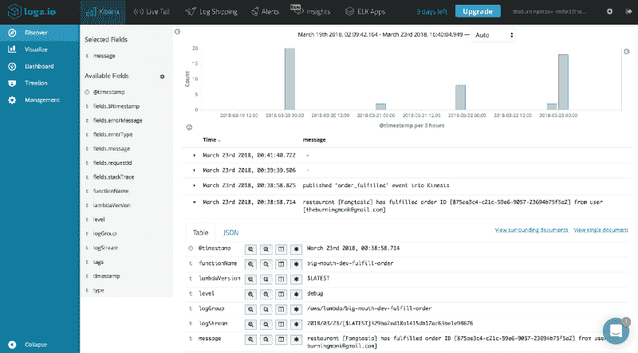
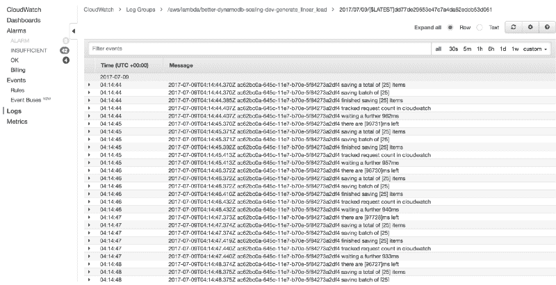
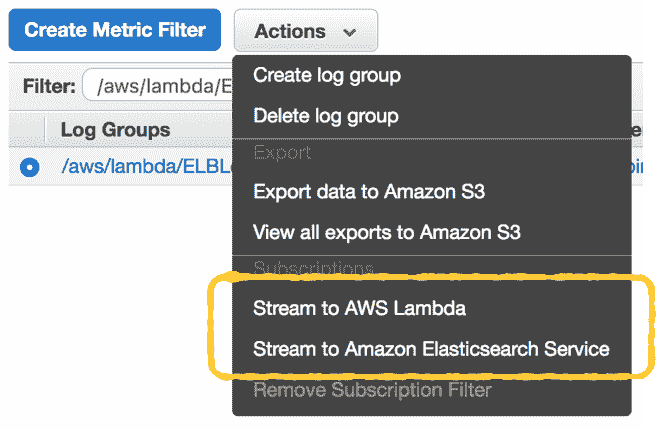
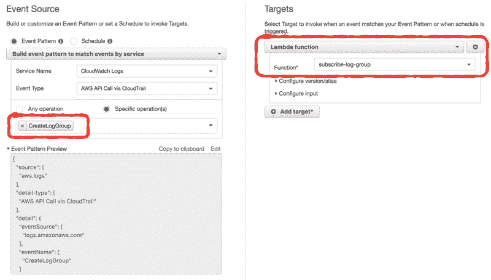
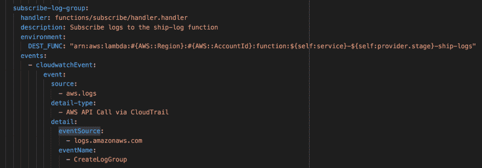
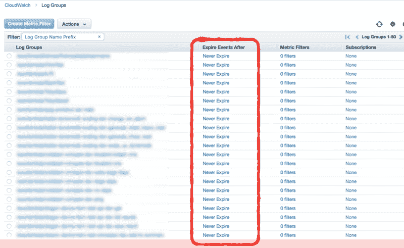
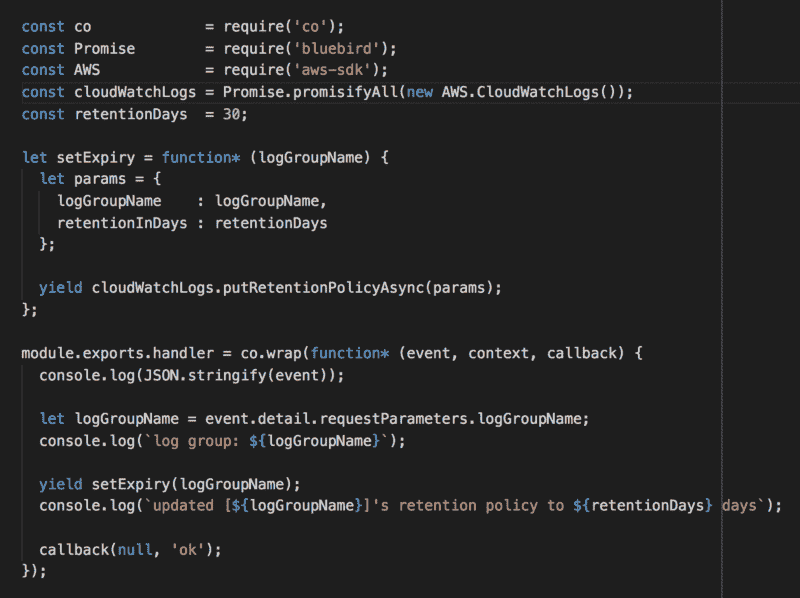

# 如何为 AWS Lambda 实现日志聚合

> 原文：<https://www.freecodecamp.org/news/how-to-implement-log-aggregation-for-aws-lambda-ca714bf02f48/>

作者:崔琰

# 如何为 AWS Lambda 实现日志聚合

Ship the logs for your Lambda functions to a log aggregation service such as Logz.io

在执行 Lamb da 函数的过程中，无论尤尔向 std out 写入什么(例如，在 Node.js 中使用`console.log`)都将被 Lamb da 捕获，并发送到后台同步的云观察日志中。它这样做不会增加你的功能执行时间。

您可以在云监控日志中找到您的 Lamb 功能的所有日志。每个功能都有一个唯一的日志组。每个日志组由许多日志流组成，每个并发执行的函数实例有一个日志流。

您可以通过[放置事件](http://docs.aws.amazon.com/AmazonCloudWatchLogs/latest/APIReference/API_PutLogEvents.html)操作将日志发送到您自己的云观察日志。或者您可以将它们发送到您首选的日志聚合服务，如 Splunk 或 Elas tic search。

但是，记住**每件事都必须在函数调用**期间完成。如果您在活动期间打了额外的网络电话，那么您将为额外的活动时间付费。您的用户也将不得不等待更长时间的 API 响应。

这些额外的网络调用可能每次调用只增加 10-20 毫秒。但是你有微服务，一个用户动作可以涉及到几个 API 调用。这些 10-20 毫秒的 API 调用可能会增加 100 毫秒以上的面向用户的延迟，这足以[减少 1%的销售额，据亚马逊](https://blog.gigaspaces.com/amazon-found-every-100ms-of-latency-cost-them-1-in-sales/)称。

所以，不要那么做！

相反，应在事后处理云监控日志中的日志。

在 Cloud Watch Logs con sole 中，您可以选择一个日志组，并选择将数据直接传输到亚马逊的主机电子搜索服务。

如果你已经在使用主机电子搜索服务，这是非常有用的。但是如果你还在评估你的选择，那么在你决定 AWS 主持的 Elas tic 搜索之前，读一下这篇文章。

您也可以将日志流式传输到 Lamb 函数。甚至已经有一些 Lambda 函数将云观察日志推送到其他日志聚合服务。

很明显，这是许多 AWS 客户所要求的。

*You can find blue­prints for ship­ping Cloud­Watch Logs to Sumo­log­ic, Splunk and Log­gly out of the box.*

您可以使用这些蓝图来帮助您编写一个 Lamb 函数，该函数会将云观察日志发送到您首选的日志聚合服务。但是这里还有一些事情需要记住。

每当尤尔创建一个新的 Lamb 函数时，它都会在云监视日志中创建一个新的日志组。您希望避免将日志组订阅到日志传送功能的手动过程。

相反，启用云跟踪，然后在云监视事件中设置一个事件模式，以便在创建阿尔日志组时调用另一个 Lamb 函数。

您可以在 Cloud Watch con sole 中进行一次性设置。

*Match the Cre­ateL­og­Group API call in Cloud­Watch Logs and trig­ger a sub­scribe-log-group Lamb­da func­tion. This function would sub­scribe the new log group to the log shipping func­tion.*

如果您正在处理多个 AWS 帐户，那么您应该避免设置人工流程。有了 [Server less](https://serverless.com/framework/) 框架，你可以在`serverless.yml`中为这个`subscribe-log-group`函数设置事件源。

需要记住的另一件事是**您需要避免为** `ship-logs` **函数本身订阅日志组。**这会造成**一个无限的卷入循环**，这是你想要避免的*痛苦的*后果。

还有一件事。

默认情况下，当 Lamb 为您的函数创建新的日志组时，保留策略设置为`Never Expire`。这是多余的，因为随着时间的推移，[数据存储成本](https://aws.amazon.com/cloudwatch/pricing/)会增加。如果您已经将日志运送到其他地方，这也是不必要的！

*By default, logs for your Lamb­da func­tions are kept in CloudWatch Logs for­ev­er*

我们可以应用上述相同的技术，并添加另一个 Lamb 功能，自动将保留策略更新到更容易实现的内容。

*Here’s a Lamb­da func­tion for auto-updat­ing the log reten­tion pol­i­cy to 30 days.*

如果你已经有很多日志组，那么就写一个一次性的脚本来更新它们。您可以通过使用[描述日志组](http://docs.aws.amazon.com/AmazonCloudWatchLogs/latest/APIReference/API_DescribeLogGroups.html) API 调用在所有日志组中递归来实现这一点。

如果你对自己应用这些技术感兴趣，我为你准备了一个简单的演示项目。如果您遵循自述文件中的说明并部署函数，那么您的 Lambda 函数的所有日志都将被交付到 [Logz.io](https://logz.io/) 。