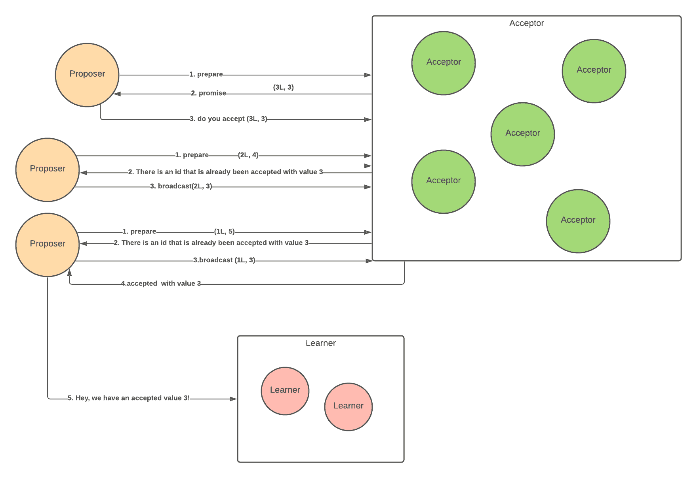
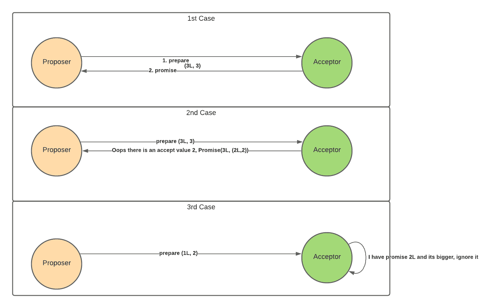
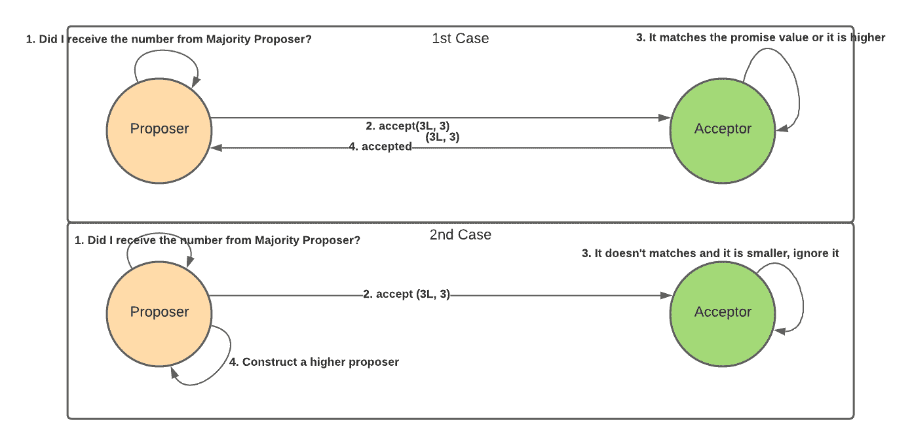

# 如何在纯函数中实现 Paxos 算法

> 原文：<https://www.freecodecamp.org/news/how-to-implement-paxos-algorithm-in-pure-functions/>

想象你在一个足球队里。训练结束后，球队喜欢一起出去吃饭。

假设团队平时想吃披萨或者汉堡。然而，你希望整个团队在练习后去同一个地方，因为那样更有趣。

因此，你需要让团队就每个人要去的足球场达成一致——去买汉堡还是披萨。

但是有一个问题:教练提前回家了。练习结束后，每个人都又累又饿，所以他们很容易分心，想要快速做出决定。

此外，你不能在足球场上大喊大叫，因为整个团队往往会大声说话，你的建议可能很容易被另一个人覆盖。

你一定在想，“我只有一种方法可以达成这个协议——通过人与人之间的交流，并希望每个人都达成共识。”

你打算怎么解决这个问题？

这个类比和我们在分布式系统中遇到的问题是一样的，但是这次您处理的是许多服务器。我们希望让许多服务器在异步环境中就公共事件或公共信息达成一致。

你可以使用许多算法来解决问题，今天我们将讨论其中的一个:Paxos 算法。

Paxos 是关于这种分布式共识算法的最早发表的论文之一，该算法一轮又一轮地运行，以帮助许多服务器就一个组成员提出的值达成一致。

该算法使用对等通信，其中每个对等体可以扮演三个角色，即提议者、接受者和学习者。这些角色不必在每个服务器上分开——这意味着一个服务器可以同时扮演学习者、接受者和提议者的角色。

回到上面的足球类比，为了简单起见，我们将三个角色分开。团队的一半可以是提议者，四分之一可以是接受者，四分之一可以是学习者。

提议者可以向接受者提议他们想去哪里吃饭。接受者将有一些标准来决定基于每个建议值他们将选择哪个位置。一旦接受者选择了大多数建议的信息，他们将把它发送给学习者。

例如，一个接受者选择了一个汉堡。他们告诉学习者，团队中的大多数人想吃汉堡。然而，这就是有趣的地方:另一个接受者选择了一个比萨饼，他们告诉学习者团队中的大多数人想吃比萨饼。

因此，由学习者根据他们从所有接受者那里得到的信息来宣布大多数人真正想吃什么。该算法将持续运行多次迭代，直到学习者宣布达成共识。

我将在本文后面更详细地解释 Paxos 算法及其实现。到本文结束时，您将了解分布式系统中的复制状态机是如何工作的，以及 Chubby [协议](https://static.googleusercontent.com/media/research.google.com/en//archive/chubby-osdi06.pdf)中使用的主要算法。

## 开始之前

在本文中，我们不会讨论“为什么”以及算法达到共识所经历的步骤。如果你对 Paxos 算法的工作原理感兴趣，你可以看看这个 Google [技术演讲](https://www.youtube.com/watch?v=d7nAGI_NZPk)中的一个很棒的简介。

其次，我假设证明和理论是可行的，本文将主要讨论实现。

## Paxos 算法简介

在 Paxos 算法中有 3 个角色——提议者、接受者和学习者。

提议者将通过向组中的另一个成员发送消息来提议一个值。

接受者将接受提议的价值。

学习者了解该组是否在算法的特定回合中达成共识。

Paxos 算法分为两个阶段(准备阶段和接受阶段)，如下所示:

### 准备阶段

每组的提议者选择一个提议号，并向系统的接受者发送一个准备好的请求。该消息不需要被所有人接收。它只需要成为算法继续进行的多数(法定人数)。

收到此消息的接受者将与当前最高的建议编号进行比较。如果传入的请求高于提议号，它将接受并向提议发回一条充满希望的消息，“好吧，你的提议高于我目前的提议，所以我会选择你。”

如果接受者已经接受了一条消息，它将发送同样的消息，除了它会说，“好吧，你的提议比我现有的要高。不过，我已经接受了留言提议。我还将在邮件中附上提案编号和价值。”

如果接受者收到建议号较低的消息，它将简单地忽略它。

### 接受阶段

如果提议者收到多数人的承诺响应，它将检查是否有任何承诺的消息具有接受的消息。如果它有一个接受消息，建议将接受该消息，以再次向处理器发送接受请求。

假设提议者没有收到它向其广播消息的大多数接受者的响应。在这种情况下，它将简单地假设“我的建议号不够高，我将创建一个更高的建议号，并将其再次广播给接受者。”

如果提议者收到大多数接受者的回应，它将通知学习者它已经达成共识。

假设一个接受者收到一个接受请求，提议号等于它的承诺。在这种情况下，它将向建议者发回一个接受建议值确认。

如果接受者收到的接受请求的建议编号小于准备好的请求，它将忽略该请求。

在学习者方面，一旦它收到来自建议的多数(法定人数)价值，它将标志着它已经达成共识。

理论上，这听起来很简单。然而，在实践中，有许多情况需要考虑。几篇[论文](https://static.googleusercontent.com/media/research.google.com/en//archive/paxos_made_live.pdf)讲述了他们在生产系统中实施 Paxos 的经验。

我看到许多资源基于面向对象语言实现了 Paxos，比如 Java [实现](https://github.com/cocagne/paxos#cocagnepaxosessential)或者用 [actor 系统](https://github.com/ahanwadi/paxos)实现。所以我想，“为什么不试着用函数式编程来实现呢？”

请注意，这个实现是基于 Paxos 制作的简单算法论文。它没有任何奇特的不变量，比如对机器故障的解释、领导人选举等等。该实现还实现了单轮基本 Paxos 算法。

## 挑战

### 模型构建

Paxos 算法的本质是节点之间的通信。因此，将角色建模为对象将是最直观的。

因为它提到了提议者、接受者和学习者如何互动，所以参与者系统是创建算法的最简单的方法。我们可以有 3 个参与者，并将逻辑和状态封装在参与者中。

### 不可变状态管理

如果我们想实现本质上不变的东西，这可能是一个挑战，因为算法需要内部状态的不断变化。面向对象的编程可以封装提议者、接受者和学习者的状态管理。在每个阶段，我们可以改变每个实例内部的状态。
例如，一个 acceptors 实例可以有一个 max_id 作为可变的内部状态，如果它收到一个包含更高 id 号的准备好的消息，它可以改变 max_id。

## 如何在功能上实现 Paxos 算法

让我们讨论如何在功能上实现 Paxos 算法，以及如何设计该实现。我将使用 Scala 并利用 cats 的数据库，而不是重新发明创建自己的 monad 实例和它的法则。

### 领域模型

让我们从每个领域模型开始。最简单的方法是想象提议者、接受者和学习者需要什么。

### 提议者模型

提案人将由一个值、一个提案号和一个法定人数组成。建议编号必须是唯一的，并且是递增的数字。实现该建议编号的常见方法是使用一个带有机器 id 的 id 来确保唯一性。