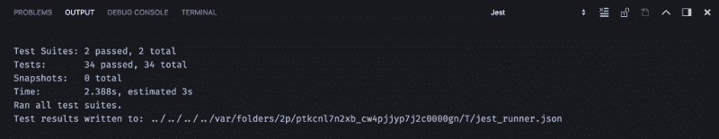

# 用 JavaScript 实现承诺

> 原文：<https://www.freecodecamp.org/news/how-to-implement-promises-in-javascript-1ce2680a7f51/>

我最喜欢编程的一点是*啊哈！*你开始完全理解一个概念的时刻。尽管可能要花很长时间和不小的努力才能到达那里，但肯定是值得的。

我认为，评估(并帮助提高)我们对某一特定主题的理解程度的最有效的方法是尝试将知识应用到现实世界中。这不仅能让我们发现并最终解决我们的弱点，还能让我们了解事情的运作方式。一个简单的*试验和* *误差*方法通常会揭示出那些之前难以捉摸的细节。

考虑到这一点，我相信学习如何实现 **promises** 是我编程之旅中最重要的时刻之一——它让我对异步代码如何工作有了非常宝贵的了解，并让我成为一名更好的程序员。

我希望这篇文章也能帮助你掌握用 JavaScript 实现承诺。

我们将重点讨论如何根据 [the Promises/A+规范](https://promisesaplus.com/)用 [the Bluebird API](http://bluebirdjs.com/docs/api-reference.html) 的一些方法实现 promise 核心。我们也将使用[TDD 方法](https://en.wikipedia.org/wiki/Test-driven_development)和 [Jest](https://jestjs.io/) 。

打字稿也会派上用场。

鉴于我们将在这里学习实现的技巧，我将假设你对什么是承诺有一些基本的理解，并对它们如何工作有一个模糊的认识。如果你没有，这里的是一个很好的起点。

现在我们已经解决了这个问题，继续克隆[库](https://github.com/maciejcieslar/promiseq)，让我们开始吧。

### 承诺的核心

如您所知，承诺是一个具有以下属性的对象:

#### 然后

为我们的承诺附加一个处理程序的方法。它返回一个新的承诺，该承诺的值由处理程序的一个方法映射自上一个承诺。

#### 经理人

由**然后由**附加的处理程序数组。处理程序是包含两个方法 **onSuccess** 和 **onFail** 的对象，这两个方法都作为参数传递给**，然后传递给** ( **onSuccess** ， **onFail** ) *。*

```
type HandlerOnSuccess<T, U = any> = (value: T) => U | Thenable<U>;
type HandlerOnFail<U = any> = (reason: any) => U | Thenable<U>;

interface Handler<T, U> {
  onSuccess: HandlerOnSuccess<T, U>;
  onFail: HandlerOnFail<U>;
}
```

#### 状态

承诺可以处于三种状态之一:**已解决、** **已拒绝、** 或**待定**。

**Resolved** 意味着要么一切顺利，我们收到了我们的价值，要么我们发现并处理了错误。

**Rejected** 意思是要么我们拒绝了承诺，要么抛出了一个错误，我们没有抓住。

**Pending** 表示 **resolve** 和 **reject** 方法都还没有被调用，我们还在等待值。

术语“承诺被解决”意味着承诺或者被解决或者被拒绝。

#### 价值

一个我们已经解决或拒绝的价值。

一旦设定了值，就无法更改。

### 测试

根据 TDD 方法，我们希望在实际代码出现之前编写测试，所以我们就这么做吧。

以下是我们的核心测试:

```
describe('PQ <constructor>', () => {
  test('resolves like a promise', () => {
    return new PQ<number>((resolve) => {
      setTimeout(() => {
        resolve(1);
      }, 30);
    }).then((val) => {
      expect(val).toBe(1);
    });
  });

  test('is always asynchronous', () => {
    const p = new PQ((resolve) => resolve(5));

    expect((p as any).value).not.toBe(5);
  });

  test('resolves with the expected value', () => {
    return new PQ<number>((resolve) => resolve(30)).then((val) => {
      expect(val).toBe(30);
    });
  });

  test('resolves a thenable before calling then', () => {
    return new PQ<number>((resolve) =>
      resolve(new PQ((resolve) => resolve(30))),
    ).then((val) => expect(val).toBe(30));
  });

  test('catches errors (reject)', () => {
    const error = new Error('Hello there');

    return new PQ((resolve, reject) => {
      return reject(error);
    }).catch((err: Error) => {
      expect(err).toBe(error);
    });
  });

  test('catches errors (throw)', () => {
    const error = new Error('General Kenobi!');

    return new PQ(() => {
      throw error;
    }).catch((err) => {
      expect(err).toBe(error);
    });
  });

  test('is not mutable - then returns a new promise', () => {
    const start = new PQ<number>((resolve) => resolve(20));

    return PQ.all([
      start
        .then((val) => {
          expect(val).toBe(20);
          return 30;
        })
        .then((val) => expect(val).toBe(30)),
      start.then((val) => expect(val).toBe(20)),
    ]);
  });
});
```

#### 运行我们的测试

我强烈推荐对 Visual Studio 代码使用 [Jest 扩展。它在后台运行我们的测试，并在代码行之间显示结果，分别用绿色和红色的点表示通过和失败的测试。](https://marketplace.visualstudio.com/items?itemName=Orta.vscode-jest)

要查看结果，请打开“输出”控制台并选择“Jest”选项卡。



我们还可以通过执行以下命令来运行我们的测试:

```
npm run test
```

不管我们怎么做测试，我们可以看到所有的测试结果都是阴性的。

让我们改变这一点。

### 实施承诺核心

#### 构造器

```
class PQ<T> {
  private state: States = States.PENDING;
  private handlers: Handler<T, any>[] = [];
  private value: T | any;
  public static errors = errors;

  public constructor(callback: (resolve: Resolve<T>, reject: Reject) => void) {
    try {
      callback(this.resolve, this.reject);
    } catch (e) {
      this.reject(e);
    }
  }
}
```

我们的构造函数将一个**回调**作为参数。

我们用 **this.resolve** 和 **this.reject** 作为参数来调用这个回调。

注意，通常我们会将 **this.resolve** 和 **this.reject** 绑定到 **this** ，但是这里我们使用了类箭头方法。

#### setResult

现在我们必须设定结果。请记住，我们必须正确处理结果，这意味着，如果它返回一个承诺，我们必须首先解决它。

```
class PQ<T> {

  // ...

  private setResult = (value: T | any, state: States) => {
    const set = () => {
      if (this.state !== States.PENDING) {
        return null;
      }

      if (isThenable(value)) {
        return (value as Thenable<T>).then(this.resolve, this.reject);
      }

      this.value = value;
      this.state = state;

      return this.executeHandlers();
    };

    setTimeout(set, 0);
  };
}
```

首先，我们检查状态是否不是**pending**——如果是，那么承诺已经确定，我们不能给它赋值。

然后我们需要检查一个值是否是一个**表**。简单来说，一个 **thenable** 就是一个以 **then** 为方法的对象。

按照惯例，一个**名字**应该表现得像一个承诺。所以为了得到结果，我们将调用**然后**并传递参数 **this.resolve** 和 **this.reject** 。

一旦 **thenable** 稳定下来，它将调用我们的一个方法，并给出我们期望的非承诺值。

所以现在我们必须检查一个对象是否是一个 **thenable** 。

```
describe('isThenable', () => {
  test('detects objects with a then method', () => {
    expect(isThenable({ then: () => null })).toBe(true);
    expect(isThenable(null)).toBe(false);
    expect(isThenable({})).toBe(false);
  });
});
```

```
const isFunction = (func: any) => typeof func === 'function';

const isObject = (supposedObject: any) =>
  typeof supposedObject === 'object' &&
  supposedObject !== null &&
  !Array.isArray(supposedObject);

const isThenable = (obj: any) => isObject(obj) && isFunction(obj.then);
```

重要的是要意识到我们的承诺永远不会是同步的，即使**回调**中的代码是同步的。

我们将通过使用 **setTimeout** 将执行延迟到事件循环的下一次迭代。

现在唯一要做的就是设置我们的值和状态，然后执行注册的处理程序。

#### 执行处理程序

```
class PQ<T> {

  // ...

  private executeHandlers = () => {
    if (this.state === States.PENDING) {
      return null;
    }

    this.handlers.forEach((handler) => {
      if (this.state === States.REJECTED) {
        return handler.onFail(this.value);
      }

      return handler.onSuccess(this.value);
    });

    this.handlers = [];
  };
}
```

再次确保状态不是**未决**。

承诺的状态决定了我们要使用哪个函数。

如果**解决**，则成功执行**，否则失败**。

为了安全起见，现在让我们清除我们的处理程序数组，不要在将来意外地执行任何东西。无论如何，可以附加一个处理程序并在以后执行。

这就是我们接下来必须讨论的:连接我们的句柄的方法。

#### attachHandler

```
class PQ<T> {

  // ...

  private attachHandler = (handler: Handler<T, any>) => {
    this.handlers = [...this.handlers, handler];

    this.executeHandlers();
  };
}
```

这真的像看起来那么简单。我们只需在处理程序数组中添加一个处理程序并执行它。就是这样。

现在，为了将它们放在一起，我们需要实现**然后**方法。

#### 然后

```
class PQ<T> {

  // ...

  public then<U>(
    onSuccess?: HandlerOnSuccess<T, U>,
    onFail?: HandlerOnFail<U>,
  ) {
    return new PQ<U | T>((resolve, reject) => {
      return this.attachHandler({
        onSuccess: (result) => {
          if (!onSuccess) {
            return resolve(result);
          }

          try {
            return resolve(onSuccess(result));
          } catch (e) {
            return reject(e);
          }
        },
        onFail: (reason) => {
          if (!onFail) {
            return reject(reason);
          }

          try {
            return resolve(onFail(reason));
          } catch (e) {
            return reject(e);
          }
        },
      });
    });
  }
}
```

然后在**中，**我们返回一个承诺，在**回调**中，我们附加一个处理程序，然后用于等待当前承诺的完成。

当这种情况发生时，要么处理程序的**成功**要么**失败**将被执行，我们将相应地继续。

这里要记住的一件事是，传递给**和**的处理程序都不是必需的。然而，重要的是，我们不要试图执行可能**未定义**的东西。

同样，在 **onFail** 中，当处理程序被传递时，我们实际上解决了返回的承诺，因为错误已经被处理。

#### 捕捉

**Catch** 实际上只是对 **then** 方法的抽象。

```
class PQ<T> {

  // ...

  public catch<U>(onFail: HandlerOnFail<U>) {
    return this.then<U>(identity, onFail);
  }
}
```

就是这样。

#### ***最后***

**Finally** 也只是对 doing**then**(**finallyCb**， **finallyCb** )的抽象，因为它并不真正关心承诺的结果。

其实也是保存了之前承诺的结果并返回。所以无论最终由**返回什么都不重要。**

```
describe('PQ.prototype.finally', () => {
  test('it is called regardless of the promise state', () => {
    let counter = 0;
    return PQ.resolve(15)
      .finally(() => {
        counter += 1;
      })
      .then(() => {
        return PQ.reject(15);
      })
      .then(() => {
        // wont be called
        counter = 1000;
      })
      .finally(() => {
        counter += 1;
      })
      .catch((reason) => {
        expect(reason).toBe(15);
        expect(counter).toBe(2);
      });
  });
});
```

```
class PQ<T> {

  // ...

  public finally<U>(cb: Finally<U>) {
    return new PQ<U>((resolve, reject) => {
      let val: U | any;
      let isRejected: boolean;

      return this.then(
        (value) => {
          isRejected = false;
          val = value;
          return cb();
        },
        (reason) => {
          isRejected = true;
          val = reason;
          return cb();
        },
      ).then(() => {
        if (isRejected) {
          return reject(val);
        }

        return resolve(val);
      });
    });
  }
}
```

#### toString

```
describe('PQ.prototype.toString', () => {
  test('returns [object PQ]', () => {
    expect(new PQ<undefined>((resolve) => resolve()).toString()).toBe(
      '[object PQ]',
    );
  });
});
```

```
class PQ<T> {

  // ...

  public toString() {
    return `[object PQ]`;
  }
}
```

它只会返回一个字符串`[object PQ]`。

实现了我们承诺的核心后，我们现在可以实现前面提到的一些蓝鸟方法，这将使我们更容易实现承诺。

### 其他方法

#### 承诺.决心

它应该如何工作。

```
describe('PQ.resolve', () => {
  test('resolves a value', () => {
    return PQ.resolve(5).then((value) => {
      expect(value).toBe(5);
    });
  });
});
```

```
class PQ<T> {

  // ...

  public static resolve<U = any>(value?: U | Thenable<U>) {
    return new PQ<U>((resolve) => {
      return resolve(value);
    });
  }
}
```

#### 承诺.拒绝

它应该如何工作。

```
describe('PQ.reject', () => {
  test('rejects a value', () => {
    return PQ.reject(5).catch((value) => {
      expect(value).toBe(5);
    });
  });
});
```

```
class PQ<T> {

  // ...

  public static reject<U>(reason?: any) {
    return new PQ<U>((resolve, reject) => {
      return reject(reason);
    });
  }
}
```

#### 承诺。所有

它应该如何工作。

```
describe('PQ.all', () => {
  test('resolves a collection of promises', () => {
    return PQ.all([PQ.resolve(1), PQ.resolve(2), 3]).then((collection) => {
      expect(collection).toEqual([1, 2, 3]);
    });
  });

  test('rejects if one item rejects', () => {
    return PQ.all([PQ.resolve(1), PQ.reject(2)]).catch((reason) => {
      expect(reason).toBe(2);
    });
  });
});
```

```
class PQ<T> {

  // ...

  public static all<U = any>(collection: (U | Thenable<U>)[]) {
    return new PQ<U[]>((resolve, reject) => {
      if (!Array.isArray(collection)) {
        return reject(new TypeError('An array must be provided.'));
      }

      let counter = collection.length;
      const resolvedCollection: U[] = [];

      const tryResolve = (value: U, index: number) => {
        counter -= 1;
        resolvedCollection[index] = value;

        if (counter !== 0) {
          return null;
        }

        return resolve(resolvedCollection);
      };

      return collection.forEach((item, index) => {
        return PQ.resolve(item)
          .then((value) => {
            return tryResolve(value, index);
          })
          .catch(reject);
      });
    });
  }
}
```

我相信实现非常简单。

从 **collection.length，**开始，我们对每个 **tryResolve** 进行倒计时，直到我们到达 0，这意味着集合中的每个项目都已被解析。然后，我们解析新创建的集合。

#### 承诺。任何

它应该如何工作。

```
describe('PQ.any', () => {
  test('resolves the first value', () => {
    return PQ.any<number>([
      PQ.resolve(1),
      new PQ((resolve) => setTimeout(resolve, 15)),
    ]).then((val) => expect(val).toBe(1));
  });

  test('rejects if the first value rejects', () => {
    return PQ.any([
      new PQ((resolve) => setTimeout(resolve, 15)),
      PQ.reject(1),
    ]).catch((reason) => {
      expect(reason).toBe(1);
    });
  });
});
```

```
class PQ<T> {

  // ...

  public static any<U = any>(collection: (U | Thenable<U>)[]) {
    return new PQ<U>((resolve, reject) => {
      return collection.forEach((item) => {
        return PQ.resolve(item)
          .then(resolve)
          .catch(reject);
      });
    });
  }
}
```

我们只是等待第一个值被解析，并在一个承诺中返回它。

#### 承诺.道具

它应该如何工作。

```
describe('PQ.props', () => {
  test('resolves object correctly', () => {
    return PQ.props<{ test: number; test2: number }>({
      test: PQ.resolve(1),
      test2: PQ.resolve(2),
    }).then((obj) => {
      return expect(obj).toEqual({ test: 1, test2: 2 });
    });
  });

  test('rejects non objects', () => {
    return PQ.props([]).catch((reason) => {
      expect(reason).toBeInstanceOf(TypeError);
    });
  });
});
```

```
class PQ<T> {

  // ...

  public static props<U = any>(obj: object) {
    return new PQ<U>((resolve, reject) => {
      if (!isObject(obj)) {
        return reject(new TypeError('An object must be provided.'));
      }

      const resolvedObject = {};

      const keys = Object.keys(obj);
      const resolvedValues = PQ.all<string>(keys.map((key) => obj[key]));

      return resolvedValues
        .then((collection) => {
          return collection.map((value, index) => {
            resolvedObject[keys[index]] = value;
          });
        })
        .then(() => resolve(resolvedObject as U))
        .catch(reject);
    });
  }
}
```

我们迭代传递的对象的键，解析每个值。然后，我们将这些值分配给新对象，并用它来解决一个承诺。

#### 承诺.原型.传播

它应该如何工作。

```
describe('PQ.protoype.spread', () => {
  test('spreads arguments', () => {
    return PQ.all<number>([1, 2, 3]).spread((...args) => {
      expect(args).toEqual([1, 2, 3]);
      return 5;
    });
  });

  test('accepts normal value (non collection)', () => {
    return PQ.resolve(1).spread((one) => {
      expect(one).toBe(1);
    });
  });
});
```

```
class PQ<T> {

  // ...

  public spread<U>(handler: (...args: any[]) => U) {
    return this.then<U>((collection) => {
      if (Array.isArray(collection)) {
        return handler(...collection);
      }

      return handler(collection);
    });
  }
}
```

#### 承诺.延迟

它应该如何工作。

```
describe('PQ.delay', () => {
  test('waits for the given amount of miliseconds before resolving', () => {
    return new PQ<string>((resolve) => {
      setTimeout(() => {
        resolve('timeout');
      }, 50);

      return PQ.delay(40).then(() => resolve('delay'));
    }).then((val) => {
      expect(val).toBe('delay');
    });
  });

  test('waits for the given amount of miliseconds before resolving 2', () => {
    return new PQ<string>((resolve) => {
      setTimeout(() => {
        resolve('timeout');
      }, 50);

      return PQ.delay(60).then(() => resolve('delay'));
    }).then((val) => {
      expect(val).toBe('timeout');
    });
  });
});
```

```
class PQ<T> {

  // ...

  public static delay(timeInMs: number) {
    return new PQ((resolve) => {
      return setTimeout(resolve, timeInMs);
    });
  }
}
```

通过使用 **setTimeout，**，我们简单地将 **resolve** 函数的执行延迟给定的毫秒数。

#### 承诺.原型.超时

它应该如何工作。

```
describe('PQ.prototype.timeout', () => {
  test('rejects after given timeout', () => {
    return new PQ<number>((resolve) => {
      setTimeout(resolve, 50);
    })
      .timeout(40)
      .catch((reason) => {
        expect(reason).toBeInstanceOf(PQ.errors.TimeoutError);
      });
  });

  test('resolves before given timeout', () => {
    return new PQ<number>((resolve) => {
      setTimeout(() => resolve(500), 500);
    })
      .timeout(600)
      .then((value) => {
        expect(value).toBe(500);
      });
  });
});
```

```
class PQ<T> {

  // ...

  public timeout(timeInMs: number) {
    return new PQ<T>((resolve, reject) => {
      const timeoutCb = () => {
        return reject(new PQ.errors.TimeoutError());
      };

      setTimeout(timeoutCb, timeInMs);

      return this.then(resolve);
    });
  }
}
```

这个有点棘手。

在我们的承诺中，如果 **setTimeout** 比 **then** 执行得快，它会以我们的特殊错误拒绝承诺。

#### 承诺，许诺

它应该如何工作。

```
describe('PQ.promisify', () => {
  test('works', () => {
    const getName = (firstName, lastName, callback) => {
      return callback(null, `${firstName} ${lastName}`);
    };

    const fn = PQ.promisify<string>(getName);
    const firstName = 'Maciej';
    const lastName = 'Cieslar';

    return fn(firstName, lastName).then((value) => {
      return expect(value).toBe(`${firstName} ${lastName}`);
    });
  });
});
```

```
class PQ<T> {

  // ...

  public static promisify<U = any>(
    fn: (...args: any[]) => void,
    context = null,
  ) {
    return (...args: any[]) => {
      return new PQ<U>((resolve, reject) => {
        return fn.apply(context, [
          ...args,
          (err: any, result: U) => {
            if (err) {
              return reject(err);
            }

            return resolve(result);
          },
        ]);
      });
    };
  }
}
```

我们将所有传递的参数应用于该函数，另外——作为最后一个——我们给出错误优先的**回调**。

#### 承诺。承诺

它应该如何工作。

```
describe('PQ.promisifyAll', () => {
  test('promisifies a object', () => {
    const person = {
      name: 'Maciej Cieslar',
      getName(callback) {
        return callback(null, this.name);
      },
    };

    const promisifiedPerson = PQ.promisifyAll<{
      getNameAsync: () => PQ<string>;
    }>(person);

    return promisifiedPerson.getNameAsync().then((name) => {
      expect(name).toBe('Maciej Cieslar');
    });
  });
});
```

```
class PQ<T> {

  // ...

  public static promisifyAll<U>(obj: any): U {
    return Object.keys(obj).reduce((result, key) => {
      let prop = obj[key];

      if (isFunction(prop)) {
        prop = PQ.promisify(prop, obj);
      }

      result[`${key}Async`] = prop;

      return result;
    }, {}) as U;
  }
}
```

我们迭代对象的键，**承诺**它的方法，并给每个方法的名字加上 **Async** 。

### 包扎

这里介绍的只是所有蓝鸟 API 方法中的一部分，所以我强烈建议您探索、尝试并实现其余的方法。

起初这可能看起来很难，但不要气馁——如果它很容易，它将毫无价值。

非常感谢您的阅读！我希望这篇文章对您有所帮助，帮助您理解了承诺的概念，并且从现在开始，您将会更加轻松地使用它们或者简单地编写异步代码。

如果您有任何问题或意见，请随时在下面的评论区提出，或者给我发[消息](https://www.mcieslar.com/contact)。

查看我的[社交媒体](https://www.maciejcieslar.com/about/)！

[加入我的简讯](http://eepurl.com/dAKhxb)！

*最初发布于 2018 年 8 月 4 日[www.mcieslar.com](https://www.mcieslar.com/implementing-promises-in-javascript)。*