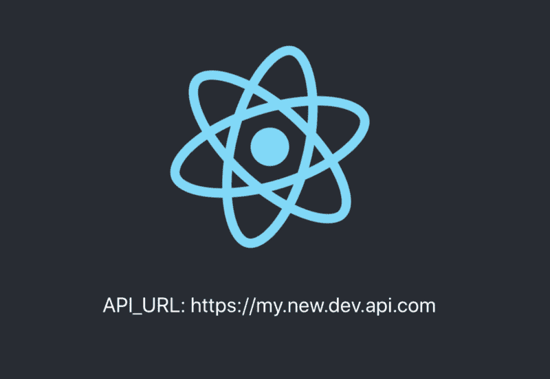
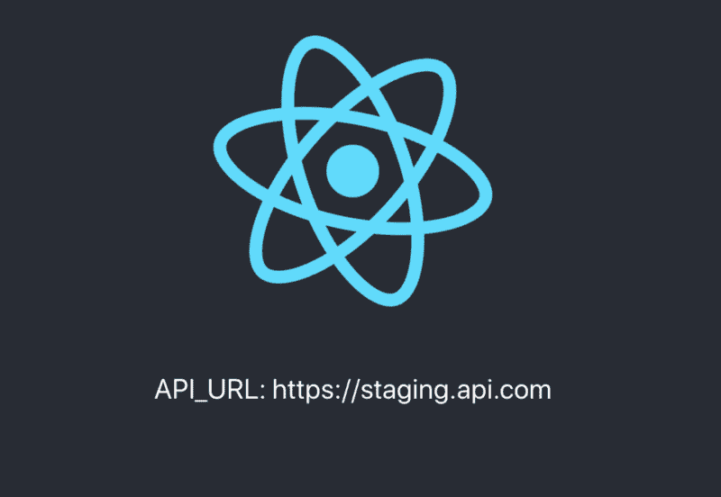
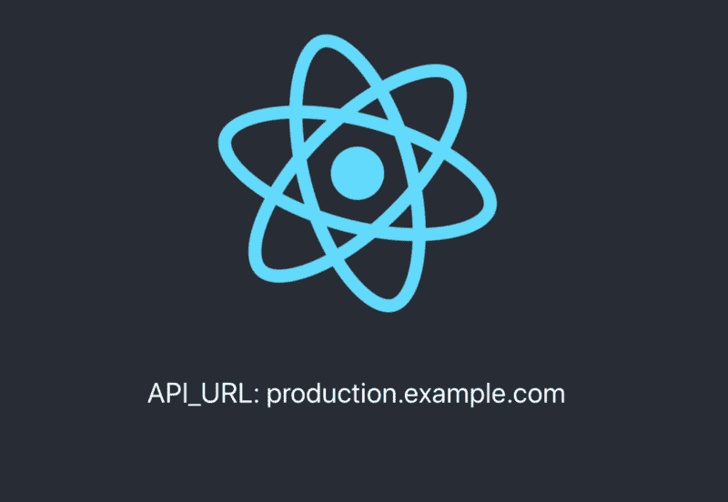

# 如何用 create-react-app、Docker 和 Nginx 实现运行时环境变量

> 原文：<https://www.freecodecamp.org/news/how-to-implement-runtime-environment-variables-with-create-react-app-docker-and-nginx-7f9d42a91d70/>

by Krunoslav Banovac

# 如何用 create-react-app、Docker 和 Nginx 实现运行时环境变量

有许多方法可以配置 React 应用程序。让我们使用一种尊重 [**十二因素 App 方法论的方法。**](https://en.wikipedia.org/wiki/Twelve-Factor_App_methodology) 这意味着它在运行时强制重新配置。因此，不需要针对每个环境进行构建。


### ？我们想要实现什么？

我们希望能够将 React 应用程序作为只构建一次的 Docker 容器来运行。通过在运行时可配置的**,它可以在任何地方运行。**输出应该是一个轻量级的高性能容器，作为静态内容服务于我们的 React 应用程序，这是我们通过使用 Ngnix Alpine 实现的。我们的应用程序应该允许在 docker-compose 文件中进行如下配置:

```
version: "3.2"
services:
  my-react-app:
    image: my-react-app
    ports:
      - "3000:80"
    environment:
      - "API_URL=https://production.example.com"
```

*当使用`Docker run`命令时，我们应该能够使用`-e`标志(环境变量)配置我们的 React 应用程序。*

> 乍看之下，这种方法对于初始设置所需的额外工作来说，带来的好处似乎太少。但是一旦设置完成，特定于环境的配置和部署将更容易处理。因此，对于任何以动态环境为目标或者使用编排系统的人来说，这种方法绝对是值得考虑的。

### ？问题是

首先必须明确，浏览器环境内部是不存在环境变量这种东西的。我们现在使用的任何解决方案都只是一个虚假的抽象概念。

但是，你可能会问，直接来自文档的[文件和`REACT_APP`前缀的环境变量呢？即使在源代码内部，它们也被用作`process.env`,就像我们在 Node.js 内部使用环境变量一样](https://facebook.github.io/create-react-app/docs/adding-custom-environment-variables)

实际上，对象`process`并不存在于浏览器环境中，它是特定于节点的。默认情况下，CRA 不做服务器端渲染。它不能在内容服务期间注入环境变量(像 [Next.js](https://github.com/zeit/next.js) 那样)。**在传输**期间，Webpack 进程用给定的字符串值替换所有出现的`process.env`。这意味着**它只能在构建时**进行配置。

#### ？解决办法

仍然可以注入环境变量的特定时刻发生在我们启动容器的时候。然后我们可以从容器内部读取环境变量。我们可以将它们写入一个文件，该文件可以通过 Nginx 提供服务(它也服务于我们的 React 应用程序)。它们是使用`index.html`的 head 部分中的`<script>`标记导入我们的应用程序的。所以在那时，我们运行一个 bash 脚本，它创建了一个 JavaScript 文件，其中的环境变量被指定为全局`window`对象的属性。通过浏览器的方式注入到我们的应用程序中。


You will find a link to the GitHub repository at the end of the article.

### ？逐步指南

让我们从一个简单的`create-react-app`项目开始，用我们想要公开的第一个环境变量创建`.env`文件。

```
# Generate React App
create-react-app cra-runtime-environment-variables
cd cra-runtime-environment-variables

# Create default environment variables that we want to use
touch .env
echo "API_URL=https//default.dev.api.com" >> .env
```

(1) Using CRA CLI to generate React app (2) Creating .env file within the root directory of the freshly generated project

然后让我们编写一个小的 bash 脚本，它将读取`.env`文件并提取将要写入文件的环境变量。如果您在容器内设置了一个环境变量，将使用它的值，否则，它将从。环境文件。它将创建一个 JavaScript 文件，将环境变量值作为一个对象，该对象被分配为`window`对象的属性。

```
#!/bin/bash

# Recreate config file
rm -rf ./env-config.js
touch ./env-config.js

# Add assignment 
echo "window._env_ = {" >> ./env-config.js

# Read each line in .env file
# Each line represents key=value pairs
while read -r line || [[ -n "$line" ]];
do
  # Split env variables by character `=`
  if printf '%s\n' "$line" | grep -q -e '='; then
    varname=$(printf '%s\n' "$line" | sed -e 's/=.*//')
    varvalue=$(printf '%s\n' "$line" | sed -e 's/^[^=]*=//')
  fi

  # Read value of current variable if exists as Environment variable
  value=$(printf '%s\n' "${!varname}")
  # Otherwise use value from .env file
  [[ -z $value ]] && value=${varvalue}

  # Append configuration property to JS file
  echo "  $varname: \"$value\"," >> ./env-config.js
done < .env

echo "}" >> ./env-config.js
```

env.sh – (1) Removes the old file, and creates a new one. (2) writes JS code which opens object literal and assigns it to the global window object. (3) Reads each line of .env file and splits into key/value pair. (4) Look for the environment variable, if set, use its value, otherwise, use the default value from .env file. (5) Append it to object that we assigned to global window object (6) Close object literal

我们需要将下面一行添加到`index.html`中的`<head>`元素，然后导入由我们的 bash 脚本创建的文件。

```
<script src="%PUBLIC_URL%/env-config.js"></script>
```

index.html

让我们在应用程序中显示我们的环境变量:

```
<p>API_URL: {window._env_.API_URL}</p>
```

src/App.js

#### ？发展

在开发过程中，如果我们不想使用 Docker，可以通过修改`package.json`经由`npm script` runner 运行 bash 脚本:

```
 "scripts": {
    "dev": "chmod +x ./env.sh && ./env.sh && cp env-config.js ./public/ && react-scripts start",
    "test": "react-scripts test",
    "eject": "react-scripts eject",
    "build": "react-scripts build'"
  },
```

Running shell script, then react-script start

如果我们运行`yarn dev`,我们应该会看到这样的输出:


Using default API_URL value from .env file

有两种方法可以在 dev 中重新配置环境变量。更改`.env`文件中的默认值，或者通过运行`yarn dev`命令并在前面添加环境变量来覆盖默认值:

```
API_URL=https://my.new.dev.api.com yarn dev
```



Using API_URL value which was passed via CLI

最后，编辑`.gitignore`,以便我们从源代码中排除环境配置:

```
# Temporary env files
/public/env-config.js
env-config.js
```

至于开发环境，就这样吧！我们已经走了一半了。与 CRA 默认提供的开发环境相比，我们在这一点上没有太大的不同。这种方法的真正潜力在生产中大放异彩。

#### ？生产

现在我们要创建最小的 Nginx 配置，这样我们就可以构建一个服务于生产就绪应用程序的优化映像。

```
# Create directory for Ngnix configuration
mkdir -p conf/conf.d
touch conf/conf.d/default.conf conf/conf.d/gzip.conf
```

主配置文件看起来应该有点像这样:

```
server {
  listen 80;
  location / {
    root   /usr/share/nginx/html;
    index  index.html index.htm;
    try_files $uri $uri/ /index.html;
    expires -1; # Set it to different value depending on your standard requirements
  }
  error_page   500 502 503 504  /50x.html;
  location = /50x.html {
    root   /usr/share/nginx/html;
  }
}
```

conf/conf.d/default.conf

启用 gzip 压缩也很有用，这样我们的资产在网络过渡期间更轻便:

```
gzip on;
gzip_http_version  1.0;
gzip_comp_level    5; # 1-9
gzip_min_length    256;
gzip_proxied       any;
gzip_vary          on;

# MIME-types
gzip_types
  application/atom+xml
  application/javascript
  application/json
  application/rss+xml
  application/vnd.ms-fontobject
  application/x-font-ttf
  application/x-web-app-manifest+json
  application/xhtml+xml
  application/xml
  font/opentype
  image/svg+xml
  image/x-icon
  text/css
  text/plain
  text/x-component;
```

conf/conf.d/gzip.conf

现在我们的 Nginx 配置已经准备好了，我们终于可以创建 Dockerfile 和 docker-compose 文件了:

```
touch Dockerfile docker-compose.yml
```

Creating Docker files

最初，我们使用`node:alpine`映像来创建应用程序的优化生产版本。然后，我们在`nginx:alpine`之上构建一个运行时映像。

```
# => Build container
FROM node:alpine as builder
WORKDIR /app
COPY package.json .
COPY yarn.lock .
RUN yarn
COPY . .
RUN yarn build

# => Run container
FROM nginx:1.15.2-alpine

# Nginx config
RUN rm -rf /etc/nginx/conf.d
COPY conf /etc/nginx

# Static build
COPY --from=builder /app/build /usr/share/nginx/html/

# Default port exposure
EXPOSE 80

# Copy .env file and shell script to container
WORKDIR /usr/share/nginx/html
COPY ./env.sh .
COPY .env .

# Add bash
RUN apk add --no-cache bash

# Make our shell script executable
RUN chmod +x env.sh

# Start Nginx server
CMD ["/bin/bash", "-c", "/usr/share/nginx/html/env.sh && nginx -g \"daemon off;\""]
```

现在我们的容器准备好了。我们可以用它做所有标准的事情。我们可以构建一个容器，使用内嵌配置运行它，并将其推送到由服务提供的存储库，如 [Dockerhub](https://hub.docker.com/) 。

```
docker build . -t kunokdev/cra-runtime-environment-variables
docker run -p 3000:80 -e API_URL=https://staging.api.com -t kunokdev/cra-runtime-environment-variables
docker push -t kunokdev/cra-runtime-environment-variables
```

Example of build, run and push commands

上面的`docker run`命令应该像这样输出应用程序:



Using API_URL which was provided via environment variable flag to docker run command

最后，让我们创建 docker-compose 文件。根据环境的不同，您通常会有不同的 docker-compose 文件，并且您将使用`-f`标志来选择要使用的文件。

```
version: "3.2"
services:
  cra-runtime-environment-variables:
    image: kunokdev/cra-runtime-environment-variables
    ports:
      - "5000:80"
    environment:
      - "API_URL=production.example.com"
```

如果我们这样做`docker-compose up`,我们应该会看到这样的输出:



Using API_URL which was provided via docker-compose environment property

太好了！我们现在已经实现了我们的目标。我们可以非常方便地在开发和生产环境中重新配置我们的应用程序。我们现在终于可以只建造一次就到处跑了！

**如果你遇到困难或者有其他想法，可以访问 GitHub 上的[源代码。](https://github.com/kunokdev/cra-runtime-environment-variables)**

#### ？后续步骤

shell 脚本的当前实现将打印。环境文件。大多数时候我们不想把它们都暴露出来。您可以使用前缀或类似的技术为不想公开的变量实现过滤器。

#### ？替代解决方案

如上所述，构建时配置将满足大多数用例。您可以使用默认方法。env 文件，为每个环境构建一个容器，并通过 CRA Webpack 提供的环境变量注入值。

你也可以看看这个覆盖这个问题的 [CRA GitHub 库问题](https://github.com/facebook/create-react-app/issues/2353)。到目前为止，应该会有更多的帖子和问题涉及到这个话题。每一个都提供了与上面类似的解决方案。具体细节要怎么实施，由你自己决定。您可以使用 Node.js 来服务您的应用程序，这意味着您也可以用 Node.js 脚本替换 shells 脚本。注意，Nginx 更便于提供静态内容。

*如果您有任何问题或想要提供反馈；请随意在 [GitHub 上打开问题。](https://github.com/kunokdev/cra-runtime-environment-variables)可以选择关注我，获取更多与网络技术相关的帖子。*