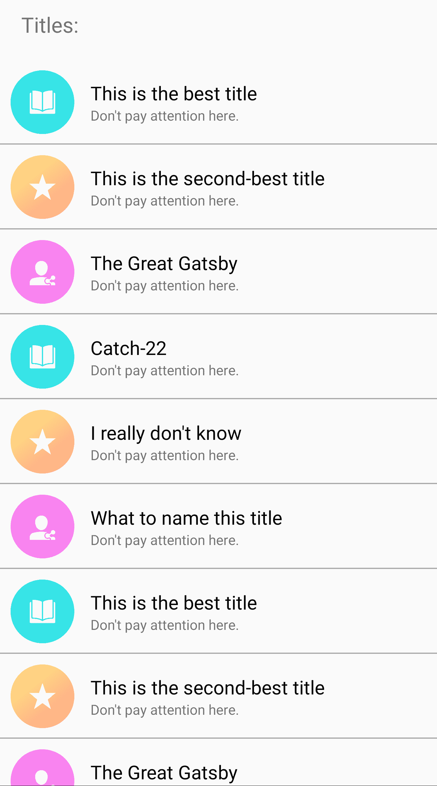
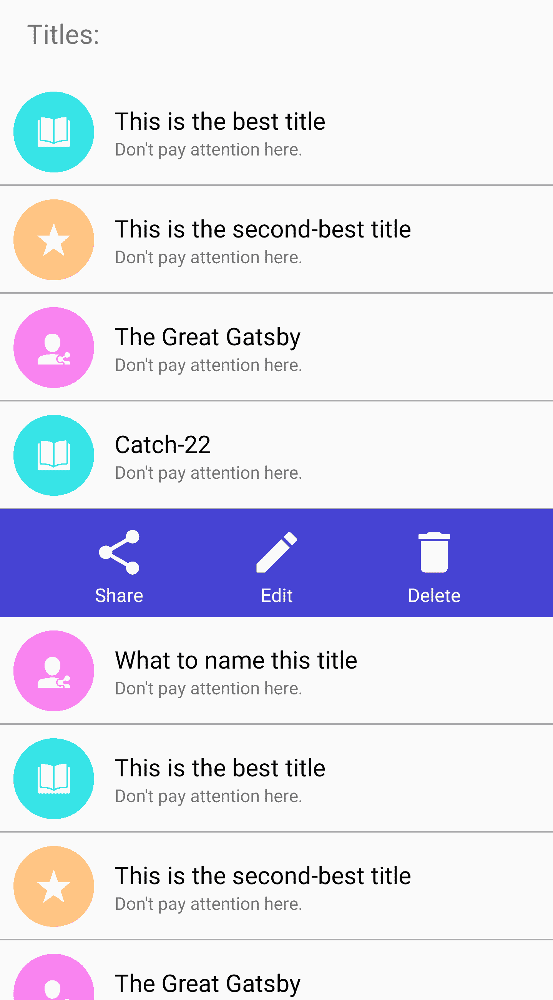

# 如何在 RecyclerView 中实现“滑动选项”

> 原文：<https://www.freecodecamp.org/news/how-to-implement-swipe-for-options-in-recyclerview/>

假设您站点的一个用户想要编辑一个列表项，而不打开该项并寻找编辑选项。如果您可以启用此功能，它会给用户带来良好的用户体验。

Mozilla 旗下的书签应用 Pocket 也做了类似的事情。您可以直接从列表中共享/存档/删除您保存的文章，而无需打开文章。然后你可以点击右上角的菜单按钮，选择你的编辑选项。

因此，在本教程中，我们将尝试编码出来。

**以下是我们想要实现的目标**:



## 首先让我们创建一个普通的 RecyclerView 列表

RecyclerView 是 ListView 和 GridView 的高级灵活版本。它能够容纳大量的列表数据，并且比它的前辈有更好的性能。

顾名思义，RecyclerView 会在列表滚动到视图之外时“回收”列表中的项目，并在它们返回视图时重新填充它们。所以列表容器只需要维护有限数量的视图，而不是整个列表。

它非常灵活，以至于新的用于创建可滑动标签的[view page 2](https://developer.android.com/training/animation/vp2-migration#diffutil)类是在 RecyclerView 之上编写的。

### 创建一个 POJO(普通旧 Java 对象)来保存列表数据

```
public class RecyclerEntity {
    private String title;
    private boolean showMenu = false;
    private int image;

    public RecyclerEntity() {
    }

    public RecyclerEntity(String title, int image, boolean showMenu) {
        this.title = title;
        this.showMenu = showMenu;
        this.image = image;
    }

    public int getImage() {
        return image;
    }

    public void setImage(int image) {
        this.image = image;
    }

    //... all the getters and setters
}
```

请注意，这里有一个 showMenu 成员，它将处理 RecyclerView 中该列表项的菜单的可见性。

### 创建 RecyclerView 适配器

```
public class RecyclerAdapter extends RecyclerView.Adapter<RecyclerView.ViewHolder> {
    List<RecyclerEntity> list;
    Context context;

    public RecyclerAdapter(Context context, List<RecyclerEntity> articlesList) {
        this.list = articlesList;
        this.context = context;
    }

    @Override
    public RecyclerView.ViewHolder onCreateViewHolder(ViewGroup parent, int viewType) {
        View v;
            v= LayoutInflater.from(parent.getContext()).inflate(R.layout.recycler_list, parent, false);
            return new MyViewHolder(v);
    }

    @Override
    public void onBindViewHolder(RecyclerView.ViewHolder holder, final int position) {
        RecyclerEntity entity = list.get(position);
        if(holder instanceof MyViewHolder){
            ((MyViewHolder)holder).title.setText(entity.getTitle());
            ((MyViewHolder)holder).imageView.setImageDrawable(context.getResources().getDrawable(entity.getImage()));   
        }
    }

    @Override
    public int getItemCount() {
        return list.size();
    }

    public class MyViewHolder extends RecyclerView.ViewHolder {
        TextView title;
        ImageView imageView;
        ConstraintLayout container;

        public MyViewHolder(View itemView) {
            super(itemView);
            title = itemView.findViewById(R.id.title);
            imageView = itemView.findViewById(R.id.imageView);
            container = itemView.findViewById(R.id.container);
        }
    }
}
```

通常我们把我们的 ViewHolder 子类(MyViewHolder)放在超类模板中。这让我们可以从 onCreateViewHolder()方法中直接返回我们定义的 ViewHolder 子类对象。然后我们就不用在 onBindViewHolder()方法中一次又一次的强制转换了。

但是在这里我们不能这样做，我们马上就会知道为什么。

### 初始化活动中的 recyclerview

```
public class MainActivity extends AppCompatActivity {
    RecyclerView recyclerView;
    List<RecyclerEntity> list;
    RecyclerAdapter adapter;

    @RequiresApi(api = Build.VERSION_CODES.M)
    @Override
    protected void onCreate(Bundle savedInstanceState) {
        super.onCreate(savedInstanceState);
        setContentView(R.layout.activity_main);

        recyclerView = findViewById(R.id.recyclerview);
        list = new ArrayList<>();

        list.add(new RecyclerEntity("This is the best title", R.drawable.one, false));
        list.add(new RecyclerEntity("This is the second-best title", R.drawable.two, false));
		//... rest of the list items

        adapter = new RecyclerAdapter(this, list);
        recyclerView.setLayoutManager(new LinearLayoutManager(this));
        recyclerView.setAdapter(adapter);
    }
}
```

现在让我们开始让事情变得更有趣一点。

## 为菜单创建布局资源

并在回收器适配器中初始化它:

```
public class RecyclerAdapter extends RecyclerView.Adapter<RecyclerView.ViewHolder> {
    List<RecyclerEntity> list;
    Context context;
    private final int SHOW_MENU = 1;
    private final int HIDE_MENU = 2;

    public RecyclerAdapter(Context context, List<RecyclerEntity> articlesList) {
        this.list = articlesList;
        this.context = context;
    }

    @Override
    public int getItemViewType(int position) {
        if(list.get(position).isShowMenu()){
            return SHOW_MENU;
        }else{
            return HIDE_MENU;
        }
    }

    @Override
    public RecyclerView.ViewHolder onCreateViewHolder(ViewGroup parent, int viewType) {
        View v;
        if(viewType==SHOW_MENU){
            v= LayoutInflater.from(parent.getContext()).inflate(R.layout.recycler_menu, parent, false);
            return new MenuViewHolder(v);
        }else{
            v= LayoutInflater.from(parent.getContext()).inflate(R.layout.recycler_list, parent, false);
            return new MyViewHolder(v);
        }

    }

    @Override
    public void onBindViewHolder(RecyclerView.ViewHolder holder, final int position) {
        RecyclerEntity entity = list.get(position);
        if(holder instanceof MyViewHolder){
        	//... same as above
        }

        if(holder instanceof MenuViewHolder){
            //Menu Actions
        }

    }

    @Override
    public int getItemCount() {
        return list.size();
    }

    public class MyViewHolder extends RecyclerView.ViewHolder {
        //... same as above
    }
    //Our menu view
    public class MenuViewHolder extends RecyclerView.ViewHolder{
        public MenuViewHolder(View view){
            super(view);
        }
    }
}
```

现在我们的适配器中有了两个 ViewHolder 子类，MyViewHolder(实际的列表项)和 MenuViewHolder。两者都继承相同的类，所以我们返回父类*recycle view。来自*的*视图持有者* onCreateViewHolder()。

我们的 getItemViewType()方法返回 int 变量(ViewType ),该变量告诉我们希望在 RecyclerView 中为特定位置显示哪种视图:即 MyViewHolder 或 MenuViewHolder。

onCreateViewHolder()使用这个 viewType 变量，它实际上返回相应的 ViewHolder 对象。

## 在 RecyclerAdapter 中添加显示/隐藏菜单的功能

```
public void showMenu(int position) {
        for(int i=0; i<list.size(); i++){
            list.get(i).setShowMenu(false);
        }
        list.get(position).setShowMenu(true);
        notifyDataSetChanged();
    }

    public boolean isMenuShown() {
        for(int i=0; i<list.size(); i++){
            if(list.get(i).isShowMenu()){
                return true;
            }
        }
        return false;
    }

    public void closeMenu() {
        for(int i=0; i<list.size(); i++){
            list.get(i).setShowMenu(false);
        }
        notifyDataSetChanged();
    }
```

请注意，有许多方法可以处理这个问题。但是为了简单起见，我们在 POJO 中保留了一个布尔值来维护菜单的可见性。

更改数据列表后，我们调用 notifyDataSetChanged()方法来重画列表。

## 在 RecyclerAdapter 中长按我们的列表项时显示菜单

```
@Override
    public void onBindViewHolder(RecyclerView.ViewHolder holder, final int position) {
        RecyclerEntity entity = list.get(position);
        if(holder instanceof MyViewHolder){
            ((MyViewHolder)holder).title.setText(entity.getTitle());
            ((MyViewHolder)holder).imageView.setImageDrawable(context.getResources().getDrawable(entity.getImage()));

            ((MyViewHolder)holder).container.setOnLongClickListener(new View.OnLongClickListener() {
                @Override
                public boolean onLongClick(View v) {
                    showMenu(position);
                    return true;
                }
            });
        }
        if(holder instanceof MenuViewHolder){
            //Set Menu Actions like:
            //((MenuViewHolder)holder).edit.setOnClickListener(null);
        }

    }
```

同样，在我们的视图上设置事件也可以通过多种方式完成。

在我们的例子中，菜单中有三个动作。您可以在第二个 if 语句中编写逻辑来处理这些操作，如注释中所示。

## 刷卡时显示菜单

为此，我们在 MainActivity.java 中添加了一个触摸助手:

```
public class MainActivity extends AppCompatActivity {
    RecyclerView recyclerView;
    List<RecyclerEntity> list;
    RecyclerAdapter adapter;

    @RequiresApi(api = Build.VERSION_CODES.M)
    @Override
    protected void onCreate(Bundle savedInstanceState) {
        //... same as above 

        adapter = new RecyclerAdapter(this, list);
        recyclerView.setLayoutManager(new LinearLayoutManager(this));
        recyclerView.setAdapter(adapter);

        ItemTouchHelper.SimpleCallback touchHelperCallback = new ItemTouchHelper.SimpleCallback(0, ItemTouchHelper.LEFT) {
            private final ColorDrawable background = new ColorDrawable(getResources().getColor(R.color.background));

            @Override
            public boolean onMove(RecyclerView recyclerView, RecyclerView.ViewHolder viewHolder, RecyclerView.ViewHolder target) {
                return false;
            }

            @Override
            public void onSwiped(RecyclerView.ViewHolder viewHolder, int direction) {
                adapter.showMenu(viewHolder.getAdapterPosition());
            }

            @Override
            public void onChildDraw(Canvas c, RecyclerView recyclerView, RecyclerView.ViewHolder viewHolder, float dX, float dY, int actionState, boolean isCurrentlyActive) {
                super.onChildDraw(c, recyclerView, viewHolder, dX, dY, actionState, isCurrentlyActive);

                View itemView = viewHolder.itemView;

                if (dX > 0) {
                    background.setBounds(itemView.getLeft(), itemView.getTop(), itemView.getLeft() + ((int) dX), itemView.getBottom());
                } else if (dX < 0) {
                    background.setBounds(itemView.getRight() + ((int) dX), itemView.getTop(), itemView.getRight(), itemView.getBottom());
                } else {
                    background.setBounds(0, 0, 0, 0);
                }

                background.draw(c);
            }
        };
        ItemTouchHelper itemTouchHelper = new ItemTouchHelper(touchHelperCallback);
        itemTouchHelper.attachToRecyclerView(recyclerView);

    }
```

当滑动列表项时，我们调用适配器中的 showMenu()函数。

当我们滑动时，onChildDraw()函数绘制背景。否则滑动时会出现白色背景，我们的菜单布局会弹出来。

## 隐藏菜单

有三种方法可以隐藏我们的菜单。

1.  滑动另一行时隐藏菜单:

我们的适配器中的 showMenu()方法已经处理了这种情况。在显示任何一行的菜单之前，我们首先为所有行调用 *setShowMenu(false)* 来隐藏菜单。

2.按下后退按钮时隐藏菜单(在我们的活动中):

```
@Override
    public void onBackPressed() {
        if (adapter.isMenuShown()) {
            adapter.closeMenu();
        } else {
            super.onBackPressed();
        }
    }
```

3.当用户滚动列表时隐藏菜单:

```
recyclerView.setOnScrollChangeListener(new View.OnScrollChangeListener() {
            @Override
            public void onScrollChange(View v, int scrollX, int scrollY, int oldScrollX, int oldScrollY) {
                adapter.closeMenu();
            }
        });
```

虽然 pocket 只有一个长按动作来显示菜单，但在本例中，我们添加了滑动来显示菜单，以增加功能。你可以再次在左右滑动时隐藏你的菜单项，但我认为这可能会让用户感到困惑。

## 包扎

如果您的应用程序有非常大的数据集要在 RecyclerView 中显示，这种类型的 UX 可能不合适。在这种情况下，你应该有一个批量编辑的功能。

此外，如果您的编辑选项超出了您在 RecyclerView 行中可以调整的范围，但您仍然希望显示一些快速操作，您可以在长按项目时显示一个底部表单对话框，它可以包含您的所有编辑选项。Google Drive Android 应用程序做了完全相同的事情。

如果你想实现一个简单的滑动删除功能，可以在 Github 的[找到代码。](https://github.com/iamtherealgd/RecyclerViewSwipeDelete)

你也可以在 Github 上查看这个项目的[源代码。](https://github.com/iamtherealgd/RecyclerViewSwipeOptions)

访问[22Boxes.com](https://22boxes.com/)获取更多移动&网络开发资源。