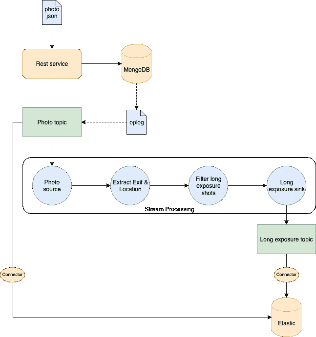

# 如何使用 Kafka 流实现变更数据捕获

> 原文：<https://www.freecodecamp.org/news/how-to-implement-the-change-data-capture-pattern-using-kafka-streams/>

**变更数据捕获** (CDC)包括观察数据库中发生的变更，并以其他系统可以利用的形式提供这些变更。

最有趣的用例之一是让它们作为事件流可用。例如，这意味着您可以在数据写入数据库时捕获事件并更新搜索索引。

有趣吧？让我们来看看如何实现一个 CDC 系统，它可以观察对 NoSQL 数据库( **MongoDB** )所做的更改，通过消息代理( **Kafka** )将这些更改流式传输，处理流式传输的消息( **Kafka Streams** )，并更新搜索索引( **Elasticsearch** )！？

## TL；速度三角形定位法(dead reckoning)

该项目的完整代码可以在 GitHub 的这个[库](https://github.com/elleFlorio/kafka-streams-playground)中获得。如果你想跳过我所有的废话，直接运行这个例子，直接进入文章末尾的
**如何运行项目**部分！？

# 用例与基础设施

我们运行一个 web 应用程序，存储用户上传的照片。人们可以分享他们的照片，让其他人下载，创建相册，等等。用户还可以提供他们照片的描述，以及 Exif 元数据和其他有用的信息。

我们希望存储这样的信息，并用它来改进我们的搜索引擎。我们将重点关注下图所示的这部分系统。



Photo information storage architecture 

信息以`JSON`格式提供。因为我喜欢在 [Unsplash](https://unsplash.com/) 上发布我的照片，而且该网站提供免费的 API，所以我在照片`JSON`文档中使用了他们的模型。

一旦`JSON`通过`POST`请求被发送到我们的服务器，我们就将文档存储在一个 **MongoDB** 数据库中。我们还会将它存储在 **Elasticsearch** 中，用于索引和快速搜索。

然而，我们喜欢**长曝光镜头**，我们希望在一个单独的索引中存储关于这种照片的信息子集。可以是曝光时间，也可以是照片拍摄的位置(经纬度)。这样，我们可以创建摄影师通常拍摄长曝光照片的位置的地图。

有趣的部分来了:一旦照片信息存储在 MongoDB 中，我们可以实现一个利用 Kafka 和 Kafka 流的 **CDC** 而不是在代码中显式调用 elastic search。

我们使用 MongoDB 本身提供的接口监听对 MongoDB **oplog** 的修改。照片存储后，我们会将其发送到一个`photo`卡夫卡主题。使用 **Kafka Connect** ，一个 Elasticsearch sink 被配置为将发送到该主题的所有内容保存到一个特定的索引中。这样，我们就可以自动索引存储在 MongoDB 中的所有照片。

我们也需要注意长时间曝光的照片。它需要对信息进行一些处理，以提取我们需要的信息。为此，我们使用 Kafka 流创建一个**处理拓扑**来:

1.  从`photo`题目开始读
2.  提取 Exif 和位置信息
3.  过滤长曝光照片(曝光时间> 1 秒。)
4.  写一个`long-exposure`题目。

然后另一个 Elasticsearch sink 会从`long-exposure`主题中读取数据，并将其写入 Elasticsearch 中的特定索引。

挺简单的，但是有 CDC 和卡夫卡流的乐趣就够了！？

# 服务器实现

让我们看看我们需要实现什么:我们的服务器公开了 REST API！

### 模型与道

首先，我们需要一个数据模型和一个**数据访问对象** (DAO)与我们的 MongoDB 数据库对话。

正如我说过的，照片`JSON`信息的模型是 Unsplash 使用的模型。查看免费的 API [文档](https://unsplash.com/documentation#get-a-photo)，获取我们将使用的`JSON`的示例。

我使用 [spray-json](https://github.com/spray/spray-json) 为照片`JSON`的序列化/反序列化创建了映射。我将跳过这方面的细节，如果你好奇就看看[回购](https://github.com/elleFlorio/kafka-streams-playground/tree/master/src/main/scala/com/elleflorio/kafka/streams/playground/dao/model/unsplash)！

让我们把注意力集中在长曝光照片的模型上。

```
case class LongExposurePhoto(id: String, exposureTime: Float, createdAt: Date, location: Location)

object LongExposurePhotoJsonProtocol extends DefaultJsonProtocol {
  implicit val longExposurePhotoFormat:RootJsonFormat[LongExposurePhoto] = jsonFormat(LongExposurePhoto, "id", "exposure_time", "created_at", "location")
} 
```

这很简单:我们从照片`JSON`中保留关于`id`、曝光时间(`exposureTime`)、照片创建时间(`createdAt`)和拍摄地点`location`的信息。`location`包括`city`、`country`以及由`latitude`和`longitude`组成的`position`。

DAO 只包含了`PhotoDao.scala`类。

```
class PhotoDao(database: MongoDatabase, photoCollection: String) {

  val collection: MongoCollection[Document] = database.getCollection(photoCollection)

  def createPhoto(photo: Photo): Future[String] = {
    val doc = Document(photo.toJson.toString())
    doc.put("_id", photo.id)
    collection.insertOne(doc).toFuture()
      .map(_ => photo.id)
  }
} 
```

因为我想尽量简化这个例子，并把重点放在 CDC 实现上，所以 DAO 只有一个在 MongoDB 中创建新照片文档的方法。

很简单:从照片`JSON`创建一个文档，并使用`id`作为照片本身的文档插入 mongo。然后，我们可以返回刚刚插入到一个`Future`中的照片的`id`(MongoDB API 是异步的)。

### 卡夫卡制片人

一旦照片存储在 MongoDB 中，我们必须将其发送到`photo` Kafka 主题。这意味着我们需要一个生产者将信息写在它的主题中。`PhotoProducer.scala`类是这样的。

```
case class PhotoProducer(props: Properties, topic: String) {

  createKafkaTopic(props, topic)
  val photoProducer = new KafkaProducer[String, String](props)

  def sendPhoto(photo: Photo): Future[RecordMetadata] = {
    val record = new ProducerRecord[String, String](topic, photo.id, photo.toJson.compactPrint)
    photoProducer.send(record)
  }

  def closePhotoProducer(): Unit = photoProducer.close()
} 
```

我认为这是不言自明的。最有趣的部分可能是在`utils`包中实现的`createKafkaTopic`方法。

```
def createKafkaTopic(props: Properties, topic: String): Unit = {
    val adminClient = AdminClient.create(props)
    val photoTopic = new NewTopic(topic, 1, 1)
    adminClient.createTopics(List(photoTopic).asJava)
  } 
```

这个方法在 Kafka 设置 1 中创建主题作为一个分区和复制因子(对于这个例子来说已经足够了)。这不是必需的，但是预先创建主题可以让 Kafka 平衡分区、选择领导者等等。这将有助于在启动服务器时让我们的流拓扑准备好进行处理。

### 事件监听器

我们有用 MongoDB 编写的 DAO 和用 Kafka 发送消息的 producer。我们需要以某种方式将它们粘合在一起，以便当文档存储在 MongoDB 中时，消息被发送到`photo`主题。这就是`PhotoListener.scala`类的目的。

```
case class PhotoListener(collection: MongoCollection[Document], producer: PhotoProducer) {

  val cursor: ChangeStreamObservable[Document] = collection.watch()

  cursor.subscribe(new Observer[ChangeStreamDocument[Document]] {
    override def onNext(result: ChangeStreamDocument[Document]): Unit = {
      result.getOperationType match {
        case OperationType.INSERT => {
          val photo = result.getFullDocument.toJson().parseJson.convertTo[Photo]
          producer.sendPhoto(photo).get()
          println(s"Sent photo with Id ${photo.id}")
        }
        case _ => println(s"Operation ${result.getOperationType} not supported")
      }
    }
    override def onError(e: Throwable): Unit = println(s"onError: $e")
    override def onComplete(): Unit = println("onComplete")})
} 
```

我们利用 MongoDB scala 库提供的 [Chage Streams 接口](https://docs.mongodb.com/manual/changeStreams/)。

它是这样工作的:我们收集存储照片的地方。当有一个新事件(`onNext`)时，我们运行我们的逻辑。

对于这个例子，我们只对新文档的创建感兴趣，所以我们明确地检查操作是否属于类型`OperationType.INSERT`。如果操作是我们感兴趣的，我们获取文档并将其转换成一个由我们的生产者发送的`Photo`对象。

就是这样！通过几行代码，我们将 MongoDB 中文档的创建与 Kafka 中的一系列事件联系起来。？

顺便提一下，要知道要使用 Change Streams 接口**，我们必须设置一个 MongoDB 副本集**。这意味着我们需要运行 3 个 MongoDB 实例，并在 mongo 客户机中使用以下命令将它们配置为副本集:

```
rs.initiate({_id : "r0", members: [{ _id : 0, host : "mongo1:27017", priority : 1 },{ _id : 1, host :"mongo2:27017", priority : 0 },{ _id : 2, host : "mongo3:27017", priority : 0, arbiterOnly: true }]}) 
```

这里我们的实例是我们将在 docker-compose 文件中运行的容器，即`mongo1`、`mongo2`和`mongo3`。

### 处理拓扑

是时候构建我们的处理拓扑了！它将负责创建弹性搜索中的`long-exposure`索引。拓扑如下图所示:


Processing topology

它是在`LongExposureTopology.scala`对象类中实现的。
让我们分析处理拓扑的每一步。

```
val stringSerde = new StringSerde

val streamsBuilder = new StreamsBuilder()

val photoSource: KStream[String, String] = streamsBuilder.stream(sourceTopic, Consumed.`with`(stringSerde, stringSerde)) 
```

第一步是阅读源主题。我们使用`StreamsBuilder()`对象从`sourceTopic`(即`photo`主题)开始一个流。`stringSerde`对象用于将主题内容序列化和去序列化为`String`。

请注意，在处理的每一步，我们都用一个`KStream`对象创建一个新的数据流。当创建流时，我们指定由流产生的键和值。在我们的拓扑中，键将总是一个`String`。在这一步中产生的值仍然是一个`String`。

```
val covertToPhotoObject: KStream[String, Photo] =
      photoSource.mapValues((_, jsonString) => {
        val photo = jsonString.parseJson.convertTo[Photo]
        println(s"Processing photo ${photo.id}")
        photo
      }) 
```

下一步是将从`photo`主题提取的值转换成适当的`Photo`对象。

所以我们从`photoSource`流开始，使用`mapValues`函数处理这些值。我们简单地将该值解析为一个`JSON`，并创建将在`convertToPhotoObject`流中发送的`Photo`对象。

```
val filterWithLocation: KStream[String, Photo] = covertToPhotoObject.filter((_, photo) => photo.location.exists(_.position.isDefined)) 
```

不能保证我们正在处理的照片会有这个位置的信息，但是我们希望它出现在我们的长曝光对象中。拓扑的这一步从`covertToPhotoObject`流中过滤出没有位置信息的照片，并创建`filterWithLocation`流。

```
val filterWithExposureTime: KStream[String, Photo] = filterWithLocation.filter((_, photo) => photo.exif.exists(_.exposureTime.isDefined)) 
```

我们处理的另一个重要因素是照片的曝光时间。出于这个原因，我们从`filterWithLocation`流中过滤掉没有曝光时间信息的照片，创建了`filterWithExposureTime`。

```
val dataExtractor: KStream[String, LongExposurePhoto] =
      filterWithExposureTime.mapValues((_, photo) => LongExposurePhoto(photo.id, parseExposureTime(photo.exif.get.exposureTime.get), photo.createdAt, photo.location.get)) 
```

我们现在拥有了创建一个`LongExposurePhoto`对象所需要的一切！这是`dataExtractor`的结果:它接受来自`filterWithExposureTime`流的`Photo`，并产生一个包含`LongExposurePhoto`的新流。

```
val longExposureFilter: KStream[String, String] =
      dataExtractor.filter((_, item) => item.exposureTime > 1.0).mapValues((_, longExposurePhoto) => {
        val jsonString = longExposurePhoto.toJson.compactPrint
        println(s"completed processing: $jsonString")
        jsonString
      }) 
```

我们快到了。我们现在必须保持长曝光时间的照片(我们决定超过 1 秒。).所以我们创建一个新的`longExposureFilter`流，去掉曝光时间不长的照片。

这次我们也把`LongExposurePhotos`序列化成对应的`JSON`字符串，下一步会写到 Elasticsearch。

```
longExposureFilter.to(sinkTopic, Produced.`with`(stringSerde, stringSerde))

streamsBuilder.build() 
```

这是我们拓扑的最后一步。我们用字符串序列化器/反序列化器写下`longExposureFilter`流中的内容。
最后一个命令简单地`build`了我们刚刚创建的拓扑。

现在我们有了自己的拓扑，我们可以在我们的服务器中使用它。`PhotoStreamProcessor.scala`类是管理处理的。

```
class PhotoStreamProcessor(kafkaProps: Properties, streamProps: Properties, sourceTopic: String, sinkTopic: String) {

  createKafkaTopic(kafkaProps, sinkTopic)
  val topology: Topology = LongExposureTopology.build(sourceTopic, sinkTopic)
  val streams: KafkaStreams = new KafkaStreams(topology, streamProps)

  sys.ShutdownHookThread {
    streams.close(java.time.Duration.ofSeconds(10))
  }

  def start(): Unit = new Thread {
    override def run(): Unit = {
      streams.cleanUp()
      streams.start()
      println("Started long exposure processor")
    }
  }.start()
} 
```

首先我们创建`sinkTopic`，使用我们之前看到的相同的实用方法。然后我们构建流拓扑，并用该拓扑初始化一个`KafkaStreams`对象。

要开始流处理，我们需要创建一个专用的`Thread`，它将在服务器运行时运行流。根据官方文档，在启动流之前对其进行`cleanUp()`总是一个好主意。

我们的`PhotoStreamProcessor`准备出发了！？

### REST API

服务器公开 REST APIs，将照片信息发送给它进行存储。我们利用 [Akka HTTP](https://doc.akka.io/docs/akka-http/current/index.html) 来实现 API。

```
trait AppRoutes extends SprayJsonSupport {

  implicit def system: ActorSystem
  implicit def photoDao: PhotoDao
  implicit lazy val timeout = Timeout(5.seconds)

  lazy val healthRoute: Route = pathPrefix("health") {
    concat(
      pathEnd {
        concat(
          get {
            complete(StatusCodes.OK)
          }
        )
      }
    )
  }

  lazy val crudRoute: Route = pathPrefix("photo") {
    concat(
      pathEnd {
        concat(
          post {
            entity(as[Photo]) { photo =>
              val photoCreated: Future[String] =
                photoDao.createPhoto(photo)
              onSuccess(photoCreated) { id =>
              complete((StatusCodes.Created, id))
              }
            }
          }
        )
      }
    )
  }

} 
```

为了简化示例，我们只有两条路线:

*   `GET /health` -检查服务器是否启动&运行
*   `POST /photo` -向系统发送我们想要存储的照片信息的`JSON`。这个端点使用 DAO 将文档存储在 MongoDB 中，如果操作成功，则返回一个带有存储照片 id 的`201`。

这绝不是一套完整的 API，但足以运行我们的示例。？

### 服务器主类

好了，我们实现了服务器的所有组件，现在是时候结束一切了。这是我们的`Server.scala`对象类。

```
implicit val system: ActorSystem = ActorSystem("kafka-stream-playground")
implicit val materializer: ActorMaterializer = ActorMaterializer() 
```

首先是几个 **Akka** 效用值。因为我们使用 [Akka HTTP](https://doc.akka.io/docs/akka-http/current/index.html) 来运行我们的服务器和 REST API，所以这些隐式值是必需的。

```
val config: Config = ConfigFactory.load()
val address = config.getString("http.ip")
val port = config.getInt("http.port")

val mongoUri = config.getString("mongo.uri")
val mongoDb = config.getString("mongo.db")
val mongoUser = config.getString("mongo.user")
val mongoPwd = config.getString("mongo.pwd")
val photoCollection = config.getString("mongo.photo_collection")

val kafkaHosts = config.getString("kafka.hosts").split(',').toList
val photoTopic = config.getString("kafka.photo_topic")
val longExposureTopic = config.getString("kafka.long_exposure_topic") 
```

然后我们读取所有的配置属性。我们稍后将回到配置文件。

```
val kafkaProps = new Properties()
kafkaProps.put("bootstrap.servers", kafkaHosts.mkString(","))
kafkaProps.put("key.serializer", "org.apache.kafka.common.serialization.StringSerializer")
kafkaProps.put("value.serializer", "org.apache.kafka.common.serialization.StringSerializer")

val streamProps = new Properties()
streamProps.put(StreamsConfig.APPLICATION_ID_CONFIG, "long-exp-proc-app")
streamProps.put(StreamsConfig.BOOTSTRAP_SERVERS_CONFIG, kafkaHosts.mkString(","))

val photoProducer = PhotoProducer(kafkaProps, photoTopic)
val photoStreamProcessor = new PhotoStreamProcessor(kafkaProps, streamProps, photoTopic, "long-exposure")
photoStreamProcessor.start() 
```

我们必须配置我们的 Kafka 生成器和流处理器。我们还启动了流处理器，因此服务器将准备好处理发送给它的文档。

```
val client = MongoClient(s"mongodb://$mongoUri/$mongoUser")
val db = client.getDatabase(mongoDb)
val photoDao: PhotoDao = new PhotoDao(db, photoCollection)
val photoListener = PhotoListener(photoDao.collection, photoProducer) 
```

还需要配置 MongoDB。我们设置连接并初始化 DAO 和监听器。

```
lazy val routes: Route = healthRoute ~ crudRoute

Http().bindAndHandle(routes, address, port)
Await.result(system.whenTerminated, Duration.Inf) 
```

一切都已初始化。我们为到服务器的通信创建 REST 路由，将它们绑定到处理程序，最后启动服务器！？

#### 服务器配置

这是用于设置服务器的配置文件:

```
http {
  ip = "127.0.0.1"
  ip = ${?SERVER_IP}

  port = 8000
  port = ${?SERVER_PORT}
}
mongo {
  uri = "127.0.0.1:27017"
  uri = ${?MONGO_URI}
  db = "kafka-stream-playground"
  user = "admin"
  pwd = "admin"
  photo_collection = "photo"
}
kafka {
  hosts = "127.0.0.1:9092"
  hosts = ${?KAFKA_HOSTS}
  photo_topic = "photo"
  long_exposure_topic = "long-exposure"
} 
```

我认为这个不需要太多的解释，对吗？？

# 连接器配置

我们实现的服务器写两个 Kafka 主题:`photo`和`long-exposure`。但是 Elasticsearch 中的消息是如何写成文档的呢？使用**卡夫卡连接**！

我们可以设置两个连接器，每个主题一个，并告诉连接器在 Elasticsearch 中编写通过该主题的每条消息。

首先我们需要[卡夫卡连接](https://docs.confluent.io/current/connect/index.html)。我们可以在 docker-compose 文件中使用 Confluence 提供的容器:

```
connect:
    image: confluentinc/cp-kafka-connect
    ports:
      - 8083:8083
    networks:
      - kakfa_stream_playground
    depends_on:
      - zookeeper
      - kafka
    volumes:
      - $PWD/connect-plugins:/connect-plugins
    environment:
      CONNECT_BOOTSTRAP_SERVERS: kafka:9092
      CONNECT_REST_ADVERTISED_HOST_NAME: connect
      CONNECT_REST_PORT: 8083
      CONNECT_GROUP_ID: compose-connect-group
      CONNECT_CONFIG_STORAGE_TOPIC: docker-connect-configs
      CONNECT_CONFIG_STORAGE_REPLICATION_FACTOR: 1
      CONNECT_OFFSET_FLUSH_INTERVAL_MS: 10000
      CONNECT_OFFSET_STORAGE_TOPIC: docker-connect-offsets
      CONNECT_OFFSET_STORAGE_REPLICATION_FACTOR: 1
      CONNECT_STATUS_STORAGE_TOPIC: docker-connect-status
      CONNECT_STATUS_STORAGE_REPLICATION_FACTOR: 1
      CONNECT_KEY_CONVERTER: "org.apache.kafka.connect.storage.StringConverter"
      CONNECT_VALUE_CONVERTER: "org.apache.kafka.connect.json.JsonConverter"
      CONNECT_VALUE_CONVERTER_SCHEMAS_ENABLE: "false"
      CONNECT_INTERNAL_KEY_CONVERTER: "org.apache.kafka.connect.json.JsonConverter"
      CONNECT_INTERNAL_VALUE_CONVERTER: "org.apache.kafka.connect.json.JsonConverter"
      CONNECT_ZOOKEEPER_CONNECT: zookeeper:2181
      CONNECT_PLUGIN_PATH: /connect-plugins
      CONNECT_LOG4J_ROOT_LOGLEVEL: INFO 
```

我想重点介绍一些配置值。

首先，我们需要公开端口`8083`——这将是我们配置连接器(`CONNECT_REST_PORT`)的端点。

我们还需要将一个卷映射到`/connect-plugins`路径，在这里我们将放置 [Elasticsearch 接收器连接器](https://docs.confluent.io/current/connect/kafka-connect-elasticsearch/index.html)来写入 Elasticsearch。这也反映在`CONNECT_PLUGIN_PATH`中。

`connect`容器应该知道如何找到 Kafka 服务器，所以我们将`CONNECT_BOOTSTRAP_SERVERS`设置为`kafka:9092`。

一旦 Kafka Connect 准备就绪，我们就可以将连接器的配置发送到`http://localhost:8083/connectors`端点。我们需要 2 个连接器，一个用于`photo`主题，一个用于`long-exposure`主题。我们可以将配置作为带有`POST`请求的`JSON`发送。

```
{
  "name": "photo-connector",
  "config": {
    "connector.class": "io.confluent.connect.elasticsearch.ElasticsearchSinkConnector",
    "tasks.max": "1",
    "topics": "photo",
    "key.converter": "org.apache.kafka.connect.storage.StringConverter",
    "value.converter": "org.apache.kafka.connect.json.JsonConverter",
    "value.converter.schemas.enable": "false",
    "schema.ignore": "true",
    "connection.url": "http://elastic:9200",
    "type.name": "kafka-connect",
    "behavior.on.malformed.documents": "warn",
    "name": "photo-connector"
  }
} 
```

我们明确地说我们将使用`ElasticsearchSinkConnector`作为`connector.class`，以及我们想要下沉的`topics`——在本例中是`photo`。

我们不想为`value.converter`使用模式，所以我们可以禁用它(`value.converter.schemas.enable`)并告诉连接器忽略模式(`schema.ignore`)。

`long-exposure`主题的连接器和这个完全一样。唯一的区别是`name`和`topics`。

# 如何运行项目

我们有了检验疾控中心所需的一切！怎么才能做到呢？这相当简单:只需运行 repo 的根文件夹中的`setup.sh`脚本！

剧本会有什么作用？

1.  运行包含所有服务的`docker-compose`文件。
2.  配置 MongoDB 副本集。这是使**变更流接口**捕获数据变更所必需的。更多关于这个[的信息在这里](https://docs.mongodb.com/manual/changeStreams/)。
3.  配置 Kafka 连接器。
4.  连接到服务器的日志。

docker-compose 将运行以下服务:

*   我们的服务器
*   3 个 MongoDB 实例(副本集需要)
*   蒙国，蒙戈布客户端
*   卡夫卡(单节点)
*   卡夫卡连接
*   动物园管理员(卡夫卡要求)
*   弹性搜索
*   Kibana

有很多容器要运行，所以要确保有足够的资源来正常运行一切。如果您愿意，可以从 compose 文件中删除 Mongoku 和 Kibana，因为它们只是用于快速查看 DBs 内部。

一旦一切就绪并开始运行，您只需向服务器发送数据。

我从 Unplash 收集了一些照片的`JSON`文档，你可以在`photos.txt`文件中使用它们来测试系统。

总共有 10 个文档，其中 5 个包含关于长曝光照片的信息。将它们发送到在 repo 的根目录下运行`send-photos.sh`脚本的服务器。检查在`http://localhost:3100`连接到 Mongoku 的 MongoDB 中存储的所有内容。然后在`http://localhost:5601`连接到 Kibana，你会在 Elasticsearch 中找到两个索引:`photo`，包含存储在 MongoDB 中的所有照片的 JSON，和`long-exposure`，只包含长曝光照片的信息。

很神奇，对吧？？

# 结论

伙计们，我们成功了！？

从用例的设计开始，我们构建了我们的系统，使用 CDC 将 MongoDB 数据库连接到 Elasticsearch。

Kafka Streams 是使能器，允许我们将数据库事件转换成我们可以处理的流。

需要看完整个项目吗？只需在 GitHub 上查看[库](https://github.com/elleFlorio/kafka-streams-playground)即可！？

就这样，好好享受吧！？