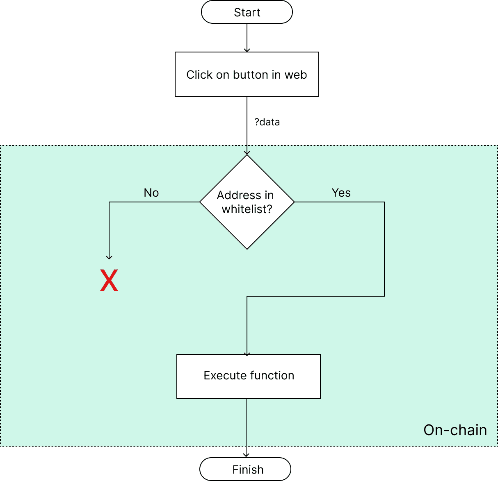
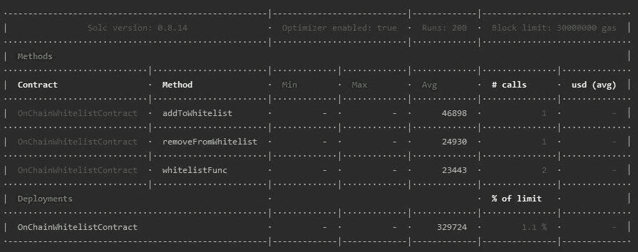
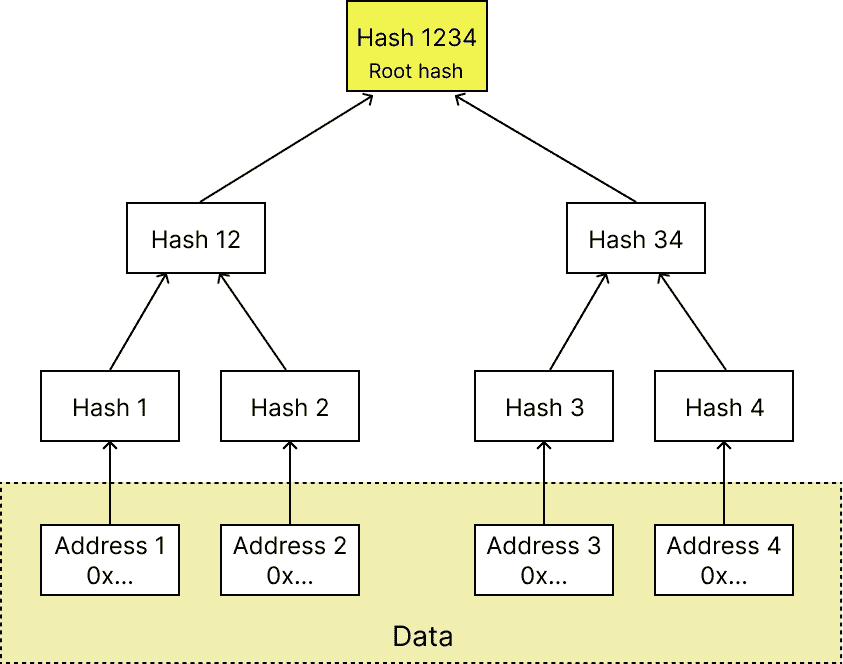
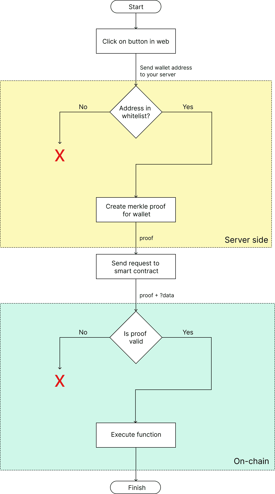
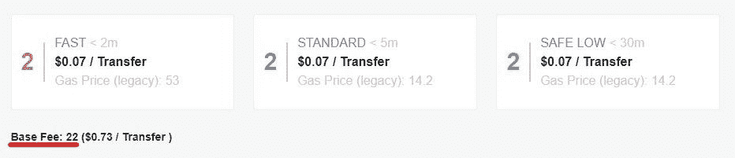

# 如何在智能合同中实现白名单(ERC-721 NFT、ERC-1155 等)

> 原文：<https://www.freecodecamp.org/news/how-to-implement-whitelist-in-smartcontracts-erc-721-nft-erc-1155-and-others/>

在本文中，我将向您展示在智能合约中创建白名单的三种方法。

我们要讨论的是:

*   链上白名单
*   数字签名
*   Merkle 树

所有方法都可以在 [repo here](https://github.com/gapon2401/smartcontract-whitelist) 中找到。

如果您想要限制对某个功能的访问，或者想要向某个用户组授予权限，那么白名单非常有用。

为了比较这些方法，我将使用非常简约的智能合同来减少不必要的汽油支出。

让我们深入研究一下。

## 如何创建链上白名单

主要思想是在智能契约中存储所有白名单地址。

看一下这个模式:



On-chain whitelist

当用户调用智能合同功能时，它会检查地址是否在白名单中。如果是，则执行该函数。

如果您想要在白名单中添加或删除地址，您可以在智能合同中使用额外的`external`功能来完成。

优点:

*   易于实施
*   所有地址都存储在智能合同中，只有所有者可以编辑它们

缺点:

*   这是最昂贵的方法
*   你必须花汽油来添加和删除地址

智能合约如下所示:

```
contract OnChainWhitelistContract is Ownable {

    mapping(address => bool) public whitelist;

    /**
     * @notice Add to whitelist
     */
    function addToWhitelist(address[] calldata toAddAddresses) 
    external onlyOwner
    {
        for (uint i = 0; i < toAddAddresses.length; i++) {
            whitelist[toAddAddresses[i]] = true;
        }
    }

    /**
     * @notice Remove from whitelist
     */
    function removeFromWhitelist(address[] calldata toRemoveAddresses)
    external onlyOwner
    {
        for (uint i = 0; i < toRemoveAddresses.length; i++) {
            delete whitelist[toRemoveAddresses[i]];
        }
    }

    /**
     * @notice Function with whitelist
     */
    function whitelistFunc() external
    {
        require(whitelist[msg.sender], "NOT_IN_WHITELIST");

        // Do some useful stuff
    }
}
```

On-chain smartcontract

所有地址都将存储在`whitelist`变量中。

函数`addToWhitelist`允许所有者添加一个地址数组。请记住，列表中的每个地址将花费大约 22904 个气体单位。调用这个函数需要 23994 个气体单位。

功能`removeFromWhitelist`允许您从白名单中删除地址。

并且函数`whitelistFunc`检查该地址是否属于白名单。

天然气支出:



Gas spending for on-chain whitelist

## 如何创建数字签名白名单

主要思想是为地址创建签名，并在智能契约中检查它们。


Digital signature whitelist

您将白名单存储在您的服务器上。在调用智能合约之前，您应该检查地址是否在白名单中。如果是，为该地址创建一个签名，并将该签名传递给智能合约。在智能合约中，您必须验证该签名。

优点:

*   没有 gas 用于从白名单中添加或删除地址。
*   无需与智能合同就白名单进行交互

缺点:

*   白名单位于可能受到攻击的数据库中。如果观众信任项目的所有者，那么这就不是问题
*   合同部署和白名单验证的最高价格

这是智能合同:

```
// SPDX-License-Identifier: MIT
pragma solidity ^0.8.14;

import "@openzeppelin/contracts/access/Ownable.sol";
import "@openzeppelin/contracts/utils/cryptography/ECDSA.sol";

contract DigitalSignatureWhitelistContract is Ownable {

    using ECDSA for bytes32;

    /**
     * @notice Used to validate whitelist addresses
               Replace this wallet address to your own!
     */
    address private signerAddress = 0xf39Fd6e51aad88F6F4ce6aB8827279cffFb92266;

    /**
     * @notice Verify signature
     */
    function verifyAddressSigner(bytes memory signature) private 
    view returns (bool) {
        bytes32 messageHash = keccak256(abi.encodePacked(msg.sender));
        return signerAddress == messageHash.toEthSignedMessageHash().recover(signature);
    }

     /**
     * @notice Function with whitelist
     */
    function whitelistFunc(bytes memory signature) external
    {
        require(verifyAddressSigner(signature), "SIGNATURE_VALIDATION_FAILED");

        // Do some useful stuff
    }
} 
```

Digital signature smartcontract

### 如何实现数字签名

首先，你需要创建一个新的钱包地址。这将是签名地址。

注意:不要发送任何资金到那个钱包。它将仅用于制作签名。

让我们假设，签名者的钱包地址是`0xf39Fd6e51aad88F6F4ce6aB8827279cffFb92266`

在此处的智能合约中指定:

```
address private signerAddress = 0xf39Fd6e51aad88F6F4ce6aB8827279cffFb92266;
```

在您的 web 项目的根目录中，使用该 wallet 的私钥创建一个`.env`文件:

```
SIGNER_PRIVATE_KEY=0xac0974bec39a17e36ba4a6b4d238ff944bacb478cbed5efcae784d7bf4f2ff80
```

只指定您自己的公钥和私钥，因为这些都是公开的。

接下来，创建白名单数据库。它可以是 PostgreSQL、MySQL、MongoDB——任何你想要的。您可以轻松添加或删除地址。

然后，当需要与智能合约交互时，用户可以点击网站上的一个按钮。您将带有用户地址的请求发送到服务器。

如果用户在白名单中，请在您的服务器上为该地址创建签名:

```
import { ethers } from 'ethers'

export default async function handler() {

  // Whitelist array from you database
  const whitelist = [
    '0x3C44CdDdB6a900fa2b585dd299e03d12FA4293BC',
    '0x90F79bf6EB2c4f870365E785982E1f101E93b906',
    '0x15d34AAf54267DB7D7c367839AAf71A00a2C6A65',
    '0x9965507D1a55bcC2695C58ba16FB37d819B0A4dc',
    '0x976EA74026E726554dB657fA54763abd0C3a0aa9',
  ]

  // This variable will contain the signature we need
  let signature = ''

  // Parse params passed to server and get user wallet address
  const userWalletAddress = ''

  if (whitelist.includes(userWalletAddress)) {
    const signer = new ethers.Wallet(process.env.SIGNER_PRIVATE_KEY!)
    const addressHash = ethers.utils.solidityKeccak256(['address'], [userWalletAddress.toLowerCase()])
    const messageBytes = ethers.utils.arrayify(addressHash)
    signature = await signer.signMessage(messageBytes)
  }

  // Return signature to web
}
```

Create digital signature on your server 

然后将签名传递给智能合约函数，在那里`verifyAddressSigner`将根据发送者的地址对其进行验证。

天然气支出:


Gas spending for digital signature whitelist

## 如何创建 Merkle 树白名单

什么是 Merkle 树？

> Merkle 树是这样一种树，其中每个“叶子”(节点)用数据块的加密散列来标记，并且每个不是叶子的节点(称为分支、内部节点或索引节点)用其子节点的标签的加密散列来标记。–[信号源](https://en.wikipedia.org/wiki/Merkle_tree)

它是如何连接到白名单问题的？

我们将使用它将所有地址散列到一个根散列中。



Merkle tree

这是工作的模式:



Merkle tree whitelist

与数字签名方法一样，您需要一个白名单地址数据库。当您准备开始销售或其他事情时，您需要创建 Merkle root hash 并将其保存在智能合同中。该散列将验证所有地址。

当用户想要向智能合同发出请求时，您需要基于所有地址的 Merkle 树为他创建一个 Merkle 证明。然后你需要发送证明给智能合约。您可以将树存储在本地。

编辑完白名单后，您应该更新 Merkle 根散列并将其重写到智能契约中。您还应该更新本地 Merkle 树。

优点:

*   智能合同的部署比数字签名方法便宜得多
*   在智能合约中验证地址也更便宜
*   在你开始销售之前，不要在白名单上添加或删除地址

缺点:

*   销售开始后，更改白名单会很复杂。您将需要每次更新智能合同和 Merkle 树。因此，气体将被消耗。
*   你需要知道如何创建一个 Merkle root 并更新智能联系人。如果不与智能合约交互，就不可能更改白名单。

这是智能合同:

```
// SPDX-License-Identifier: MIT
pragma solidity ^0.8.14;

import "@openzeppelin/contracts/access/Ownable.sol";
import "@openzeppelin/contracts/utils/cryptography/MerkleProof.sol";

contract MerkleTreeWhitelistContract is Ownable {

    /**
     * @notice Merkle root hash for whitelist addresses
     */
    bytes32 public merkleRoot = 0x09485889b804a49c9e383c7966a2c480ab28a13a8345c4ebe0886a7478c0b73d;

    /**
     * @notice Change merkle root hash
     */
    function setMerkleRoot(bytes32 merkleRootHash) external onlyOwner
    {
        merkleRoot = merkleRootHash;
    }

    /**
     * @notice Verify merkle proof of the address
     */
    function verifyAddress(bytes32[] calldata _merkleProof) private 
    view returns (bool) {
        bytes32 leaf = keccak256(abi.encodePacked(msg.sender));
        return MerkleProof.verify(_merkleProof, merkleRoot, leaf);
    }

    /**
     * @notice Function with whitelist
     */
    function whitelistFunc(bytes32[] calldata _merkleProof) external
    {
        require(verifyAddress(_merkleProof), "INVALID_PROOF");

        // Do some useful stuff
    }
} 
```

Merkle proof smartcontract

### 如何在 web 上实现 Merkle 树

首先，创建白名单数据库。可以是 PostgreSQL，MySQL，MongoDB 或者任何你想要的。您可以轻松添加或删除地址。

当需要与智能合约交互时，创建一个 Merkle 根哈希:

```
import { ethers } from 'ethers'
import { MerkleTree } from 'merkletreejs'

// Your whitelist from database
const whitelist = [
  '0x3C44CdDdB6a900fa2b585dd299e03d12FA4293BC',
  '0x90F79bf6EB2c4f870365E785982E1f101E93b906',
  '0x15d34AAf54267DB7D7c367839AAf71A00a2C6A65',
  '0x9965507D1a55bcC2695C58ba16FB37d819B0A4dc',
  '0x976EA74026E726554dB657fA54763abd0C3a0aa9',
]

const { keccak256 } = ethers.utils
let leaves = whitelist.map((addr) => keccak256(addr))
const merkleTree = new MerkleTree(leaves, keccak256, { sortPairs: true })

// Save this value to smartcontract
const merkleRootHash = merkleTree.getHexRoot()
// 0x09485889b804a49c9e383c7966a2c480ab28a13a8345c4ebe0886a7478c0b73d
```

Create merkle root hash

然后在智能合约中保存 Merkle 根哈希。

在部署之前指定它:

```
bytes32 public merkleRoot = 0x09485889b804a49c9e383c7966a2c480ab28a13a8345c4ebe0886a7478c0b73d;
```

或者使用一个函数`setMerkleRoot`:

```
function setMerkleRoot(bytes32 merkleRootHash) external onlyOwner
{
    merkleRoot = merkleRootHash;
}
```

当用户点击你的网站上的一个按钮时，你用用户的地址发送请求到你的服务器。如果用户在白名单中，在您的服务器上创建 Merkle 校样:

```
import { ethers } from 'ethers'
import { MerkleTree } from 'merkletreejs'

export default async function handler() {

  // Whitelist array from you database
  const whitelist = [
    '0x3C44CdDdB6a900fa2b585dd299e03d12FA4293BC',
    '0x90F79bf6EB2c4f870365E785982E1f101E93b906',
    '0x15d34AAf54267DB7D7c367839AAf71A00a2C6A65',
    '0x9965507D1a55bcC2695C58ba16FB37d819B0A4dc',
    '0x976EA74026E726554dB657fA54763abd0C3a0aa9',
  ]

  // This variable will contain the signature we need
  let proof = []

  // Parse params passed to server and get user wallet address
  const userWalletAddress = ''

  if (whitelist.includes(userWalletAddress)) {
    const { keccak256 } = ethers.utils
    let leaves = whitelist.map((addr) => keccak256(addr))
    const merkleTree = new MerkleTree(leaves, keccak256, { sortPairs: true })
    let hashedAddress = keccak256(userWalletAddress)
    proof = merkleTree.getHexProof(hashedAddress)
  }

  // Return proof to web
} 
```

Create Merkle proof on your server

然后将证明传递给智能合约函数，在那里`verifyAddress`将根据发送者的地址对其进行验证。

天然气支出:


Gas spending for Merkle tree whitelist

## 摘要

以下是这些不同方法消耗的气体单位的对比表:

| 财产 | 链上 | 数字签名 | Merkle 树 |
| --- | --- | --- | --- |
| 部署 | 329 724 | 486 182 | 352 790 |
| 添加到白名单 1 地址 | 46 898 | Zero | 28 986 |
| 将 10 个地址添加到白名单 | 253 010 | Zero | 28 986 |
| 从白名单中删除 | 24 930 | Zero | 28 986 |
| 使用白名单调用函数 | 23 443 | 29 365 | 26 065 |

长话短说:

*   一个链上白名单易于实施，但昂贵的使用。我不建议使用它。
*   数字签名白名单是一种通用工具，不需要与智能合约进行额外的交互。您可以随时轻松编辑白名单。但是你必须为多功能性付出代价。白名单的部署和功能是最昂贵的。如果你的地址经常改变，那么使用数字签名。
*   如果您的白名单地址在您开始预售后不会改变，Merkle tree 是最佳选择。例如，收集地址并在数据库中编辑它们不需要任何成本。当销售开始时，您停止编辑白名单，创建根哈希，将其保存到智能合同，就这样。在这种情况下，Merkle 树比数字签名更好。

具体用什么由你决定！

最后，我想告诉你如何计算天然气价格。

### 如何计算气价

使用以下公式:

```
(gas units) * (gas price per unit) = gas fee in gwei
```

使用[https://ethgasstation.info/](https://ethgasstation.info/)或任何其他网站查找单位汽油价格。写这篇文章的时候，油价是 22。



Gas price per unit

该值可以根据一天中的时间而变化。

让我们来计算一下部署数字签名智能合同的成本。

```
Deployment = 486 182 * 22 = 10 696 004 gwei = 0,010696004 ETH
```

现在，由于 ETH/USD 的价格是 1324 美元，这意味着部署到 Mainnet 将花费大约 14 美元。

也许你想把对照表转换成美元？
`Gas price per unit` = 22，`ETH`= 1324 美元

| 财产 | 链上 | 数字签名 | Merkle 树 |
| --- | --- | --- | --- |
| 部署 | $9.6 | $14.16 | $10.28 |
| 添加到白名单 1 地址 | $1.37 | Zero | $0.84 |
| 将 10 个地址添加到白名单 | $7.37 | Zero | $0.84 |
| 从白名单中删除 | $0.73 | Zero | $0.84 |
| 使用白名单调用函数 | $0.68 | $0.86 | $0.76 |

感谢您的阅读！❤