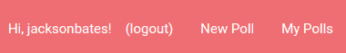

# 如何实现你的第一个无密码登录系统

> 原文：<https://www.freecodecamp.org/news/how-to-implement-your-first-password-less-login-system-8141b6f9ddf2/>

你可能听说过有[3.6 亿个理由销毁所有密码](https://medium.freecodecamp.com/360-million-reasons-to-destroy-all-passwords-9a100b2b5001#.e45q1htgn)和[密码过时](https://medium.com/p/9ed56d483eb)。但是这并不能真正帮助您创建一个无密码的认证系统，不是吗？

做好身份验证可能很困难，并且充满了潜在的安全陷阱。好消息是，有一些可爱的小 JavaScript 库可以为我们做一些繁重的工作。他们提供了大量的代码片段来帮助我们开始。

所以，下面是我如何在我最近的自由代码营[投票应用](https://pollz.herokuapp.com/login)项目中实现无密码认证系统的概要。

在我们开始之前，请注意您需要 Node.js 和 npm 的工作知识。

### 你需要什么:

*   无密码认证库:[无密码](http://passwordless.net)
*   一个电子邮件库: [EmailJS](https://github.com/eleith/emailjs)
*   一个新的、单一用途的电子邮件地址:[微软 Outlook](https://signup.live.com/signup?wa=wsignin1.0&ct=1473911386&rver=6.6.6556.0&wp=MBI_SSL&wreply=https%3a%2f%2foutlook.live.com%2fowa%2f&id=292841&CBCXT=out&bk=1473911387&uiflavor=web&uaid=b9b59510e54e4c20a9d7b5e3e5890614&mkt=EN-US&lc=1033&lic=1) (别担心——我稍后会解释)
*   “敢做”的态度和灵巧的手指


### 我们开始吧！

#### 注册您的专用电子邮件地址

为你能想到的客户选择一个最专业、最有意义的名字。例如，由于我的应用程序叫做“Pollz”，我注册了电子邮件地址*pollz.tokendelivery@outlook.com*。通过这种方式，我可以告诉收件人，这是一个与他们刚刚尝试登录的应用程序相关的专用电子邮件地址。

请注意，如果您拥有一个“适当的”域，最好从该域发送，但是本教程假设您想要快速启动并运行一些东西来测试这个概念。

你可能需要采取一些额外的步骤，如验证你的帐户，然后才能让你通过应用程序自动发送电子邮件。因此，如果以后事情不顺利，检查收件箱中来自 Outlook 的任何邮件，并遵循他们的建议。

#### 安装并要求节点模块

从终端安装以下 npm 软件包:

```
// Add 'sudo' at the beginning if you need it!

npm install --save passwordless
npm install --save passwordless-mongostore
npm install --save emailjs
```

安装基本需求。您还将使用其他重要的节点库，您可能已经为您的项目安装了这些节点库。如果没有，也安装这些:

```
npm install --save express-sessions
npm install --save body-parser
npm install --save cookie-parser
```

现在，假设您有一个单独的 server.js 和 routes.js 文件，在相应文件的顶部包含以下内容。如果你没有单独的文件，你可以把它们揉成一团，用美味的意大利面酱裹住:

**注意:**别忘了你平时包括的所有其他模块！(Express、Mongo 等...)

```
// server.js
var cookieParser = require( 'cookie-parser' );
var expressSession = require( 'express-session' );
var passwordless = require( 'passwordless' );
var MongoStore = require( 'passwordless-mongostore' );
var email = require( 'emailjs' ); 
```

```
// routes.js
var bodyParser = require( 'body-parser' );
var urlencodedParser = bodyParser.urlencoded( { extended: false });
var passwordless = require( 'passwordless' );
```

#### 设置交货

接下来，在 server.js 文件中，我们将包含处理向用户发送身份验证令牌的代码片段:

```
// server.js
var yourEmail = 'pollz.tokendelivery@outlook.com';
var yourPwd = process.env.OUTLOOK_PASSWORD;
var yourSmtp = 'smtp-mail.outlook.com';
var smtpServer  = email.server.connect({ 
	user: yourEmail,
    	password: yourPwd,
    	timeout: 60000,
    	host: yourSmtp, tls: { ciphers: 'SSLv3' }
    });

// MongoDB setup (given default can be used)
var pathToMongoDb = url;

// Path to be send via email
var host = 'https://pollz.herokuapp.com/';
```

上面的代码做了一些你需要知道的假设。

首先，将`yourEmail`变量的值更改为您设置的新地址。

其次，你在那里看到的`yourPwd`变量并不意味着我的密码是超级模糊的`process.env.OUTLOOK_PASSWORD`，也不意味着你应该继续把你的密码放在那里。

`process.env.***`用于访问节点中的*环境变量*。基本上，你可以在本地系统的 [`dotenv`](https://www.npmjs.com/package/dotenv) 文件中硬编码这些变量，或者通过你的应用程序的设置在 Heroku 中硬编码，然后如上所述引用它们。这意味着您没有将敏感信息提交给公共 GitHub 存储库供所有人查看。有点超出了本教程的范围，不过精细手册可以告诉你更多: [process.env](https://nodejs.org/api/process.html#process_process_env) 。

你看到的这个 URL 和我在应用程序中连接 Mongo 的路径是一样的。如果你已经连接到 Mongo，你可以再次使用相同的网址。

一定要把`host`的网址改成你自己的应用的网址。

#### 配置无密码

```
// server.js 
// Setup of Passwordless

passwordless.init( new MongoStore( pathToMongoDb ));

passwordless.addDelivery(function(tokenToSend, uidToSend, recipient, callback) {
    // Send out token
    smtpServer.send({
        text: `Hello!\nYou can now access your account here: ${host}?token=${tokenToSend}&uid=${encodeURIComponent(uidToSend)}`,
        from: yourEmail,
        to: recipient,
        subject: `Token for ${host}`,
        attachment: [{
            data: "<html>INSERT HTML STRING LINKING TO TOKEN</html>",
            alternative: true
        }]
    }, function( err, message ) {
        if( err ) { 
            console.log( err );
        }
        callback( err );
    });
});
```

可怕的代码块，对吧？但我希望不是完全的胡言乱语。

这里发生了两件事:

1.  初始化无密码，并为令牌设置存储。
2.  添加发送机制并构建电子邮件将包含的内容。

细读一下，应该有道理。注意，要包括适当数量的右括号和花括号。昨晚在我最新的应用程序上，我在这个问题上花了 45 分钟。不是开玩笑。

#### 让您的中间件就位

中间件就像内衣:忘记它会导致不舒服，但是穿错顺序会导致尴尬。

您可能已经包含了这个更通用的 Express 中间件，但是如果没有，您需要:

```
// server.js
// Standard express setup

app.use( cookieParser() );
app.use( expressSession({
  secret: 'quincylarsonisaprinceamongmen',
  saveUninitialized: false,
  resave: false,
  cookie: { maxAge: 60*60*24*365*10 }
}));
```

那么您需要无密码的特定中间件可以这样包含:

```
// server.js
// Passwordless middleware

app.use( passwordless.sessionSupport() );
app.use( passwordless.acceptToken( { successRedirect: '/' }));
```

我把所有这些都放在无密码初始化片段之后，并在“无密码”中间件 之前包含“标准”中间件 ***。`sessionSupport`依赖于`expressSession`，所以顺序很重要。其他任何东西都会导致皮肤发炎。***

#### 设置一些测试路线

只有几条必经路线。我们需要让用户登录和注销，并且需要有一种方法来区分非认证用户的受限页面和公共页面。

注意:此部分假设您已经为您的应用程序设置了快速路由器。

**登录:**

```
// routes.js
// GET /login
router.get( '/login', function( req, res ) {    res.render( 'login' ); });

// POST /sendtoken
router.post( '/sendtoken',  urlencodedParser,   passwordless.requestToken(
    // Simply accept every user*
    function( user, delivery, callback ) { callback( null, user );  }),
    function( req, res ) { 
    	res.render( 'pages/sent', { user: req.user });
    }
);
```

在上面的 POST 请求中，我们使用最简单、最快速的机制让某人登录。您更可能希望使用从登录表单传递来的电子邮件地址(我们马上就会看到)在数据库中查找用户，或者创建一个新的用户。你可以在[无密码文档](https://passwordless.net/getstarted)中看到更详细的方法。

POST 请求包括我们之前设置的`urlencodedParser`变量。我们这样做是为了能够读取表单数据，但是我们只将它应用于这个特定的路由。你可以在这里阅读更多关于这个安全考虑的内容:[危险地使用体解析器](https://fosterelli.co/dangerous-use-of-express-body-parser.html)。特别感谢[杰瑞米](http://crookedcode.com/)的这个提示！

还要注意，在 POST 请求中,“已发送”页面呈现了一个传入的“用户”电子邮件地址。这可以在视图模板中访问，并且可以根据需要使用和传递。我们将很快使用 EJS 导航条来演示这一点。

**注销:**

```
// routes.js
// GET logout
router.get( '/logout', passwordless.logout(), function( req, res ) {
    res.redirect( '/' );
});
```

您可能已经注意到，这个简单的 GET 请求在 URL 端点和处理请求的回调函数之间有一个额外的参数。这个“passwordless.logout()”方法完成了迅速忘记用户所需的所有后台工作。

**受限页面:**

```
// routes.js
// GET restricted site
router.get( '/restricted',   passwordless.restricted({
	failureRedirect: '/login'
}),  function( req, res ) {
	res.render( 'pages/restricted' , { user: req.user });
});
```

受限页面的格式也很容易解析。类似于注销模式，我们有路由`/restricted`，后面是`passwordless.restricted()`方法，后面是处理 HTTP 请求的回调函数。这里的区别在于，`passwordless.restricted()`将一个对象作为参数，指定如果用户没有通过身份验证，我们将重定向到哪个端点。

#### 视图

本教程中最重要的视图之一是简单的登录页面。按照您喜欢的方式进行设置，但包括此表单以请求您的用户的电子邮件地址:

```
<!-- views/pages/login.ejs -->
<form action='/sendtoken' method='POST'>
    <div class='input-field'>
        <label for='user'>Email</label>
        <input name='user' type='email' aria-required='true'>
    </div>
    <br>
    <input type='submit' value='Login / Register'>
</form>
```

我们快没时间了。用你自己的钱设计它。

重要的是，您已经包含了前面提到的`body-parser`中间件，以便能够处理从这个表单提交的数据。

最后一个值得一看的视图是包含了我们在 routes 部分看到的认证用户值的视图。

这是一个非常简单的导航条的例子，它会根据用户是否被认证而改变:

```
<!-- views/partials/navbar.ejs -->
<nav>
	<ul>
        <% if(user) { %>
            <li>Hi, <%= user %>! </li>
            <li><a href='/logout'>(logout)</a></li>
        <% } else { %>
            <li><a href='/login'>Login</a></li>
        <% } %>
    </ul>
</nav>
```

如果您不熟悉 EJS 语法，这就是标记中奇怪的''标签的原因。

上面的标记可以用英语解析为“如果有用户，打印一个列表项，上面写着“嗨，<username>！”和允许他们注销 another 列表项；否则只显示带有登录链接的列表项。</username>



Here's 投票应用中更完整的版本是什么样的:


Logged out



Logged in

### 仅此而已。但是还有更多…

这就是启动和运行无密码身份验证所需了解的全部内容。

需要注意一些警告:

**展望有点慢。**我还没有精确地缩小原因，但我相信这是由于 TLS‘SSL v3’密码前景要求。我不是专家，但这是我最好的猜测。这也是为什么我建议在邮件配置部分设置一个长得离谱的“超时”(我选择了 60 秒)。

那么，为什么不用 Gmail 呢？好问题，也是我尝试的第一件事。当我将应用程序推送到 Heroku 时，我的 emailjs 脚本一直失败，但是 Heroku 日志没有提供太多细节。它只是说我提出了一个“糟糕的请求”。我在网上逛了逛，发现也许谷歌正等着我向他们注册我的应用程序，并支付特权费用。我没有那么做。我只是跳槽去了 Outlook。

那么，还有比 Outlook 更好的服务吗？如果你有自己的域名并且有能力为它配置 DNS 记录，你应该试试 SparkPost 和 SparkPost 节点客户端库。这是一个有点繁重的工作，但它又好又快，如果你能成功地通过他们发送电子邮件，他们会给你一个笔记本电脑贴纸。我正在我最新的应用程序中使用它。这是王牌。

所以现在你知道了，你再也没有借口要求你的用户输入密码了！