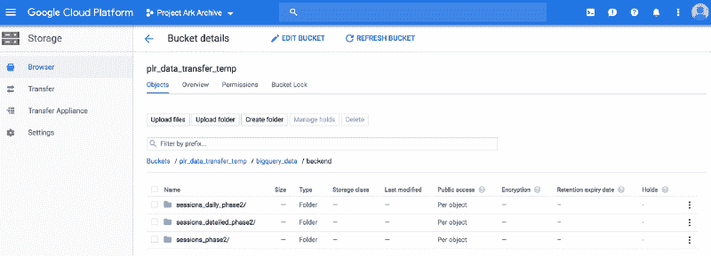
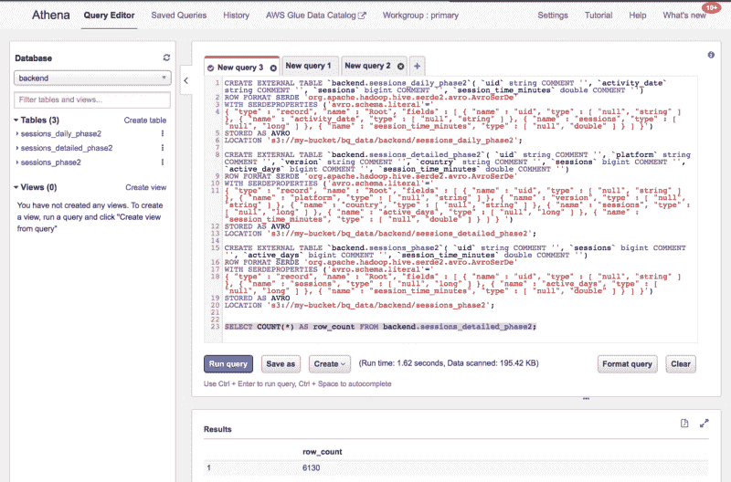

# 如何将 Google BigQuery 表导入 AWS Athena

> 原文：<https://www.freecodecamp.org/news/how-to-import-google-bigquery-tables-to-aws-athena-5da842a13539/>

作者:阿夫塔布·安萨里

# 如何将 Google BigQuery 表导入 AWS Athena


Photo by [Josè Maria Sava](https://unsplash.com/photos/WxRnkVoVl0o?utm_source=unsplash&utm_medium=referral&utm_content=creditCopyText) via [Unsplash](https://unsplash.com/?utm_source=unsplash&utm_medium=referral&utm_content=creditCopyText)

作为一名数据工程师，很可能您正在使用领先的大数据云平台之一，如 AWS、Microsoft Azure 或 Google Cloud 来处理数据。此外，将数据从一个平台迁移到另一个平台可能是您已经面临或将在某个时候面临的事情。

在本文中，我将展示如何将 Google BigQuery 表导入 AWS Athena。如果您只需要一个工具列表，在一些非常高级的指导下使用，您可以快速查看这个[帖子，它展示了如何将单个 BigQuery 表导入 Hive metastore](https://amazon-aws-big-data-demystified.ninja/2018/05/27/how-to-export-data-from-google-big-query-into-aws-s3-emr-hive/) 。在本文中，我将展示一种将完整的 BigQuery 项目(多个表)导入 Hive 和 Athena metastore 的方法。

有一些导入限制:例如，当您从分区表导入数据时，您不能导入单个分区。开始该过程前，请检查[极限值](https://cloud.google.com/bigquery/docs/exporting-data)。

为了成功地将 Google BigQuery 表导入 Athena，我执行了如下所示的步骤。当从 Google BigQuery 转储数据和模式并将它们加载到 AWS Athena 时，我使用了 AVRO 格式。

[第一步。将 BigQuery 数据转储到 Google 云存储中](#264f)

[第二步。将数据从谷歌云存储传输到 S3 自动气象站](#3af9)

[第三步。从存储在 S3 的 AVRO 文件中提取 AVRO 模式](#c089)

[第四步。使用步骤 3](#cc2d) 中的模式，在 AVRO 数据的基础上创建配置单元表

[第五步。从配置单元表中提取配置单元表定义](#fbf3)

[第六步。使用步骤 3 和 5 的输出创建 Athena 表](#c6f6)

那么，尽管最终目标是将数据保存在 Athena 中，为什么我必须首先创建 Hive 表呢？这是因为:

*   Athena 不支持使用`avro.schema.url` 来指定表模式。
*   Athena 要求您在 CREATE 语句中显式指定字段名及其数据类型。
*   在`avro.schema.literal`下，Athena 还需要 JSON 格式的 AVRO 模式。
*   您可以查看此 AWS [文档](https://docs.aws.amazon.com/athena/latest/ug/avro.html)了解更多详情。

因此，可以通过指向存储在 S3 上的 AVRO 模式文件来直接创建配置单元表。但是要在 Athena 中实现这一点，CREATE TABLE 语句中需要列和模式。

克服这个问题的一个方法是首先从 AVRO 数据中提取模式，作为`avro.schema.literal`提供。其次，对于 CREATE 语句所需的字段名和数据类型，基于存储在 S3 的 AVRO 模式创建配置单元表，并使用`SHOW CREATE TABLE`转储/导出包含字段名和数据类型的配置单元表定义。最后，通过组合提取的 AVRO 模式和配置单元表定义来创建 Athena 表。我将在随后的章节中详细讨论。

为了进行演示，我准备将下面的 BigQuery 表导入 Athena。


所以，让我们开始吧！

### 第一步。将 BigQuery 数据转储到 Google 云存储中

借助 Google cloud UI，可以将 BigQuery 数据转储到 Google storage 中。但是，如果您必须手动转储几个表，这可能会成为一项单调乏味的任务。

为了解决这个问题，我使用了 Google Cloud Shell。在 Cloud Shell 中，您可以将常规 Shell 脚本与 BigQuery 命令相结合，并相对快速地转储多个表。可以激活云壳，如下图所示。


在 Cloud Shell 中，下面的操作提供了 BigQuery `extract`命令，将“后端”数据集的每个表转储到 Google 云存储中。

```
bq ls backend | cut -d ' ' -f3 | tail -n+3 | xargs -I@ echo bq --location=US extract --destination_format AVRO --compression SNAPPY <dataset>.@ gs://<bucket>@
```

在我的例子中，它打印:

```
aftab_ansari@cloudshell:~ (project-ark-archive)$ bq ls backend | cut -d ' ' -f3 | tail -n+3 | xargs -I@ echo bq --location=US extract --destination_format AVRO --compression SNAPPY backend.@ gs://plr_data_transfer_temp/bigquery_data/backend/@/@-*.avro
```

```
bq --location=US extract --destination_format AVRO --compression SNAPPY backend.sessions_daily_phase2 gs://plr_data_transfer_temp/bigquery_data/backend/sessions_daily_phase2/sessions_daily_phase2-*.avro
```

```
bq --location=US extract --destination_format AVRO --compression SNAPPY backend.sessions_detailed_phase2 gs://plr_data_transfer_temp/bigquery_data/backend/sessions_detailed_phase2/sessions_detailed_phase2-*.avro
```

```
bq --location=US extract --destination_format AVRO --compression SNAPPY backend.sessions_phase2 gs://plr_data_transfer_temp/bigquery_data/backend/sessions_phase2/sessions_phase2-*.avro
```

请注意:`--compression SNAPPY`，这很重要，因为未压缩的大文件会导致`gsutil`命令(用于向 AWS S3 传输数据)被卡住。通配符( ***** )使`bq extract`将更大的表(> 1GB)分割成多个输出文件。在 Cloud Shell 上运行这些命令，将数据复制到下面的 Google 存储目录中。

```
gs://plr_data_transfer_temp/bigquery_data/backend/table_name/table_name-*.avro
```

让我们做`ls`来看看被抛弃的 AVRO 文件。

```
aftab_ansari@cloudshell:~ (project-ark-archive)$ gsutil ls gs://plr_data_transfer_temp/bigquery_data/backend/sessions_daily_phase2
```

```
gs://plr_data_transfer_temp/bigquery_data/backend/sessions_daily_phase2/sessions_daily_phase2-000000000000.avro
```

我也可以从 UI 中浏览并找到如下所示的数据。



### 第二步。将数据从谷歌云存储转移到 S3 自动气象站

将数据从谷歌存储转移到 S3 自动气象站非常简单。首先，设置您的 S3 凭据。在云壳上，创建或编辑`.boto`文件(`vi ~/.boto`)并添加这些:

```
[Credentials]aws_access_key_id = <your aws access key ID>aws_secret_access_key = <your aws secret access key>[s3]host = s3.us-east-1.amazonaws.comuse-sigv4 = True
```

请注意:**s3.us-east-1.amazonaws.com**必须与铲斗所在的区域相对应。

设置凭证后，执行`gsutil`将数据从 Google Storage 传输到 AWS S3。例如:

```
gsutil rsync -r gs://your-gs-bucket/your-extract-path/your-schema s3://your-aws-bucket/your-target-path/your-schema
```

将 ***-n*** 标志添加到上面的命令中，以显示将使用指定命令执行的操作，而无需实际运行它们。

在本例中，为了将数据传输到 S3，我使用了以下代码:

```
aftab_ansari@cloudshell:~ (project-ark-archive)$ gsutil rsync -r gs://plr_data_transfer_temp/bigquery_data/backend s3://my-bucket/bq_data/backend
```

```
Building synchronization state…Starting synchronization…Copying gs://plr_data_transfer_temp/bigquery_data/backend/sessions_daily_phase2/sessions_daily_phase2-000000000000.avro [Content-Type=application/octet-stream]...Copying gs://plr_data_transfer_temp/bigquery_data/backend/sessions_detailed_phase2/sessions_detailed_phase2-000000000000.avro [Content-Type=application/octet-stream]...Copying gs://plr_data_transfer_temp/bigquery_data/backend/sessions_phase2/sessions_phase2-000000000000.avro [Content-Type=application/octet-stream]...| [3 files][987.8 KiB/987.8 KiB]Operation completed over 3 objects/987.8 KiB.
```

让我们看看数据是否被传输到 S3。我从我的本地机器上验证了这一点:

```
aws s3 ls --recursive  s3://my-bucket/bq_data/backend --profile smoke | awk '{print $4}'
```

```
bq_data/backend/sessions_daily_phase2/sessions_daily_phase2-000000000000.avrobq_data/backend/sessions_detailed_phase2/sessions_detailed_phase2-000000000000.avrobq_data/backend/sessions_phase2/sessions_phase2-000000000000.avro
```

### 第三步。从存储在 S3 的 AVRO 文件中提取 AVRO 模式

要从 AVRO 数据中提取模式，可以使用 Apache`avro-tools-<version&g`t；。jar wit `h the get`模式参数。使用这个工具的好处是，它返回模式的形式可以在创建 Athena 表时直接使用`ly in WITH SERDEPROP` ERTIES 语句。

您会注意到，在转储 BigQuery 表时，每个表只有一个`.avro`文件。这是因为数据量很小——否则，我会在每个表中得到几个文件。不管每个表是单个还是多个文件，对每个表的任何单个文件运行 avro-tools 来提取该表的模式就足够了。

我下载了 avro-tools 的最新版本`avro-tools-1.8.2.jar`。我首先将所有的`.avro`文件从 s3 复制到本地磁盘:

```
[hadoop@ip-10-0-10-205 tmpAftab]$ aws s3 cp s3://my-bucket/bq_data/backend/ bq_data/backend/ --recursive
```

```
download: s3://my-bucket/bq_data/backend/sessions_detailed_phase2/sessions_detailed_phase2-000000000000.avro to bq_data/backend/sessions_detailed_phase2/sessions_detailed_phase2-000000000000.avro
```

```
download: s3://my-bucket/bq_data/backend/sessions_phase2/sessions_phase2-000000000000.avro to bq_data/backend/sessions_phase2/sessions_phase2-000000000000.avro
```

```
download: s3://my-bucket/bq_data/backend/sessions_daily_phase2/sessions_daily_phase2-000000000000.avro to bq_data/backend/sessions_daily_phase2/sessions_daily_phase2-000000000000.avro
```

Avro-tools 命令应该类似于`java -jar avro-tools-1.8.2.jar getschema your_data.avro > schema_file.a` vsc。如果您有几个 AVRO 文件，这可能会变得很乏味(实际上，我已经为一个有更多表格的项目这样做了)。我再次使用 shell 脚本来生成命令。我创造了`ed extract_schema_avro`。包含以下内容的 sh:

```
schema_avro=(bq_data/backend/*)for i in ${!schema_avro[*]}; do  input_file=$(find ${schema_avro[$i]} -type f)  output_file=$(ls -l ${schema_avro[$i]} | tail -n+2 \    | awk -v srch="avro" -v repl="avsc" '{ sub(srch,repl,$9);    print $9 }')  commands=$(    echo "java -jar avro-tools-1.8.2.jar getschema " \      $input_file" > bq_data/schemas/backend/avro/"$output_file  )  echo $commandsdone
```

运行`extract_schema_avro.sh`提供以下内容:

```
[hadoop@ip-10-0-10-205 tmpAftab]$ sh extract_schema_avro.sh
```

```
java -jar avro-tools-1.8.2.jar getschema bq_data/backend/sessions_daily_phase2/sessions_daily_phase2-000000000000.avro > bq_data/schemas/backend/avro/sessions_daily_phase2-000000000000.avsc
```

```
java -jar avro-tools-1.8.2.jar getschema bq_data/backend/sessions_detailed_phase2/sessions_detailed_phase2-000000000000.avro > bq_data/schemas/backend/avro/sessions_detailed_phase2-000000000000.avsc
```

```
java -jar avro-tools-1.8.2.jar getschema bq_data/backend/sessions_phase2/sessions_phase2-000000000000.avro > bq_data/schemas/backend/avro/sessions_phase2-000000000000.avsc
```

执行上述命令会将提取的模式复制到`bq_data/schemas/backend/avro/`下:

```
[hadoop@ip-10-0-10-205 tmpAftab]$ ls -l bq_data/schemas/backend/avro/* | awk '{print $9}'
```

```
bq_data/schemas/backend/avro/sessions_daily_phase2-000000000000.avscbq_data/schemas/backend/avro/sessions_detailed_phase2-000000000000.avscbq_data/schemas/backend/avro/sessions_phase2-000000000000.avsc
```

让我们也检查一下`.avsc`文件中的内容。

```
[hadoop@ip-10-0-10-205 tmpAftab]$ cat bq_data/schemas/backend/avro/sessions_detailed_phase2-000000000000.avsc
```

```
{"type" : "record","name" : "Root","fields" : [ {"name" : "uid","type" : [ "null", "string" ]}, {"name" : "platform","type" : [ "null", "string" ]}, {"name" : "version","type" : [ "null", "string" ]}, {"name" : "country","type" : [ "null", "string" ]}, {"name" : "sessions","type" : [ "null", "long" ]}, {"name" : "active_days","type" : [ "null", "long" ]}, {"name" : "session_time_minutes","type" : [ "null", "double" ]} ]}
```

如您所见，该模式是可以在 Athena `WITH SERDEPROPERTIES`中直接使用的形式。但是在 Athena 之前，我使用 AVRO 模式来创建 Hive 表。如果您想避免创建 Hive 表，您可以读取`.avsc`文件来提取字段名和数据类型，但是您必须自己将数据类型从 AVRO 格式映射到 Athena 表创建 DDL。

映射任务的复杂程度取决于表中数据类型的复杂程度。为了简单起见(也为了涵盖大多数简单到复杂的数据类型)，我让 Hive 为我做映射。所以我首先在 Hive metastore 中创建了这些表。然后我使用`SHOW CREATE TABLE`来获取 DDL 的字段名和数据类型部分。

### 第四步。使用步骤 3 中的模式，在 AVRO 数据的基础上创建配置单元表

如前所述，Hive 允许使用`avro.schema.url`创建表。因此，一旦从 AVRO 数据中提取了模式(`.avsc`文件)，就可以创建如下的表:

```
CREATE EXTERNAL TABLE table_nameSTORED AS AVROLOCATION 's3://your-aws-bucket/your-target-path/avro_data'TBLPROPERTIES ('avro.schema.url'='s3://your-aws-bucket/your-target-path/your-avro-schema');
```

首先，将提取的模式上传到 S3，以便`avro.schema.url` 可以引用它们在 S3 的位置:

```
[hadoop@ip-10-0-10-205 tmpAftab]$ aws s3 cp bq_data/schemas s3://my-bucket/bq_data/schemas --recursive
```

```
upload: bq_data/schemas/backend/avro/sessions_daily_phase2-000000000000.avsc to s3://my-bucket/bq_data/schemas/backend/avro/sessions_daily_phase2-000000000000.avsc
```

```
upload: bq_data/schemas/backend/avro/sessions_phase2-000000000000.avsc to s3://my-bucket/bq_data/schemas/backend/avro/sessions_phase2-000000000000.avsc
```

```
upload: bq_data/schemas/backend/avro/sessions_detailed_phase2-000000000000.avsc to s3://my-bucket/bq_data/schemas/backend/avro/sessions_detailed_phase2-000000000000.avsc
```

在 S3 有了 AVRO 数据和模式之后，可以使用本节开头所示的模板创建 Hive 表的 DDL。我使用了另一个 shell 脚本`create_tables_hive.sh`(如下所示)来覆盖任意数量的表:

```
schema_avro=$(ls -l bq_data/backend | tail -n+2 | awk '{print $9}')for table_name in $schema_avro; do  file_name=$(ls -l bq_data/backend/$table_name | tail -n+2 | awk \    -v srch="avro" -v repl="avsc" '{ sub(srch,repl,$9); print $9 }')  table_definition=$(    echo "CREATE EXTERNAL TABLE IF NOT EXISTS backend."$table_name"\\nSTORED AS AVRO""\\nLOCATION 's3://my-bucket/bq_data/backend/"$table_name"'""\\nTBLPROPERTIES('avro.schema.url'='s3://my-bucket/bq_data/\schemas/backend/avro/"$file_name"');"  )  printf "\n$table_definition\n"done
```

运行该脚本会提供以下内容:

```
[hadoop@ip-10-0-10-205 tmpAftab]$ sh create_tables_hive.sh
```

```
CREATE EXTERNAL TABLE IF NOT EXISTS backend.sessions_daily_phase2STORED AS AVROLOCATION 's3://my-bucket/bq_data/backend/sessions_daily_phase2' TBLPROPERTIES ('avro.schema.url'='s3://my-bucket/bq_data/schemas/backend/avro/sessions_daily_phase2-000000000000.avsc');
```

```
CREATE EXTERNAL TABLE IF NOT EXISTS backend.sessions_detailed_phase2 STORED AS AVROLOCATION 's3://my-bucket/bq_data/backend/sessions_detailed_phase2'TBLPROPERTIES ('avro.schema.url'='s3://my-bucket/bq_data/schemas/backend/avro/sessions_detailed_phase2-000000000000.avsc');
```

```
CREATE EXTERNAL TABLE IF NOT EXISTS backend.sessions_phase2STORED AS AVROLOCATION 's3://my-bucket/bq_data/backend/sessions_phase2' TBLPROPERTIES ('avro.schema.url'='s3://my-bucket/bq_data/schemas/backend/avro/sessions_phase2-000000000000.avsc');
```

我在配置单元控制台上运行了上面的代码，以实际创建配置单元表:

```
[hadoop@ip-10-0-10-205 tmpAftab]$ hiveLogging initialized using configuration in file:/etc/hive/conf.dist/hive-log4j2.properties Async: false
```

```
hive> CREATE EXTERNAL TABLE IF NOT EXISTS backend.sessions_daily_phase2> STORED AS AVRO> LOCATION 's3://my-bucket/bq_data/backend/sessions_daily_phase2' TBLPROPERTIES ('avro.schema.url'='s3://my-bucket/bq_data/schemas/backend/avro/sessions_daily_phase2-000000000000.avsc');OKTime taken: 4.24 seconds
```

```
hive>> CREATE EXTERNAL TABLE IF NOT EXISTS backend.sessions_detailed_phase2 STORED AS AVRO> LOCATION 's3://my-bucket/bq_data/backend/sessions_detailed_phase2'> TBLPROPERTIES ('avro.schema.url'='s3://my-bucket/bq_data/schemas/backend/avro/sessions_detailed_phase2-000000000000.avsc');OKTime taken: 0.563 seconds
```

```
hive>> CREATE EXTERNAL TABLE IF NOT EXISTS backend.sessions_phase2> STORED AS AVRO> LOCATION 's3://my-bucket/bq_data/backend/sessions_phase2' TBLPROPERTIES ('avro.schema.url'='s3://my-bucket/bq_data/schemas/backend/avro/sessions_phase2-000000000000.avsc');OKTime taken: 0.386 seconds
```

因此，我已经成功地创建了配置单元表。为了验证这些表是否有效，我运行了这个简单的查询:

```
hive> select count(*) from backend.sessions_detailed_phase2;Query ID = hadoop_20190214152548_2316cb5b-29f1-4416-922e-a6ff02ec1775Total jobs = 1Launching Job 1 out of 1Status: Running (Executing on YARN cluster with App id application_1550010493995_0220)----------------------------------------------------------------------------------------------VERTICES      MODE        STATUS  TOTAL  COMPLETED  RUNNING  PENDING  FAILED  KILLED----------------------------------------------------------------------------------------------Map 1 .......... container     SUCCEEDED      1          1        0        0       0       0Reducer 2 ...... container     SUCCEEDED      1          1        0        0       0       0----------------------------------------------------------------------------------------------VERTICES: 02/02  [==========================>>] 100%  ELAPSED TIME: 8.17 s----------------------------------------------------------------------------------------------OK6130
```

所以有效！

### 第五步。从配置单元表中提取配置单元表定义

如前所述，Athena 要求您在`CREATE`语句中明确指定字段名及其数据类型。在第 3 步中，我提取了 AVRO 模式，它可以用在 Athena 表 DDL 的`WITH SERDEPROPERTIES`中，但是我还必须指定所有的恶魔名称和它们的(Hive)数据类型。现在我已经在 Hive metastore 中有了表，我可以通过运行`SHOW CREATE TABLE`轻松地获得这些表。首先，为所有表准备配置单元 DDL 查询:

```
[hadoop@ip-10-0-10-205 tmpAftab]$ ls -l bq_data/backend | tail -n+2 | awk '{print "hive -e '\''SHOW CREATE TABLE backend."$9"'\'' > bq_data/schemas/backend/hql/backend."$9".hql;" }'
```

```
hive -e 'SHOW CREATE TABLE backend.sessions_daily_phase2' > bq_data/schemas/backend/hql/backend.sessions_daily_phase2.hql;
```

```
hive -e 'SHOW CREATE TABLE backend.sessions_detailed_phase2' > bq_data/schemas/backend/hql/backend.sessions_detailed_phase2.hql;
```

```
hive -e 'SHOW CREATE TABLE backend.sessions_phase2' > bq_data/schemas/backend/hql/backend.sessions_phase2.hql;
```

执行上述命令复制`bq_data/schemas/backend/hql/`下的配置单元表定义。让我们看看里面有什么:

```
[hadoop@ip-10-0-10-205 tmpAftab]$ cat bq_data/schemas/backend/hql/backend.sessions_detailed_phase2.hql
```

```
CREATE EXTERNAL TABLE `backend.sessions_detailed_phase2`(`uid` string COMMENT '',`platform` string COMMENT '',`version` string COMMENT '',`country` string COMMENT '',`sessions` bigint COMMENT '',`active_days` bigint COMMENT '',`session_time_minutes` double COMMENT '')ROW FORMAT SERDE'org.apache.hadoop.hive.serde2.avro.AvroSerDe'STORED AS INPUTFORMAT'org.apache.hadoop.hive.ql.io.avro.AvroContainerInputFormat'OUTPUTFORMAT'org.apache.hadoop.hive.ql.io.avro.AvroContainerOutputFormat'LOCATION's3://my-bucket/bq_data/backend/sessions_detailed_phase2'TBLPROPERTIES ('avro.schema.url'='s3://my-bucket/bq_data/schemas/backend/avro/sessions_detailed_phase2-000000000000.avsc','transient_lastDdlTime'='1550157659')
```

到目前为止，在 Athena 中创建 AVRO 表所需的所有构件都已经存在:

*   字段名和数据类型可以从配置单元表 DDL 中获得(用于`CREATE`语句的列部分)
*   AVRO 模式(JSON)可以从提取的`.avsc`文件中获得(将在`WITH SERDEPROPERTIES`中提供)。

### 第六步。使用步骤 3 和 5 的输出创建 Athena 表

如果你还和我在一起，你已经做得很好了。我现在将执行最后一步，即创建 Athena 表。我使用下面的脚本组合`.avsc`和`.hql`文件来构建 Athena 表定义:

```
[hadoop@ip-10-0-10-205 tmpAftab]$ cat create_tables_athena.sh
```

```
# directory where extracted avro schemas are storedschema_avro=(bq_data/schemas/backend/avro/*)# directory where extracted HQL schemas are storedschema_hive=(bq_data/schemas/backend/hql/*)for i in ${!schema_avro[*]}; do  schema=$(awk -F '{print $0}' '/CREATE/{flag=1}/STORED/{flag=0}\   flag' ${schema_hive[$i]})  location=$(awk -F '{print $0}' '/LOCATION/{flag=1; next}\  /TBLPROPERTIES/{flag=0} flag' ${schema_hive[$i]})  properties=$(cat ${schema_avro[$i]})  table=$(echo $schema '\n' \    "WITH SERDEPROPERTIES ('avro.schema.literal'='\n"$properties \    "\n""')STORED AS AVRO \n" \    "LOCATION" $location";\n\n")  printf "\n$table\n"done \  > bq_data/schemas/backend/all_athena_tables/all_athena_tables.hql
```

运行上面的脚本将 Athena 表定义复制到`bq_data/schemas/backend/all_athena_tables/all_athena_tables.hql`。在我的案例中，它包含:

```
[hadoop@ip-10-0-10-205 all_athena_tables]$ cat all_athena_tables.hql
```

```
CREATE EXTERNAL TABLE `backend.sessions_daily_phase2`( `uid` string COMMENT '', `activity_date` string COMMENT '', `sessions` bigint COMMENT '', `session_time_minutes` double COMMENT '')ROW FORMAT SERDE 'org.apache.hadoop.hive.serde2.avro.AvroSerDe'WITH SERDEPROPERTIES ('avro.schema.literal'='{ "type" : "record", "name" : "Root", "fields" : [ { "name" : "uid", "type" : [ "null", "string" ] }, { "name" : "activity_date", "type" : [ "null", "string" ] }, { "name" : "sessions", "type" : [ "null", "long" ] }, { "name" : "session_time_minutes", "type" : [ "null", "double" ] } ] }')STORED AS AVROLOCATION 's3://my-bucket/bq_data/backend/sessions_daily_phase2';
```

```
CREATE EXTERNAL TABLE `backend.sessions_detailed_phase2`( `uid` string COMMENT '', `platform` string COMMENT '', `version` string COMMENT '', `country` string COMMENT '', `sessions` bigint COMMENT '', `active_days` bigint COMMENT '', `session_time_minutes` double COMMENT '')ROW FORMAT SERDE 'org.apache.hadoop.hive.serde2.avro.AvroSerDe'WITH SERDEPROPERTIES ('avro.schema.literal'='{ "type" : "record", "name" : "Root", "fields" : [ { "name" : "uid", "type" : [ "null", "string" ] }, { "name" : "platform", "type" : [ "null", "string" ] }, { "name" : "version", "type" : [ "null", "string" ] }, { "name" : "country", "type" : [ "null", "string" ] }, { "name" : "sessions", "type" : [ "null", "long" ] }, { "name" : "active_days", "type" : [ "null", "long" ] }, { "name" : "session_time_minutes", "type" : [ "null", "double" ] } ] } ')STORED AS AVROLOCATION 's3://my-bucket/bq_data/backend/sessions_detailed_phase2';
```

```
CREATE EXTERNAL TABLE `backend.sessions_phase2`( `uid` string COMMENT '', `sessions` bigint COMMENT '', `active_days` bigint COMMENT '', `session_time_minutes` double COMMENT '')ROW FORMAT SERDE 'org.apache.hadoop.hive.serde2.avro.AvroSerDe'WITH SERDEPROPERTIES ('avro.schema.literal'='{ "type" : "record", "name" : "Root", "fields" : [ { "name" : "uid", "type" : [ "null", "string" ] }, { "name" : "sessions", "type" : [ "null", "long" ] }, { "name" : "active_days", "type" : [ "null", "long" ] }, { "name" : "session_time_minutes", "type" : [ "null", "double" ] } ] }')STORED AS AVROLOCATION 's3://my-bucket/bq_data/backend/sessions_phase2';
```

最后，我在 Athena 中运行上述脚本来创建表格:



这就是了。

感觉过程有点漫长。然而，这对我很有效。另一种方法是使用 AWS Glue wizard 来抓取数据并推断模式。如果你使用过 AWS 胶水向导，请在下面的评论区分享你的经验。