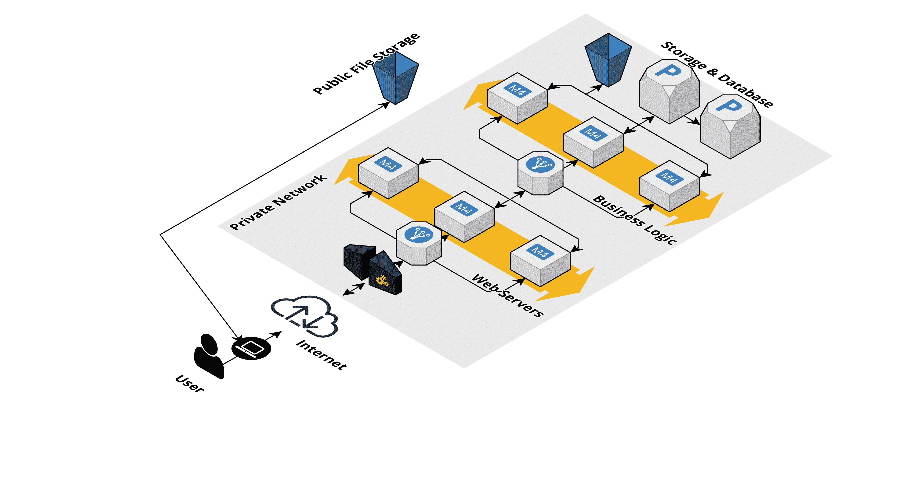

# 什么是云原生？以及如何让它更快

> 原文：<https://www.freecodecamp.org/news/how-to-improve-cloud-native-system-performance/>

构建 Web 应用程序是为了向最终用户提供各种在线服务。开发和托管这些服务需要努力和天赋。这一切都始于一个想法。

但是想象一下，在付出了所有这些努力之后，用户对系统的性能感到畏缩——“太慢了……”，“但愿此生能得到回应……”，“产品虽好，但并不真正值得等待……”他们继续前进。

另一方面，如果您决定为您的用户提供最佳性能，但是您的系统架构很差，那么您的基础设施成本可能会飙升。

在本文中，将会看到做出正确的权衡是多么重要。

想象一场音乐会。所有人都在那里，等着欣赏他们最喜欢的现场表演。有如此多的音频参数与舞台上运行的每一行输入和输出相关联，这些参数需要设置在一个*最佳*水平。

把一切都开到最大音量会让人们离开音乐会。当然，这不是艺术家的错——而是录音师的错，他的工作就是让艺术家的声音好听。

毕竟，这是一个生产系统，类似于 IT 生产环境。在 IT 中，管理系统的性能本质上意味着很好地管理权衡。当然，有明确的选择，但有时，做出这些直截了当的选择并不那么明显。

Basic Web Application Infra Design

## 什么是云原生？

在托管数据中心(也称为云)上部署业务应用程序和服务是 IT 行业的长期趋势。这主要是因为在提供数据中心即服务的同时，云提供了许多好处和专业知识。

安全、监管和运营挑战依然存在，因此组织在将 100%的工作负载迁移到云方面仍然落后。另一方面，初创公司倾向于云部署，因为从第一天开始就让云平台管理您的基础设施要容易得多。

但是我们所说的云原生是什么意思呢？你可能认为仅仅将你的工作负载转移到云上就能帮助你获得最大的收益。这在一定程度上是正确的，因为云的采用是分阶段的。云提供商提供许多丰富的基础设施服务，如果利用得当，它们可以大幅降低您的 IT 基础设施成本。

术语“云原生”表示组织中云的采用程度。您可能遇到过由组织执行的云迁移项目，在这些项目中，他们将工作负载从本地硬件服务器转移到云中的虚拟机。这是有用的，因为他们从消除维护数据中心本身所需的工作中受益，但情况仍然可以更好。

仅仅提升和转移工作负载并不明智，也不是云原生的。云平台提供了更多的服务，如容器注册、集群管理解决方案、DevOps 服务、无服务器/功能即服务等等。总之，在成本、性能、维护、灵活性、可靠性、安全性等各方面，这些都带来了更好的结果。

走向云原生的概念意味着尽可能多地采用云提供商提供的服务，并调整或重构您的工作负载，以最有利的方式部署在云上。

记住这一点，让我们看看云原生采用如何帮助您提高系统性能。

## 如何提高系统的性能

当设计任何 it 系统时，性能都是关键因素之一。我们可以将下面讨论的性能主题分为三大类，即计算、存储和内存以及网络。这种分类有助于我们从不同的角度来看待这个系统，并找出问题。

### 1.工作负载分区

*类别:计算*

您可能意识到整体架构代表了单点故障。整个系统瘫痪的可能性很高，即使是因为一些微不足道的问题。

微服务架构的出现帮助解决了这个问题，但也取决于那些微服务是如何设计的。

当将一个整体重构为微服务时，您应该遵循单一责任原则。只为一个目的构建一个微服务，并在自动扩展模式下部署多个关键微服务实例，以避免性能下降。

这种工作负载划分有助于以隔离的方式解决问题，从而降低失败的风险。

云提供商提供的首批服务之一可能是按需启动虚拟机的能力。我们可以选择操作系统的风格、大小、网络和各种其他方面。利用这种灵活性来部署分区工作负载。

更进一步，您可以使用容器化来隔离服务的运行时需求。这可能是操作系统资源、CPU、网络带宽、内存等，其中配额可以预定义。这允许共享但专用的资源分配，因此打破了一个应用、一个服务器的规则。

当工作负载被容器化时，它提供了一个坚实的基础系统，确保其在支持运行容器工作负载的任何系统上的性能——独立于硬件或操作系统。

云提供商还提供容器编排服务(例如 Kubernetes)，使得在不停机的情况下部署、调试和发布新版本的应用程序变得更加容易。使用这些服务和明智的部署策略可以帮助推出新功能，而不会给用户体验带来任何滞后或故障。

我想强调的是，您应该将您的应用程序分解为微服务，并在隔离的基础架构上托管每个服务。这避免了大量的进程间干扰和资源争用，从而优化了性能的资源消耗。

### 2.计算优化

*类别:计算*

每个应用程序都有不同的需求。标准虚拟机提供通用服务器所需的一切，包括 CPU、内存和网络功能。

然而，就资源消耗而言，并不是在这些虚拟机上运行的每个应用程序都遵循一个标准。应用或微服务组件是目的驱动的，在某种程度上，它们有不同的计算需求。

与计算或内存需求相比，前端服务器可能更依赖网络功能。处理大型数据转换活动的微服务可能需要更好的内存管理解决方案来访问内存和执行事务。

主要的云提供商提供了优化虚拟资源(尤其是虚拟机和数据库)的功能，以使它们符合应用程序的需求。一般来说，这些优化可以分为三类:

1.  计算优化
2.  内存优化
3.  存储优化

根据应用程序的关键程度，有一些选项可以帮助您优化成本。您只需要选择合适的定价方案，然后在极低应用的可用性和成本效益之间进行权衡。

优化虚拟服务器的选择取决于它们的用途:

1.  考虑到计算密集型任务，批处理、繁重的数据转换工作负载和 ML 算法通常需要高性能处理器。为此，选择预配内存优化实例。计算优化实例配有增强的数据块和文件存储，以及更宽的网络带宽。这有助于产生最佳性能来处理面向数据的工作负载。
2.  如果您的应用需要提供高网络性能来传输大量数据并满足大量请求，那么选择与调配的虚拟机相关联的正确网络硬件就非常重要。在这种情况下，您可以通过选择高性能网络接口卡来优化网络性能。
3.  如果处理需要内存上的多个事务，基于 SSD 的卷用于提高 CPU 性能。存储优化的虚拟机有助于加快 IO 操作，并针对高吞吐量进行了调整。与使用通用虚拟机相比，存储优化虚拟机可提供更高的性能。

分析给定工作负载的系统需求非常重要。通用虚拟机提供的平衡配置可能只会导致更高的成本，而不会显著提高性能。通过查看可以调配的虚拟机类型，您可以做出明智的选择。

### 3.缩放比例

*类别:计算*

有两种缩放类型:

1.  纵向扩展—虚拟计算资源根据其大小进行扩展。
2.  向外扩展—在数量上进行扩展。

在云环境中，这两个选项都是可用的。鉴于模板化大小选择的性质，资源的扩展并不总是最好的情况，因为应用程序可能会在其中一个方面遇到瓶颈。增加虚拟机中所有内容的大小来解决一个瓶颈会造成资源利用不足。这只会增加成本。

此外，纵向扩展也意味着我们正在扩展单点故障。更好的选择是在数量上向外扩展。这样，即使一个节点出现故障，仍有其他节点为用户服务并避免潜在损失。

云提供商提供了一个自动扩展功能，让您可以确保尽可能多的实例始终处于运行状态，即使其中一些同时出现故障。这是自动完成的。

但这并不意味着没有理由担心节点故障。理想情况下，节点根本不应该失败，自动伸缩只提供了一种回退机制，作为从丢失中恢复的尝试。这本身就是一种美德。

更进一步，云原生平台提供的 Kubernetes 功能增加了额外的资源分配定制级别。从计算的角度来看，这意味着我们有更好的方法来管理瓶颈。

### 4.无服务器

*类别:计算*

超越容器——如果您不想担心使用的映像、集群管理、操作系统和流程编排中的漏洞扫描，而只想编写代码并让它运行，那么无服务器是一个很好的选择。

在云提供商提供的无服务器服务中，您只需要编写定义托管应用程序逻辑的“函数”。运行这些功能所需的所有基础设施都由云提供商平台抽象。

除了无服务器提供的巨大成本优势(另一天的主题)，在无服务器框架上开发应用程序是最接近原生云的事情。您越是云原生，您可以利用的服务就越多。

需要注意的是，无服务器不仅仅意味着写代码。云提供商可能只提供一个地方来执行传入的请求。处理请求并将其路由到适当的队列和 API 的方式需要利用额外的服务。

然而，重构现有的应用程序需要付出巨大的努力，这也是容器化更容易开始的地方。应用程序，尤其是从零开始开发的 web 服务，通常是无服务器的好选择。

### 5.数据库分区

*类别:内存&数据库*

对数据库进行分区在性能上有明显的优势。可以把它看作是大量存储的数据本身的高级分类。

当对这些卷运行查询时，很可能会扫描整个数据库或存储卷以获取请求的数据。分区缩小了扫描的范围，从而缩短了响应时间。好的分区策略是根据存储的数据本身定义的。

例如，从 2000 年开始的所有报纸的档案可以基于年份进行划分，并且进一步基于月份等进行划分。所以如果你知道你想看的报纸的名字和日期，在档案馆里找到它会更容易。

就数据的划分而言，云平台提供了各种服务。与传统方式相反，一旦配置完成，所有的分区需求都由平台本身来处理。所以考虑对数据进行分区。

### 6.动态数据缓存

*类别:内存&数据库*

Web 应用程序并行处理多个请求。这些请求可能需要从数据库中读取数据。如果数据被频繁读取，每个请求都需要连接到数据库，读取数据并使其可供业务层使用。

如果正在读取的数据是相同的，那么将它存储在缓存中以便更快地访问是有意义的。这避免了不必要的、昂贵的和频繁的到数据库层的往返。

在多节点环境中，每个节点都可以缓存自己的数据副本。虽然它提高了性能，但也在多个节点上创建了相同数据的多个副本，因此效率仍然很低。

其中一个解决方法是实施客户端亲缘关系，确保特定请求总是由集群中的同一节点提供服务。如果节点繁忙，则会带来额外的延迟，而群集中有多个节点并不符合目的。

这就是共享缓存数据库的用武之地。Redis 和 memcached 是最常用的共享缓存数据库，它们被用在许多 web 应用程序的后端架构中。

共享缓存数据库不是数据库的替代品——它们有助于存储数据，以便快速检索临时数据。它们通常位于业务逻辑节点和数据库之间。

共享缓存数据库有助于整合数据库事务并保持数据库状态的一致性。安装和配置后，您可以使用它们来设置和获取值。因此，使用共享缓存数据库有助于保持数据一旦存储就可供所有节点使用，而不是维护特定于节点的数据副本。

云提供商为托管 Redis 和 memcached 提供支持、解决方案和服务，以增强系统的性能。

### 7.考虑最终的一致性

*类别:内存&数据库*

就数据库而言，一致性定义了立即读取的数据是否与最新写入的信息保持一致。对数据库执行许多 IO 任务的应用程序倾向于使用锁定机制来确保多个预期的写入以一致的方式发生。

但是，在读取如此频繁变化的数据时，尤其是在允许多次读取的情况下，数据可能与最近一次写入的数据一致，也可能不一致。

当启用多个读取器时，在某些情况下，还会复制数据库以获得主数据库的实时或接近实时的副本(其目的是为所有读取请求提供服务)。

在这种情况下，如果您需要一致性，那么这会增加性能延迟，因为所有读取操作都必须暂停，直到写入操作在数据库的所有副本上复制。

当您开发业务关键型服务时，具有 ACID 合规性/保证的分布式关系数据库会导致系统相当慢。

最终的一致性是一个主要由 NoSQL 和文档数据库提供的特性。最终的一致性保证了正在读取并显示给用户的数据是最新写入的，并且将在数据库中更新。

云提供商提供 NoSQL 和文档数据库服务，这些服务也提供最终的一致性。通过实现最终一致性并同时保护数据完整性来提高系统性能是一项挑战，需要一个总体解决方案。

确定可以利用最终一致性并开发例程和事务来支持端到端数据完整性的情况。这将有助于提高性能。云原生解决方案提供了这种能力，最终的一致性也有助于成本优化。

### 8.利用主干网络

*类别:网络*

就网络而言，成熟的云原生平台在全球各地都有数据中心和服务器群。流量来自哪里并不重要，这些云提供商很可能在其附近有一个可用的数据中心。

这些数据中心与一个主干网络相连，该网络也是由专门用于跨区域通信的云提供商开发的。这是一个很大的优势。如果应用程序用户生活在多个大洲，在云上部署应用程序自然会加快服务的交付，这要归功于这些主干网络。

由于这是一个支持所有服务的全球网络，托管云原生应用程序可以在更靠近用户的地方提供服务，而不管他们来自哪个洲或国家。

直接和专用连接以及 VPN 还用于以接入点的形式将内部或私有数据中心安全地连接到云基础架构。在某种程度上，建立这些联系有助于在这个主干网上建立组织网络，帮助他们联系全球各地的员工。

### 9.API 网关缓存

*类别:网络*

像其他服务一样，云提供商为您的应用程序提供托管和配置 API 网关的服务。今天，API 是任何 web 应用程序的首选接口。

API 网关不仅有助于开发这些 API 路径，它们还与计算、存储、数据库、函数、容器、编排、队列等相关的其他服务无缝集成。丰富的 Web UI 使得配置 API 网关和维护相同版本变得很容易。

由于 API 处理有效载荷数据的发送和接收，因此有几个预构建的特性有助于有效载荷的格式化、编码和安全性。由于这些高级特性是预先构建在这些 API 网关服务中的，因此配置这些特性以实现最佳交付所需的工作量很小。

您可以利用这些功能对请求进行自动压缩、解压缩、分类和路由到目标服务，使缓存能够改善应用程序响应的延迟。

### 10.CDNs

*类别:网络*

考虑到云提供商提供他们自己的主干网络，在他们的数据中心之间传输专用流量，对他们来说提供 CDN 服务也变得非常方便。

主要的云平台提供 CDN 服务，就静态数据的内容交付而言，这些服务提供了非常好的结果。通过 Web 浏览器提供给用户的 Web 应用程序通常使用 HTML、CSS、JS 文件来构建交互式用户界面。这些文件相当静态，不会频繁更改。

当应用被部署在云平台上时，利用 CDN 服务来提高这些应用的网络性能是有意义的。

## 结论

当我们谈论优化云原生系统的性能时，涉及到更多的因素。重要的是要从各种角度考虑系统，包括计算、存储、数据库和网络，并通过执行各种负载和压力测试来识别瓶颈。

监控是许多主要云公司提供的重要功能，并且与其他服务很好地集成在一起。利用这些监控功能来分析性能瓶颈，并确定有效的变革措施。

我已经在我的网站[上发布的免费电子书](https://letsdotech.dev)中用更深刻的见解讲述了挑战和方法。如果你有兴趣关注更多的建筑方面的东西，请关注我。社交: [Instagram](https://www.instagram.com/letsdotech/) ， [Twitter](https://twitter.com/letsdotech_dev) ， [LinkedIn](https://www.linkedin.com/company/letsdotech) ， [FB](https://www.facebook.com/ldtmavens) 。