# 如何提高 Android 项目的构建速度

> 原文：<https://www.freecodecamp.org/news/how-to-improve-the-build-speed-of-your-android-projects-bd49029d8602/>

by Prateek Phoenix

最近，我承担了将 Android 代码库从 Kure 迁移到 Android 的任务。这似乎是尝试和修正项目构建速度的绝佳机会。

Gradle 一直以速度慢和资源密集而闻名，但我对项目构建配置的微小变化如何能够大幅提高构建速度感到非常惊讶。

为了让你先睹为快，我可以从我们干净的构建中摆脱出来，这里有一个构建扫描前后的度量。

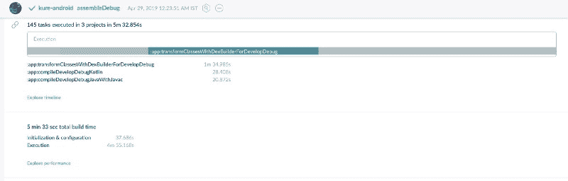

pre-optimisation ??

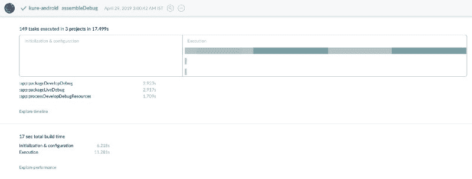

post-optimization ⚡️⚡️

从 5.5 分钟降到 **17 秒？？太疯狂了。**

很容易过度优化，以进一步缩短构建时间。但是为了让这篇文章对初学者更友好，我打算把重点放在一些小的、不痛不痒的措施上。

### 但是首先！

在开始优化之前，重要的是对我们的项目进行基准测试，看看当前构建需要多长时间。Gradle 有一个方便的扫描选项，可以用来分析任务的性能。在 Android Studio 上启动终端并执行以下命令:

```
./gradlew assembleDebug --scan
```

一旦构建成功完成，它将提示您接受服务条款以上传您的构建扫描结果。键入 **yes** 继续。一旦发布完成，您将在终端上看到一个链接来检查您的构建扫描。打开链接。

> 网站上有很多选项，但是为了简洁起见，我们只看一下最重要的。

summary 视图向您显示已运行任务的摘要以及完成这些任务所需的时间。但是我们在这里感兴趣的是**表演**部分。它给出了总构建时间的更详细的细分，如下所示。

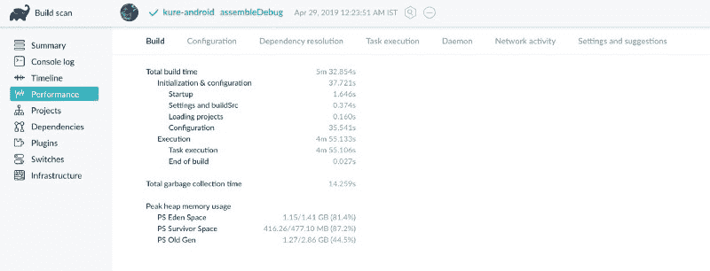

在 performance 部分下面，有一个**设置和建议**标签，给你如何提高构建速度的建议。我们去看看。

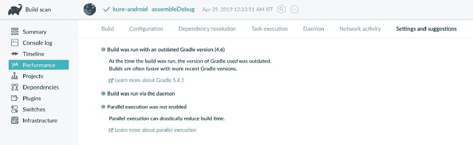

在这一节中，我们可以找到一些提高构建速度的简单方法。因此，让我们继续在我们的项目中应用这些建议。

### 步骤 1:更新您的工具

Android 团队正在不断改进和发展 Android 构建系统。因此，大多数时候，只要采用最新版本的工具，您就可以获得显著的改进。

在这次重构的时候，我们的项目在 Android Studio *的 Gradle 插件的**版本 3.2.1** (比最新发布的版本老了几个版本)。*

你可以访问 [**这个链接**](https://developer.android.com/studio/releases/gradle-plugin) 来获取 Gradle 插件最新发布的版本。

写这篇帖子的时候，最新的版本恰好是**3 . 4 . 0 版本。**

但是它带来了一个我们需要记住的问题:

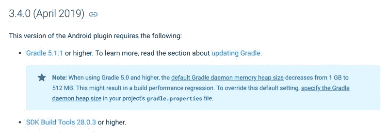

[https://developer.android.com/studio/releases/gradle-plugin](https://developer.android.com/studio/releases/gradle-plugin)

> 当使用 **Gradle 5.0 和更高版本**时，我们将需要显式增加堆的大小，以确保我们的构建速度不会下降。我们一会儿将回到这个话题。

打开顶层的 **build.gradle** 文件，您可以在您的项目的根目录中找到该文件，并在**依赖项部分添加下面一行:**

```
classpath 'com.android.tools.build:gradle:3.4.0'
```

您还需要更新位于***grad le/wrapper/grad le-wrapper . properties .***的 gradle wrapper 属性文件中的**分发 URL** 。

*(该链接将在 [Android Gradle 插件发布页面](https://developer.android.com/studio/releases/gradle-plugin)上提供。)*

```
distributionUrl=https\://services.gradle.org/distributions/gradle-5.1.1-all.zip
```

如果你在你的项目中使用 Kotlin，如果你的 Kotlin Gradle 插件版本低于 **1.3.0** ，你会遇到一个错误。如果是这种情况，使用 IDE 的提示将你的 Kotlin Gradle 插件更新到最新版本*(在撰写本文时恰好是**版本 1.3.31** )。*

好了，让我们从终端再次运行构建，看看我们是否实现了任何改进。

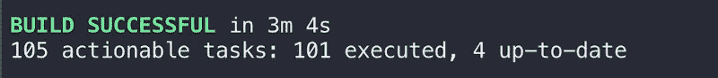

### 步骤 2:更新您的配置

因此，我们能够从构建时间中减少大约 2.5 分钟，但这仍然不够好。在研究终端中的构建日志时，我发现了一行我们感兴趣的内容:

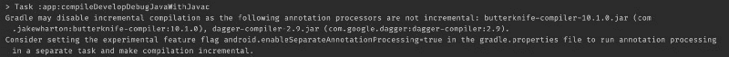

增量编译基本上防止了对整个源文件集的浪费性编译，而是只编译已经改变的文件。查看日志，很明显我们没有利用这个特性。它建议我们使用***Android . enableseparateannotationprocessing = true***但是既然我们在项目中使用 Kotlin，我们无论如何都不应该使用*‘注释处理器’*配置。

幸运的是，Kotlin **版本 1.3.30** 增加了对增量注释处理的支持。

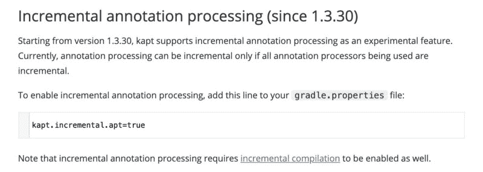

[https://kotlinlang.org/docs/reference/kapt.html](https://kotlinlang.org/docs/reference/kapt.html)

所以让我们

1.  将**注释处理器**配置更改为 **kapt**
2.  启用**增量注释处理**实验标志

打开您的模块级 ***build.gradle*** 文件，并将以下行添加到文件的顶部:

```
apply plugin: 'kotlin-kapt'
```

接下来，将 dependencies 部分中的所有 annotationProcessor 配置更改为使用 kapt。这里有一个例子:

```
//Before
annotationProcessor 'com.google.dagger:dagger-compiler:2.9'

//After
kapt 'com.google.dagger:dagger-compiler:2.9'
```

现在打开位于项目根目录下的***gradle . properties***文件，添加下面一行:

```
kapt.incremental.apt=true
```

让我们再次运行构建。？？？？？？

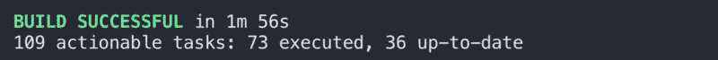

好吧，看起来我们快到了。

### 第三步:梯度属性

我们现在处于最后阶段。还记得我们在更新 Gradle 插件版本时遇到的问题吗？原来 Gradle 的新版本将堆大小减少到了 512 MB。这是为了确保低端机器不会卡住。我在一台 16gb 的机器上，所以我可以负担得起给 Gradle 守护进程大约 2-3g，但是你的里程数可能会有所不同。

打开位于项目根目录下的***gradle . properties***文件，添加下面一行。记得根据您的要求和机器规格选择尺寸。

```
org.gradle.jvmargs=-Xmx3072m -XX:MaxPermSize=512m -XX:+HeapDumpOnOutOfMemoryError -Dfile.encoding=UTF-8
```

同时，让我们也在属性中启用并行构建和按需配置。

下面是我最终的***grad le . properties***文件的样子:

```
org.gradle.jvmargs=-Xmx3072m -XX:MaxPermSize=512m -XX:+HeapDumpOnOutOfMemoryError -Dfile.encoding=UTF-8

org.gradle.parallel=true

org.gradle.configureondemand=true

kapt.incremental.apt=true
```

*   这个标志允许 Gradle 在一个项目中并行地而不是顺序地构建模块。这仅在多模块项目中有益。
*   `org.gradle.configureondemand` -这个标志只配置项目需要的模块，而不是构建所有的模块。

有了这些，让我们看看我们在构建速度指标上处于什么位置:

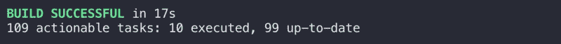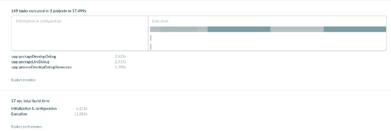

我们开始吧。？？？

### 结束语

这绝不是对优化项目构建速度的所有方法的广泛覆盖。还有很多其他的事情我没有在这篇文章中讨论，比如在使用 MultiDex 时使用 minSdk 21，对你的库进行预索引，禁用 PNG 处理，等等。

但是这些配置中的大多数都需要对 Android 的构建系统有更深入的理解，并且需要有从事大型多模块项目的经验*(这是优势最明显的地方)*。我上面提到的步骤很容易被初级开发人员整合到项目中，并有可观的回报。我希望这能帮助你降低建造速度！

好吧，下次再见，和平！✌?