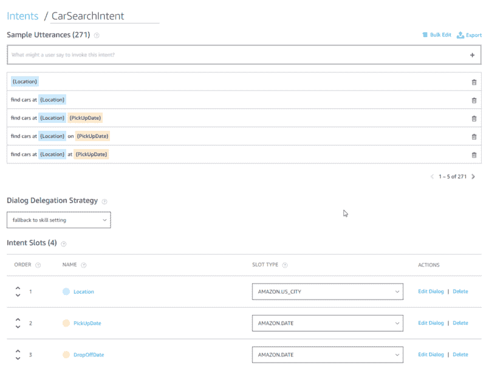
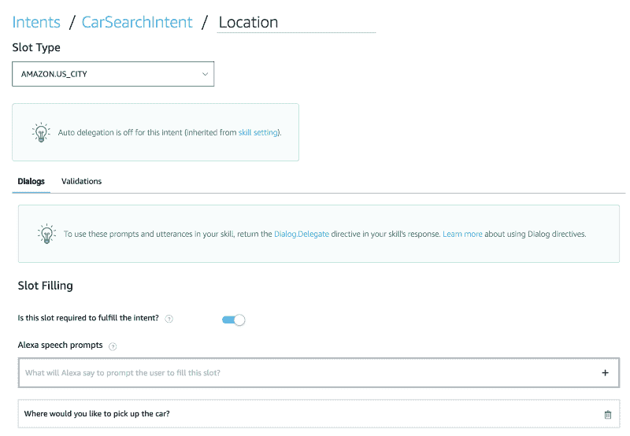

# 如何提高你的 Alexa 技能的对话流程

> 原文：<https://www.freecodecamp.org/news/how-to-improve-the-conversation-flow-of-your-alexa-skill-1b6c6556f9a3/>

加勒特·瓦格斯

# 如何提高你的 Alexa 技能的对话流程


Photo by [Mael BALLAND](https://unsplash.com/@mael_bld?utm_source=medium&utm_medium=referral) on [Unsplash](https://unsplash.com?utm_source=medium&utm_medium=referral)

自然对话是流畅的。这是面对面交流的乐趣之一，你永远不知道对话会如何发展。但有时，谈话会自然而然地进行。问别人想去哪里吃饭，你期望听到的是一家餐馆或一种食物，而不是一部最喜欢的电影。

人们在使用语音助手时遇到的一个挫折是，他们有时很难理解自己在说什么。亚马逊有一个工具来帮助第三方开发者提供更好的识别。**对话框管理**让您提示输入值，以更高的准确度完成请求。

例如，如果你正在创建一个搜索汽车租赁的技能，Alexa 可以在客户说“找到一辆车”后提示客户输入城市和旅行日期。在这种情况下，Alexa 的内置功能提高了语音识别的准确性，因为它会监听特定的值。

问题是客户必须说出合适的话来触发对话控制的意图。亚马逊最近宣布[意向链](https://developer.amazon.com/blogs/alexa/post/9ffdbddb-948a-4eff-8408-7e210282ed38/intent-chaining-for-alexa-skill)作为这个问题的解决方案。

在这篇博客中，我将向您展示我如何使用这一功能，让用户执行汽车搜索。首先，让我们回顾一下对话框管理在 Alexa 中是如何工作的。让我们看一个 CarSearchIntent，它收集开始汽车搜索所需的输入。



CarSearchIntent with slots for location and travel dates

正如您所看到的，我们有几个关于客户如何找到汽车的变体，包括位置、PickUpDate 和 DropOffDate 的槽。在我们开始处理请求之前，我们希望确保客户提供了所有这三个插槽。我们使用对话管理让 Alexa 处理提示客户提供这些。



Location as required slot with prompt

当处于对话模式时，Alexa 有更高的准确性，因为它试图填充这个意图的插槽。但是要进入这种模式，客户必须通过说“找到一辆车”或类似的短语来触发这种意图。理想情况下，我们会让客户在开始使用技能时就进入这种模式。

输入意图链接！我们可以在我们的响应中添加一个**对话委托**指令，将客户放入 CarSearchIntent 的对话流中。

```
canHandle(handlerInput) {  const request = handlerInput.requestEnvelope.request;  return handlerInput.requestEnvelope.session.new ||    (request.type === 'LaunchRequest');},handle: function(handlerInput) {  return handlerInput.responseBuilder    .addDelegateDirective({      name: 'CarSearchIntent',      confirmationStatus: 'NONE',      slots: {}    })    .speak("Welcome to car search.")    .getResponse();}
```

dialog 指令允许我们预先填充一些槽(例如，我们可以将位置默认为上次使用的搜索位置)。值得注意的是，我们只指定“欢迎使用汽车搜索”作为该处理程序的响应。我们不指定重新提示。Alexa 将 CarSearchIntent 的对话框提示附加到我们的响应中，并将其用作重新提示。所以在这种情况下，用户将会听到“欢迎使用汽车搜索。您想在哪里取车？”如果他们不回答，他们会听到“您想在哪里取车？”

您还可以在将客户放入对话框时，指导他们填写特定的位置。假设我们想要引导用户首先指定他们的汽车的提车日期。我们可以使用一个**引出槽**指令来实现，如下面的代码所示。

```
canHandle(handlerInput) {  const request = handlerInput.requestEnvelope.request;  return handlerInput.requestEnvelope.session.new ||    (request.type === 'LaunchRequest');},handle: function(handlerInput) {  return handlerInput.responseBuilder    .addElicitSlotDirective('PickUpDate', {      name: 'CarSearchIntent',      confirmationStatus: 'NONE',      slots: {}    })    .speak("Welcome to car search. When would you like to pick up your car?")    .reprompt("When would you like to pick up your car?")    .getResponse();}
```

在这种情况下，我们需要将整个演讲拼出来，然后重新向客户展示。我们需要这样做，因为我们正在控制如何将客户放入对话管理流程。

链接意图让你以更自然的方式管理对话流。利用它让你的技能对你的客户更有用！