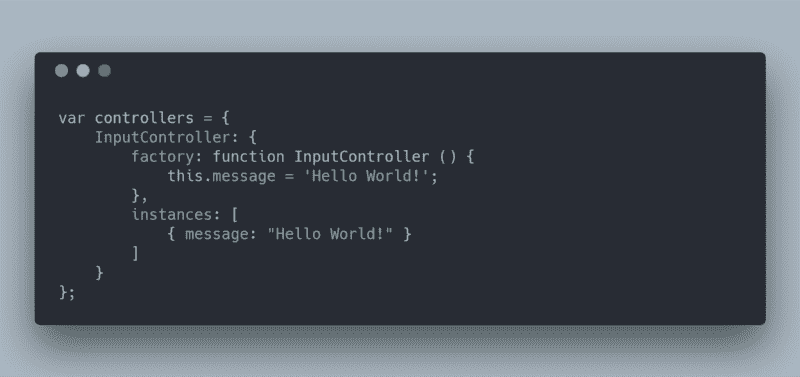
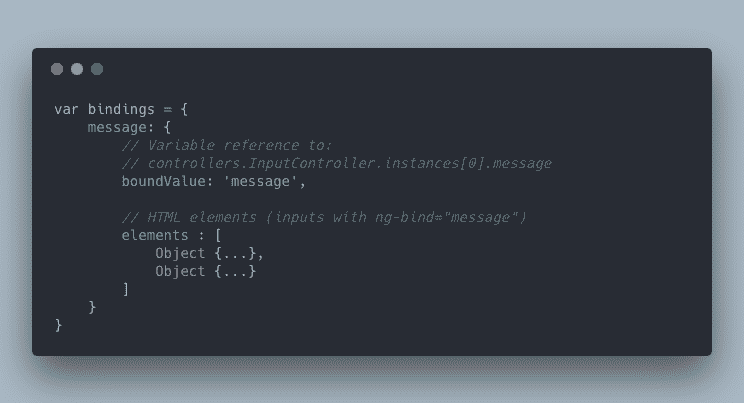

# 如何通过编写自己的 Web 开发框架来提高 JavaScript 技能

> 原文：<https://www.freecodecamp.org/news/how-to-improve-your-javascript-skills-by-writing-your-own-web-development-framework-eed2226f190/>

你曾经问过自己框架是如何工作的吗？

当我在多年前学习 [jQuery](https://jquery.com/) 后发现 [AngularJS](https://angularjs.org/) 时，AngularJS 对我来说就像是黑魔法。

然后 Vue.js 出来了，在分析了它是如何工作的之后，我被鼓励去写我自己的[双向绑定系统](https://en.wikipedia.org/wiki/Data_binding)。

在本文中，我将向您展示如何编写一个具有定制 HTML 元素属性、反应性和双重绑定的现代 JavaScript 框架。

### 反应性是如何工作的？

最好从了解反应性如何工作开始。好消息是这很简单。实际上，当你在 Vue.js 中声明一个新组件时，框架会使用[代理设计模式](https://en.wikipedia.org/wiki/Proxy_pattern)来[代理每个属性](https://vuejs.org/v2/guide/reactivity.html#How-Changes-Are-Tracked)(getter 和 setters)。

因此，它将能够检测来自代码和用户输入的属性值更改。

### 代理设计模式是什么样子的

代理模式背后的思想是简单地重载对一个对象的访问。现实生活中的一个类比就是进入你的银行账户。

例如，你不能直接访问你的银行账户余额，并根据你的需要改变值。你有必要询问有这种许可的人，在这种情况下，你的银行。

```
var account = {
	balance: 5000
}

// A bank acts like a proxy between your bank account and you
var bank = new Proxy(account, {
    get: function (target, prop) {
    	return 9000000;
    }
});

console.log(account.balance); // 5,000 (your real balance)
console.log(bank.balance);    // 9,000,000 (the bank is lying)
console.log(bank.currency);   // 9,000,000 (the bank is doing anything)
```

在上面的例子中，当使用`bank`对象访问`account`余额时，getter 函数被重载，它总是返回`9,000,000`而不是属性值，即使该属性不存在。

```
// Overload setter default function
var bank = new Proxy(account, {
    set: function (target, prop, value) {
        // Always set property value to 0
        return Reflect.set(target, prop, 0); 
    }
});

account.balance = 5800;
console.log(account.balance); // 5,800

bank.balance = 5400;
console.log(account.balance); // 0 (the bank is doing anything)
```

通过重载`set`函数，可以操纵它的行为。您可以更改 set 的值，改为更新另一个属性，或者甚至不做任何事情。

### 反应性示例

既然您对代理设计模式的工作方式有了信心，让我们开始编写 JavaScript 框架。

为了简单起见，我们将模仿 AngularJS 语法来做这件事。声明控制器并将模板元素绑定到控制器属性非常简单。

```
<div ng-controller="InputController">
    <!-- "Hello World!" -->
    <input ng-bind="message"/>   
    <input ng-bind="message"/>
</div>

<script type="javascript">
  function InputController () {
      this.message = 'Hello World!';
  }
  angular.controller('InputController', InputController);
</script>
```

首先，用属性定义一个控制器。然后在模板中使用这个控制器。最后，使用`ng-bind`属性启用与元素值的双重绑定。

### 解析模板并实例化控制器

为了绑定属性，我们需要一个地方(也就是控制器)来声明这些属性。因此，有必要定义一个控制器并将其引入我们的框架。

在控制器声明期间，框架将寻找具有`ng-controller`属性的元素。

如果它符合其中一个声明的控制器，它将创建这个控制器的一个新实例。这个控制器实例只负责这个特定的模板。

```
var controllers = {};
var addController = function (name, constructor) {
    // Store controller constructor
    controllers[name] = {
        factory: constructor,
        instances: []
    };

    // Look for elements using the controller
    var element = document.querySelector('[ng-controller=' + name + ']');
    if (!element){
       return; // No element uses this controller
    }

    // Create a new instance and save it
    var ctrl = new controllers[name].factory;
    controllers[name].instances.push(ctrl);

    // Look for bindings.....
};

addController('InputController', InputController);
```

下面是手工制作的`controllers`变量声明的样子。`controllers`对象包含所有通过调用`addController`在框架内声明的控制器。



Handmade controllers definition

对于每个控制器，保存一个`factory`函数，以便在需要时实例化一个新的控制器。该框架还存储模板中使用的同一控制器的每个新实例。

### 寻找绑定

此时，我们已经获得了控制器的一个实例和一个使用该实例的模板。

下一步是寻找具有使用控制器属性的绑定的元素。

```
var bindings = {};

// Note: element is the dom element using the controller
Array.prototype.slice.call(element.querySelectorAll('[ng-bind]'))
    .map(function (element) {
        var boundValue = element.getAttribute('ng-bind');

        if(!bindings[boundValue]) {
            bindings[boundValue] = {
                boundValue: boundValue,
                elements: []
            }
        }

        bindings[boundValue].elements.push(element);
    });
```

非常简单，它存储一个对象的所有绑定(用作一个[哈希映射](https://en.wikipedia.org/wiki/Hash_table))。该变量包含所有要与当前值绑定的属性以及绑定该属性的所有 DOM 元素。



Handmade bindings declaration

### 双重绑定控制器属性

在框架完成了前期工作之后，现在到了有趣的部分:**双绑定**。

它包括将控制器属性绑定到 DOM 元素，以便在代码更新属性值时更新 DOM。

另外，不要忘记将 DOM 元素绑定到控制器属性。这样，当用户改变输入值时，它将更新控制器属性。然后，它还将更新绑定到该属性的所有其他元素。

#### 用代理检测代码更新

如上所述，Vue 将组件包装在一个代理中，以对属性变化做出反应。让我们通过只为控制器绑定属性代理 setter 来做同样的事情。

```
// Note: ctrl is the controller instance
var proxy = new Proxy(ctrl, {
    set: function (target, prop, value) {
        var bind = bindings[prop];
        if(bind) {
            // Update each DOM element bound to the property  
            bind.elements.forEach(function (element) {
                element.value = value;
                element.setAttribute('value', value);
            });
        }
        return Reflect.set(target, prop, value);
    }
});
```

每当设置绑定属性时，代理将检查绑定到该属性的所有元素。然后它会用新值更新它们。

在这个例子中，我们只支持**输入**元素绑定，因为只设置了`value`属性。

#### 对元素事件做出反应

最后要做的是对用户交互做出反应。DOM 元素在检测到值改变时触发事件。

侦听这些事件，并用事件中的新值更新绑定属性。由于代理，绑定到同一属性的所有其他元素将自动更新。

```
Object.keys(bindings).forEach(function (boundValue) {
  var bind = bindings[boundValue];

  // Listen elements event and update proxy property   
  bind.elements.forEach(function (element) {
    element.addEventListener('input', function (event) {
      proxy[bind.boundValue] = event.target.value; // Also triggers the proxy setter
    });
  })  
});
```

一旦你把所有的东西放在一起，你就得到手工制作的双面输入。这是一个包含所有代码的工作演示。

[https://codepen.io/jbardon/embed/preview/eVjPVR?height=300&slug-hash=eVjPVR&default-tabs=js,result&host=https://codepen.io](https://codepen.io/jbardon/embed/preview/eVjPVR?height=300&slug-hash=eVjPVR&default-tabs=js,result&host=https://codepen.io)

感谢您的阅读。我希望它能帮助你揭开 JavaScript 框架是如何工作的神秘面纱。

恭喜你！您已经开发了一些流行的特性，比如定制 HTML 元素属性、反应性和双重绑定！

**如果您觉得这篇文章有用，请点击**？**按钮几下，让别人找到文章，以示支持！**？

**别忘了关注我，获取我即将发布的文章的通知**？

### 看看我的其他帖子

[https://www.freecodecamp.org/news/author/jbardon/](https://www.freecodecamp.org/news/author/jbardon/)

#### 对初学者做出反应

*   [学习 React 及其虚拟 DOM 如何工作的快速指南](https://medium.freecodecamp.org/a-quick-guide-to-learn-react-and-how-its-virtual-dom-works-c869d788cd44)
*   [如何使反应性与状态发生反应](https://medium.freecodecamp.org/how-to-bring-reactivity-into-react-with-states-exclude-redux-solution-4827d293dfc4)

#### JavaScript

*   [使用 Vue.js 时要避免的常见错误](https://medium.freecodecamp.org/common-mistakes-to-avoid-while-working-with-vue-js-10e0b130925b)
*   [停止痛苦的 JavaScript 调试，用源代码图拥抱 Intellij】](https://medium.com/dailyjs/stop-painful-javascript-debug-and-embrace-intellij-with-source-map-6fe68eda8555)
*   [如何毫不费力地减少庞大的 JavaScript 包](https://medium.com/dailyjs/how-to-reduce-enormous-javascript-bundle-without-efforts-59fe37dd4acd)